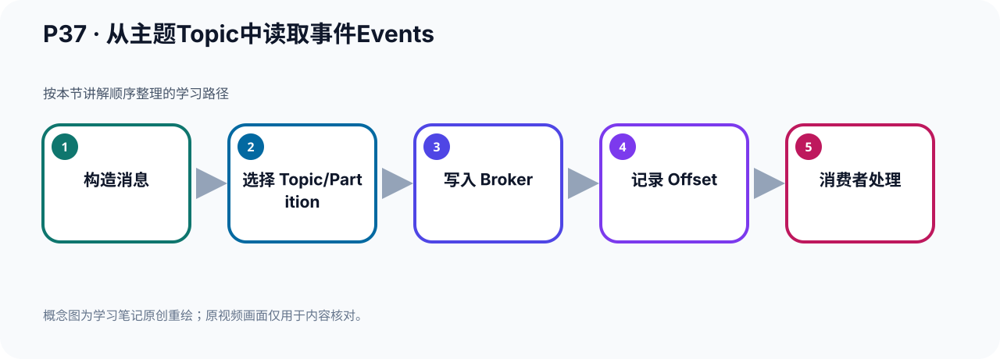
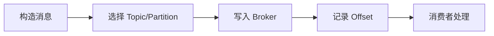

# P37：从主题Topic中读取事件Events

> 笔记编号 37/156 · 时长 05:44 · [打开原视频 P37](https://www.bilibili.com/video/BV14J4m187jz?p=37)

[← P36: 从主题Topic中读取事件Events](../03-topic-event-cli/p036-从主题Topic中读取事件Events.md) · [返回本章](./README.md) · [P38: 外部环境连接Kafka →](../03-topic-event-cli/p038-外部环境连接Kafka.md)

## 先看结论

> 这节把“从主题Topic中读取事件Events”放回消息链路，沿 Producer、Broker、Partition、Offset 与 Consumer 追踪数据和元数据如何流动。它服务于本章目标：用脚本创建 Topic，写入与读取 Event，并解决内外网连接与容器配置问题。

## 老师怎么一步步讲

1. 第 1 步，围绕“从主题Topic中读取事件Events”完成构造消息。
2. 第 2 步，围绕“从主题Topic中读取事件Events”完成选择 Topic/Partition。
3. 第 3 步，围绕“从主题Topic中读取事件Events”完成写入 Broker。
4. 第 4 步，围绕“从主题Topic中读取事件Events”完成记录 Offset。
5. 第 5 步，围绕“从主题Topic中读取事件Events”完成消费者处理。

## 老师的补充说明

下面按原声顺序整理老师的完整讲解脉络。保留原因、案例、对比、操作过程、边界条件和口头提醒；删除重复语气词，并把长口语拆成适合阅读的短段落。

> 技术术语已经过统一校正；仍无法确认的人名或口头英文会保留原意，并通过右侧时间范围返回视频核对。

### 先明确：从主题Topic中读取事件Events要解决什么 · 00:00–00:41

我们将将这段消息读到Gana from Begini。那么这个from Begini是个什么意思呢？那么它上面这个文档帮助手写中，它是可以有说明的。我们找一下from Begini，那就是在这个地方，from Begini。它的说明就在后面这一段，我们来看一下什么意思。那就是这一段这个说明，这说明。如果这个消费者没有建立Offset，那么这是个偏移量。后面我们会对这个偏移量做分析。

### 对比不同情况，明确条件和边界 · 00:41–01:52

这个偏移量，如果没建立偏移量的话，那么它开始用这个最早的这个消息。最早的这个消息，出现的最早的消息，就在这个日志文件中，因为它的消息是放日志文件里面的。那我们日志文件里面不是放两个消息吗？Handle有两个消息放这个里面的，放日志文件里面的，两个。那就是你加了这个参数以后，那么它开始读的话，就从最早的消息开始读，那就从这个开始读，那么把它读出来，把它读出来。不然的话，你不加的话，是吧？Ratis的message，就是最近的消息。

也就是说你不加这个参数，那么就读最近的消息，你加这个参数，那你读这个什么？Alist最早的消息，那就把之前的历史消息都给你读出来。从第一条开始读，一条一条读出来。你如果不加这个参数，那么它就读最新的消息，最新的，你从这个最新的消息开始读，那么最新的你目前没有。

### 跟着老师操作，并观察运行结果 · 01:52–02:55

我们是在这个地方开始启动了，在这个时间点，我们开始启动消费者，等于我们启动消费者之后来，我们现在没有发新消息，没有发新消息，那我就读不到消息。如果你加上这个参数之后来，那么它可以把--list这个老的消息也可以读出来。所以我们这个加这个参数，它起见一个作用。你加这个参数，就读最早的消息都可以读出来，历史消息都可以读出来。如果你不加这个参数，那么它是读最近的消息，那就是在我消费的起程以后，你发的消息我可以读的。我这个消息还没有启动，你发的之前那些历史消息我是读不到的。

这就是我们这个参数。那么我们接下来继续看一下，我们可以再执行这个迷你，它可以再读，你看，我们加这个迷你之后，你看，你可以再读一下。这个消息还在那个回变中，还可以读到，走一下，你看，这消息还可以读到，两个读到了。

### 跟着老师操作，并观察运行结果 · 02:55–04:04

那么我们扛就C退出，那如果说不加这个from迷你，那么它读不到，历史消息是读不到的。这是回参，读不到，对吧。但是如果说此时你又发一个新消息，那么它还是可以读到的，你发个新消息。发个新消息怎么发呢？我们就通过我们之前这个发消息这个迷你，就通过这个方式去往这里面再去发两条消息，通过它执行一下发送。那这个出来，我们这个消费者开这里，开这里，然后我们在这边开个新窗口，然后呢，这里去发送一下，回车。

发送，我发个123，随便发个消息，回车，回车之后你看这边是不是读到了，那123读到了，对吧，然后这个abc回车，又发一个消息，那这边呢，它也读到了。你说你这个消费者启动之后，它是可以读取我消费者启动以后，你新发的消息可以读到，那么之前的消息它读不到，那你加上这个参数以后，那么你之前的例子消息，它相比于从第一条消息开始读取，从第一条消息开始读取，这个from beginning就从第一条消息开始读取。

### 最后验证结果，并收束本节结论 · 04:05–05:40

那么这样的话，我们这个消息的消费，就通过了这个方式，就消费了，消费，然后你按couch c就停止消费，我们这里停下来就couch c停止消费，然后这边这个也是couch c退出这个生产，生产端退出。那么由于它这个消息，也就是在这个Kafka里面也叫世界，世界就是你的消息，就是你的数据，那么它是永久存在Kafka中道，所以你可以多次任意的消费，你可以反复的消费，多次消费都没有问题。

所以我们这边，如果说你再消费，你应该还可以拿到，那么这个时候你再加个from beginning，从第一条开始消费，那这个时候我们应该可以消费到4条数据，你看。我们之前发了4条消息，那么还可以多次消费啊，你再执行一遍的也可以消费，再执行一遍还是可以消费的。那么再次我们通过这个命令，做一个消费，消费这个消息，从我们的这个Topical里面去消费消息，那么Topical名字一定需要指定，还有就是你的这个服务系的IP端口需要指定。

如果说你从第一条消息开始读取，要加一个from beginning这个参数，就开始读取，从第一条消息开始读取，否则的话它是可以读取你消费的期限以后新发的消息才可以读到，不然的话之前的消息是读不到的。那么以上这个呢，就是通过这个脚本，通过它这个脚本消费的扣端呢，我们去读取这个消息，或者说叫消费这个消息。

## 放进整套课

本节属于 **Topic、Event 与命令行实操**。这一章要解决的是：用脚本创建 Topic，写入与读取 Event，并解决内外网连接与容器配置问题。

这节位于消息链路上。要顺着“发送端—Broker—分区日志—消费端”看数据和元数据怎样流动。

### 记忆路线

```mermaid
flowchart LR
    N0["构造消息"]
    N1["选择 Topic/Partition"]
    N0 --> N1
    N2["写入 Broker"]
    N1 --> N2
    N3["记录 Offset"]
    N2 --> N3
    N4["消费者处理"]
    N3 --> N4
```

## 用在工作里

| 项目 | 内容 |
|---|---|
| 先回答 | 先明确消息从哪里产生、写入哪个 Topic、由谁消费。 |
| 立刻做 | 复现发送、Broker 写入和消费者处理的完整链路。 |
| 留下证据 | 记录 Partition、Offset、序列化结果和消费端输出。 |

## 关键术语

- **Kafka：** Apache 开源的分布式事件流平台，常用于高吞吐消息传递、数据管道和流处理。
- **Topic：** 事件的逻辑分类。生产者向 Topic 写数据，消费者从 Topic 读取数据。
- **Event：** Kafka 中的一条业务记录，通常由 key、value、时间戳和 headers 等组成。
- **Offset：** 事件在 Partition 中的位置编号，也是消费者记录消费进度的依据。

## 最容易踩的坑

能发送成功不代表业务处理成功；序列化、分区、确认机制和消费进度需要分别观察。

## 自测

1. 不看笔记，用自己的话解释“从主题Topic中读取事件Events”解决了什么问题。
2. 按顺序复述：构造消息、选择 Topic/Partition、写入 Broker、记录 Offset、消费者处理。
3. 如果运行结果和老师不同，你会先检查哪三个输入或环境条件？

## 学完检查

- [ ] 我能不看视频复述本节完整思路
- [ ] 我能指出关键命令、配置、类或接口的作用
- [ ] 我能解释画面中的输入与输出为什么对应
- [ ] 我读完了老师的详细讲解正文，没有只看路线图和要点
- [ ] 我完成了本节自测或复现实验

## 需要核对原话时

[查看本节带时间戳的完整 ASR](./transcripts/p037-从主题Topic中读取事件Events-ASR.md)。主笔记负责理解与实践；ASR 页面负责逐句完整性复核。
