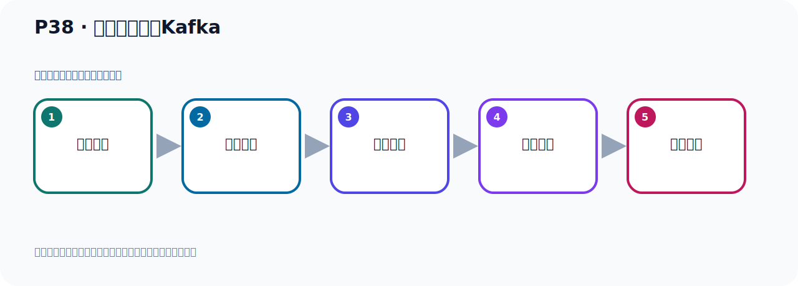

# P38：外部环境连接Kafka

> 笔记编号 38/156 · 时长 06:15 · [打开原视频 P38](https://www.bilibili.com/video/BV14J4m187jz?p=38)

[← P37: 从主题Topic中读取事件Events](../03-topic-event-cli/p037-从主题Topic中读取事件Events.md) · [返回本章](./README.md) · [P39: 外部环境连不上Kafka？ →](../03-topic-event-cli/p039-外部环境连不上Kafka.md)

## 这节到底讲什么

**核心主题：外部环境连接Kafka。**

这节继续完善 Kafka 的完整知识链。请按老师的讲解顺序理解动机、做法和结果。
本节属于“Topic、Event 与命令行实操”这一章；放在全章里看，它的作用是：用脚本创建 Topic，写入与读取 Event，并解决内外网连接与容器配置问题。

## 本节路线

## 老师的完整讲解（按视频顺序校正）

> 下面保留老师的完整讲解顺序，并修正 Kafka、Java、ZooKeeper、
> Topic、Partition、Offset 等常见识别错误。它不是压缩摘要；原始 ASR 在后面单独保留。

### 1. 00:00–01:05

前面我们把Kafka的基本操作，比如创建主题，向主题中写入事件，以及从主题中读取事件、读取消息。我们都做了一个操作。接下来我们来看一下，从外部环境如何连接Kafka。我们之前在Linux里面按钮了一个Kafka，然后我们之前的操作都是在Linux里面直接操作，本地操作。在Linux里面直接连接Kafka，它是没有任何问题的。但是现在我现在在一个外部的机器上，在我的Windows上，是另外一台机器，在我Windows里面连接Linux里面的Kafka，它能不能连上去。因为这个已经不是本地了，是内台机器。我们这个是在虚拟机里面，在Linux里面，那这边是我们的Windows，它是跨网络的连接，看看能不能连上去，以及它怎么连。

### 2. 01:05–02:02

好，那首先我们目前Linux里面的环境里面，我们这个Kafka，它是个多个容器。你看一下我们这个课件，我们之前讲解的顺序，你看一下，我们在创建主题之前，我们是起了多个容器。也就是我们这个Kafka是运行在多个容器里面的。所以我们这边的Kafka在多个容器中，我们怎么看呢？你可以这样看一下多个ps，你可以看一下我们这有个Kafka，然后它是一个容器。然后以后是通过lightstit，看端口，那么Kafka它有个992端口，你看它后面这个进程，都是这个dokalproposit，说明我们目前在Linux里面运行的一个Kafka，但是它是在多个容器里面。

### 3. 02:02–03:08

那就是我现在在Windows里面要连接Linux里面的多个容器里面的Kafka，那么这是跨网络的一个连接，看看我们Windows的怎么样去连接Linux里面的多个容器里面的Kafka，看怎么连。那我去连的话，是不是需要一个工具去连，怎么连，那就是我们看一下，那我去连接Dokal里面的Kafka，那我需要一个工具，或者说我写个程序。首先我们给它介绍一下，用工具去连，那就在我这个电脑上，我需要装个工具，装工具来上去连接这个多个容器里面的Kafka，那么这个工具我首先给大家介绍一个，就是我们IDA的插件，通过IDA的插件去连那个多个容器的Kafka，那这个我们点文件，菜单里面文件，然后这个side，side里面我们去安装一个插件，在这个BloodE里面，然后在这边这个地方搜索一下，。

### 4. 03:08–03:38

说什么，搜索Kafka，这关词来Kafka，好，搜完之后你看它就出现一些Kafka，这些东西，好，那你找一下哪一个是Kafka，像下面你看这个名字都不是Kafka，这个不是是吧，上面这个也不是是吧，那么这个是的，这也是的，这两个你看它后面一个叫pad付费，收费的，不是免费的，那么这两个是免费的，好，那我搜索上面这个，我用上面这个，因为这个排名靠前，我们用它，给它安装，那这个是Kafka。

### 5. 03:38–04:37

安装一下，就这个，把它安装一下，使用这个工具，我们去连接一下我们的Kafka，看看怎么样，好，我们等它安装一下，好，那么它安装比较快，安装完了，我们这个是OK一下，好，然后这个应用一下，好，应用完之后它也没有让我们除奇，它没有让我们除奇，那我们就不除奇，好，安装完之后它其实自动帮你打开这个界面，这个界面，这个加号是什么，这加号是建个连接，这加号是建个连接，连接Kafka，建个连接这个加号，好，那么它这个界面其实就是到这个地方，你安装完之后这里会多一个Kafka这个图标，在这个位置，点一下，Kafka图标就是几个圆圈连在一起的这个Kafka图标，点一下，点一下就不见了，再点一下出来，好，出来之后呢，你在这边可以点一下这个天江的连接，就连接Kafka，那不在点天江连接，。

### 6. 04:38–05:25

好，天连接呢，那么这是名字，这个名字你自己的定义就可以了，好，那么连接到这个Kafka这个blog这个服务器，对吧，好，那么这个配置方式呢，我们不是云平台，也不是Propolis，那我们用自定义，卡统，自定义，自定义那么这里面就写它的IP和端口，对不对，好，然后这个什么授权方式我们这次没有的，是空的，好，那下面这个就不需要填了，我们只需要来写一个IP端口，那我们现在连接这个多口里面这个Kafka，那么它这个GCIP应该是191，198，191.18，那我们首先把这个IP改一下，那就这种改一下，192.168.11.128，是吧，端口多口端口，不是，那个Kafka端口是9092，。

### 7. 05:26–06:11

那这样，完了之后我们这点测试呢，测试一下，看看它能不能连上去，好，等它连一下，看这个情况，有可能是连不上的，是有问题的，它如果连上去的话，它应该很快可以连上，没连上，你看它连接错误，然后看这个详情，你看，是超时的异常，啊，连接超时的，就是没连上，啊，再点开，这个就是它一个Termaut异常，那就是我们这个直接去连的时候，连不上啊，连不上，好，那接下来我们看看怎么去解决问题呢，我们需要做一些这个配置，这样我们才可以连上，啊，真正的连上我们这个Kafka，好，那我们看一下怎么配置啊，。

## 关键术语

- **Kafka：** Apache 开源的分布式事件流平台，常用于高吞吐消息传递、数据管道和流处理。

## 完整原声逐段记录

[查看本节带时间戳的本地 ASR](./transcripts/p038-外部环境连接Kafka-ASR.md)。主笔记负责可读性和术语校正；ASR 页面负责完整性复核。

## 读完记住

- 本节主题是 **外部环境连接Kafka**，它服务于本章目标：用脚本创建 Topic，写入与读取 Event，并解决内外网连接与容器配置问题。
- 理解顺序是：问题背景 → 关键对象 → 处理过程 → 结果验证 → 应用边界。
- 学习时要同时核对老师的解释、画面中的配置/代码，以及最终运行结果。

## 最容易踩的坑

不要把孤立 API 或配置项当成完整能力；始终把它放回生产、存储、消费或集群链路中理解。

## 自测

1. 不看笔记，用自己的话解释“外部环境连接Kafka”解决了什么问题。
2. 按顺序复述：问题背景、关键对象、处理过程、结果验证、应用边界。
3. 如果运行结果和老师不同，你会先检查哪三个输入或环境条件？

## 学完检查

- [ ] 我能不看视频复述本节完整思路
- [ ] 我能指出关键命令、配置、类或接口的作用
- [ ] 我能解释画面中的输入与输出为什么对应
- [ ] 我核对过完整 ASR，没有跳过老师的补充说明
- [ ] 我完成了本节自测或复现实验
