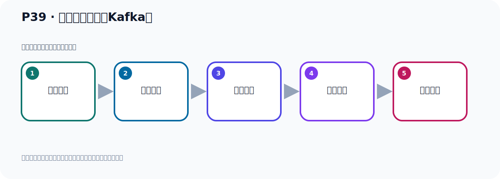

# P39：外部环境连不上Kafka？

> 笔记编号 39/156 · 时长 07:18 · [打开原视频 P39](https://www.bilibili.com/video/BV14J4m187jz?p=39)

[← P38: 外部环境连接Kafka](../03-topic-event-cli/p038-外部环境连接Kafka.md) · [返回本章](./README.md) · [P40: Docker容器Kafka配置文件 →](../03-topic-event-cli/p040-Docker容器Kafka配置文件.md)

## 这节到底讲什么

**核心主题：外部环境连不上Kafka？。**

这节继续完善 Kafka 的完整知识链。请按老师的讲解顺序理解动机、做法和结果。
本节属于“Topic、Event 与命令行实操”这一章；放在全章里看，它的作用是：用脚本创建 Topic，写入与读取 Event，并解决内外网连接与容器配置问题。

## 本节路线

## 老师的完整讲解顺序（ASR 辅助复核）

> 下面按时间顺序保留经过基础术语替换的 ASR，方便核对老师是否提到某个细节。
> 人名、命令、代码和英文参数仍可能识别错误；准确结论以本节白话说明、代码块和实操速查表为准。

### 1. 00:00–00:55

好，那我们现在呢，我们连接啊，我们这个Kafka，Nedex里面容器中的这个Kafka连不上啊，这个连接是它连不上。连不上之后呢，我们怎么办呢？我们接下来，我们看一下啊，怎么解决一下它的连接问题。好，那接下来我们再往下看一下。也就是说，我们这个外部环境啊，我们去连这个Kafka连不上。好，那这个手能看官方回答。我们使用的是官方的那个多口镜像，官方的，那我们找官方文档。你看一下我们之前启动多口的时候呢，用的是哪一个呢？用的是这样一个镜像，这个镜像，那么这个镜像是官方提供的。所以我们下面就去找官方的这个文档。那官方文档，那我们去它这个多个HUB啊，多个HUB呢，去搜下我们这个官方镜像。那么它网站在这，我们点进去看一下。

### 2. 00:56–01:49

好，那我们把这个多个HUB在我们这个连接打开啊。好，那么这个就是我们多个HUB，这里面我们可以搜索镜像，这里面好多多镜像，这是它的这个网站。好，那我们用的是Kafka，我们搜下Kafka这个搜索。好，搜索之后你看，我们用的就是这个镜像，阿巴奇邪纲Kafka，你看我们这边就是，我们前面这个镜像，你看一下，就是这个阿巴奇邪纲Kafka，我们是3.7点了这个版本啊。好，那就点了这个镜像里面去，点进去，在官方的啊，16天之前更新的，点进来。好，点进去后来那么它这个后面是标签，标签就是它的版本，你看这是Nartis的版本啊，最新版本，那我们用的是3.7，要是这个版本啊，。

### 3. 01:49–02:41

3.7这个版本，其实你也可以用这个Nartis的版本，是吧，Nartis的也可以啊，最新的，Kafka你看这个数据都一样啊，应该是同一个版本，只不过这个是版本号，这个是Nartis的最新的这个意思，它应该是同一个啊，应该是同一个。你看它这个这个这个数字都一样啊，应该是同一个。好，那么它的文档就看这个OVV，这边是文档。好，这个文档里面就会告诉你怎么去使用这个镜像，配置这个镜像。那首先呢，它说你去这个看这个官方这个文档，这个文档呢我们原来是看过的啊，这个地方，是吧，这在官网嘛，啊，官网，好，这是一个啊，然后呢，再说它说在线文档啊，这些文档，你可以看这个文档是什么，这个工程的外部页，这个页面可以看文档，好，打开看一下。

### 4. 02:43–03:24

啊，这是它这个Kafka，官方网站啊，它这个文档，那么这个文档里面呢，就是这个所有的文档啊，你看，包含所有左边这个，是吧，包含所有啊，好，这个没有。那今天看一下，哎，Kafka这个多颗文档，哎，对，我们就是要看这个多颗文档，啊，因为我们要去连接这个多颗嘛，看这个文档，那么这个文档有两个啊，一个是上面这个文档，一个是下面这个文档，两份文档。好，那我们再把这个打开，好，其他文档先不用看，啊，因为其他这个文档都是它官方的文档，啊，这个阿巴奇下那个文档，我们看多颗文档，那这里打开，然后把这个也打开，这两个文档我们需要看一下，对吧，好，左手看多个文档，看那两个。

### 5. 03:24–04:24

那现在这个文档，哎，这个文档也是它官方的，你看，阿巴奇官方，好，它这个文档它只是告诉你，啊，你怎么去下载这个进向，啊，下载三两七的版本，或者下载它最新的版本，它是下载，是吧，然后这个是怎么启动，啊，启动，好，这个其实我们前面都用过了啊，那几个，一个是下载一个启动，我们之前就是按照这个方式去下载启动的，好，那接下来就是什么呢，接下来它这个就，都，就，就，就。

### 6. 04:24–05:17

这个介绍里面这个文档我已经提前阅读了一下这个文档那我在这里给大家解读一下这个文档首先我们这个迹象起到之后这个容计连不上那就是你需要配置配置之后才能连上那么他说你起到这个卡布尔卡福奇你可以用下面的这个方式一种是默认配置笛附的配置一种是文件单独用个文件输入的配置还有一个就是用环境这个变量的方式进一配置他有三种配置方式这三种那我课件中的也中了个整理就是往下看一下我们找他这个官方文档以后最多的文档就是这个文档刚看到了就这个文档因为其他文档都没什么用这个文档这个文档中给我们提供了这个多个容计他的Kafka是吧启动Kafka有三种配置启动方式。

### 7. 05:17–06:10

三种方式第一种方式用默认配置那么这个方式就是使用Kafka容器他的默认配置那你这样默认配置的话你外部是连不上的我们之前启动Kafka就是用的默认配置你用默认配置那你外界环境连不上原来我们启动已经是默认配置的就是我们这样启动就是我们这样去启动这个多个容器的时候他其实用的是默认配置他用默认配置那我们外界连不上外部环境连不上所以这个要排除掉那第二种方式就是文件输入的方式那就是你提供一个本地Kafka属性配置文件然后替换掉多个容器中的默认配置文件你搞一个文件把它多个容器中默认的文件给它替换掉用这种方式那你可以做一些配置配置之后把它默认配置改掉。

### 8. 06:10–07:06

这样的话你外部环境就可以连上多个容器的Kafka了那么这个方式还是可以的然后还有第三种方式就是环境辨量那么这个就是在你启动的时候通过EAV辨量定义Kafka属性用你定义的这个属性覆盖默认配置中定义的对应的属性值把它默认的容器中默认的Kafka配置值给它覆盖掉那么这种方式也是可以的所以我们现在要想让外部环境可以使用我们这个Kafka容器里面的Kafka那你用这两种方式都是可以的那两种方式都可以的好 那下面我们这个文档也看了那么它下面就告诉我们用默认配置怎么怎么做默认配置不用怎么操作也不用配 直接启动 是吧好 然后用文件配置怎么怎么操作然后用这个环境辨量。

### 9. 07:06–07:15

这个配置怎么怎么操作在它的下面的文档那接下来我们就去操作一下看看怎么样操作。

## 关键术语

- **Kafka：** Apache 开源的分布式事件流平台，常用于高吞吐消息传递、数据管道和流处理。

## 完整原声逐段记录

[查看本节带时间戳的本地 ASR](./transcripts/p039-外部环境连不上Kafka-ASR.md)。主笔记负责可读性和术语校正；ASR 页面负责完整性复核。

## 读完记住

- 本节主题是 **外部环境连不上Kafka？**，它服务于本章目标：用脚本创建 Topic，写入与读取 Event，并解决内外网连接与容器配置问题。
- 理解顺序是：问题背景 → 关键对象 → 处理过程 → 结果验证 → 应用边界。
- 学习时要同时核对老师的解释、画面中的配置/代码，以及最终运行结果。

## 最容易踩的坑

不要把孤立 API 或配置项当成完整能力；始终把它放回生产、存储、消费或集群链路中理解。

## 自测

1. 不看笔记，用自己的话解释“外部环境连不上Kafka？”解决了什么问题。
2. 按顺序复述：问题背景、关键对象、处理过程、结果验证、应用边界。
3. 如果运行结果和老师不同，你会先检查哪三个输入或环境条件？

## 学完检查

- [ ] 我能不看视频复述本节完整思路
- [ ] 我能指出关键命令、配置、类或接口的作用
- [ ] 我能解释画面中的输入与输出为什么对应
- [ ] 我核对过完整 ASR，没有跳过老师的补充说明
- [ ] 我完成了本节自测或复现实验
