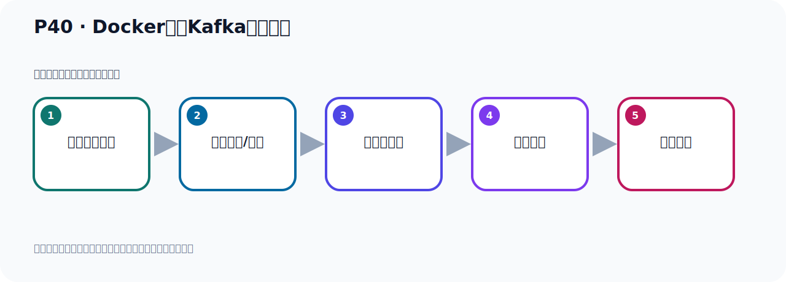

# P40：Docker容器Kafka配置文件

> 笔记编号 40/156 · 时长 05:01 · [打开原视频 P40](https://www.bilibili.com/video/BV14J4m187jz?p=40)

[← P39: 外部环境连不上Kafka？](../03-topic-event-cli/p039-外部环境连不上Kafka.md) · [返回本章](./README.md) · [P41: Docker容器Kafka配置文件复制到Linux →](../03-topic-event-cli/p041-Docker容器Kafka配置文件复制到Linux.md)

## 这节到底讲什么

**核心主题：Docker容器Kafka配置文件。**

这是一节动手课。不要只记命令，要把前置条件、操作步骤、关键参数和成功信号连成一条验证链。
本节属于“Topic、Event 与命令行实操”这一章；放在全章里看，它的作用是：用脚本创建 Topic，写入与读取 Event，并解决内外网连接与容器配置问题。

## 本节路线

## 老师的完整讲解（按视频顺序校正）

> 下面保留老师的完整讲解顺序，并修正 Kafka、Java、ZooKeeper、
> Topic、Partition、Offset 等常见识别错误。它不是压缩摘要；原始 ASR 在后面单独保留。

### 1. 00:00–00:55

好，那下面我们就开始进行配置，那我们使用文件方式进行配置。默认配置我们是连不上的，所以我们使用第二种方式，提供一个本地的Kafka属性文件，替换掉多口容器中的那个配置文件。用这种方式我们去启动Kafka。好，那现在我们要找到多口容器中默认的配置文件，先把它找到。把这个文件找到，找到之后我们再去把它做一个修改。好，那此时怎么办呢？我们接下来一步一步操作，那这个地方我就把这个再附着一个新的这个课件。附着个新课件我们在这个新课件里面去改一下怎么去操作，好，那我们这个时候使用这个文件输的方式，好，那它的具体操作步骤我们在这里写上。

### 2. 00:56–01:53

那首先我们把这个多口容器先给它启动起来，多口容器启动起来，多口容器启动起来我们怎么启动，我们前面有通过这个方式把多口容器先启动，我们先找到它多口里面那个默认的配置文件，好，那这个就是多口容器的启动。我们看看之前有没有启动，先提一下多口PS，多口PS是查看一下当前运行的这个多口容器，有没有这个多口容器，我们把这里都记录一下，到时候大家在复习的时候有问题的话可以看一下查看有没有这个运行的多口容器，好，好，现在我们用我们这个密立启动多口容器，好，再启动，就这个吧，这个密立启动好，我们去启动一下，目前多口容器没有运行，好，那么这个我们就是这样，。

### 3. 01:54–03:13

现在我们就启动了一个多口，多口启动了，里面有个Kafka，这个你可以看一下，那么这个多口PS查一下，你看这个多口容器有了，有了之后我们现在要进入这个多口容器，我们去找这个多口容器里面那个配置文件，对吧，它那个配置文件，默认配置文件，那怎么进入这个多口容器呢，这个时候是通过这样一个密立啊，这就是进入多口容器，多口，然后ESEC的执行密立，好，GANG IT，这个是打开一个交互界面，因为我们要从Midbox里面要进入到多个里面去，相互产生一个交互啊，输入交互，GANG IT，然后里面呢，就是跟上我们这个容器ID，然后后面是吗，进入到这个容器里面以后呢，我们要打开这个多数窗口，不是多数窗口，打开那个密立和窗口，Batch就是卸药窗口，所以这个后面加个B，然后呢，Batch，进入卸药窗口，好，我们相互执行这么个密立，进入容器里面，那我们怎么进入，好，就执行多口了，ESEC，GANG IT，。

### 4. 03:14–04:11

打开交互界面，然后后面给一个容器ID，好，这个值就是容器ID，这个值呢，这是continentalID，这是容器ID，好，后面就是什么，B，然后呢，Batch，进入这个密立行，进入容器的密立行，回车，好，这个时候你看一下，它这个前面这个数字不一样的，表示我们进入容器密立行了，这个名字就是我们这个容器ID，我们进入到这个容器的这个密立行啊，上面这个是密立个式密立行，这是容器里面的密立行，进来之后呢，我们lol看一下，那么这里面它是不支持lol密立的，它需要用ls，ls看一下之后呢，我们发现呢，这个里面呢有一个什么，就有一个叫，叫，它因为你要找配置文件，它的配置文件是在这个etc下，在这个下面，我们进入到这个etc这个下面，这下面是吧，etc下，然后再ls看一下，。

### 5. 04:12–04:59

然后在这个里面呢，它有个叫Kafka，就这个，Kafka，好，我们进入卡Kafka，这个木箱，进来，ls看一下，然后这个Kafka下面呢，它有两个文件夹，我们分别看一下，首先看一下这个后面这个文件夹，这个文件夹应该不是了，我们去猜测一下应该不是，这个secret进来，ls看一下，这里面没有文件的，里面是空的，好，那么这个排除呢，那肯定是在这个多颗这个里面啊，那么进入到，这个多颗，上层木箱，是吧，这个多颗这个木箱，好，进来之后呢，我们ls看一下，这里面确实有个这个servo.pro文件，那么这个文件就是Kafka这个服务器，预计了一个配置文件，这是Kafka，预计了配置文件，。

## 关键术语

- **Kafka：** Apache 开源的分布式事件流平台，常用于高吞吐消息传递、数据管道和流处理。

## 完整原声逐段记录

[查看本节带时间戳的本地 ASR](./transcripts/p040-Docker容器Kafka配置文件-ASR.md)。主笔记负责可读性和术语校正；ASR 页面负责完整性复核。

## 读完记住

- 本节主题是 **Docker容器Kafka配置文件**，它服务于本章目标：用脚本创建 Topic，写入与读取 Event，并解决内外网连接与容器配置问题。
- 理解顺序是：确认前置条件 → 执行安装/配置 → 启动或应用 → 观察输出 → 排查失败。
- 学习时要同时核对老师的解释、画面中的配置/代码，以及最终运行结果。

## 最容易踩的坑

只照抄命令而不核对当前目录、版本、端口和配置文件路径，最容易造成“命令没报错但服务不可用”。

## 自测

1. 不看笔记，用自己的话解释“Docker容器Kafka配置文件”解决了什么问题。
2. 按顺序复述：确认前置条件、执行安装/配置、启动或应用、观察输出、排查失败。
3. 如果运行结果和老师不同，你会先检查哪三个输入或环境条件？

## 学完检查

- [ ] 我能不看视频复述本节完整思路
- [ ] 我能指出关键命令、配置、类或接口的作用
- [ ] 我能解释画面中的输入与输出为什么对应
- [ ] 我核对过完整 ASR，没有跳过老师的补充说明
- [ ] 我完成了本节自测或复现实验
