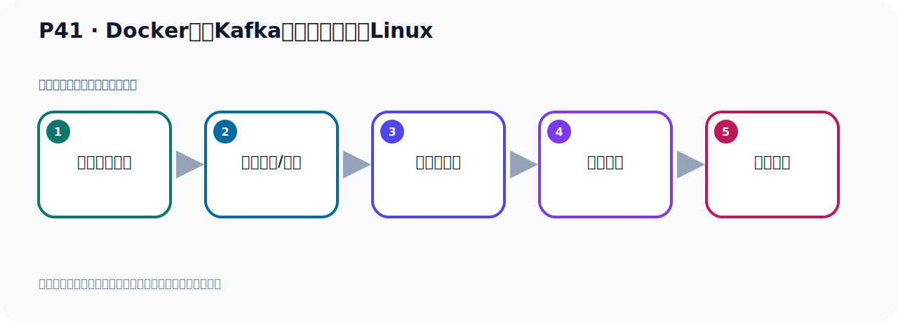

# P41：Docker容器Kafka配置文件复制到Linux

> 笔记编号 41/156 · 时长 05:07 · [打开原视频 P41](https://www.bilibili.com/video/BV14J4m187jz?p=41)

[← P40: Docker容器Kafka配置文件](../03-topic-event-cli/p040-Docker容器Kafka配置文件.md) · [返回本章](./README.md) · [P42: Docker容器Kafka配置文件修改 →](../03-topic-event-cli/p042-Docker容器Kafka配置文件修改.md)

## 这节到底讲什么

**核心主题：Docker容器Kafka配置文件复制到Linux。**

这是一节动手课。不要只记命令，要把前置条件、操作步骤、关键参数和成功信号连成一条验证链。
本节属于“Topic、Event 与命令行实操”这一章；放在全章里看，它的作用是：用脚本创建 Topic，写入与读取 Event，并解决内外网连接与容器配置问题。

## 本节路线

## 老师的完整讲解（按视频顺序校正）

> 下面保留老师的完整讲解顺序，并修正 Kafka、Java、ZooKeeper、
> Topic、Partition、Offset 等常见识别错误。它不是压缩摘要；原始 ASR 在后面单独保留。

### 1. 00:00–00:50

那么这个文件就是Kafka这个服务器运行的一个配置文件。这是Kafka运行的配置文件。好，那么这个配置文件呢，我们可以比如说看了一下这个文件内容啊，看了一下，打开，你看它里面不是有好多配置项吗？和我们之前虚议机聖劳额室里面那个配置文件其实差不多一样的，是吧？有很多配置项。好，现在我们把这个文件要覆盖掉，覆盖掉怎么办呢？我把这个文件给它复制一份，复制到我们的虚议机里面去，复制到SIN的OS里面去。因为你不能直接在这里改啊，因为这个你改这个没有用，为什么？因为你这个容器它这个顺时的，你这次启动一个容器，你下次又可以启动容器，下次又可以启动容器，通过同个进行可以启动很多个容器。

### 2. 00:51–02:02

你启动之后它就是这个文件，而且这个文件改不了，你看一下，比如说我再加个东西，我加在这里，先加A，输入A，A这个编辑模式，是吧？然后保存一下，能不能保存啊这个，保存一下，你看它是止读了里面，所以O里是止读的，是吧？这只要你不可以改啊，这个里面改不了，所以我们把这个文件要复制到我们的SINOS里面去，然后在SINOS里面去改，再改。好，那我们这个退出一下，退出一下，那么把这个文件复制到SINOS里面去，那怎么复制呢？那就是我们需要把这个文件往SINOS复制，那我给它找一个目录啊，这边，这是我们SINOS吧，我们给它找一个这个比如说OPT目录吧，OPT目录下来，我们这有个Kafka，我看一下，Kafka这个目录，然后，然后我们在Kafka下面创一个文件夹叫多可，MAKE，D2创一个多可，这个文件夹，创一个文件夹叫多可，。

### 3. 02:03–03:16

好，我们进入这个多可文件夹下，好，那我们这个多可文件夹是个新的这个空可文件夹，我把那个那个容器里面那个那个围件，我给它复制过来，复制到我们这个这个多可里面来，就适当起这个目录下来，对吧？那怎么复制啊？我们看一下，那就是这个多可，它有个叫CPE，多可CPE，多可CPE，然后呢，我们给上这个容器ID，容器ID是多少？我们先查一下，多可PS，先查一下，好，容器ID是这个ID，我们先复制一下，复制一下，多可CPE夹的复制，复制我们这个容器下，帽号是吧，它下面有个什么名字呢？在ETC那个下面，是吧？然后ETC下在，你看你看这个路径啊，在哪里？我们看一下，P大麦D，在这个路底下，容器里面这个路底下复制，好，我们把它粘一下，这个路底下，然后有个什么？SERVO.propec，是吧？它有个SERVO.propec，就是说把这个容器下得，这个路底下得这个文件复制到哪去呢？

### 4. 03:16–04:16

复制到我们的，复制到我们当前部下，复制到我们当前这个v率是这个部下，好，执行一个回车，好，它就成功了，已经复制了，SERVO.propec成功了，好，那么这是复制文件啊，或者文件，给大家说一下，那我们这个方式复制这个文件，是吧？把它里面这个文件复制过来啊，复制过来，好，复制过来啦，复制过来之后呢，那我们当前部下就有这个文件了，就有这个文件了，好，那下面我们就去修改这个文件了，好那下面我们就去修改这个文件，在我们这个send OS里面修改，不是在容器里面修改，我们这个地方现在是send OS，是吧？是我们的minus，好，我们打开这个vm修改这个文件就可以了，对吧？好，这是我们的这个操作啊，也就是说把容器里面的它的这个配置文件给它复制到我们minus里面来，这是这个步骤，好，那我们现在用到这么几个mini，看一下啊，这个就是把这个，嗯，这个，嗯，这个文件，。

### 5. 04:16–05:02

多可，容器中的这个文件，复制到这个litix中，是吧？放litix中，好，这个mini，这个mini，后面这个是litix目录，前面这一段，这是容器ad，加那个文件，啊，这个这个完整路径，好，我们刚才呢，做了这么一些操作，好，这操作呢，就是我们多可的一些命令啊，好，操作完之后，接下来我们就开始去干嘛呢，我们开始要去修改它这个文件了，因为它已经复制过来了，已经有了，好，今天我们看看这个文件该怎么去修改，修改之后，让它能够连上，让外部能够连上，那我们就修改这个文件，我们今天来看看怎么修改这个文件。

## 关键术语

- **Kafka：** Apache 开源的分布式事件流平台，常用于高吞吐消息传递、数据管道和流处理。

## 完整原声逐段记录

[查看本节带时间戳的本地 ASR](./transcripts/p041-Docker容器Kafka配置文件复制到Linux-ASR.md)。主笔记负责可读性和术语校正；ASR 页面负责完整性复核。

## 读完记住

- 本节主题是 **Docker容器Kafka配置文件复制到Linux**，它服务于本章目标：用脚本创建 Topic，写入与读取 Event，并解决内外网连接与容器配置问题。
- 理解顺序是：确认前置条件 → 执行安装/配置 → 启动或应用 → 观察输出 → 排查失败。
- 学习时要同时核对老师的解释、画面中的配置/代码，以及最终运行结果。

## 最容易踩的坑

只照抄命令而不核对当前目录、版本、端口和配置文件路径，最容易造成“命令没报错但服务不可用”。

## 自测

1. 不看笔记，用自己的话解释“Docker容器Kafka配置文件复制到Linux”解决了什么问题。
2. 按顺序复述：确认前置条件、执行安装/配置、启动或应用、观察输出、排查失败。
3. 如果运行结果和老师不同，你会先检查哪三个输入或环境条件？

## 学完检查

- [ ] 我能不看视频复述本节完整思路
- [ ] 我能指出关键命令、配置、类或接口的作用
- [ ] 我能解释画面中的输入与输出为什么对应
- [ ] 我核对过完整 ASR，没有跳过老师的补充说明
- [ ] 我完成了本节自测或复现实验
