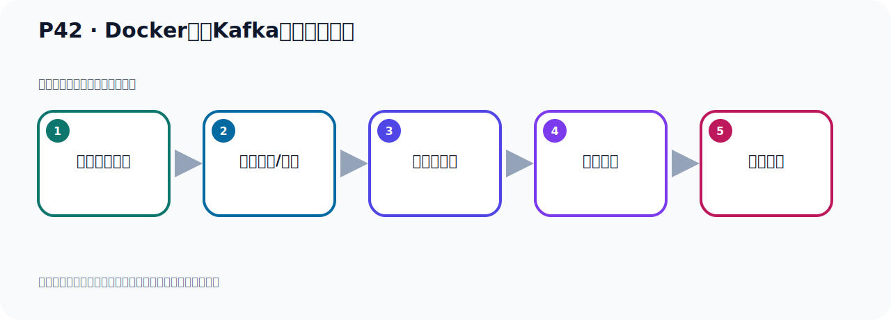

# P42：Docker容器Kafka配置文件修改

> 笔记编号 42/156 · 时长 06:43 · [打开原视频 P42](https://www.bilibili.com/video/BV14J4m187jz?p=42)

[← P41: Docker容器Kafka配置文件复制到Linux](../03-topic-event-cli/p041-Docker容器Kafka配置文件复制到Linux.md) · [返回本章](./README.md) · [P43: Docker容器Kafka配置文件映射 →](../03-topic-event-cli/p043-Docker容器Kafka配置文件映射.md)

## 这节到底讲什么

**核心主题：Docker容器Kafka配置文件修改。**

这是一节动手课。不要只记命令，要把前置条件、操作步骤、关键参数和成功信号连成一条验证链。
本节属于“Topic、Event 与命令行实操”这一章；放在全章里看，它的作用是：用脚本创建 Topic，写入与读取 Event，并解决内外网连接与容器配置问题。

## 本节路线

## 老师的完整讲解顺序（ASR 辅助复核）

> 下面按时间顺序保留经过基础术语替换的 ASR，方便核对老师是否提到某个细节。
> 人名、命令、代码和英文参数仍可能识别错误；准确结论以本节白话说明、代码块和实操速查表为准。

### 1. 00:00–00:51

好，那我们接下来继续看一下，我们刚才是把这个文件已经复制过去了。就是把Docker下的Server配置文件已经复制到我们的一个目录下，我们看一下复制到哪个目录下。复制到我们是叫OPT，Lidbox OPT，然后卡复，卡，然后Docker，把它复制到已经复制到这个目录下去了，这是一个复制。复制完之后我们今天就是修改这个文件，这个文件我们已经复制到这个目录下去了，那我们就进入这个目录，然后去修改这个文件就可以了。进这个目录，好，那这个时候我们在这边CD到这个目录下，对吧。好，这目录下lv看一下，这个时候这里面有一个这个文件，好，那么这个文件我们就VAM打开这个文件，打开。

### 2. 00:52–01:41

好，打开之后我们先回到最上面，这个上面，是吧，这是它的文件，人家类似的就是这些。从Docker容易中复制过来的这个文件，好，那现在我们为了让我们的Windows，我们外界可以连到这个Docker容器中的这个Kafka里面去，那我们说怎么改来。那这个时候我们再看一下我们下个课件，我们走。好，那这个时候我们修改这个文件，这个文件让我们要改哪个地方啊，一个就是Lacence，一个是Advice的Lacence，这个这个两个地方。好，那么找到这种地方啊，在这个文件中啊，回到最上面啊，好，在最上面，我想找在它这个这个Socket服务这里啊，这个是服务的基本配置，。

### 3. 01:41–02:25

然后下面有个叫Socket server settings，就是网络套节制这个服务配置，是吧，与网络相关的。好，与网络相关的我们配哪两个呢，配这两个啊，一个就是这个Lacence，一个是这个东西，一个是Advice的Lacence，这几个配置像。好，莫人请问一下呢，他这个地方啊，是个空的啊，是个空的，然后这个地方也是个空的啊，对吧，这是空的。那么是空的的话呢，他上面有个住室，你如果是空的话，他其实是用这个java代码呢，get什么这个，这个hose的内蒙啊，拿这个hose内蒙，就根据这行java代码去拿这个hose内蒙啊，拿个名字。

### 4. 02:26–03:22

那么他拿了这个名字呢，我们外界连不上，我们通过Windows去连打，是吧，到时候我们是，你看这是Windows，Windows连过来，连过来这是Linux，啊Linux里面有个容器，容器里面这个才是我们Kafka，你看，这边才是Kafka啊，Kafka。所以你看，你Windows，你要进入这个Linux，Linux再进到这个容器中啊，才可以访问这个Kafka，是这样的关系啊。所以我们这个地方不能拿，用他这个莫人拿这个名字啊，他莫人的名字拿不到，那我们这边怎么办呢，由于我们这个Kafka在这个容器里面，在多个容器里面，那我们这边这个配置像啊，我们一般是配个0.0.0，就用这个保留IP，我们不固定IP，因为容器我比如说我这一次把容器关了，我下次又启动个容器，有可能容器里面的IP他发生变化，。

### 5. 03:23–04:14

所以我们这个这个这个什么这个IP不写固定，不要写固定的，对吧，这边这个IP就相应就是容器里面的IP，那么IP你固定了之后来，你下次重新起一个新容器，他可能这个IP有变化，所以我们这个值啊，我们通常写成0.0.0一个保留IP，那么这个保留IP啊，它是适合于你任何IP的，对吧，任何IP都是适应的，就是0.0.0，没写上吗，按个I字母啊，进入编辑模式，就是这里写的是0.0.0.0，这个是个保留IP啊，保留IP，我们打开个留意气可以看一样，这个保留IP你看，0.0.0.0，这个什么意思啊，它是一个保留IP，就适合于任何IP，任何IP我都都相应我都等价的，我都可以使用啊，保留IP，好，起个塌。

### 6. 04:14–05:13

然后后面这个concure，这个东西呢，是后面这个，它作为一个concure的节点，与集群相关，后面我们再去介绍它这个concure这个节点这个角色，那这边我们也是来写上0.0.0.0，前面这个GNT啊，是0.0.0.0，这也是0.0.0.0，好，这样完了，好，第二个配置就这里吧，那么这个配置它是对外公布的一个IP例子，就是我到时候我去访问你这个容器里面这个，Kafka的时候，我用哪个IP去访问，那这个时候我们是写上lilxIP，你看啊，这是我们Windows，Windows，然后到时候连接，连接这个，这是lilx，lilx里面一个容器啊，一个容器，这边一个Kafka，是吧，一个Kafka，好，到时候我们Windows就连了时间，那我们是填上这个lilxIP，写上lilxIP，通过lilxIP连到这个Kafka，那么这个地方相与是对外所公开的那个IP地址是多少，对外公开的IP地址，。

### 7. 05:13–06:03

这个out of vice其实就像对外广播，对外公开这个意思，公开的那个是哪，是多少呢，那就是我们lilxIP，lilxIP那就是我们这个，是吧，191.168，什么11.128啊，这个IP，所以我们这里面就写上这个IP，对外公开的这个IP，我们通过IP，这个IP到时候就连我们的这个Kafka，192.168点，这个11.128，好，这样我们就配在两个选项啊，把这两个选项配置一下，好，那就是我们这里的一个是它啊，这个写0.0，然后再写我们真实的IP，当然你那边倒是你的服务器的IP不一样，那你的写上你的那个lilxIP，你不能照抽我的，因为我的IP是11.188，你那边可能不是这个IP，那你写上你的IP就可以了，啊，所以这个out of vice这个东西啊，它表示对外宣称到公布的，。

### 8. 06:04–06:40

那么对外所开放的这个IP口端口，到时候我们通过的IP端口可以连到我们这个多口，啊多口里面Kafka，好，那么这样的话我们就这个配完，配完之后来把我分享，保存，保存一下是吧，也就是说我们在这个lilx里面啊，这个部像我们把这个文件就改好了，啊，改好了，我们改了是我们lilx里面这个文件，没有改多个的文件，因为多个是顺时的啊，它可以启动很多个多口，所以我们不要去改那个文件，而且这个文件是只读到改不了，啊，它是只读到，所以我们改这个lilx里面这个文件，啊，而且这个文件是从多口考备过来的，啊，父子过来的，。

## 关键术语

- **Kafka：** Apache 开源的分布式事件流平台，常用于高吞吐消息传递、数据管道和流处理。

## 完整原声逐段记录

[查看本节带时间戳的本地 ASR](./transcripts/p042-Docker容器Kafka配置文件修改-ASR.md)。主笔记负责可读性和术语校正；ASR 页面负责完整性复核。

## 读完记住

- 本节主题是 **Docker容器Kafka配置文件修改**，它服务于本章目标：用脚本创建 Topic，写入与读取 Event，并解决内外网连接与容器配置问题。
- 理解顺序是：确认前置条件 → 执行安装/配置 → 启动或应用 → 观察输出 → 排查失败。
- 学习时要同时核对老师的解释、画面中的配置/代码，以及最终运行结果。

## 最容易踩的坑

只照抄命令而不核对当前目录、版本、端口和配置文件路径，最容易造成“命令没报错但服务不可用”。

## 自测

1. 不看笔记，用自己的话解释“Docker容器Kafka配置文件修改”解决了什么问题。
2. 按顺序复述：确认前置条件、执行安装/配置、启动或应用、观察输出、排查失败。
3. 如果运行结果和老师不同，你会先检查哪三个输入或环境条件？

## 学完检查

- [ ] 我能不看视频复述本节完整思路
- [ ] 我能指出关键命令、配置、类或接口的作用
- [ ] 我能解释画面中的输入与输出为什么对应
- [ ] 我核对过完整 ASR，没有跳过老师的补充说明
- [ ] 我完成了本节自测或复现实验
