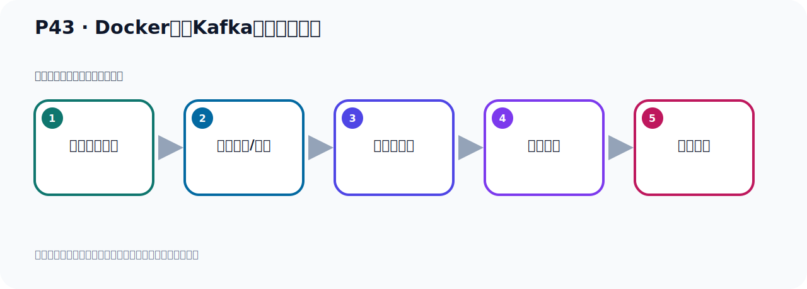

# P43：Docker容器Kafka配置文件映射

> 笔记编号 43/156 · 时长 03:51 · [打开原视频 P43](https://www.bilibili.com/video/BV14J4m187jz?p=43)

[← P42: Docker容器Kafka配置文件修改](../03-topic-event-cli/p042-Docker容器Kafka配置文件修改.md) · [返回本章](./README.md) · [P44: Idea之Kafka插件工具 →](../04-tools-monitoring/p044-Idea之Kafka插件工具.md)

## 这节到底讲什么

**核心主题：Docker容器Kafka配置文件映射。**

这是一节动手课。不要只记命令，要把前置条件、操作步骤、关键参数和成功信号连成一条验证链。
本节属于“Topic、Event 与命令行实操”这一章；放在全章里看，它的作用是：用脚本创建 Topic，写入与读取 Event，并解决内外网连接与容器配置问题。

## 本节路线

## 老师的完整讲解顺序（ASR 辅助复核）

> 下面按时间顺序保留经过基础术语替换的 ASR，方便核对老师是否提到某个细节。
> 人名、命令、代码和英文参数仍可能识别错误；准确结论以本节白话说明、代码块和实操速查表为准。

### 1. 00:00–01:11

改完之后，你做个文件印射。就是把我们所改的文件覆盖掉容器里面的文件。通过这一行的命令去覆盖，这个命令不是随便写的，这个也是看它的文档去写的。文档不是在这里吗？我们再打开一张文档。看这个文档。这个文档，我们现在采用文件覆盖的方式去配置Docker里面的Kafka。那你用文件配置方式就在这一方式，这是默认方式，那是文件配置方式。那你看它是用这个命令去覆盖，这是我们Lidbox里面的文件的路径。这个是Docker里面的路径，这个路径是固定的，你不可以随便写。你按这个文档来，后面是意义设端口吗？把我们Lidbox的9092和Docker里面的9092做个意义设，。

### 2. 01:11–01:58

后面是你那个镜像的名字，所以它整个命令是这一段。所以我们这一方就写Lidbox的那个路径，那个配置名字的路径，这个地方是固定的，就叫这个路径，它是固定的，必须是这个路径，你也不能写别的路径。所以我们就用这个命令，就可以启动一下这个。好，那我们就在这个地方，那就是我们在这个地方，我们就这样。我们的Lidbox里面的路径是这个地方，在这个位置，在OPTDocker这个目录下。然后这里面这个路径是固定的，是不能变的，然后印射端口，然后启动我们这个镜像就可以了。好，那我们这样运行我们这个容器就可以了，然后我们外界到时候就可以连上。

### 3. 01:58–02:51

好，那这个时候我们就把我们这边这个容器先给人关掉。Cauture C就关掉了，关掉这ps查一下，不是ps查一下，通过Docker，Dockerps，查一下，没有了，对吧，没有了之后我们现在重新启动，重新启动就通过了我们这样一个命令，去启动我们这个Docker，好，启动一下。好，再说我们扎进来，那我们运行，好，现在我们启动全新的一个Docker，而且他已经启动好了，对吧，启动好了。好，启动好之后，接下来我们就去验证我们现在还能不能连上去，还能不能连上去，那你就用我们之前这个工具了，之前不是连不上吗？现在我们就去联系一下，试一下，好，那我们这个IP，你看就是通过这个公开的IP，。

### 4. 02:51–03:40

这个IP11128，992，好，我们点一下联接，这个手你看，它已经联接成功了，预设的。好，那么至此我们就完成了这个Docker容器中Kafka的一个配置，实现这个外界环境可以连到Docker容器中的这个Kafka，好，那么整个过程就是我们刚才介绍的过程，好，这个参数是做一个文件印射的，把另一个是这个文件和这里面这个目录下的文件做印射，我们到时候只要改正目录下的这个配置文件就可以了，它把这个配置文件会印射到这边去，到时候在运行的时候会使用我们的这个N64这个配置文件去运行Docker，这样的话由于它对外公开的这个地址，所以我们可以访问这个Docker里面的Kafka了，。

### 5. 03:40–03:46

好，那么以上我们就完成了这个外部环境连接Kafka。

## 关键术语

- **Kafka：** Apache 开源的分布式事件流平台，常用于高吞吐消息传递、数据管道和流处理。

## 完整原声逐段记录

[查看本节带时间戳的本地 ASR](./transcripts/p043-Docker容器Kafka配置文件映射-ASR.md)。主笔记负责可读性和术语校正；ASR 页面负责完整性复核。

## 读完记住

- 本节主题是 **Docker容器Kafka配置文件映射**，它服务于本章目标：用脚本创建 Topic，写入与读取 Event，并解决内外网连接与容器配置问题。
- 理解顺序是：确认前置条件 → 执行安装/配置 → 启动或应用 → 观察输出 → 排查失败。
- 学习时要同时核对老师的解释、画面中的配置/代码，以及最终运行结果。

## 最容易踩的坑

只照抄命令而不核对当前目录、版本、端口和配置文件路径，最容易造成“命令没报错但服务不可用”。

## 自测

1. 不看笔记，用自己的话解释“Docker容器Kafka配置文件映射”解决了什么问题。
2. 按顺序复述：确认前置条件、执行安装/配置、启动或应用、观察输出、排查失败。
3. 如果运行结果和老师不同，你会先检查哪三个输入或环境条件？

## 学完检查

- [ ] 我能不看视频复述本节完整思路
- [ ] 我能指出关键命令、配置、类或接口的作用
- [ ] 我能解释画面中的输入与输出为什么对应
- [ ] 我核对过完整 ASR，没有跳过老师的补充说明
- [ ] 我完成了本节自测或复现实验
