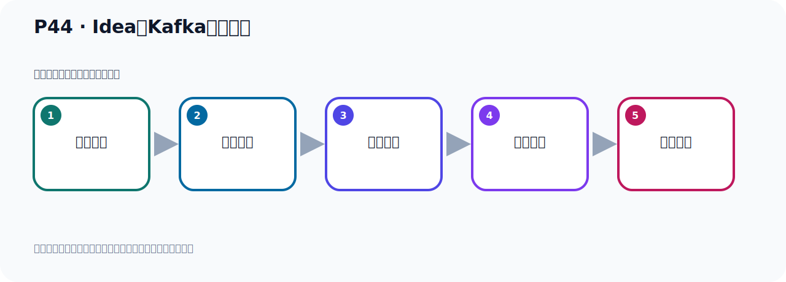
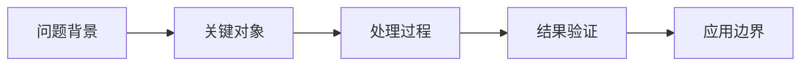

# P44：Idea之Kafka插件工具

> 笔记编号 44/156 · 时长 04:02 · [打开原视频 P44](https://www.bilibili.com/video/BV14J4m187jz?p=44)

[← P43: Docker容器Kafka配置文件映射](../03-topic-event-cli/p043-Docker容器Kafka配置文件映射.md) · [返回本章](./README.md) · [P45: Kafka连接工具Offset Explorer →](../04-tools-monitoring/p045-Kafka连接工具Offset-Explorer.md)

## 这节到底讲什么

**核心主题：Idea之Kafka插件工具。**

这节继续完善 Kafka 的完整知识链。请按老师的讲解顺序理解动机、做法和结果。
本节属于“连接、管理与监控工具”这一章；放在全章里看，它的作用是：认识 IDEA 插件、Offset Explorer、CMAK 与 EFAK 的用途、配置和限制。

## 本节路线

## 老师的完整讲解顺序（ASR 辅助复核）

> 下面按时间顺序保留经过基础术语替换的 ASR，方便核对老师是否提到某个细节。
> 人名、命令、代码和英文参数仍可能识别错误；准确结论以本节白话说明、代码块和实操速查表为准。

### 1. 00:00–00:58

前面通过配置以后，我们连上了Kafka，连上了Linux里的Docker 容器中的Kafka，就连上了。这个配置定位在大数据BigDataTools工具里面的。我们写了个名字叫Kafka，然后这地方是连接到Kafka的地址，IP加端口。我们通过自立一方式连接到Custom，然后授权认证是NOW没有。下面这个地方看一下，这个可选项，这是可选项，这是NOW就行了。可选项，然后连接成功了，对吧。这个从没应用，OK一下。OK一下，它就在这个地方多一个窗口，其实就是在你这个地方，这个可以收起来，就是这个地方了，点一下展开，点一下折起来，点一下展开，就这个。

### 2. 00:58–01:50

好，那么打开之后，你可以看一下，我们看一下，它就在这个地方有个Topic，对吧，目前里面没有Topic，还有一个消费组，消费组，就两个信息，一个叫消费组，消费分组，也就叫Topic。那我们这个容器因为是我们全新起的那个容器，那么容器里面目前还是没有Topic的。比方说，我们用之前的方式，我们创建一个Topic，我们看课件之前不是有个方式可以创建Topic吗？好，这个，创建Topic，我们就通过用这个脚本，然后创建，我们连接我们本地的这个容器里面的Kafka，我们可以创建个Topic，我们创建一下，我们看能不能看到，我们试一下，把这个方式复设一下，然后我们去创建一个。

### 3. 01:50–02:37

好，那么这个我们在优优的罗可Kafka避布像，在里面它有这个脚本，我们用这个脚本去执行，我们看优优的罗可卡，我们看优�我们这个地方写个真实地址行不行比如写个地址192.168.11.128。

### 4. 02:37–03:28

因为我们容器里面的Kafka它对外公开了这名个地址对吧我们这个地址，我们创立一个Topic，行不行我们创立一个Topic2，之前名字过没加个2我们这个时候再创建一下那么它也是可以的，连这个地址也可以然后连我们这个罗可卡也可以因为这个罗可就在我们当前这个利利格式里面所以我们后者连也是可以的用这个IP去连也是可以的这个IP就是那个罗可容器里面的Kafka对外暴露的这个IP对不对都可以那么这样我们就创建两个Topic了一个它，一个它那么我们这个时候在我们这个里面看一下它有没有呢我们这个是刷新一下刷新那就是在这里看一下刷新的这个刷新刷新连接，Refresh，刷新点一下刷新。

### 5. 03:28–03:59

刷新之后你看这个Topic展开它就有两个Topic了这个可以看到相对于这是个图形界面的一个Topic图形界面两个两个那么这个消费分组还没有因为我们还没有用消费者去消费所以这边没有的那我们后续就是通过这个图形界面可以看到我们那个Kafka的一些信息这是我们这个工具它有一些信息可以展示一下好那我们这个工具就可以简单给大家介绍这里。

## 关键术语

- **Kafka：** Apache 开源的分布式事件流平台，常用于高吞吐消息传递、数据管道和流处理。
- **Topic：** 事件的逻辑分类。生产者向 Topic 写数据，消费者从 Topic 读取数据。

## 完整原声逐段记录

[查看本节带时间戳的本地 ASR](./transcripts/p044-Idea之Kafka插件工具-ASR.md)。主笔记负责可读性和术语校正；ASR 页面负责完整性复核。

## 读完记住

- 本节主题是 **Idea之Kafka插件工具**，它服务于本章目标：认识 IDEA 插件、Offset Explorer、CMAK 与 EFAK 的用途、配置和限制。
- 理解顺序是：问题背景 → 关键对象 → 处理过程 → 结果验证 → 应用边界。
- 学习时要同时核对老师的解释、画面中的配置/代码，以及最终运行结果。

## 最容易踩的坑

不要把孤立 API 或配置项当成完整能力；始终把它放回生产、存储、消费或集群链路中理解。

## 自测

1. 不看笔记，用自己的话解释“Idea之Kafka插件工具”解决了什么问题。
2. 按顺序复述：问题背景、关键对象、处理过程、结果验证、应用边界。
3. 如果运行结果和老师不同，你会先检查哪三个输入或环境条件？

## 学完检查

- [ ] 我能不看视频复述本节完整思路
- [ ] 我能指出关键命令、配置、类或接口的作用
- [ ] 我能解释画面中的输入与输出为什么对应
- [ ] 我核对过完整 ASR，没有跳过老师的补充说明
- [ ] 我完成了本节自测或复现实验
