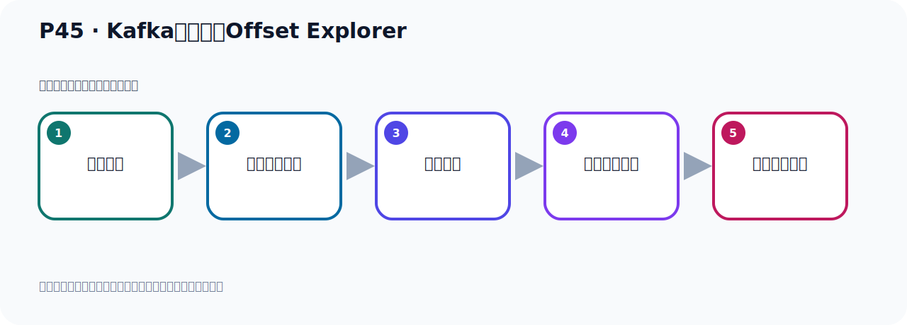

# P45：Kafka连接工具Offset Explorer

> 笔记编号 45/156 · 时长 06:50 · [打开原视频 P45](https://www.bilibili.com/video/BV14J4m187jz?p=45)

[← P44: Idea之Kafka插件工具](../04-tools-monitoring/p044-Idea之Kafka插件工具.md) · [返回本章](./README.md) · [P46: Kafka连接工具CMAK →](../04-tools-monitoring/p046-Kafka连接工具CMAK.md)

## 这节到底讲什么

**核心主题：Kafka连接工具Offset Explorer。**

这节围绕位置与进度展开。一定要区分日志中的位置、各副本的末端位置、可见水位和消费者提交进度。
本节属于“连接、管理与监控工具”这一章；放在全章里看，它的作用是：认识 IDEA 插件、Offset Explorer、CMAK 与 EFAK 的用途、配置和限制。

## 本节路线

## 老师的完整讲解顺序（ASR 辅助复核）

> 下面按时间顺序保留经过基础术语替换的 ASR，方便核对老师是否提到某个细节。
> 人名、命令、代码和英文参数仍可能识别错误；准确结论以本节白话说明、代码块和实操速查表为准。

### 1. 00:00–01:01

好，我们给大家介绍了一个idea的插件工具。除了这个工具之外，我们还有些别的工具。好，我们接着看一下。我们在使用Kafka的时候，我们有一些其他的图形界面的连接工具。通过这些工具，可以连到Kafka，然后可以查看Kafka内部的信息。好，在这里给大家介绍三款工具。我们看一下。第一款工具叫Offset Explorer。这个Offset是一个偏移量、偏移的意思。因为Kafka里面有个概念，叫偏移量。那么就是偏移量、偏移量的一个探索者、考察者，大概这个意思。那么这个工具，它原来是叫Kafka2，Kafka工具。后面改名叫Offset Explorer。

### 2. 01:01–01:51

它的官网在这里，它官网的域名，其实还是Kafka2。我们打开这个官网，看一下它的工具。那就在这里打开语言器，然后我们输入它这个官网，访问一下。这个就是我们Offset Explorer，它改名字的。你看，它原来这个，之前名字是叫Kafka2。现在改成了这个名字，改这个名字。这是这个工具，看一下。然后我们去下载，下载，那就是点下这个Download，点Download。Download下载。下载那么目前这些版本就是三个版本，那么它有Windows版本，有MAC版本，还有Negas版本，我们下三个版本，那么我们下Windows，Windows，。

### 3. 01:51–02:42

那就是这个，64位，我们Windows64位，下这个，点这个Download就可以下载，点下下载，当时这个软件我已经下完了，我就不再下了，我已经下过了，好，那么就是这个版本，三个人，那我下哪去了呢，那我本地店上，这里啊，就这个。下载完之后就它，那我们就是把这个软件给它安装一下就可以了，那就双击安装，双击安装，好，安装这个软件。好，Yes啊，那这个安装的话，基本上就是下一步，下一步就可以了，下一步，然后你要接受它这个许可证，这个协议，这个协议，安装协议，下一步，安装位置，那这个我们就放这个C函算了，OK，下一步，好，。

### 4. 02:42–03:28

这个我们就是创建图标，那我们创建一下吧，下一步，好，那么它就开始安装，安装完之后我们看一下这个软件啊，长什么样子，好，它已经安装完了，对吧，我们点这个复计席，完成。好，完成之后它没有帮我们自动打开啊，那我们需要从开子菜单去打开一下的，从开子菜单啊，那就在这里面就有一个啊，在这里面点一下是吧，就这个软件啊，好，点了之后就到这里了是吧，然后它说你这个没有这个配置连接，对吧，它这个英语提示啊，没有配置连接，它说你必须要配置一个连接啊，连接到你这个Kafka集群，啊，你配一下，那么点这个确定，确定，好，点确定它要谈这个界面啊，。

### 5. 03:28–04:12

这个界面就是需要你去配置，配置连接Kafka，它这有四个选项是吧，好，第一个选项叫Poblix，Poblix就是配那些手信，通用的手信，Gilet Ray，集群名字叫什么，这个启动的服务系的IP端口，还有这个Kafka的版本，是吧，那么版本它给我们自动选了3.7，它还有之前的版本啊，二连几一直都可以啊，对不，我们3.7，目前我们用的是3.7，那点选它啊，那这个地址，集群地址呢，我们是连到我们这个Nilivus里边，对吧，这个Kafka，我们是用多颗啊，容器启动的Kafka，那么怎么连接，就像我们之前这个地方一样的，和这个地方一样，我们点这个地方，点这个设置，。

### 6. 04:12–05:03

那它的地址就这一段，对吧，11.128这种地址啊，那我们放这边来，地址就这个，好，你特别可以聘一下，看能不能通啊，聘一下，试一下，哎，这个servo可以的，没问题，没问题，没错呢，这里提设是这个设置，成功的，对吧，成功的，OK，那么这个集群名字，这个名字其实我觉得无所谓啊，你随便写个名字啊，我们就用这个it做名字算了，it做名字吧，然后这个这个这个，就加个it叫名字，这种年纪这个名字啊，名字随便写，好，一个地址，然后呢，好，下面这个是rookib，啊，rookib呢，我们现在用的是多颗容器启动的一个Kafka，那么这个多颗容器里面，它其实没有启动rookib，啊，我们可以在这个leaders里面查看一下，你看，。

### 7. 05:04–05:49

我们查看端口吧，nightstat，对吧，nightstat，gun，glpt，it，我们才能端口，你看它目前只用了一个9092，9092，就是我们这个dokong里面，那个用了端口，所以它里面呢，用的是crawl的方式，起了那个Kafka，所以它没用了那个rookib，没有用rookib，没有用rookib的话，那我们这些方式其实不需要配rookib这个ip端口啊，不需要配，好，不需要配呢，我们直接点这个下面那个测试，测试一下，哎，你看，它这个年纪成功啊，年纪成功它问你要不要加这个年纪，那我们要加，把它加进来啊，那么点s4，好，那么这个年纪又加上了，对吧，那就这个了，这个年纪啊，。

### 8. 05:50–06:46

对吧，好，那么点展开了，那在有里面呢，可以看到你的这个服务器信息呢，在这服务器呢，这个ip端口啊，这服务器的，这Broker，这个Broker叫代理，代理就指的是我们Kafka服务器啊，这个Broker就是我们Kafka服务器，那么这个是Topic，那Topic呢，我们之前创建有两个Topic对吧，一个它，一个它，两个Topic，那Topic啊，这里面还有卡地形，这个我们后面介绍啊，这是两个Topic对吧，两个Topic看到啊，那消费者，消费者目前没有，还没有消费者啊，所以说你这里没有没东西，哎，这么个情况啊，通过这个呢，可以看到这个一样的这个数据啊，这些数据信息，好，这是这个图形基本工具，先给它安装好，后面我们再去用这个工具，好，那么这个工具呢，我们就安装完了啊，安装完了，好，后面我们再用这个工具，去查看信息，。

### 9. 06:48–06:50

好，。

## 关键术语

- **Kafka：** Apache 开源的分布式事件流平台，常用于高吞吐消息传递、数据管道和流处理。
- **Topic：** 事件的逻辑分类。生产者向 Topic 写数据，消费者从 Topic 读取数据。
- **Broker：** 运行 Kafka 服务的节点；多个 Broker 组成 Kafka 集群。
- **Offset：** 事件在 Partition 中的位置编号，也是消费者记录消费进度的依据。

## 完整原声逐段记录

[查看本节带时间戳的本地 ASR](./transcripts/p045-Kafka连接工具Offset-Explorer-ASR.md)。主笔记负责可读性和术语校正；ASR 页面负责完整性复核。

## 读完记住

- 本节主题是 **Kafka连接工具Offset Explorer**，它服务于本章目标：认识 IDEA 插件、Offset Explorer、CMAK 与 EFAK 的用途、配置和限制。
- 理解顺序是：消息写入 → 形成日志位置 → 副本同步 → 更新可见水位 → 记录消费进度。
- 学习时要同时核对老师的解释、画面中的配置/代码，以及最终运行结果。

## 最容易踩的坑

“Offset”不是一个全局数字；它必须放在具体 Topic、Partition、消费者组或副本语境中解释。

## 自测

1. 不看笔记，用自己的话解释“Kafka连接工具Offset Explorer”解决了什么问题。
2. 按顺序复述：消息写入、形成日志位置、副本同步、更新可见水位、记录消费进度。
3. 如果运行结果和老师不同，你会先检查哪三个输入或环境条件？

## 学完检查

- [ ] 我能不看视频复述本节完整思路
- [ ] 我能指出关键命令、配置、类或接口的作用
- [ ] 我能解释画面中的输入与输出为什么对应
- [ ] 我核对过完整 ASR，没有跳过老师的补充说明
- [ ] 我完成了本节自测或复现实验
