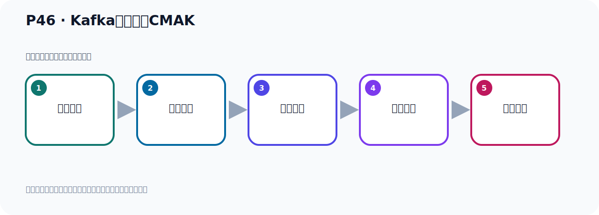

# P46：Kafka连接工具CMAK

> 笔记编号 46/156 · 时长 06:43 · [打开原视频 P46](https://www.bilibili.com/video/BV14J4m187jz?p=46)

[← P45: Kafka连接工具Offset Explorer](../04-tools-monitoring/p045-Kafka连接工具Offset-Explorer.md) · [返回本章](./README.md) · [P47: Kafka连接工具CMAK配置与启动 →](../04-tools-monitoring/p047-Kafka连接工具CMAK配置与启动.md)

## 这节到底讲什么

**核心主题：Kafka连接工具CMAK。**

这节继续完善 Kafka 的完整知识链。请按老师的讲解顺序理解动机、做法和结果。
本节属于“连接、管理与监控工具”这一章；放在全章里看，它的作用是：认识 IDEA 插件、Offset Explorer、CMAK 与 EFAK 的用途、配置和限制。

## 本节路线

## 老师的完整讲解（按视频顺序校正）

> 下面保留老师的完整讲解顺序，并修正 Kafka、Java、ZooKeeper、
> Topic、Partition、Offset 等常见识别错误。它不是压缩摘要；原始 ASR 在后面单独保留。

### 1. 00:00–00:47

好，那我们这个Offset Explorer工具呢，我们就介绍完了，就在这里啊，这是我们这个工具。好，那接下来呢，我们介绍的第一个工具啊，叫CMAK这个工具。那么这个工具啊，我们之前它的名字叫什么，叫Kafka Manager，后面它改名字了啊，这个工具啊。那么它的官网呢，就在GitHub上，它没有独立的官网，不像这个啊，这个有个独立官网，它这个就在GitHub上。好，我们通过这个地址，访问GitHub。好，那么打开GitHub器，看一下这个这个软件啊，打开。访问啊，好，打开之后啊，它这个是亚虎公司啊，给我们提供的，这是亚虎公司。

### 2. 00:48–01:39

它这个工具啊，用来管理这个Kafka集群的，这样一个工具，这个介绍呢。它是一个工具啊，管理这个Kafka集群，cluster。好，那么这是它的这个开源这个项目啊，下面有一些这个说明啊，它这个安装之后的效果是这个效果，这个这个效果可以大概浏览一下啊，就这个效果。好，这它效果啊，效果图，就这个效果。那我们现在需要去安装一下啊，安装一下。好，那安装一下，第一步你去下载，那么下载怎么下载来，下载就在这个Releases这里面啊，这个Releases的发布的版本这里，对吧。好，我们点这个Releases，点进去，点进去。好，那目前的话，最新版本就是3.0.0.6啊，这个最新版本，在22年啊，这个时候发布的。

### 3. 01:40–02:25

好，那你下载的话呢，就在这里啊，它这个里面下的这个压缩包，那就CMAK啊，这个压缩包，zip 压缩包，下载它就行了，95兆。那这个呢，你点一下，就可以下载啊，点一下下载，那这一块呢，我就提前下好了，因为它有点慢啊，这个GitHub上有点慢，我下好了啊，下完了我们看一下，在哪里呢，在我这边啊，在我这个我们就夹一下，就这个东西。3.0.0.6啊，这个压缩包。那么下好之后，我们就可以去安装它啊，好，那么我们接下来看一下我们的课件。好，那么CMAK啊，这个工具呢，它是一个外部后台管理系统，就是通过浏览器去访问，可以管理我们Kafka机群。

### 4. 02:26–03:21

GitHub地址在这里，刚才已经打开过了，好，我们注意一下呢，它的这个外部管理管理，也就是说这个软件，它说呢JDK 11的一个支持。它这个文档中，它其实写一个什么呢，叫JDK 11加，就11以上的版本的支持。但是呢，我用JDK 117我试了一下，不行啊，用11就可以，用117它不行啊，它，它不错，它有错误。所以呢，它这个文档中说的是JDK 11以上，但是呢，用117其实不行的啊，好，那么看它这个文档里面。它是有一个说明，就是它需要JDK 11以上的一个支持，在这啊。那这里它要求的吧，要求是JDK 11，但是117是不行的，这点注意一下，117不行。

### 5. 03:22–04:10

好，那我们这个了解之后，接下来我们去下载，点这个类似，去下载。好，然后下下来这个压缩包，我们知道了，然后我们通过ONZ部解压就可以了，解压之后，它就完成了，那我们就在这说呢，怎么下载我们刚才已经演示过了，到这里去下载啊，到这里历史这里面去下载。好，那下完之后呢，我们在这里方，那接下来我们就去Nilius里面，去安装一下，安装一下。好，打了一个车，那我们在这边打历史了。我在这个一个束缚的文件下，这里边，我的软件到时候就存了这个束缚的文件下，存这里，好，那我就INZ去上传一下，INZ接收。好，接收你看，我们这个软在这里，就这个，把它打开传输一下。

### 6. 04:15–05:06

好，那现在它就传上来的，用RAC上传，或者说你打开这个工具啊，这个IKS，LTP啊，用这个工具也可以了，用这个去传也是可以的，用这个也传也可以，好，那我这里用Mini传的。好，传了之后呢，就是这个软件啊，这个软件它只要解压说之后就可以使用啊，那就是NZ不解压，NZ普是吧，NZ普，CMAK都软件。好，我们来解压一下啊，这个是回车，好，解压了，好，解压之后就得到这么一个文件夹。好，那么这个文件夹呢，我给它移到我们这个UZNLOCK下去啊，因为我把我们的所有安心的软件啊，我都放到UZNLOCK下，这样我们比较统一一些，那就MV把这个东西给移走，移到哪去啊，UZNLOCK这个墓下去，移走。

### 7. 05:07–05:55

移走之后这里就没有了，我们再UZNLOCK下看一下。好，那我们这个CMAK呢，就在这里边啊，进去看一下这个软件啊，CMAK，好进来。好，它里面呢，有这么几个文件夹，这个B目录，B目录呢，就是一些脚本啊，看一下。对吧，有一些这个，比如说CMAK，到时候我们通过这个脚本啊，去运行啊，一些脚本。然后呢，就是这个CAMF，CAMF就是它的配置文件啊，里面有配置文件，我们到时候需要修改它的一些配置文件啊，这里面啊。好，然后呢，再回到上一层，然后就内部，内部就是它里面的一些架包呢，对吧，里面好多这个架包了，用的那些架包在这里面。

### 8. 05:56–06:39

好，这是它的这个内部啊，内部目录。然后就是RidderB，RidderB就是一个说明啊，说明，说明文档，然后share，share里面是一个它的这个dok，也就是它的这个文档，文档说明。这里是文档，然后IPI文档，进来。好，里面好多这个IGTEMPORE页面，好，大概就是这个样子啊，了解一下就可以了。好，那我们这个软件呢，就安装好了啊，安装好了，从GTHUP上面下载，下载之后直接紧压，紧压之后就完成安装了，不需要做其他什么操作。好，这是我们这个CMAK这个软件的下载以及安装。

## 关键术语

- **Kafka：** Apache 开源的分布式事件流平台，常用于高吞吐消息传递、数据管道和流处理。
- **Offset：** 事件在 Partition 中的位置编号，也是消费者记录消费进度的依据。
- **CMAK：** Kafka Manager 的社区延续版本，用于集群管理；不同 Kafka 版本存在兼容边界。

## 完整原声逐段记录

[查看本节带时间戳的本地 ASR](./transcripts/p046-Kafka连接工具CMAK-ASR.md)。主笔记负责可读性和术语校正；ASR 页面负责完整性复核。

## 读完记住

- 本节主题是 **Kafka连接工具CMAK**，它服务于本章目标：认识 IDEA 插件、Offset Explorer、CMAK 与 EFAK 的用途、配置和限制。
- 理解顺序是：问题背景 → 关键对象 → 处理过程 → 结果验证 → 应用边界。
- 学习时要同时核对老师的解释、画面中的配置/代码，以及最终运行结果。

## 最容易踩的坑

不要把孤立 API 或配置项当成完整能力；始终把它放回生产、存储、消费或集群链路中理解。

## 自测

1. 不看笔记，用自己的话解释“Kafka连接工具CMAK”解决了什么问题。
2. 按顺序复述：问题背景、关键对象、处理过程、结果验证、应用边界。
3. 如果运行结果和老师不同，你会先检查哪三个输入或环境条件？

## 学完检查

- [ ] 我能不看视频复述本节完整思路
- [ ] 我能指出关键命令、配置、类或接口的作用
- [ ] 我能解释画面中的输入与输出为什么对应
- [ ] 我核对过完整 ASR，没有跳过老师的补充说明
- [ ] 我完成了本节自测或复现实验
