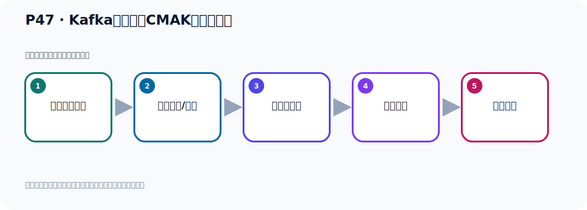

# P47：Kafka连接工具CMAK配置与启动

> 笔记编号 47/156 · 时长 08:30 · [打开原视频 P47](https://www.bilibili.com/video/BV14J4m187jz?p=47)

[← P46: Kafka连接工具CMAK](../04-tools-monitoring/p046-Kafka连接工具CMAK.md) · [返回本章](./README.md) · [P48: Kafka连接工具CMAK使用限制 →](../04-tools-monitoring/p048-Kafka连接工具CMAK使用限制.md)

## 这节到底讲什么

**核心主题：Kafka连接工具CMAK配置与启动。**

这是一节动手课。不要只记命令，要把前置条件、操作步骤、关键参数和成功信号连成一条验证链。
本节属于“连接、管理与监控工具”这一章；放在全章里看，它的作用是：认识 IDEA 插件、Offset Explorer、CMAK 与 EFAK 的用途、配置和限制。

## 本节路线

## 老师的完整讲解顺序（ASR 辅助复核）

> 下面按时间顺序保留经过基础术语替换的 ASR，方便核对老师是否提到某个细节。
> 人名、命令、代码和英文参数仍可能识别错误；准确结论以本节白话说明、代码块和实操速查表为准。

### 1. 00:00–00:46

好，那我们这个CMAK这个软件我们下载安卓好了，那接下来我们开始去运行这个软件，好，那这个是我们看下个课件。好，那下面我们就开始去运行这个软件，那么第一步啊，你需要对它配置一下，对它配置一下。那配置怎么配置呢？在它那个conf 目录下有个application.conf这个配置文件，配置文件中呢，我们需要修改这两个地方，修改这两个。好，那我们去修改一下，那么这个是我们打开我们这个软件的位置，进入到这个conf 目录下，这里面，这里面有个application.conf这个文件，好，那这个是我们这个VAM打开这个Application这个文件，打开。

### 2. 00:47–01:21

好，打开之后呢，我们先回到最上名啊，好，目前就这已经是最上名的，最上名的，好，我想走啊，那么配置有一些，那么其他地方你都不用动啊，你不用动，那我们改什么地方呢？你看，一直到这里你看，这两个配置是吧，好，那么多啊，其他地方不用动，好，我们就在这个位置可以啊，在哪里呢？在这个地方，就是，我们要设置一下这个卡号卡，这个ZK，也就是ZooKeeper它的App和端口，ZooKeeper的App和端口。好，那么这两个是相同的啊，这两个是相同的，对吧，相同的，你要配一个，配一个就可以了，这两个也是相同的，对吧，相同的，好，那我们怎么配呢，我们就配一个，另外一个，注释掉，好，那么把下面这个给注释掉，配一个就可以了，那我们首先按i字母啊，这种编辑模式，然后把它注释掉，然后把它注释掉，留下两个就可以了，因为这两个是相同的啊，两个是相同的。好，那么这一方呢，你要配什么呢？就配你那个ZooKeeper的IP，好，那么这一方呢，你要配什么呢？就配你那个ZooKeeper的IP，好，那么这一方呢，你要配什么呢？就配你那个ZooKeeper的IP，好，那么这。

### 3. 01:50–02:41

就是说短统，那就说我们这个软件啊，叫CMAK这个软件啊，它其实莫衬阳只支持用ZooKeeper方式启动的Kafka，如果你说你这个Kafka用的是KRaft的那个方式启动的，KRaft的那个方式启动的，它它其实不支持的，它不支持的，你看它这里面不是，它需要你用ZooKeeper吗？对吧，你如果用KRaft的方式启动这个ZooKeeper的这个，这个Kafka，它是不行的啊，它是不行的，所以它这里面只支持这种ZooKeeper方式，所以我们到出来还需要把我们的Kafka，用ZooKeeper方式启动，这样才可以使用这个软件，否则这个软件呢，不行的好，那么既然要用ZooKeeper方式呢，我们把这个改成ZooKeeper的IP啊，那这一方就把这个里面这个删掉了，再改多了来，改成ZooKeeper，那ZooKeeper多少？ZooKeeper就是我们192.168。

### 4. 02:42–03:24

就显127啊，127.0.0.1，因为就在我的ZooKeeper就在我当前这个电脑上，我就直接显127啊，就行了好，那么下面这一方也是，这个也是配ZooKeeper，那也是127，直接配127的这一方好，那么这方是127.0.0.1，因为这个ZooKeeper就在我当前这个Lilig里面，所以我就用127就行了啊，好，这样就配完了啊，再配两个好，配文之后我们保存一下，保存一下好，保存之后呢，那我这个配置文件就配好了啊，就在两个地方，当然你写这个真实IP也可以啊，这一方写这个真实的IP也是可以的是吧，写你Lilig的真实IP，就是你ZooKeeper那个。

### 5. 03:25–04:14

那个Lilig，他的IP是多少，你写真实IP也可以，后面是2181啊，是他的这个ZooKeeper的端口好，那么这个配文之后呢，你就可以启动了啊，启动就启动了它个并布一下好，执行它有个CMAK这个脚本好，后面要指定配置文件，刚才我们不是改了这个配置文件吗，所以用这个配置文件去启动杠滴指定配置文件好，后面注意一下，杠的加到后母，要指定JDK11它必须是11，用127不行，这个我已经测试过了，用127它抱错的啊，必须用11，那这个时候你在你的电脑上，你的Lilig里面要准备一个11啊那下面我们去准备一个11，JDK11好，那现在呢，我这里要准备一个11，那我们进入到缩分的部件。

### 6. 04:15–05:11

好，那我这里呢，只有17啊，我要上传一个11，那么IZ上传上传后呢，我这边提前下载好了一个11的JDK这个去all一个官网去下载就可以了，打开把11下下载，存上来存上来之后呢，把这个11的JDK，我们解压到我们Lilig里面去到时候我们指定这个11的这个路径啊好，上传完了，上传完了之后，我们把11这个JDK解压一下，那么TANGang Z，XVF，然后呢JDK，JDK11好，Gang大解C，我们把解压到U字的logo想，所以这里想U字的logo这个部好，回车就把它解压到U的logo目标下好，解压完了，解完之后呢，那么它就在我们的当前部落下就没有道理。

### 7. 05:12–05:57

我们是把它解压到U的logo这个部落下的那JDK11，就是这里吧，这里，好，我们进入到JDK11，在里面对吧，在JDK11，好，披他们的看一下，它的目录呢，就是这个路径啊，这路径好，到时候呢，我们这个客家里面啊，也说路径就这里面，那就是我把这边改一下，加上货目呢，就是这一段啊，就这一段这一段，对吧好，那我现在这个路径就可以了啊，我现在就去启动它，好，去启动那现在呢，我们轻松的我们的U的Norco这个CMAK这个软件，这里面是吧，然后到它的B部下去启动B部下启动，通过这个脚本去启动啊，这脚本，好，那么CMAK这个脚本，然后Gang大解B啊，配置文件。

### 8. 05:58–06:46

好，那这一块呢，我就直接抄一下，Gang大配置文件，康费一个，然后指定配置文件，好，后面这些，指定一下那我们这里，沾一下对吧，好，开始启动了啊，好，再启动了好，那现在就启动好了啊，启动到中呢，它会接一个909000端口啊，909000这个端口好，在这个端口上，那我们接下来就去访问这个端口就可以了啊，这个软件已经启起来了啊，已经启起来了，好，那就是我们接下来就是去访问就行了啊，访问就行了好，访问的端口默认909000，好，那么接下来就启动你的立立个是AP，然后9000端口去访问好，我们去访问一下呢，这个这个这个外部管理后台啊，等下这里访问一下。

### 9. 06:49–07:40

打开好，那这就是它的这个页面啊，你看和它这个官方提供的这个效果差不多了对吧，差不多啊，好，那这里面呢，点现在是这个首页啊，首页然后点这里它目前list，这边是没有没有集群，目前没有集群啊，那我们在这里面这个点一下这个adbcluster好，点一下adbcluster呢那这里面就可以添加这个这个什么，添加这个Kafka，好，那么它这个Kafka，它目前支持的版本啊，最新只支持3点1点0然后那个我们现在用了3点7点0，它就没有没有没有列出来啊，所以这个软件呢，它有点自后没有及时的更新啊，大概这么个情况好，那么这个软件呢，我们先给它按钮这里啊，按钮这里。

### 10. 07:41–08:25

好，那接下来，大家比我们发现，我这个软件启动，它要连接基于如kipo方式启动的Kafka那为什么我现在启动它没有爆出来啊，这个原因是因为啊，我现在定转上这个Kafka我在这个讲课之前啊，我已经把它改了，改成Kafka方式的啊，改成如kipo方式启动的啊，我已经改了，所以来导致了它这个直接没有问题如果说我把它换回到以前那个Docker 方式，用crumble的方式启动的那个Kafka，它是连不上的啊，这是因为我在讲课之间我已经改完了啊，好，那下面我给大家看一下看一下，如果说我不改它会怎么样啊，它其实会报错的那我们演示一下。

## 关键术语

- **Kafka：** Apache 开源的分布式事件流平台，常用于高吞吐消息传递、数据管道和流处理。
- **ZooKeeper：** 旧版 Kafka 用于集群元数据和控制器协调的外部服务。
- **KRaft：** Kafka 自带的 Raft 元数据仲裁模式，可在新架构中摆脱 ZooKeeper。
- **CMAK：** Kafka Manager 的社区延续版本，用于集群管理；不同 Kafka 版本存在兼容边界。

## 完整原声逐段记录

[查看本节带时间戳的本地 ASR](./transcripts/p047-Kafka连接工具CMAK配置与启动-ASR.md)。主笔记负责可读性和术语校正；ASR 页面负责完整性复核。

## 读完记住

- 本节主题是 **Kafka连接工具CMAK配置与启动**，它服务于本章目标：认识 IDEA 插件、Offset Explorer、CMAK 与 EFAK 的用途、配置和限制。
- 理解顺序是：确认前置条件 → 执行安装/配置 → 启动或应用 → 观察输出 → 排查失败。
- 学习时要同时核对老师的解释、画面中的配置/代码，以及最终运行结果。

## 最容易踩的坑

只照抄命令而不核对当前目录、版本、端口和配置文件路径，最容易造成“命令没报错但服务不可用”。

## 自测

1. 不看笔记，用自己的话解释“Kafka连接工具CMAK配置与启动”解决了什么问题。
2. 按顺序复述：确认前置条件、执行安装/配置、启动或应用、观察输出、排查失败。
3. 如果运行结果和老师不同，你会先检查哪三个输入或环境条件？

## 学完检查

- [ ] 我能不看视频复述本节完整思路
- [ ] 我能指出关键命令、配置、类或接口的作用
- [ ] 我能解释画面中的输入与输出为什么对应
- [ ] 我核对过完整 ASR，没有跳过老师的补充说明
- [ ] 我完成了本节自测或复现实验
