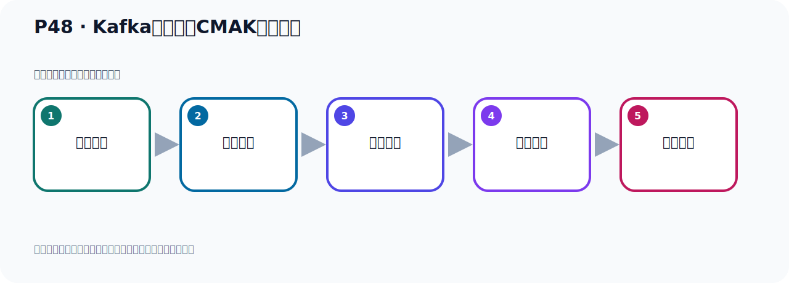

# P48：Kafka连接工具CMAK使用限制

> 笔记编号 48/156 · 时长 08:16 · [打开原视频 P48](https://www.bilibili.com/video/BV14J4m187jz?p=48)

[← P47: Kafka连接工具CMAK配置与启动](../04-tools-monitoring/p047-Kafka连接工具CMAK配置与启动.md) · [返回本章](./README.md) · [P49: Kafka监控工具EFAK →](../04-tools-monitoring/p049-Kafka监控工具EFAK.md)

## 这节到底讲什么

**核心主题：Kafka连接工具CMAK使用限制。**

这节继续完善 Kafka 的完整知识链。请按老师的讲解顺序理解动机、做法和结果。
本节属于“连接、管理与监控工具”这一章；放在全章里看，它的作用是：认识 IDEA 插件、Offset Explorer、CMAK 与 EFAK 的用途、配置和限制。

## 本节路线

## 老师的完整讲解顺序（ASR 辅助复核）

> 下面按时间顺序保留经过基础术语替换的 ASR，方便核对老师是否提到某个细节。
> 人名、命令、代码和英文参数仍可能识别错误；准确结论以本节白话说明、代码块和实操速查表为准。

### 1. 00:00–00:52

好，刚才我们通过这个方式配置完之后，我们就可以正常访问我们外部后台了，在管理后台可以访问了。好，这个原因是因为我Kafka已经是采用ZooKeeper启动了。如果说我不采用ZooKeeper启动，那你这个管理后台是无法进行管理的，是打不开的。好，我们现在就去测试一下，我把我的Kafka变成了多个方式启动，不使用ZooKeeper方式启动。那我们这种方式到时这个软件它就防不了了，好，那我们看一下。那我把我们之前这个东西关掉，那怎么呢？就关掉，关掉我们看一下，我们要关掉PWD，关掉我的Kafka，因为我的Kafka之前又是ZooKeeper方式启动的，在这个下面，那我关掉它怎么关呢？

### 2. 00:52–01:36

首先把这个Kafka关掉，那么Kafka关掉的那就是当前部下执行Kafka，Serv，然后使Drop，上层部下一个Serv，一个ConfigServ.publiz这个文件，好，这样就把这个Kafka关掉，回车。好，这样把Kafka就关掉了，关掉了。然后呢，我们去关一下ZooKeeper，对吧？好，那ZooKeeper就是ZooKeeper，ZooKeeperServ.publiz，是Drop，好，上了层部下，Config部下，然后ZooKeeper这个配置的文件，好，这样把它关掉，不是Serv，是Drop，是Drop，回车。

### 3. 01:37–02:27

那么这样的话把ZooKeeper关掉，对吧？好，关掉，这个时候我们PWD查一下，看看Kafka，ZooKeeper查一下，好，没有了，然后Kafka查一下，Kafka查一下，没有了，对吧？好，没有以后呢，那我们这个时候，没有了，对吧？然后我们这个时候干嘛呢？我们用多个方式的起动下，用多个方式的起动下，好，那这种回答我们这个多颗这个地方，看一下我们多颗的起动方式，好，多颗起动呢，就通过这样一个配置啊，通过这个方式的起动，好，多颗起动这个，我们执行一下多颗。我们在这一之前，我们可以先查一下端口啊，Night，State，Gun，Ding，Lpt，查一下，你看目前没有218121端口，也没有9092端口，Kafka端口和ZooKeeper端口都没有，对吧？

### 4. 02:27–03:06

啊，我们的ZooKeeper和Kafka都关了，现在我们通过多颗起动一个呢，这个Kafka，好，那么这个方式，它说起动的Kafka呢，它是不带ZooKeeper的，是没有ZooKeeper的，好，然后起动好了啊，这个地方不是破错，这是它的一些配置信息啊，配置值，它现在已经Kafka已经实大了，已经期下了，啊，这一方不是错误啊，这不是错误，应该往上走一下，是配置值，它的一个配置值在这里，往上走，你看，是配置对吧，配置啊，好，起动完之后呢，那今天我们这个CMCK，CMAK，现在还能不能用呢，好，那我们先看一下我们CMAK，再不在这个进程再不在，啊，。

### 5. 03:06–04:10

PES查一下，CMAK，查一下，好，这进程没有了啊，没有了，我们现在重新去启动我们这个CMAK这个程序，好，那这个我们我想走一下，好，使用CMAK，那就是我们通过了这样一个命令，再启动这个CMAK，好，这什么语，执行，回车，好，回车执行，那么执行的时候，因为它启动的时候，它要连这个ZooKeeper，那么它能不能连上呢，这个时候你看它连不上，你看它有个连接拒绝，一直打一这个连接拒绝，连接拒绝，那就这里吧，连接拒绝，连接拒绝，所以它这个管理后台啊，它是只能是对那个ZooKeeper方式启动的这个Kafka，它才可以使用它，啊，否则使用不了，啊，好，这是我们这个软件，所以这个软件还没有得到急止更新，好，那我们这个退出一下啊，退出一下，好，这都不行的，所以你要用这个软件的话，哎呀，退出一下，退出一下，。

### 6. 04:11–05:16

所以要用这个软件的话呢，要保证一个条件就是，基于这个，基于ZooKeeper方式启动的这个Kafka，才可以使用该软件啊，可以使用呢，该这个，该这个外部管理后台啊，管理后台，管理后台，否则不能，否则不行啊，否则呢，不行，好，就这样啊，要基于ZooKeeper方式启动的Kafka，才可以用，否则呢，不能用啊，否则不能用，好，这是我们的这个一个说明，好，那这样的话呢，我们就把这一块内容啊，这个软件就给大家介绍完了，好，我们往上这个提一下，好，这样，这是我们的CMAK这个软件，好，所以我们需要改成ZooKeeper方式启动，它才可以使用，所以这个时候呢，我把这个Kafka停掉，。

### 7. 05:17–06:01

多个方式的Kafka停掉，那我们这个时候多个PS，尝一下，没有了，没有了之后，我们接下来启动我们，基于ZooKeeper方式的，这个Kafka，它就可以了，你看，我们这个时候启动ZooKeeper，好，首先ZooKeeper，Serv，start，然后呢，上层目录下，conf，ZooKeeper，好，然后语号后台启动，启动ZooKeeper，好，讲出ZooKeeper，好，结束后来我们启动Kafka，那这个在Kafka，serv，start，上层目录下，然后呢，这个serv点，上层目录下，conf目录下，serv点，populist，好，后台启动，启动，。

### 8. 06:02–06:49

好，这是启动Kafka，好，那么现在我们就用启动那个呢，基于ZooKeeper的Kafka，对吧，好，先回来，结束后我们接下来，再用我们这个软件，那这软件呢，现在它已经停了，PS刚ef我们重新启动一下，PS刚ef查一下，epcfak，啊，它没停，没停我们先把它关一下，或者说它没停它在，它在的话，那我们要么去访问一下试试，看它行不行啊，就这个是吧，好，我们再访问一下，看它进程，那是有问题的，把它关一下吧，强行刷一下，重新启动一下，把这个CMAK这个刷掉，好，这个刷掉，因为它之前连辱Keyboard连不上，它应该这个进程有点问题的，刷掉，好，刷掉了对吧，。

### 9. 06:50–07:10

好，接下来我们接下来同一系统，然后看一下这个系统，对吧，好，回车系统，看看啊，这个里面它说，它说你的这个目录下有一个Rawley PID这个文件，导致无法启动，那我们回到这个目录下看一下，然后呢，你看它说有个Rawley PID文件，那就是你需要把这个东西删一下，删一下，因为上次呢，这个启动的时候，因为连不上RawPID导致个进程有点问题，把这个文件删掉一下，删了之后再进入个并幕下，并幕下，好，然后呢，我们再执行，执行什么，执行这个命令，启动，好，因为我们刚才是通过强行刷进程，把这个CMAK给刷掉了，但是它留下了一个这个文件，啊，留下一个这个文件，啊，刷掉了。

### 10. 07:39–08:12

所以把这个文件也要删一下，否则的话呢，我们没法通过这个方式去启动，啊，它刚才提示语，就这个意思，对吧，好，那么这个时候回升在启动好，启动了，对吧，启动之后，这个时候我们再去访问，好，之前不能访问，对吧，现在我们去访问，现在没问题了，你看，可以访问了所以这个软件，它只能连接啊，基于ZooKeeper方式的这个Kafka啊，那我们在这里啊就给它啊，演示一下，演示一下，好，那么这个软件呢，就演示完了啊。

## 关键术语

- **Kafka：** Apache 开源的分布式事件流平台，常用于高吞吐消息传递、数据管道和流处理。
- **ZooKeeper：** 旧版 Kafka 用于集群元数据和控制器协调的外部服务。
- **CMAK：** Kafka Manager 的社区延续版本，用于集群管理；不同 Kafka 版本存在兼容边界。

## 完整原声逐段记录

[查看本节带时间戳的本地 ASR](./transcripts/p048-Kafka连接工具CMAK使用限制-ASR.md)。主笔记负责可读性和术语校正；ASR 页面负责完整性复核。

## 读完记住

- 本节主题是 **Kafka连接工具CMAK使用限制**，它服务于本章目标：认识 IDEA 插件、Offset Explorer、CMAK 与 EFAK 的用途、配置和限制。
- 理解顺序是：问题背景 → 关键对象 → 处理过程 → 结果验证 → 应用边界。
- 学习时要同时核对老师的解释、画面中的配置/代码，以及最终运行结果。

## 最容易踩的坑

不要把孤立 API 或配置项当成完整能力；始终把它放回生产、存储、消费或集群链路中理解。

## 自测

1. 不看笔记，用自己的话解释“Kafka连接工具CMAK使用限制”解决了什么问题。
2. 按顺序复述：问题背景、关键对象、处理过程、结果验证、应用边界。
3. 如果运行结果和老师不同，你会先检查哪三个输入或环境条件？

## 学完检查

- [ ] 我能不看视频复述本节完整思路
- [ ] 我能指出关键命令、配置、类或接口的作用
- [ ] 我能解释画面中的输入与输出为什么对应
- [ ] 我核对过完整 ASR，没有跳过老师的补充说明
- [ ] 我完成了本节自测或复现实验
