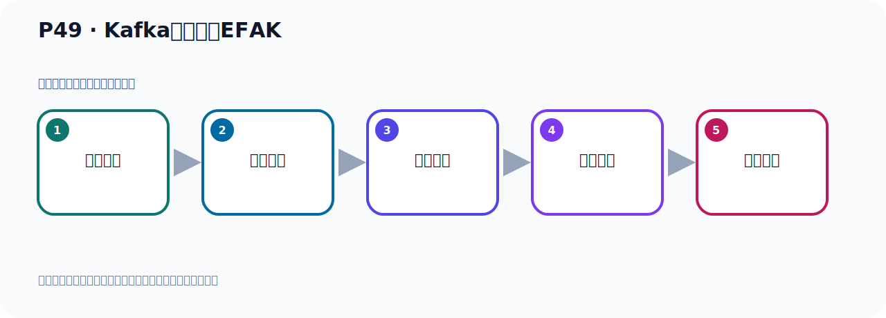

# P49：Kafka监控工具EFAK

> 笔记编号 49/156 · 时长 08:57 · [打开原视频 P49](https://www.bilibili.com/video/BV14J4m187jz?p=49)

[← P48: Kafka连接工具CMAK使用限制](../04-tools-monitoring/p048-Kafka连接工具CMAK使用限制.md) · [返回本章](./README.md) · [P50: Kafka监控工具EFAK配置 →](../04-tools-monitoring/p050-Kafka监控工具EFAK配置.md)

## 这节到底讲什么

**核心主题：Kafka监控工具EFAK。**

这节继续完善 Kafka 的完整知识链。请按老师的讲解顺序理解动机、做法和结果。
本节属于“连接、管理与监控工具”这一章；放在全章里看，它的作用是：认识 IDEA 插件、Offset Explorer、CMAK 与 EFAK 的用途、配置和限制。

## 本节路线

## 老师的完整讲解顺序（ASR 辅助复核）

> 下面按时间顺序保留经过基础术语替换的 ASR，方便核对老师是否提到某个细节。
> 人名、命令、代码和英文参数仍可能识别错误；准确结论以本节白话说明、代码块和实操速查表为准。

### 1. 00:00–01:16

CMAK 软件安裝配置。第三款软件，EFAK原名Kafka Eagle。第三款软件，客件往下走。客件，EFAK以前叫Kafka Eagle，是一款優秀免費開源的Kafka集群監控工具，而且這個工具是我們中國開發的，國人開發並且開源的。它的官網在這裡，我們打開看一下。打開裡面去看一下。訪問一下官網。這個是它的官網。官網是EFAK的，雖然它是中國開發的，但是它EFAK的，看一下。這是它的首頁，關於下載，然後這是文檔。文檔在新頁面，文檔。然後在這裏，它的博客在中國開發的，。

### 2. 01:16–02:09

因為它有一個博客，就是這個人，做著這個人，他的網名叫這個名字。這是他在聯繫方式。然後它的GitHub在這個例子，這個例子我們可以看一下，就是文檔原有GitHub，點一下GitHub。幾乎這個例子，GitHub。或者說你從下載這裡，也可以點一下，下載，那你也可以點一下。GitHub，對吧？好，就是這個網名，這個人開發的，它是中國的，你看，Chana中國的。這是它的開源的代碼，然後它左是一個接觸的一個軟件，下面有它一些工理介紹，一個開源的集群接觸工具，Kafka的接觸工具。這在文檔，它運氣後的一個效果圖，是這個效果，是它。

### 3. 02:09–02:57

好，那我們把這個軟件我們安裝一下，配置一下。這是這個項目，然後它的官網在這，然後它的原代碼，這個Releases，它的發布的版本點進來看一下。它版本點這個TarGaS。好，最新版本是3.0.1，有Zip版，還有Tar.Gz，這個兩個壓縮包。好，那這是我們這個軟件的一個介紹。那麼下載我們就開始去下載和安裝它，那麼下載的話呢，找到它的下例子，那我們去下載一下。你可以通過GitHub點這個MiddleGaS裡面，我們點這個Tar.Gz，我們在MiddleGaS裡面部署啊。好，那麼Tar.Gz，或者說在這邊也可以啊，這邊有個直接點一下，。

### 4. 02:57–03:46

點一下，直接下載，啊，它彈出這個下載框，然後我們點下載就可以下載下來，那這個軟件呢，我已經下載好了啊，下載好了。好，下載好了我就不再下載了，那這個下載好之後呢，我放在我的這個這個軟件裡面的啊，那就是它，3.0.1這個版本，它這邊也是3.0.1呢，看一下。3.0.1了，啊，這個版本，最新版本就是它。那現在我們就去安裝它，安裝它呢，我們就是給它連到這個Middle上去啊，然後去安裝一下，好，我把這個工具打開一下，剛剛給關了，好，我們連上去。連上去之後呢，我們放在這個速度的部分下啊，速度不下來，然後把這個軟件傳上來啊，這個軟件呢，我已經提前傳上來的，。

### 5. 03:46–04:32

就是這個軟件了，就它呢，就這個軟件，啊，已經傳上來了，3.0.1這個版本啊，傳上來了，好，上傳啊，如果你們沒有上傳的話，把它上傳一下，好，上傳之後呢，那摸住軟件它安裝的時候需要做兩次解壓，需要解壓兩次，我們下面給大家操作一下，好，那這個軟件呢，我之前做過一次解壓，我把之前解壓這個軟件，我先刪一下，給大家重新演示一下，那麼RM，把之前這個軟件刪掉，刪掉一下，好，這樣我就沒有這個軟件解壓了，這個軟件是我之前解壓的，好，現在這個軟件在這個位置，我們去解壓它，解壓它的話，它是個TAT.GZ的高，那就是TAT，是吧，GUNZXVF解壓我們這個KafkaEGO，。

### 6. 04:32–05:26

EGO，哎呀，這個軟件，好，我們直接回車，回車，好，它解壓了啊，解壓之後呢，解壓之後呢，來，來看一下，它得了一個軟件夾了，得了一個軟件夾，這個軟件夾，我們就CD到這個軟件夾下，一個，這個軟件夾下，切換進來，進來之後看一下，它裡面又是一個壓縮薄，對吧，所以你需要解壓兩次，好，那這個再解壓這個壓縮薄，它也是TAT.GZ薄，所以我們TAT.GZXVF，然後呢，這個外部，它這個外部程序，它這個管理後台外部程序，EFIK上GUN外部，好，我們這個解壓回車，好，這個是解壓完了，解壓完之後呢，我們在這個地方，這個那個皮夾，這個就是我們最終的，我們要運行的這個軟件這個程序了，。

### 7. 05:26–06:14

那麼這個程序我們移到哪兒去了，我們統一放到U的NOK下去，這樣我們把所有軟件都放到一個統一的目錄下，好，我們做個移動，MV，EFIK，移到U的NOK，要這裡來移走，移走之後這裡沒有了，沒有之後我們把這個棉被夾就可以刪掉，我們看一下，這個棉被夾就沒有用了，沒有用了，我們刪掉一下，這個Kafka，剛好一口，好，把它刪掉，好，這樣之後這邊就是乾淨的，然後呢，我們在U的NOK下，有一個解壓護軟那個最終的那個程序，這個外部程序，好，那就是EFIK，剛外部，就是這個程序啊，就是它，好，它就是我們最終要使用的就是這個程序，這個外部程序，看一下，。

### 8. 06:15–07:08

好，它裡面的被電夾呢，就是這個效果啊，這個效果，有這樣幾個這個被電夾，好，我們分別看一下，首先看這個bin 目录，bin 目录呢，就是它的啟動腳本，比如說我們到這啟動，是K點SH，通過這個腳本去啟動，它這個需要腳本，好，這是bin 目录，然後就是康費格部路，康佛部路，那就是它的配置文件，到時候呢，我們需要去修改它這個Satem，這個康費格這個文件，就把這個配置文件，好，然後呢，就是這個Dbin 目录啊，Dbin 目录呢，它目前這個空的啊，那個東西呢，這個空的啊，好，它裡面需要一代數據庫的，它需要一代一個買設個順庫，好，這個什麼放特木蘆，這個應該是個字體啊，應該是字體文件，這個不用管它，它的字體文件，就是文字的那個字體，。

### 9. 07:08–07:47

然後這個KMS啊，這個KMS啊，裡面佈服了一個程序，你看我們繼續看一下，KMS進來，進來之後呢，它裡面其實是一個TOMCAD這個，你看這個結構啊，就和TOMCAD一樣，你看，我們進入到這個壁步下，比如說看一下，你看，怎麼CAD，LINDA啊，這個什麼SH啊，什麼START的UP啊，什麼START啊，SHATTERDOWN啊，這個就是我們TOMCAD，哎，那些腳步啊，所以它裡面相應包含一個TOMCAD，好，再你看這個康復部路，你看，就是TOMCAD配置文件，你看，這些什麼外部的XMAL啊，KADLINDA啊，這東西是吧，好，。

### 10. 07:47–08:36

所以它裡面其實包含一個TOMCAD，好，那這是它的NABLE是假包，TOMCAD的假包是吧，LOGO是限制字，啊，這是雷時部路，好，這個外部NPP裡面，就是它不能的外部程序，我們看一下，那在這裡面，那這個它是打個襪包叫K1點襪，到時候起頭之後，它運行的就是這個襪包裡面的程序，它是外部程序，打開之後通通LOGO去訪問，裡面呢，這是個外部程序，裡面有頁面，哎，大概這個情況，好，這就是我們的這個KNPS這個名字夾，這個WALKFUNCAD夾是一個呢，這個，你運行TOMCAD產生了一些這個編譯後的一些文件，這個WALKFUNCAD夾，好，總之啊，它這裡面是一個TOMCAD啊，好，。

### 11. 08:36–08:52

回來上面，好，然後下面是LOGO是限制字的，那目前是空的啊，因為我們剛剛才解壓，所以是空的，好，這就是整個它這個文件夾，我們了解一下，好，那麼這個軟體呢，我們相遇就下載，並且按做好了，那我們下一步呢，就是要去配置和啟動它，。

## 关键术语

- **Kafka：** Apache 开源的分布式事件流平台，常用于高吞吐消息传递、数据管道和流处理。
- **CMAK：** Kafka Manager 的社区延续版本，用于集群管理；不同 Kafka 版本存在兼容边界。
- **EFAK：** Kafka Eagle 的后续名称之一，用于 Kafka 集群监控与可视化管理。

## 完整原声逐段记录

[查看本节带时间戳的本地 ASR](./transcripts/p049-Kafka监控工具EFAK-ASR.md)。主笔记负责可读性和术语校正；ASR 页面负责完整性复核。

## 读完记住

- 本节主题是 **Kafka监控工具EFAK**，它服务于本章目标：认识 IDEA 插件、Offset Explorer、CMAK 与 EFAK 的用途、配置和限制。
- 理解顺序是：问题背景 → 关键对象 → 处理过程 → 结果验证 → 应用边界。
- 学习时要同时核对老师的解释、画面中的配置/代码，以及最终运行结果。

## 最容易踩的坑

不要把孤立 API 或配置项当成完整能力；始终把它放回生产、存储、消费或集群链路中理解。

## 自测

1. 不看笔记，用自己的话解释“Kafka监控工具EFAK”解决了什么问题。
2. 按顺序复述：问题背景、关键对象、处理过程、结果验证、应用边界。
3. 如果运行结果和老师不同，你会先检查哪三个输入或环境条件？

## 学完检查

- [ ] 我能不看视频复述本节完整思路
- [ ] 我能指出关键命令、配置、类或接口的作用
- [ ] 我能解释画面中的输入与输出为什么对应
- [ ] 我核对过完整 ASR，没有跳过老师的补充说明
- [ ] 我完成了本节自测或复现实验
