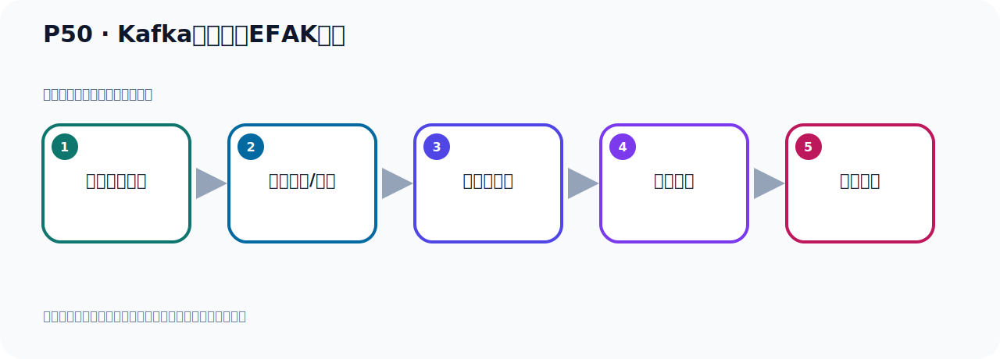

# P50：Kafka监控工具EFAK配置

> 笔记编号 50/156 · 时长 10:26 · [打开原视频 P50](https://www.bilibili.com/video/BV14J4m187jz?p=50)

[← P49: Kafka监控工具EFAK](../04-tools-monitoring/p049-Kafka监控工具EFAK.md) · [返回本章](./README.md) · [P51: Kafka监控工具EFAK部署运行 →](../04-tools-monitoring/p051-Kafka监控工具EFAK部署运行.md)

## 这节到底讲什么

**核心主题：Kafka监控工具EFAK配置。**

这是一节动手课。不要只记命令，要把前置条件、操作步骤、关键参数和成功信号连成一条验证链。
本节属于“连接、管理与监控工具”这一章；放在全章里看，它的作用是：认识 IDEA 插件、Offset Explorer、CMAK 与 EFAK 的用途、配置和限制。

## 本节路线

## 老师的完整讲解顺序（ASR 辅助复核）

> 下面按时间顺序保留经过基础术语替换的 ASR，方便核对老师是否提到某个细节。
> 人名、命令、代码和英文参数仍可能识别错误；准确结论以本节白话说明、代码块和实操速查表为准。

### 1. 00:00–01:04

EFAK 下載安装就好了。之后，我们继续看一下它的配置。EFAK 它的配置。EFAK 它的全称是叫这个名字。我们这里也说一下。Ego for Apache Kafka 手字母，所叫EFAK。手字母缩写。Ego 它是叫做音的意思。叫 脑音。前面我们把安装好了。接下来我们要去配置一下。配置之后才可以使用。配置的话，我们大概也这么散户。第一步就是你需要安装一个税庫。我们需要安装一个Messurge。然后在Messurge里面创建一个税庫叫K1、K。好，我们现在准备一个税庫。税庫的后来我原来已经装过了。我们在Euronoke、Messurge、8.0.33的税庫。

### 2. 01:04–02:06

我之前装好的。然后我们看一下Messurge有没有启动。我们插一下。Messurge 这个是启动的。它已经开着了。开着的话，我们在这里也就是给它粘上去。粘上去我们看一下。然后就是我这个税庫。这税庫就这样。然后我们需要干嘛呢？我们需要给它创建一个税庫名字叫K1。好，创造税庫。好，这里右键，然后新建税庫。好，叫K1。然后我们这里是给它置物编码。UTF-8、Mb4。这个Mb4，这个制服级它是最宽广的。制服级最宽的制服级。所以我们用它来做制服级。当你用UTF-8也可以。这个制服级是最宽的。它可以存表情符。表情符都可以存。然后是Generic。

### 3. 02:06–02:55

Generic 通用的排序规则。那我们创建一个税庫。创建一下。创建之后我们就放这里可以了。你不用去这个表不用管。不用创建表，放这里可以了。好，那我们这一步就完成了。然后我们开始第二步了。第二步就修改它的安装部路下。有一个康复部路下，有一个Sensame Configure这个部路。这个配置文件，好，我们要配这个文件了。那接下来我们切换到我们这个软件部路下。不是这里，我们切过来看一下。我们这个名字叫EFFK，这里面。这里面然后在它康复部路下，这个部下。康复部路下。好，这个部条有一个System系统配置这个属性文件VM打开。

### 4. 02:57–03:45

打开之后我们就配，首先这里面很多东西，你看一下。很多东西，从上完下走应该很多啊。好，很多东西。那目前的话我们就配两个就可以启动了。后续有需要我们再去修改配置，我们先把这个基础的这个不敢运行起来。运行起来我们改两个地方。一个就是改它的ZooKeeper，一个是ZooKeeper配置改一下，一个是买设个税库配置改一下，就改两个地方，其他不用动。也就是说我们这个EFFK，它也是依赖ZooKeeper版本的这个卡报卡。也就是你要用这个ZooKeeper的方式启动卡报卡，那么才可以使用它去接口。目前呢，它还没有找到它的配置，它的配置面中，。

### 5. 03:45–04:37

目前没有看到它支持那个Cravity，还没有，目前没看到。所以还得用ZooKeeper的卡报卡，那我们找到最上面，已经到最上面了。最上面之后呢，这三行就是与ZooKeeper相关的，那我们看一下，首先这个地方呢，是给这个棋局取个名字，这一行不用动。Class1，Class2或者Class3，Class3可以写名字这个不动，好，接下来这里方。这里方是写上你这个ZCAP，也就是你那个棋群的这个地址，就是ZooKeeper地址，那我们就写ZooKeeper地址。地址我们在本地，那我把它改一下，127，0.0.1。好，那我们只有一台，我们ZooKeeper就一台，所以我们把后面这个去掉。

### 6. 04:37–05:17

如果有多台的话，你需要用斗号分隔去掉，好，那么它既然上面配有两个棋群一，棋群二，那我们就写两个吧，那我下面这个也写一个，好，这个去掉。然后前面演示一下，我们都指向了同一个呢，这个ZooKeeper，127.0.0.1，其实你下面这个也可以注视掉，你不要也可以啊，就留下一个也可以，就这个不要，注视掉也可以。棋群外相也没有，那就是我们前面这个锦号注视掉不要，好，这就是把ZooKeeper就配上了，这ZooKeeper啊。本地的这个2181ZooKeeper，因为ZooKeeper到时也在我们这个，呃，这个里面，所以用127就可以了啊。

### 7. 05:18–05:59

好，那么下面这些什么ACL，这我们可以不用配，好，第一个ZooKeeper配完了，然后就配那个Mysok，Mysok呢在最下面啊。中间这些都可以不用动，啊，先不用动，后续有需要调整的时候，我们再去调整，好，先把这个基础位置配好，那Mysok在最下面，那就在这有适合，Mysok，这个根据情况的配，首先一个驱动，这个驱动没有问题，是吧，然后这个里面地址，我们这个Mysok就在我们当前这个，Liliqus里面，所谓是127，啊，IT，3306端口，好，我们说用户名字叫K1，好，没问题，后面是一段这个连接串，啊，连接串，好，下面是Root，那夜参临朋友，。

### 8. 05:59–06:44

这是我们Mysok的用名，Mysok的密码，好，这个也是对的，我认为Mysok也是夜参临朋友这个密码，啊。后面这一段连接串，啊，就是我们对这个连接什么制服编码一些控制啊等等，啊。比如说为了避免一些乱码等等一些问题，好，那我们这个配完了，那保存一下这个明天配好了，保存，不，也很简单啊，所以改这个地方，啊，一个是它，啊，一个是它，啊，那怎么改的，我们刚才，我们干脆把这个地方也插出一个这个，这个文不扬，给大家这个看一下，都是，你知道怎么改的，啊，该哪里的地方呢，一个就是，好，我们打开这个文件啊，那里方也给大家再标注一下，一个就是这里方，好，。

### 9. 06:44–07:46

改成你本地的这个Root Keyboard，好，这是一个，然后另外呢就是那个Mysok，Mysok就最下面这个Mysok啊，就这一段Mysok，按照实际情况去配这一下，哎，这样就可以了，好，这就是我们的，呃，这关于它的配置啊，配置在这里就是这一段，好，我把这个放放在这里，到时候让它，呃，给它加一个颜色啊，好，这样是啊，就这一段，好，搞小点，好，那我们要改的地方呢，就是这样的两个地方，好，就它啊，好，那么这两个改好之后，接下来我们第三步，第三步呢就是配件环境辨量，它这个必须要配这个环境辨量，叫K1这个Home，啊，如果你不配的话呢，。

### 10. 07:47–08:29

那我已经给大家提前测试过啊，如果你不配的话，你到时候启动它这个，呃，它这个程序的时候啊，它会报，报一个错误，你的这个错误做什么，说你这个K1Home这个辨量，它说你没有定义，啊，没有定义，它会报这个错，你需要定义这个环境辨量，不定义这个环境辨量，它启动的时候会报错的，所以这一步，第三步是不能省略的，不能省略，必须要配，好，那么这个配的话，我们就在Profile这个文件，etcprofile年纪添加，好，那你再这个文件最后啊，加上这点好，好，那我们去加一下，再好，这个就可以保存一下啊，那我们就是VM打开这个etc下这个profile，。

### 11. 08:30–09:16

就是我们配置GTK环境辨量到那个文件，在那个文件中进行配置，好，配置呢，我们来到它最后，好，最后就这里，好，放这里，好，在这里，摘一下这个，好，我们看一下这个配置啊，首先这个配一货某就指向到你那个程序的所在目录，那我们的目录确实在U的LOG下，然后这个目录，当然你要确保这个目录是对的，不能出错，我这个目录应该是没有错，我们再打开看一下是不是这个目录啊，确定一下，我们LL看一下，有没有这个目录，好，是这个目录，没问题，然后就是pass导出pass了，就是你这个后母下的一个B，把这个B的pass导出去一下，然后还有就是呢，这个L6是本身的这个pass，你不能，不能那么丢啊，。

### 12. 09:16–10:03

这个不能那么丢，所以帽号连上L6是本身的pass，这个帽号是连接服，把前面这一段和后面这段用帽号分隔啊，连接，连接服，好，这样我们把这个环境辨量配好了，就这个配置，然后帽号保存，保存之后呢，要让这个配置文件生效，我们需要把这个配置文件来硕实一下，是吧，souic硕实一下这个etcprofile这个文件，让它生效一下，好，这样就可以了，对吧，好，也要让这个配置生效要硕实一下，执行硕实命令，硕实一下这个文件，好，那么支持了我们的这个软件啊，它就配置完了，主要就是配一个，准备一个mysuckle里面穿一个续库，然后修改这个配置文件，。

### 13. 10:03–10:21

这配置文件中呢主要配两个，一个就是Kafka，一个不是Kafka，一个就是主keyboard，那个连接地址，一个就是mysuckle那个连接地址，连接信息，然后第三步就是，倒出这个环境辨量，配置环境辨量，好，这样我们就把这个软件就配置好了，。

## 关键术语

- **Kafka：** Apache 开源的分布式事件流平台，常用于高吞吐消息传递、数据管道和流处理。
- **ZooKeeper：** 旧版 Kafka 用于集群元数据和控制器协调的外部服务。
- **EFAK：** Kafka Eagle 的后续名称之一，用于 Kafka 集群监控与可视化管理。

## 完整原声逐段记录

[查看本节带时间戳的本地 ASR](./transcripts/p050-Kafka监控工具EFAK配置-ASR.md)。主笔记负责可读性和术语校正；ASR 页面负责完整性复核。

## 读完记住

- 本节主题是 **Kafka监控工具EFAK配置**，它服务于本章目标：认识 IDEA 插件、Offset Explorer、CMAK 与 EFAK 的用途、配置和限制。
- 理解顺序是：确认前置条件 → 执行安装/配置 → 启动或应用 → 观察输出 → 排查失败。
- 学习时要同时核对老师的解释、画面中的配置/代码，以及最终运行结果。

## 最容易踩的坑

只照抄命令而不核对当前目录、版本、端口和配置文件路径，最容易造成“命令没报错但服务不可用”。

## 自测

1. 不看笔记，用自己的话解释“Kafka监控工具EFAK配置”解决了什么问题。
2. 按顺序复述：确认前置条件、执行安装/配置、启动或应用、观察输出、排查失败。
3. 如果运行结果和老师不同，你会先检查哪三个输入或环境条件？

## 学完检查

- [ ] 我能不看视频复述本节完整思路
- [ ] 我能指出关键命令、配置、类或接口的作用
- [ ] 我能解释画面中的输入与输出为什么对应
- [ ] 我核对过完整 ASR，没有跳过老师的补充说明
- [ ] 我完成了本节自测或复现实验
