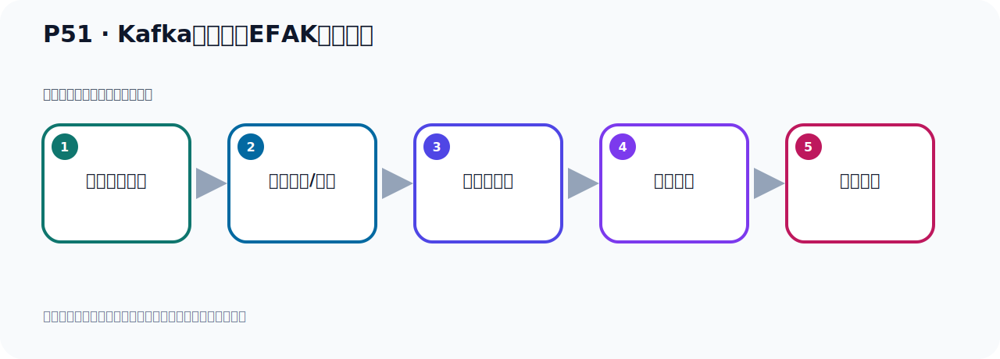

# P51：Kafka监控工具EFAK部署运行

> 笔记编号 51/156 · 时长 09:57 · [打开原视频 P51](https://www.bilibili.com/video/BV14J4m187jz?p=51)

[← P50: Kafka监控工具EFAK配置](../04-tools-monitoring/p050-Kafka监控工具EFAK配置.md) · [返回本章](./README.md) · [P52: Spring Boot集成Kafka开发 →](../05-spring-boot-basics/p052-Spring-Boot集成Kafka开发.md)

## 这节到底讲什么

**核心主题：Kafka监控工具EFAK部署运行。**

这是一节动手课。不要只记命令，要把前置条件、操作步骤、关键参数和成功信号连成一条验证链。
本节属于“连接、管理与监控工具”这一章；放在全章里看，它的作用是：认识 IDEA 插件、Offset Explorer、CMAK 与 EFAK 的用途、配置和限制。

## 本节路线

## 老师的完整讲解（按视频顺序校正）

> 下面保留老师的完整讲解顺序，并修正 Kafka、Java、ZooKeeper、
> Topic、Partition、Offset 等常见识别错误。它不是压缩摘要；原始 ASR 在后面单独保留。

### 1. 00:00–00:56

好，我们的EFAK就配置好了。配置好以后，我们下一步，我们就开始去启动运行场。好，那我们看一下。好，那接下来我们开始启动运行我们的EFAK。那往手上第一步，你要确保你的Kafka是采用ZooKeeper方式启动的。它目前的这个软件EFAK，它其实还不支持用Kalif方式的那种Kafka，还不支持。我们看一下它文档，它这个文档里面它这样写的，这个是它官网，官网之后它有GitHub，GitHub在这边，这个是文档，然后GitHub在这里，给它点进来。好，这个是GitHub，这个GitHub它这里写的什么呢？它写说，它说跨版本的，它说支持KafkaKalif的模式。

### 2. 00:56–01:47

但是，目前你在它配置面中完全找不到这个Kalif的这个配置。它的配置文件就是我们的这个文件，PWD看一下。好，就这个抗布下吧，就是这个Saturn这个文件。这个文件我给你下到桌面上看一下，是吧，下到我们桌面上。好，下桌面上我们打开，用一个这个文本工具打开，这样我们看得比较清晰，你看。你这里收下这个Kalif的方式有吗？Kalif是吧？Kalif你收下技术，那这完全没有啊，与这个相关的一个配置都没有。这里面完全找不到Kalif的这个配置。所以呢，它文档中写的是支持Kalif的，但是这里面啊，找了以后啊，确实找不到。没有任何地方发现与这个Kalif的相关，找不到。

### 3. 01:47–02:43

那按理说你应该要有一个配置吧，找不到对吧，然后呢，另外呢，我又看了一下它的这个，它的这个什么，这里面提的问题里面，这个提的问题里面，你收下这个Kalif的这个东西啊。你收下，收下Kalif的这个关键字，你看一下，公民特点中看到已经支持它，有效果文档吗？这是一个网友的提问，但是这个，几个人去问，但是都没有回答。公民特点中看到已经支持Kalif的模式，但是有效果文档吗？从那个配置面中没有看出来它的支持对吧？哎，这有的人问，你们可以回答啊，目前应该是不支持，你看啊，它有抛弃ZooKeeper的趋势，那么是否支持Kalif模式集群呢？

### 4. 02:44–03:31

哎，这个是看一下，你看，它有抛弃它的趋势，你是不是支持这个模式啊？我们公司用这个方式部署，今天搭建这个，我们这个软件的时候发现，不知道咋配，因为它配置面中确实没有这个配置啊。你看，这一个提问，哎，你说支持这个Kalif模式，但是找不到配置啊，你看，是吧？很多人提问啊，也没得回复，所以这个有待考证，或者说它后续的版本也有可能会支持，因为有这么多人去提这个问题啊，这还有一个英文提问啊，就是说你这个Kalif模式，你是不是没有ZooKeeper行不行啊？你这个软件支持不支持啊？哎，有同样的人就问这个问题对吧？哎，有考虑这个，你有考虑没有？

### 5. 03:31–04:20

所以这个目前啊，从这些信息看显示的，这个排布支持Kalif的模式，所以我们还得怎么办呢？我们还得用ZooKeeper方式启动Kalif卡，第一步确保用ZooKeeper方式启动Kalif卡，好，那我们这边看一下，目前呢，我们这边Kalif卡有没有启动呢？我们来调一下，那就是ZooKeeper先看一下，好，没有，Kafka有没有Kafka，也没有，好，那我们现在就用ZooKeeper方式启动一个呢？Kafka，对不对？好，那进到ZooKeeperKafka不卡，并不卡，好，首先请用ZooKeeper，那叫ZOK，Server，Start，好，上层目录下，看过目录下，这个ZooKeeper配置名件，好，这个后台启动，叫语号啊，。

### 6. 04:20–05:19

这是启动我们的ZooKeeper，把ZooKeeper启动，好，回车，好，讲出ZooKeeper，这样启动一下，好，启动完了我们回车，回车进入运行，然后进来启动什么呢？启动Kafka，点KafkaServer，Start，上层目录下，然后呢，config，然后呢，这个Server配置名件，好，语号，后台启动，好，这个信息啊，应该是我们上次那个，ZooKeeper，它又打了一点信息，那我这个密件，我在回车，因为我已经，这个密件已经写完了啊，已经写完了，对吧，我按个回车就行了，回车，好，应该它已经创下进入以后了啊，然后开始启动，好，这是我的Kafka，行，好，我们回到密件行，那这个时候你PS查一下，你看，Kafka也有了啊，ZooKeeper也有了啊，ZOK，还有了啊，Kafka，查一下，复卡，好，回车，再。

### 7. 05:19–06:16

有了，后来说你看一下端口，Night，STAT，ZAK，Night，OPT，我们看一下端口，我们的Kafka，是这个9092，啊，9092，然后21，21，81，ZooKeeper，1181，好，都有啊，都有，没问题，好，那这是我们第一步呢，我们这个就OK的啊，OK的好，OK以后，接下来我们开始第二步啊，在这个软件的安装目录下，这个B目录下，啊，执行这个K，start，执行这个脚本好，那我们接下来直接第二步，第二步呢，我们就切换到我们那个软件，啊EFFAK这个软件，好，EFFAK这个软件，好，切换到它B目录下对吧，好，B目录下有个脚本叫KSH啊，这个脚本你可以打开看一眼呢，SH，打开看一下，它里面的使用方式就是什么，后面跟STAT跟这些参数可以，比如屏，重启等等，状态啊，这些都可以，都可以啊。

### 8. 06:16–07:07

哎，跟它后面的这些迷离就可以了，好，跟着迷离到K，当前步驾KSH，那么启动就start，STAT，start这就启动我们的这个软件，这个监控软件，好，那么再找个回测好，这样启动了启动了啊好，等一下启动完啊，现在还没启动完，等一下启动完一下启动完之后啊，它会给我们显示一个提示信息，那这个时候就启动完了，这个你说等一会啊，哎，对，它当它出现这个Nogo啊，这样一个提示信息，好，并且回到迷离行啊，到这个情况下就说明你已经启动好了啊，启动好了好，那么这个地方又有一个日志啊，这个日志应该是我们之前那个RU PIPER打的日志，这个不用管它，应该是RU PIPER的，回测一下。

### 9. 07:08–07:53

好，那现在我们启动之后呢，你看它告诉我们，它说你现在可以访问了，端口是8048这它的端口8048好，它有个账号是2等米，密码来说1，3456对吧，延伸5，6啊，好，这是我们，那我们现在去访问呢，访问我就用我们的AP 11128，是吧，然后8048就可以了啊，那这个时候我们访问的时候就是吧8048就这样，就是通过这个日志，8048就访问好，那么我们就打开RU PIPER，在这里啊，打开RU PIPER，我们在这打开一下，访问好，访问之后呢，就调到登入页，登入页它的账号和了是2等米，密码是1，2，3，4，5，6，好，再点，登入一下。

### 10. 07:54–08:49

好，登入之后呢，我们就登入到这个系统啊，好，登入系统它的首页呢，就是一个仪表盘监控数据那么它左边呢，有很多菜单啊，那么这个软件，我们先把它安装到这里后面呢，我们再使用这个软件啊，做一些监控，查看我们的一些卡富卡的运行情况，卡富卡的数据信息好，这是我们这个软件呢，就在这里给它安装部署好了，后面我们再看下它的使用啊，只要用它去操作那么安装好之后啊，它就会在我们的预计以后，就会在我们这个里面，之前是没有表的，你看现在就会出现一些表啊，这点啊，有什么表好，这个表里面现在还没有什么数据，大部分表没有数据啊，这点那么用目标有数据的，打开用目标你看，我们默论账号熬的密码级是3，5，6。

### 11. 08:49–09:38

哎，这地方它有点不好的地方就是它这个密码既然是迷门的啊，密码不应该要迷门好，所以你如果想改密码的话，你看我们现在账号默论是2，0密码，也算是5，6嘛，那你想改密码到时候改这里行啊改税户，相云是，改税户，它是你没存出的，这点不太好啊，它这里还有角色管理啊还有这个像什么资源管理啊，这些，权限啊，权限资源这些是吧，它也是一个，它这里面有个权限管理的啊，因为它下面有个系统呢，系统里面有个权限用户啊，角色啊，资源啊，资源管理啊这几个啊还有这么几个菜单啊，是这个它有这么一些功能好，然后呢，呃，它里面可能有一些这个监控的数据啊，就它用它去存储啊，目前的大部分表面有数据。

### 12. 09:40–09:52

目前大部分是空的好，比如说，像这里面就有数据了，有一些信息啊，这里面好，这是我们的这个软件啊，就部署安装好了，后面我们来使用这个软件。

## 关键术语

- **Kafka：** Apache 开源的分布式事件流平台，常用于高吞吐消息传递、数据管道和流处理。
- **ZooKeeper：** 旧版 Kafka 用于集群元数据和控制器协调的外部服务。
- **EFAK：** Kafka Eagle 的后续名称之一，用于 Kafka 集群监控与可视化管理。

## 完整原声逐段记录

[查看本节带时间戳的本地 ASR](./transcripts/p051-Kafka监控工具EFAK部署运行-ASR.md)。主笔记负责可读性和术语校正；ASR 页面负责完整性复核。

## 读完记住

- 本节主题是 **Kafka监控工具EFAK部署运行**，它服务于本章目标：认识 IDEA 插件、Offset Explorer、CMAK 与 EFAK 的用途、配置和限制。
- 理解顺序是：确认前置条件 → 执行安装/配置 → 启动或应用 → 观察输出 → 排查失败。
- 学习时要同时核对老师的解释、画面中的配置/代码，以及最终运行结果。

## 最容易踩的坑

只照抄命令而不核对当前目录、版本、端口和配置文件路径，最容易造成“命令没报错但服务不可用”。

## 自测

1. 不看笔记，用自己的话解释“Kafka监控工具EFAK部署运行”解决了什么问题。
2. 按顺序复述：确认前置条件、执行安装/配置、启动或应用、观察输出、排查失败。
3. 如果运行结果和老师不同，你会先检查哪三个输入或环境条件？

## 学完检查

- [ ] 我能不看视频复述本节完整思路
- [ ] 我能指出关键命令、配置、类或接口的作用
- [ ] 我能解释画面中的输入与输出为什么对应
- [ ] 我核对过完整 ASR，没有跳过老师的补充说明
- [ ] 我完成了本节自测或复现实验
