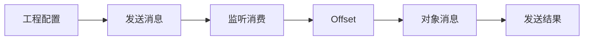

# 第 5 章：Spring Boot 集成 Kafka

搭建 Spring Boot 工程，掌握 KafkaTemplate、消息发送、监听消费、偏移量和对象序列化。

## 整章核心讲解

Spring Boot 自动配置会根据 `bootstrap-servers`、序列化器和监听器配置创建常用组件。`KafkaTemplate` 负责发送，`@KafkaListener` 负责监听消费，但底层仍遵守 Kafka 原生语义。

对象消息必须让发送端 Serializer 与接收端 Deserializer 对得上；Offset 策略只在没有有效已提交进度时决定从 earliest 还是 latest 开始，不能把它当成每次启动都强制重放的开关。

## 先看懂整章数据流

## 本章逐节目录

1. [P52 Spring Boot集成Kafka开发](./p052-Spring-Boot集成Kafka开发.md) · 06:50
2. [P53 Spring Boot集成Kafka开发配置](./p053-Spring-Boot集成Kafka开发配置.md) · 08:48
3. [P54 Spring Boot集成Kafka事件Event发送](./p054-Spring-Boot集成Kafka事件Event发送.md) · 05:28
4. [P55 Spring Boot集成Kafka事件Event发送测试](./p055-Spring-Boot集成Kafka事件Event发送测试.md) · 09:15
5. [P56 Spring Boot集成Kafka事件Event读取](./p056-Spring-Boot集成Kafka事件Event读取.md) · 08:36
6. [P57 Kafka的几个概念快速梳理](./p057-Kafka的几个概念快速梳理.md) · 06:40
7. [P58 SpringBoot集成Kafka读取最早的消息](./p058-SpringBoot集成Kafka读取最早的消息.md) · 04:16
8. [P59 SpringBoot集成Kafka读取最早的消息](./p059-SpringBoot集成Kafka读取最早的消息.md) · 06:00
9. [P60 手动重置Kafka偏移量offset](./p060-手动重置Kafka偏移量offset.md) · 07:25
10. [P61 消息消费时偏移量策略的配置](./p061-消息消费时偏移量策略的配置.md) · 10:10
11. [P62 Spring Boot集成Kafka发送Message对象消息](./p062-Spring-Boot集成Kafka发送Message对象消息.md) · 07:42
12. [P63 Spring Boot集成Kafka发送ProducerRecord对象消息](./p063-Spring-Boot集成Kafka发送ProducerRecord对象消息.md) · 12:00
13. [P64 Spring Boot集成Kafka发送指定分区的消息](./p064-Spring-Boot集成Kafka发送指定分区的消息.md) · 04:14
14. [P65 Spring Boot集成Kafka发送默认topic消息](./p065-Spring-Boot集成Kafka发送默认topic消息.md) · 07:21
15. [P66 kafkaTemplate.send()和kafkaTemplate.sendDefault()的比较](./p066-kafkaTemplate.send-和kafkaTemplate.sendDefault-的比较.md) · 03:14
16. [P67 获取生产者消息发送结果](./p067-获取生产者消息发送结果.md) · 04:42
17. [P68 阻塞式获取生产者消息发送的结果](./p068-阻塞式获取生产者消息发送的结果.md) · 11:18
18. [P69 非阻塞式获取生产者消息发送的结果](./p069-非阻塞式获取生产者消息发送的结果.md) · 10:52
19. [P70 SpringBoot集成Kafka开发发送对象消息](./p070-SpringBoot集成Kafka开发发送对象消息.md) · 05:20
20. [P71 SpringBoot集成Kafka自动装配的KafkaTemplate](./p071-SpringBoot集成Kafka自动装配的KafkaTemplate.md) · 04:06
21. [P72 SpringBoot集成Kafka开发发送对象消息序列化](./p072-SpringBoot集成Kafka开发发送对象消息序列化.md) · 09:39
22. [P73 SpringBoot集成Kafka开发发送消息的KafkaTemplate注入](./p073-SpringBoot集成Kafka开发发送消息的KafkaTemplate注入.md) · 02:39

## 本章学习方法

1. 先把上面的流程图画在纸上，明确每节位于哪一步。
2. 读逐节正文，再用 ASR 核查老师的补充、口头提醒和演示顺序。
3. 遇到命令或代码课，必须记录“输入—配置—输出—失败原因”。
4. 学完后从头解释整章，不以“视频播放完”作为完成标准。
