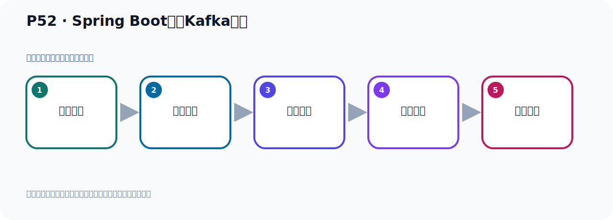

# P52：Spring Boot集成Kafka开发

> 笔记编号 52/156 · 时长 06:50 · [打开原视频 P52](https://www.bilibili.com/video/BV14J4m187jz?p=52)

[← P51: Kafka监控工具EFAK部署运行](../04-tools-monitoring/p051-Kafka监控工具EFAK部署运行.md) · [返回本章](./README.md) · [P53: Spring Boot集成Kafka开发配置 →](../05-spring-boot-basics/p053-Spring-Boot集成Kafka开发配置.md)

## 这节到底讲什么

**核心主题：Spring Boot集成Kafka开发。**

这节继续完善 Kafka 的完整知识链。请按老师的讲解顺序理解动机、做法和结果。
本节属于“Spring Boot 集成 Kafka”这一章；放在全章里看，它的作用是：搭建 Spring Boot 工程，掌握 KafkaTemplate、消息发送、监听消费、偏移量和对象序列化。

## 本节路线

## 老师的完整讲解（按视频顺序校正）

> 下面保留老师的完整讲解顺序，并修正 Kafka、Java、ZooKeeper、
> Topic、Partition、Offset 等常见识别错误。它不是压缩摘要；原始 ASR 在后面单独保留。

### 1. 00:00–00:51

好，那我们这些图形工具啊，装好之后，接下来我们继续往下看一下。好，那下面呢，我们就要继续开发啊。呃，那我们作为这个Java成员，Java开发，那我们现在最常用的就是Spring Boot。所以我们这里呢，就是把Kafka和这个Spring Boot做一个集成开发。好，开发的第一步啊，就是我们建个项目。好，那这个是我们打开IDEA，我们建个项目先。好，那我们这里就用一个这个工程啊，有工程。那么这个工程呢，我们先建个空工程，这个空工程放了什么位置呢？我们放在这个位置，这个位置下。呃，名字我们叫Code，建一个代码，在我这个Kafka这个部下，建一个这个Code文件夹，Code文件夹。

### 2. 00:52–01:42

好，我们建个空工程，先把空工程建好，建个文件夹，这个创建。好，创建以后呢，那么它就产生一个Code文件夹，到时候我们在这个Code文件夹下，我们建我们的项目啊，建我们的项目。好，那就是在我们这个Code文件夹，这个Code文件夹，就这个地方。啊，创建个Code文件夹，放在位置。好，完了之后呢，我们在里面建个项目，好，右键。右键呢，叫Module，这个模块。好，这个模块我们需要用Spring Boot内，Initializr，这个东西呢，这个创建，这个脚手架。好，那我们创建呢，叫Spring Boot，刚这个Kafka，Kafka，Bass基础程序。

### 3. 01:43–02:36

那么这个地方我们给它建一个这个杠能一啊，好，第一个程序吧，或者能一放中间，我们倒是做个排序啊，这个能一，好，放中间。好，这是我们这个项目，名字叫它，好，到时候放这个目录下，然后加法，然后用Maven 项目构建，好，加包，然后这个它，然后这个，梦影方法这个包改短一点，好，JDKS7这没问题，好，就这些，然后我们下一步。下步之后呢，我们勾选依赖啊，首先是布德拉斯山啊，山这个版本，最新版本，好，把这个DevTools勾选一下，Lombok勾选一下，啊。然后呢，就是我们的这个，呃，外部开发我算了，我用一个加法程序开发，啊，不写外部，好，那我们就是这个消息服系呢，这里面，要勾选消息服系。

### 4. 02:36–03:32

那我们是什么呢，Kafka那种，叫Kafka拿它，下面这个Streams啊，是Kafka的另外一种功能，叫Streams，啊，流逝的这种数据啊，那我们用这个Kafka就这个，啊，用它进行发送数据，也就是发送事件，这个事件就是消息啊，数据，发送事件，或者是夺取事件，啊，通过它，好，那我们这个完成一下，那我们就这个几个一代，啊，走，参见。好，创建好之后呢，我们这个项目就查，啊，就这个项目。好，这个样子，在这个标准的什么样程序啊，就它。好，第一步是创建项目，创建好了，是吧，用脚踪脚创建好，然后第二步是配一代，啊，配一代啊，我们刚才通过它那个脚踪脚，直接选好的一代，实际上它就配的这个一代，啊，那我们已经选好了，我们可以在这里看一眼这个一代啊，就是这个破文件，打开。

### 5. 03:33–04:33

我们稍微来整理一下，这是继承史威布勒夫项目，当前项目它有个GNV坐标，这个项目有个名称和描述，好，今天该是17，是吧，好，这是史威布勒这个启动程序这个实踏者，啊，基础的一个这个假包一代，啊，一代实踏者，好，这个就是Kafka，啊，这个Kafka的这个一代，好，住下，它这个它这个不是啊，它这个呢，不是什么，不是史大特的一代，不是史大特的一代，它这个不是史大特的一代，你看，它直接是史不利的Kafka，不像我们这种什么史大特什么什么，比如说我们之前，啊，用了那个什么热力士啊，它都是史威布特什么什么史大特热力士，是吧，买白力士的话，它是什么什么史大特，买白力士啊，是这样的，那么这个地方它不是史大特啊，哎，但是它其实在史威布勒困境中已经帮它自动配置好了，。

### 6. 04:33–05:21

史威布勒里面已经有自动的配置，对对这个Kafka已经配置好了，好，下面才是热布鼠啊，热布鼠插件，在那里不可，生存设定给的方法，好，下面两个是测试一代，啊，测试一代，再往下就是那个打包插件里面它会做一个排除，排除一下这个那里不可，当然这个东西啊，你不排除也可以，啊，都是可以的，不排除也可以，排除也行，它生存之后它木轮排除掉了，那么这个我们就不动，那这我们像不像就这样子啊，主要是加了一个这个Kafka的一代，加了之后我们在右边这个稍微特一的这个一代，刷新一下，好，就这样子，好，那么Kafka一代就这个东西，里面一代呢，史文类包包史文麦斯基等等呀，它里面已经把史文的一些包都加进来了，。

### 7. 05:22–06:13

而且把那个Kafka，就是阿帕旗下的那个Kafka，它那个扣端的这个架包也加进了，是吧，这Kafka本身的这个架包，相当于是史文类把这个Kafka本身的这个扣端架包啊，做了一个集成整合，就是用我们的史文类整合了一下这个这个架包，即使我们之前啊，我们也有的公司也有直接用这个扣端架包直接开发的，创建代码，写代码的开发，那么它代码来写的这个横朔可能要多一些，现在在史文里面它帮它封装了，封装之后它帮我们封装一个模板类，TypeLate模板类，那么直接操作会更加方便，写代码会更少一些，就像瑞麗士一样，瑞麗士呢，他本身也有什么接力是这个架包，或是lighting是这个架包，是吧，。

### 8. 06:13–06:46

我们可以直接用它去连接瑞麗士去操作，但是呢，你用SpringLate瑞麗士，那么这样的话，它直接给你提供了瑞麗士Temperate，那么操作一下更方便，那么这个Kafka也是一样，你直接用这个架包也可以去写代码，连接Kafka去操作，发送具，写读送具，但是呢，用SpringLate机成之后，它给你提供一个Temperate的类，开发起来会更方便，写代码会更少一点，更简洁一些，好，那么这个一代就加好了，一代加好了，好，加好之后，我们接下来开始下一步吧。

## 关键术语

- **Kafka：** Apache 开源的分布式事件流平台，常用于高吞吐消息传递、数据管道和流处理。

## 完整原声逐段记录

[查看本节带时间戳的本地 ASR](./transcripts/p052-Spring-Boot集成Kafka开发-ASR.md)。主笔记负责可读性和术语校正；ASR 页面负责完整性复核。

## 读完记住

- 本节主题是 **Spring Boot集成Kafka开发**，它服务于本章目标：搭建 Spring Boot 工程，掌握 KafkaTemplate、消息发送、监听消费、偏移量和对象序列化。
- 理解顺序是：问题背景 → 关键对象 → 处理过程 → 结果验证 → 应用边界。
- 学习时要同时核对老师的解释、画面中的配置/代码，以及最终运行结果。

## 最容易踩的坑

不要把孤立 API 或配置项当成完整能力；始终把它放回生产、存储、消费或集群链路中理解。

## 自测

1. 不看笔记，用自己的话解释“Spring Boot集成Kafka开发”解决了什么问题。
2. 按顺序复述：问题背景、关键对象、处理过程、结果验证、应用边界。
3. 如果运行结果和老师不同，你会先检查哪三个输入或环境条件？

## 学完检查

- [ ] 我能不看视频复述本节完整思路
- [ ] 我能指出关键命令、配置、类或接口的作用
- [ ] 我能解释画面中的输入与输出为什么对应
- [ ] 我核对过完整 ASR，没有跳过老师的补充说明
- [ ] 我完成了本节自测或复现实验
