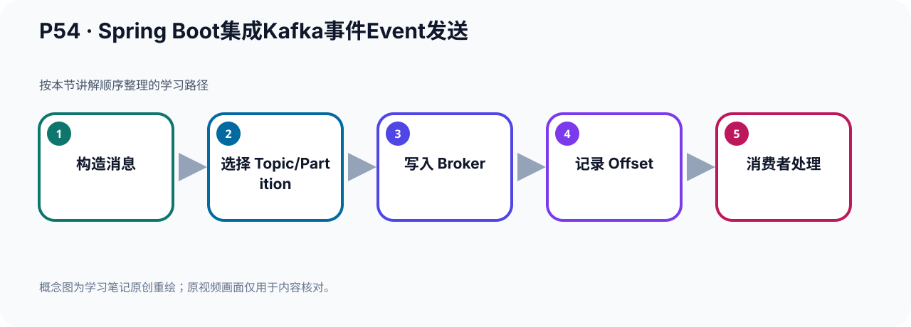
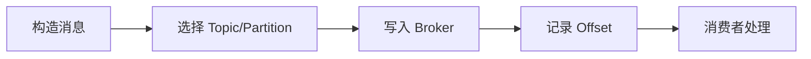

# P54：Spring Boot集成Kafka事件Event发送

> 笔记编号 54/156 · 时长 05:28 · [打开原视频 P54](https://www.bilibili.com/video/BV14J4m187jz?p=54)

[← P53: Spring Boot集成Kafka开发配置](../05-spring-boot-basics/p053-Spring-Boot集成Kafka开发配置.md) · [返回本章](./README.md) · [P55: Spring Boot集成Kafka事件Event发送测试 →](../05-spring-boot-basics/p055-Spring-Boot集成Kafka事件Event发送测试.md)

## 先看结论

> 这节把“Spring Boot集成Kafka事件Event发送”放回消息链路，沿 Producer、Broker、Partition、Offset 与 Consumer 追踪数据和元数据如何流动。它服务于本章目标：搭建 Spring Boot 工程，掌握 KafkaTemplate、消息发送、监听消费、偏移量和对象序列化。

## 老师怎么一步步讲

1. 第 1 步，围绕“Spring Boot集成Kafka事件Event发送”完成构造消息。
2. 第 2 步，围绕“Spring Boot集成Kafka事件Event发送”完成选择 Topic/Partition。
3. 第 3 步，围绕“Spring Boot集成Kafka事件Event发送”完成写入 Broker。
4. 第 4 步，围绕“Spring Boot集成Kafka事件Event发送”完成记录 Offset。
5. 第 5 步，围绕“Spring Boot集成Kafka事件Event发送”完成消费者处理。

## 老师的补充说明

下面按原声顺序整理老师的完整讲解脉络。保留原因、案例、对比、操作过程、边界条件和口头提醒；删除重复语气词，并把长口语拆成适合阅读的短段落。

> 技术术语已经过统一校正；仍无法确认的人名或口头英文会保留原意，并通过右侧时间范围返回视频核对。

### 先明确：Spring Boot集成Kafka事件Event发送要解决什么 · 00:00–01:29

我们项目的配置好以后，接下来我们开始第四步。第四步就是写代码，首先写生产者，然后写消费者，其实就是写一个是写数据，一个是读数据，那么上面这属于写入事件，按照Kafka的说法，就是写入事件，那么消费者就是读取事件，读取事件。这个事件就是数据，就是我们的消息，各种数据就是消息。

那首先写生产者代码，那么打开我们的代码，这个图我先可以关掉，这个可以关掉，把这个展开，收起来，好，我们整个关一下，关一下我们在写代码，写代码我们这里写一个生产者，写个消费者，那就在这里先写个类，这个类，不如丢手，Producer生产者，好，写个类，那么这个类就是EVENT，事件生产者，好，这个名字就叫这个算了，好，这是生产者，事件的一个生产者，也就是发生者，那么这个类我们把它作为容器一个并，写一个complete，好，那么怎么开发，这个开发很简单，当你加入相关EVENT之后，。

### 继续拆解选择 Topic/Partition · 01:29–03:00

加入了什么，加入了这个，加入了Spring Boot，这个卡，FU卡这个EVENT，那么Spring Boot，自动装配了，自动装配了，自动装配了这个，自动装配，自动配置好了，配置好了这个，自动配置好了那个Kafka，也就是自动装配好了，装备好了那个叫Kafka，Kafka这个tipelade，这个并，就把这个并，帮你自动装备好了，就在容器中已经帮你创建好这个并了，因为你加了这个EVENT，这个加了EVENT当然也还要加上你这个`.yml`里面的配置，`.yml`的这个配置，配置信息，这里面配的那个连接信息，有连接信息，然后有这个EVENT，那么Spring Boot他自动装备好了这个Kafka，帮你把Kafka，自动就配置好了，自动配置好了Kafka，然后他就自动在容器中装备好了这个并，

那么有这个并之后我们可以直接通过什么，@Resource注入一下，用@Resource注入点或者是@Autowired注入点都可以，这里面都是实现注入的，好，那么这个@Resource注入点在我们Spring Boot三年零以后，他这个JAR 包，他的这个包名发生变化了，这地方叫jakarta.annotation这个@Resource，。

### 老师用例子进一步解释 · 03:00–04:21

这个注解的包名变了，如果你是用了Spring Boot2的话，他这地方其实是什么，这方是javax，之前那个老版本Spring Boot2，这地方是javax，现在我们的新版本是亚家党这个包名变了，好，那么他自动装备好了这个并，我们就可以直接把这个Kafka，TEMPLATE这个东西，直接注入，直接注入，然后用这个内去发动消息，也就是写入世界，对吧，那么这个内，这个冰，它这个范形的里面，它的范形的，它的范形里面是个GEN和直，也就是我们Kafka里面的数据，它是以GEN值对的方式存在的，它是以为GEN的一个直的，这么一个模式，有点类似@Resource，我们@Resource也不是注入一个@Resource TEMPLATE，那这也是注入一个TEMPLATE，那我们这个GEN给了一个字五串，好，

由于我们是第一个程序，那么直的我们也给一个字五串，是吧，我们的直到是可以给一个对象也可以，比如发送一个对象也是可以的，好，那么这样就把它注进来的，注进来之后，我们写个方法，比如PublicVoid，然后叫，叫着这个，SEN的发送，SEN的这个EVEAT，发送世界吧，写的那个方法，对吧，写的那个方法，好，。

### 最后验证结果，并收束本节结论 · 04:21–05:24

那我们就用这个TEMPLATE调它的方法去发送，就行了，点一下调它的方法，SEN的方法，调SEN的，好，调SEN的时候它这里面很多方法，对吧，那我们就先用一个基础方法，基础方法怎么方法呢，就是说，我们就指定一个一个TOMIC，然后指定一个消息，这个消息是个字五串，先用这个方法，其他方法我们后面再给大家演示一下，那我们先看这个方法，那就是指定一个TOMIC，这个TOMIC，对吧，那TOMIC我们现在指定一个TOMIC，比如说这个TOMIC就叫做，嗯，什么TOMIC呢，我们就指HANDO，TOMIC，名字叫它，HANDO，刚好这个TOMIC吧，这是我们主题，TOMIC主题的名字，好，消息我们写个HANDO，比如说HANDO这个Kafka，这边一个字五串，好，那这样我就把消息发出去了，这个就是消息的发送，非常简单，

掉它的圣诞方法就可以了，好，那我们消息发送了，这就写好了，写好了之后呢，我们就可以去发送消息了，好，带把你写好了，。

## 放进整套课

本节属于 **Spring Boot 集成 Kafka**。这一章要解决的是：搭建 Spring Boot 工程，掌握 KafkaTemplate、消息发送、监听消费、偏移量和对象序列化。

这节位于消息链路上。要顺着“发送端—Broker—分区日志—消费端”看数据和元数据怎样流动。

### 记忆路线

```mermaid
flowchart LR
    N0["构造消息"]
    N1["选择 Topic/Partition"]
    N0 --> N1
    N2["写入 Broker"]
    N1 --> N2
    N3["记录 Offset"]
    N2 --> N3
    N4["消费者处理"]
    N3 --> N4
```

## 用在工作里

| 项目 | 内容 |
|---|---|
| 先回答 | 先明确消息从哪里产生、写入哪个 Topic、由谁消费。 |
| 立刻做 | 复现发送、Broker 写入和消费者处理的完整链路。 |
| 留下证据 | 记录 Partition、Offset、序列化结果和消费端输出。 |

## 关键术语

- **Kafka：** Apache 开源的分布式事件流平台，常用于高吞吐消息传递、数据管道和流处理。
- **Event：** Kafka 中的一条业务记录，通常由 key、value、时间戳和 headers 等组成。
- **Producer：** 向 Kafka Topic 发送事件的客户端。

## 最容易踩的坑

能发送成功不代表业务处理成功；序列化、分区、确认机制和消费进度需要分别观察。

## 自测

1. 不看笔记，用自己的话解释“Spring Boot集成Kafka事件Event发送”解决了什么问题。
2. 按顺序复述：构造消息、选择 Topic/Partition、写入 Broker、记录 Offset、消费者处理。
3. 如果运行结果和老师不同，你会先检查哪三个输入或环境条件？

## 学完检查

- [ ] 我能不看视频复述本节完整思路
- [ ] 我能指出关键命令、配置、类或接口的作用
- [ ] 我能解释画面中的输入与输出为什么对应
- [ ] 我读完了老师的详细讲解正文，没有只看路线图和要点
- [ ] 我完成了本节自测或复现实验

## 需要核对原话时

[查看本节带时间戳的完整 ASR](./transcripts/p054-Spring-Boot集成Kafka事件Event发送-ASR.md)。主笔记负责理解与实践；ASR 页面负责逐句完整性复核。
