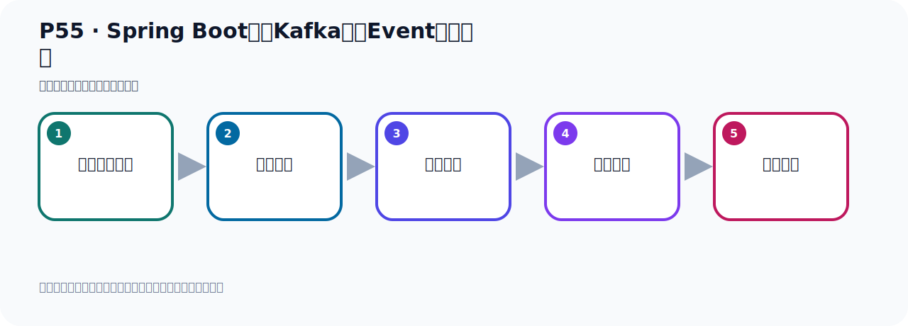

# P55：Spring Boot集成Kafka事件Event发送测试

> 笔记编号 55/156 · 时长 09:15 · [打开原视频 P55](https://www.bilibili.com/video/BV14J4m187jz?p=55)

[← P54: Spring Boot集成Kafka事件Event发送](../05-spring-boot-basics/p054-Spring-Boot集成Kafka事件Event发送.md) · [返回本章](./README.md) · [P56: Spring Boot集成Kafka事件Event读取 →](../05-spring-boot-basics/p056-Spring-Boot集成Kafka事件Event读取.md)

## 这节到底讲什么

**核心主题：Spring Boot集成Kafka事件Event发送测试。**

这节用实验验证前面的配置或机制。重点是记录输入、预期、实际输出，以及两者不一致时如何定位。
本节属于“Spring Boot 集成 Kafka”这一章；放在全章里看，它的作用是：搭建 Spring Boot 工程，掌握 KafkaTemplate、消息发送、监听消费、偏移量和对象序列化。

## 本节路线

## 先用白话读懂

这节的闭环是：先启动 ZooKeeper 与 Kafka；第一次由 Windows/Spring Boot 连接时故意观察连接失败；随后修改 `server.properties` 中的 `listeners` 与 `advertised.listeners`，让 Broker 绑定监听地址并向外公布客户端真正可达的 IP；重启 Kafka 后再次发送 Event，最后在 IDEA Kafka 插件中看到 `helloTopic` 的消息数量增加。

## 老师的完整讲解（按视频顺序校正）

> 下面保留老师的完整讲解顺序，并修正 Kafka、Java、ZooKeeper、
> Topic、Partition、Offset 等常见识别错误。它不是压缩摘要；原始 ASR 在后面单独保留。

### 1. 00:00–00:47

好，那我们发消息，带忙写好之后，接下来我们接着看一下。好，那我们就开始去发送消息，也就是发送事件，这个事件就是消息，就是数据。好，发之前，我把我这个服务器准备一下，就是我的消费者，我的Kafka服务器准备一下。那现在我就不用那个Docker容器了，我单独用我们这个Linux里面单独按住了Kafka，不用那个容器。好，不用那个容器，那我就单独用我们Kafka，那在这里，bin 目录下。好，那我就用我这个基于ZooKeeper方式启动的Kafka，那我第一步，我启动一下，我这个我前面我好像关了，我现在ZooKeeperKafka都没有启动，你看，都没有启动，。

### 2. 00:48–01:37

然后Kafka都没有启动，好，我先启动ZooKeeper，ZooKeeper，server，Start，好，然后我们这个ZooKeeper配置文件，后面加个语号，后台启动这个ZooKeeper。ZooKeeper需要先启动，好，启动之后我们就放这里算了，我把这里开个新窗口，然后再启动Kafka。好，那这边是ZooKeeperKafka，bin 目录下，然后Kafka，server，Start，然后Kafka，Kafka，server，properties 文件。好，那么这个配置文件在启动之前要修改一下，你不修改的话，倒是你的程序是连不上的，你看我现在直接给你启动，我先启动一下，我给你演示一下，。

### 3. 01:37–02:33

那我这个启动之后呢，它现在已经启动了，是吧，这是我们的ZooKeeper，这是我们的Kafka，好，启动之后你现在直接发出消息的，那么它是有问题的，那现在我们吊这么累，去发一下，这是个B吧，这这个B的话呢，我们可以在我们这个测试这里，这么一个测试，在测试这里我们可以注入这个B，注入一下，所以说，注入了，做这个发生消息这个B。好，注入之后呢，我们这里测试一下，那就在这边测试了，Test，Test能一吧，那就吊一下它的这个方法，它的这个对象的发生这个事件，这个方法。好，那我们可以运行啊，我们这边，你认识我们Kafka的这个地址，IP加端口，没问题，是吧，但是现在你发送，看一下，有没问题呢，我们再是点一下这个发送，测试。

### 4. 02:36–03:39

好，等它边移运行一下。好，运行，运行的时候你看，它现在有个这个Warning警告，警告的话，你看它提示什么呢，就是我们这个连不上了，连接到这个节点，是吧，它说不能建立这个连接，就是我们这个Broker啊，Block，它说Block，Block就是我们的Broker，它说可能是不可用的，可能是不可用的，就连不上。所以我们在发送消息之前，我们需要把Kafka的配置改一下，改一下Kafka的配置，现在是连不上的啊，消息发不出去，你看，一直在跑啊，一直在跑，然后一直是建立，建不上，连不上。好，连不上，我把先把它停掉。停掉之后呢，我们改配置文件，我们看一下啊，那我们现在把Kafka给停一下啊，停一下呢，那我现在，刚才我起动的时候，你看，我的命令啊，我后面没有加语号，所以我这个停掉之后呢，那么Kafka就停了，你看，它已经下载到了，按一个C，就停了，因为之前我们起动的时候，用的是前排启动，所以它已经停了啊。

### 5. 03:40–04:16

停了之后，我们要改配置文件，这个是我们进到上一层目录下，config目录下下，是吧，我们要改那个server.properties的文件，这个就是我们Kafka的文件，那么VM打开这个文件。要改什么东西呢，这个和我们之前啊，在讲这个Docker 方式，启动Kafka，是一样的，也差不多，你看，它这里面，卓子改这个server.properties的配置项，那么这里面配置项呢，改哪一头呢，就是改它那个，这个IP啊。在哪里啊，在这里啊，你看，现在木，木是注释掉的，这一方，它是注释掉的，好，首先我们要把这个打开，好，这个打开啊，它现在是注释掉的，先把它打开，好，或者我把它复制一份，算了，复制一份放后面啊，它原来我先不动，复制一份，复制一份之后呢，再写个新的，好，然后这一方写什么，这一方我们写0.0.0.0.0，0.0.0，0，0.0，0，0，。

### 6. 04:45–05:22

0.0.0你好端口就929这个改完了然后今天来改个什么呢改个那个advertised.listeners。

### 7. 05:22–06:12

listeners和我们之前那个Docker 方式里面是一样啊第一个加这个配置箱都跟这里加一个加个这个配置箱好站在这里好那么这边写什么呢这边就是我们对外啊公开对外这个通告通告通知到一个地址那就是向外开放一个地址开放的AP地址就是外界通过我这个AP来访问我这个Kafka那我们这个AP是多少来就是我们这个1271921681118这个AP192.168.11.128我们向外界公开这个AP是吧到时候外界也就是我们windows的我们这个程序这个程序到时候来就通过这个AP加这个端口然后去访问我的这个这个Kafka服务器就可以了好那目前我们只需要改在里面地方啊。

### 8. 06:12–07:19

其他地方不动好那把你们改一下就行了发动之前服务器改这两个配置好那么这个地方呢我们加一个插入一个这个插再插入一段这个文字本本框专门个分本框在写这位置啊好一个是他配置不见一个是他还有来就是他这两个改一下这样保证你服务器啊可以到代码可以连接服务器啊这个就是这两个啊好然后我们把他这个颜色改一下这样子啊改了点好干完之后那我们现在去保存一下让我们去发送看一下其他地方不能动保存一下其他地方我们后面需要改了是我们在改一步步来先把需要改的方法改一下其他的后面再改好那我保存完以后呢我们就开始了去去这个启动是吧启动服务器啊好进入到这个bin 目录下啊。

### 9. 07:21–08:12

好进入下那我就启动啊那我们这个是就Kafka然后servo然后是大特好然后上一层步一下那个可费格然后这个servo点差点泼泼里好这个语号后载启动叫语号行好那这样我们的Kafka就启动好了啊好启动好之后我们接着再用这个程序再运行一下看一下啊好那这种再测试看着他们没发送点一下运行好去发送我们那个消息发送这个世界好那么发送之后你发现他就成功了啊然后这里你看没有报任何错误啊这打个勾打勾那说明我这个消息就发出去了啊就发出去了好发现之后那这个时候我们这个发的时候看一下我们这点发的时候这个Topic叫helloTopic那我们可以通过工具去看一下数据。

### 10. 08:13–08:58

啊那之前我们在你装那个插件id里面Kafka插件点他点一下之后呢我们在那刷新看一下啊哎helloTopic就这个了就这个对吧啊这里可以看到是吧点到这个helloTopic你看他现在这个地方有个叫message count就message个数哎我们现在已经发了一个消息了发了一个消息好那说明我们的消息呢已经发到这个主题下去了这个Topic下去了这个Topic我们前面给他介绍过他就像他就是一个文件夹是吧文件夹里面相遇见文件文件就是消息啊Topic你可以看到这个文件夹这个文件夹下倒是放消息那你一个消息是个文件啊第一个消息又是一个文件第三个小学就是个文件那是这样啊。

### 11. 08:58–09:11

消息那是一个文件那个Topic类似于文件夹这样来去对比去理解那么你就非常好理解了好那这样后来我们就把这个消息就发到服务器上去了啊再次消息的一个发送。

## 关键术语

- **Kafka：** Apache 开源的分布式事件流平台，常用于高吞吐消息传递、数据管道和流处理。
- **Topic：** 事件的逻辑分类。生产者向 Topic 写数据，消费者从 Topic 读取数据。
- **Event：** Kafka 中的一条业务记录，通常由 key、value、时间戳和 headers 等组成。
- **Broker：** 运行 Kafka 服务的节点；多个 Broker 组成 Kafka 集群。
- **ZooKeeper：** 旧版 Kafka 用于集群元数据和控制器协调的外部服务。

## 完整原声逐段记录

[查看本节带时间戳的本地 ASR](./transcripts/p055-Spring-Boot集成Kafka事件Event发送测试-ASR.md)。主笔记负责可读性和术语校正；ASR 页面负责完整性复核。

## 读完记住

- 本节主题是 **Spring Boot集成Kafka事件Event发送测试**，它服务于本章目标：搭建 Spring Boot 工程，掌握 KafkaTemplate、消息发送、监听消费、偏移量和对象序列化。
- 理解顺序是：准备测试条件 → 执行操作 → 读取结果 → 对照预期 → 形成结论。
- 学习时要同时核对老师的解释、画面中的配置/代码，以及最终运行结果。

## 最容易踩的坑

测试前残留的 Topic、Offset、缓存或旧进程会污染结果；每次实验都要先确认初始状态。

## 自测

1. 不看笔记，用自己的话解释“Spring Boot集成Kafka事件Event发送测试”解决了什么问题。
2. 按顺序复述：准备测试条件、执行操作、读取结果、对照预期、形成结论。
3. 如果运行结果和老师不同，你会先检查哪三个输入或环境条件？

## 学完检查

- [ ] 我能不看视频复述本节完整思路
- [ ] 我能指出关键命令、配置、类或接口的作用
- [ ] 我能解释画面中的输入与输出为什么对应
- [ ] 我核对过完整 ASR，没有跳过老师的补充说明
- [ ] 我完成了本节自测或复现实验
