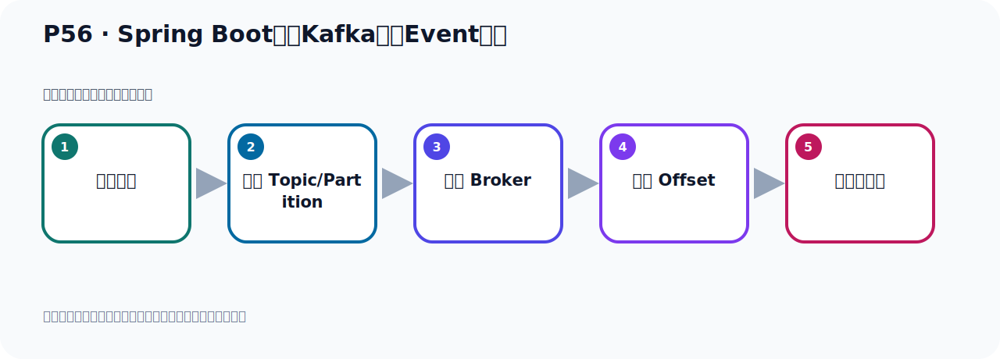
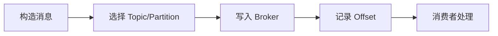

# P56：Spring Boot集成Kafka事件Event读取

> 笔记编号 56/156 · 时长 08:36 · [打开原视频 P56](https://www.bilibili.com/video/BV14J4m187jz?p=56)

[← P55: Spring Boot集成Kafka事件Event发送测试](../05-spring-boot-basics/p055-Spring-Boot集成Kafka事件Event发送测试.md) · [返回本章](./README.md) · [P57: Kafka的几个概念快速梳理 →](../05-spring-boot-basics/p057-Kafka的几个概念快速梳理.md)

## 这节到底讲什么

**核心主题：Spring Boot集成Kafka事件Event读取。**

这节位于消息链路上。要顺着“发送端—Broker—分区日志—消费端”看数据和元数据怎样流动。
本节属于“Spring Boot 集成 Kafka”这一章；放在全章里看，它的作用是：搭建 Spring Boot 工程，掌握 KafkaTemplate、消息发送、监听消费、偏移量和对象序列化。

## 本节路线

## 老师的完整讲解（按视频顺序校正）

> 下面保留老师的完整讲解顺序，并修正 Kafka、Java、ZooKeeper、
> Topic、Partition、Offset 等常见识别错误。它不是压缩摘要；原始 ASR 在后面单独保留。

### 1. 00:00–00:55

好，我们这个消息就已经发到这个服务器上去以后，我们接下来就开始去消费这个消息。好，我们在这边就写一个消费者。按照我们的课件的话，就是我们开始去写一个消费者，去接收这个事件，也就是这个消息数据，去接收。好，那这个是我们写个消费者这里。好，把之前这个都关掉。写一个消费者，右键。好，那么就是考虚嘛。好，那么我们这个里面叫event，这个考虚嘛。好，写在这里个消费者啊。这个消费者这个类也是一样，也是容器的一个B，把它放到容器中。使用部落形之后啊，这个类就是容器一个B。好，那么这个消息怎么接收呢？这个消息啊，我们采用监听的方式接收，采用这个监听的方式。

### 2. 00:56–01:41

接收这个消息，接收这个事件，这个事件就是我们那个消息的，消息或者说有数据，有吧，接收它。而当然我们接收消息啊，除了监听的方式接收以外啊，还有别的方式，我们后面再接收啊，先采用这个监听的方式来接收。好，监听的方式接收呢，它就是写一个方法，一个普通方法，握一刀，然后按message，按event吧。好，写这个方法，这个方法迷可以自己随便地定义，这个迷字都随便写就可以。好，接收我们之前发的时候，我们发这个消息，它是自捕串的，自捕串的。它是自捕串的，那我们这边就是接收这个消息，它是自捕串，直接用方法参数，把这个消息接过来。

### 3. 01:41–02:29

那这样我们就拿这个消息了，然后就可以把这个消息打印一下，看有没有接到，那么读取到的这个事件，也就是我们的消息是多少呢？那这就是我们这个event。好，这样我们代码写好了，就写这么一个方法，接收。那这个方法随意调用呢，让这个监听器到时候去调用，所以这个是我们加个Kafka，list的，这样接听器的。这个方法就是到时候接听器调用这个方法，调用这个方法，它会把那个读取到监听器的这个消息传给我们这个方法，传给我们的方法，那我们的方法里面就拿到这个消息了，好，就这样子，用监听器的方式接收我们的消息。好，那这样就写好了，写好了之后，我们这个类是融系一个B，。

### 4. 02:29–03:24

起动之后，那么这个B在融系中就出说话好了，出说话好以后，它这个监听器就生效了，这个监听器生效之后，它就在融系中一直在那里监听，就是有一个线神一直在那里，一直在那里等着那里的，你有消息过来，它就回调这个方法，把消息传给我们这个方法，你只要有消息过来，它就回调这个方法，把消息传给你这个方法，那么这个方法就拿到这个消息了，所以它这个监听器一直在这个融系中，一个线神一直在那里御习，它不会提下来，一直在御习，御习有消息就调这个方法，把消息传过来，调这个方法，有消息就调这个方法，这样就可以接受消息了，好，那这个时候我们就把这个套地御习起来，御习，御习之后到时我们这个融系中有这个B，这个B里面到时就会有一个线神一直在那里启动那里监听消息，。

### 5. 03:24–04:22

好，那现在我启动之后你发现它报错了，这是一个状态异常非法的不合格的状态异常，那这个状态异常它说Topic是Topicpartum，或者Topicpartum型，你必须要提供，Provider没有提供了，那就是说这个三个参数你要提供其中一个，要提供其中一个，你都不行不行，那就是我们这个助己它这里面不能直接这么写，你里面至少指的一个什么，指的一个，三个参数里面，只剩一指的一个，那我们一般情况下我们就是指的一个Topic，这个这个属性，这个属性就是你指定监听哪个主题，那之前我们发的时候你看，我们是发到这个主题上头，那我们就监听这个主题就可以了，对吧，监听这个主题来谈就行了，好，那么这个Topic它本身是个数组呢，这个属性是个数组呢，。

### 6. 04:22–05:29

所以你如果有多个Topic需要监听也可以，那你可以什么，写个数组，如果你还有个主题需要监听，那你写个数组就行了，那这样写啊，到时候终于可以逗合分格，再加别的，加别的这个主题就可以了，好，这样行为之后我们再跑一下，看有没有问题的，这是在预言美方法，对吧，预言美方法，在美方法右键，然后在预言美方法右键行，好，预言之后呢，它又爆出了，对吧，好，爆出了什么失败的什么这个开始这个B，这个B呢，什么B呢，这样一个什么这个Kafka拉米斯的这个B，好，然后它的原因是什么，原因往上走走，它的原因就是这个CostBuy，原因就是它说也是一个状态的异常啊，它说没有这个GroupAD找到，就是在消费者配置中啊，你消有个GroupAD，没有GroupAD它不行，就是容器或者是容器属性里面，是吧，容器属性中你要配GroupAD，或者是你这个注解里面，你要配这个GroupAD，。

### 7. 05:29–06:15

所以这个GroupAD啊，没有，它是必须的，应该，required，必须要求的，是吧，它就是我们需要一个GroupAD，那GroupAD呢，就是我们在这个注解里面加成啊，它里面需要，这个水，叫GroupAD的，它里面有个GroupAD，对吧，GroupAD呢，我就写一个叫Handle吧，Handle这个GiOup好吧，HandleGroup，好，这个名字我们自己指定一个主名字型的，它需要一个给你，你需要指定一个主ID，这个ID你自己指定，啊，就行了，自己指定一个主ID，ID我们一般不重物是吧，你消费者你指定的ID别重物，那我们指定ID，指定好，名字可以自己定义，自己写个名字也行的，好，这个新闻字我们再跑一步，好，。

### 8. 06:15–07:14

我们再跑一下，看能不能运行啊，这能不能走一下，好，走一下，现在呢，它就成功了啊，就没有报错，而且这个程序它不会提下来，不会提下来，因为它里面那个接听器啊，就是一个线程，一直在运行，它接听消息，你如果发消息，它就开始接收，那目前的话呢，你看我们这句话，应该没有党议，说明我们知识的消息，它并没有帮我们读取到，你让我们再收一下，收拾字，收拾它，收拾你看，找到一个结果，也就是说，它默认情况下，它接收消息的时候，它是从最新的消息开始接收，你之前发消息，它不会接收，默认情况下是这样的，如果说我现在发一个消息过去，那它就可以接收到，好，那这个是你看，它这个这里的监听，它在监听的时候呢，我在这里给它发个消息，在这里发一个，这里发一个消息，对吧，那这个那也太长了，我们改短点啊，太长了，改个名字，。

### 9. 07:15–07:59

reliable，太长了，好，改成这样子，这个模块，好，成功，改短点啊，不然太长了，好，那在这里边是吧，我们通过它，去发消息了，这里发消息了，它发一个Handel网是吧，好，那我们去发一下啊，好，发完了之后，之前它这边你搜索这个，过程词，你搜索找不到是吧，一个没找到，现在我们发一个之后，它也可以找到了，你看，发一个，它默认从最新一条消息开始接收，好，那我这边这个消息就发完了，发完之后，我们在这边去搜索一下，看哪里没搜索，你看，这个时候搜索，读教师界你看，它找到一条结果吧，一条结果，在哪里呢，走一下，在这里，好，读断了我们刚成的消息，。

### 10. 08:01–08:31

不断了，好，也就是说，以消费者启动以后，然后你再发了消息，我就可以读到，我消费者没有启动，你之前发的那些消息，他默认情况下是读不到的，那如果我想读之前的已经发送的消息，我们也有办法可以读到，好，我们下个点看一下，怎么把之前的消息也给它读出来，现在我们是读到了新发的消息，新发的消息可以读到，之前的消息没读到，我们看看之前的消息该怎么读，。

## 关键术语

- **Kafka：** Apache 开源的分布式事件流平台，常用于高吞吐消息传递、数据管道和流处理。
- **Topic：** 事件的逻辑分类。生产者向 Topic 写数据，消费者从 Topic 读取数据。
- **Event：** Kafka 中的一条业务记录，通常由 key、value、时间戳和 headers 等组成。

## 完整原声逐段记录

[查看本节带时间戳的本地 ASR](./transcripts/p056-Spring-Boot集成Kafka事件Event读取-ASR.md)。主笔记负责可读性和术语校正；ASR 页面负责完整性复核。

## 读完记住

- 本节主题是 **Spring Boot集成Kafka事件Event读取**，它服务于本章目标：搭建 Spring Boot 工程，掌握 KafkaTemplate、消息发送、监听消费、偏移量和对象序列化。
- 理解顺序是：构造消息 → 选择 Topic/Partition → 写入 Broker → 记录 Offset → 消费者处理。
- 学习时要同时核对老师的解释、画面中的配置/代码，以及最终运行结果。

## 最容易踩的坑

能发送成功不代表业务处理成功；序列化、分区、确认机制和消费进度需要分别观察。

## 自测

1. 不看笔记，用自己的话解释“Spring Boot集成Kafka事件Event读取”解决了什么问题。
2. 按顺序复述：构造消息、选择 Topic/Partition、写入 Broker、记录 Offset、消费者处理。
3. 如果运行结果和老师不同，你会先检查哪三个输入或环境条件？

## 学完检查

- [ ] 我能不看视频复述本节完整思路
- [ ] 我能指出关键命令、配置、类或接口的作用
- [ ] 我能解释画面中的输入与输出为什么对应
- [ ] 我核对过完整 ASR，没有跳过老师的补充说明
- [ ] 我完成了本节自测或复现实验
