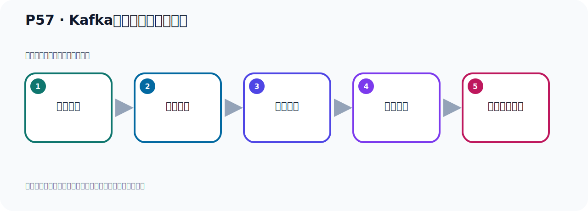
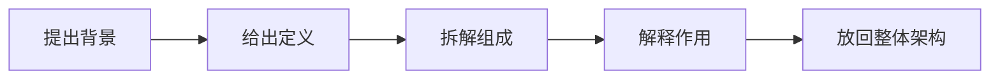

# P57：Kafka的几个概念快速梳理

> 笔记编号 57/156 · 时长 06:40 · [打开原视频 P57](https://www.bilibili.com/video/BV14J4m187jz?p=57)

[← P56: Spring Boot集成Kafka事件Event读取](../05-spring-boot-basics/p056-Spring-Boot集成Kafka事件Event读取.md) · [返回本章](./README.md) · [P58: SpringBoot集成Kafka读取最早的消息 →](../05-spring-boot-basics/p058-SpringBoot集成Kafka读取最早的消息.md)

## 这节到底讲什么

**核心主题：Kafka的几个概念快速梳理。**

这是一节概念课。老师先交代背景，再给出定义、组成和作用，最后把概念放回 Kafka 整体架构。
本节属于“Spring Boot 集成 Kafka”这一章；放在全章里看，它的作用是：搭建 Spring Boot 工程，掌握 KafkaTemplate、消息发送、监听消费、偏移量和对象序列化。

## 本节路线

## 老师的完整讲解（按视频顺序校正）

> 下面保留老师的完整讲解顺序，并修正 Kafka、Java、ZooKeeper、
> Topic、Partition、Offset 等常见识别错误。它不是压缩摘要；原始 ASR 在后面单独保留。

### 1. 00:00–01:04

下面我们看一下怎么读取之前发生的消息。在解决这个问题之前，我们先来看一下几个概念。我们看一下课件。我们要介绍一下这么几个概念，我们把它打开看一下。这里总共有五个概念，这五个，我们分别看一下。首先前面这三个都比较好理解。这三个我们就看这张图就可以了。第一个生产者就是我们的生产者，可以有一个也可以有多个。生产者主要就是发送消息的，或者说叫写入事件。事件就是我们的数据、我们的消息，把数据写入到我们的Topic。Topic就是写入到我们的Kafka服务器，这是生产者，它主要是写入数据。它消费的Consumer，Consumer就右边这个是Consumer，Consumer也可以有一个或者多个。

### 2. 01:04–02:05

可以有多个Consumer，多个消费者，这是生产者和消费者。中间这个是Topic，这就是我们Topic。Topic就是在我们的Kafka服务器里面，我们会创建一个Topic。我们在写入数据或是读取数据的时候，都是从Topic去读取去写入。数据写入Topic，读取从Topic读取。我们在写数据、取数据都要首先创建一个Topic。这个图就是我们这三个概念，都比较好理解。这是我们这三个概念。好，接下来我们要看右边这个图，右下角这个图。这个图就涉及到我们下面这两个概念，一个叫分区、帕滴形，一个叫偏移量、Outsight。这两个概念我们来看一下。首先我们的试试者，然后写数据、发送消息、写数据，写入到我们的Topic里面去。

### 3. 02:05–03:01

Topic就是我们Kafka服务器写入这里面去。我们Topic里边可以有分区，可以有一个或者多个分区。就是一个Topic下，可以有一个分区，或者两个分区，或者三个分区，或者是多个分区。那么分区就得扒地形，分区就得扒地形。你也可以这么的理解，比如说我们这个Topic，我们有取个名字叫Topic，Topic你可以看用这个文件夹。这个文件夹下面你可以认为又有三个指文件夹，那就是我们这里面有个P1，P2，相予有三个指文件夹。那么这个P1，P1，P2就是那个分区，叫扒地形。就是一个Topic下，它至少有一个分区，当然也可以有多个，默认是有一个分区。

### 4. 03:01–03:48

一个Topic下，默认有一个分区，默认是一个，也可以在创建Topic的时候，指定它有几个分区。你可以指定5个，8个，10个，指定它的分区个数。好，这就是分区概念，那就是我们这个Topic下，托一个名字叫埋Topic，那么它下面目前就有三个分区。当然它默认情况下，它只有一个分区，就是你不指定的话它只有一个分区，相予只有P1这一个分区。好，这就是分区的概念。好，接下来我们介绍一下这个叫偏易定，Osyde这个概念。Osyde是什么呢？Osyde就是每个分区里面，你存放了消息，就是你的那个数据或者叫事件，你写入的时候就是往这个分区里面写入。

### 5. 03:48–04:39

比如说这是一条数据，是吧，每个格子是一个数据，每个格子是这个数据，那就是你这个每个数据的相遇它给你一个什么，有一个序号，或者说有个下标，有个序号。就是说你这个数据放了什么位置的，这个序号从零开始一直往后增长的，税续增长的，是有税续的。零一二三十五六七八九十，后面是省略的，是绝的，一直往后增长到一千一百一万这样增长。从零开始，那么你第一个消息放进来相遇这个位置就能，第一个消息放进来就是一，第三个放进来就是二，有个序号。好，这就是我们偏移量。好，这是我们的偏移量这个概念，就是每个分区里面，你的消息是有顺序的，是有顺序的，那么有个序号，标示它的位置。

### 6. 04:39–05:31

好，这就是我们这个偏移量这个概念。那我们这个，深圳者在网里面写消息的时候，写试镜的时候，你看它是写的时候，写，写的时候它是写了什么？就写了它后面的位置，左边这个像是脑位置，后面是新位置，我们这边有个脑，欧的这个六，新的，对吧？左边是脑位置，右边是新位置，那你写的时候是要写在这个新位置上，比如说前面零到六，已经写消息了，那你地后面那个消息，那你写来到后面这个位置，写这个位置。有一个序号，好，然后我们消费的，到时候从这边去拉取消息，读取消息，那么读取消息的时候，你可以从第一个消息开始读，对吧？你也可以从最新的这个位置开始读消息，好，这是读消息。

### 7. 05:31–06:28

那这几个概念呢，给大家做了一个胸铃，那我们接下来看一下，在Kafka中，每个Topic，就是每一个呢，这个主题是吧？它可以有一个或者多个分区，就是有一个或多个，那我们这个图里面就有三个分区，那么在创建Topic的时候，如果你不指定的话，那么这个Topic它的Party，就是它分区数量，默认呢，就是一个分区，默认就一个。你要指定三个五个，你可以指定，你不指定，它默认呢，就是一个Topic下，有一个分区，默认是一个。这个AuFace是标识每一个分区中消息的唯一位置，从一开始的，能一二三这样增长的。好，以上啊，就是我们对这五个概念做一个简单梳理，那下面呢，我们去写代表的时候，因为会设计到这个概念，好，那么这几个概念，小英大家呢，有一个认识的。

### 8. 06:28–06:36

好，那今天我们进一步来看一下，再摸去消息，再摸去消费，它之前的历史的消息。

## 关键术语

- **Kafka：** Apache 开源的分布式事件流平台，常用于高吞吐消息传递、数据管道和流处理。
- **Topic：** 事件的逻辑分类。生产者向 Topic 写数据，消费者从 Topic 读取数据。
- **Consumer：** 从 Kafka Topic 拉取并处理事件的客户端。

## 关键画面核对

IDEA 画面显示 `KafkaBaseApplicationTests` 使用 `@SpringBootTest`，通过 `@Resource` 注入 `EventProducer`，并在 `test01()` 中调用 `eventProducer.sendEvent()`；项目按 producer、consumer、配置和启动类分层。

[查看课程关键画面核对总表](../../sources/visual-checks.md)。

## 完整原声逐段记录

[查看本节带时间戳的本地 ASR](./transcripts/p057-Kafka的几个概念快速梳理-ASR.md)。主笔记负责可读性和术语校正；ASR 页面负责完整性复核。

## 读完记住

- 本节主题是 **Kafka的几个概念快速梳理**，它服务于本章目标：搭建 Spring Boot 工程，掌握 KafkaTemplate、消息发送、监听消费、偏移量和对象序列化。
- 理解顺序是：提出背景 → 给出定义 → 拆解组成 → 解释作用 → 放回整体架构。
- 学习时要同时核对老师的解释、画面中的配置/代码，以及最终运行结果。

## 最容易踩的坑

不要只背术语定义；需要同时说清它解决什么问题、与哪些组件交互、失效时会出现什么现象。

## 自测

1. 不看笔记，用自己的话解释“Kafka的几个概念快速梳理”解决了什么问题。
2. 按顺序复述：提出背景、给出定义、拆解组成、解释作用、放回整体架构。
3. 如果运行结果和老师不同，你会先检查哪三个输入或环境条件？

## 学完检查

- [ ] 我能不看视频复述本节完整思路
- [ ] 我能指出关键命令、配置、类或接口的作用
- [ ] 我能解释画面中的输入与输出为什么对应
- [ ] 我核对过完整 ASR，没有跳过老师的补充说明
- [ ] 我完成了本节自测或复现实验
