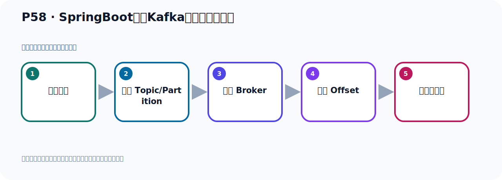
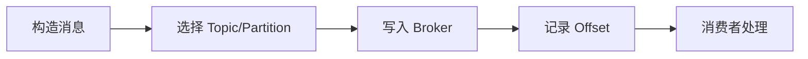

# P58：SpringBoot集成Kafka读取最早的消息

> 笔记编号 58/156 · 时长 04:16 · [打开原视频 P58](https://www.bilibili.com/video/BV14J4m187jz?p=58)

[← P57: Kafka的几个概念快速梳理](../05-spring-boot-basics/p057-Kafka的几个概念快速梳理.md) · [返回本章](./README.md) · [P59: SpringBoot集成Kafka读取最早的消息 →](../05-spring-boot-basics/p059-SpringBoot集成Kafka读取最早的消息.md)

## 这节到底讲什么

**核心主题：SpringBoot集成Kafka读取最早的消息。**

这节位于消息链路上。要顺着“发送端—Broker—分区日志—消费端”看数据和元数据怎样流动。
本节属于“Spring Boot 集成 Kafka”这一章；放在全章里看，它的作用是：搭建 Spring Boot 工程，掌握 KafkaTemplate、消息发送、监听消费、偏移量和对象序列化。

## 本节路线

## 老师的完整讲解顺序（ASR 辅助复核）

> 下面按时间顺序保留经过基础术语替换的 ASR，方便核对老师是否提到某个细节。
> 人名、命令、代码和英文参数仍可能识别错误；准确结论以本节白话说明、代码块和实操速查表为准。

### 1. 00:00–00:50

好，那刚才我们了解了这五个概念。有了这个了解之后，接下来我们来实现一下，我们怎么把这个历史消息也给它读取出来。好，那么在末日情况下，当我们启动一个新的消费主食，就是我们消费的时候，它都需要有个消费组。因为你需要指一个消费组ID，如果你不指定的话，你的程序启动它会报错。也就是在我们的代码中，你消费，那你需要指一个ID，这个globalID，这个不指定的话，它程序报错。好，当我们启动一个消费主的时候，那么它从每个分区的这个最新片一辆，最新片一辆就是最新的，也就是最后的那个位置，那个Offset，你看，在后面是新的，是吧？

### 2. 00:50–01:47

前面是老的，那就是最新的，就是从这个6下面的位置从7开始读，这个对它来说就从4开始读消息，那么上面这个东西就是从6开始读消息，因为这个是当前的这个消息的下一个位置，就是最新的。最新片一辆就是该分区中最后一条消息的下一个位置，从这个位置开始消费，这是默认情况下，它从这里开始消费，那就是我们消费的启动之后，我们要消费消息，那么它默认对于这个Partition这个分区来说，它从6这个位置读消息，在从4，在从7开始读消息。那如果说你希望从雷从最早的这个位置开始读，你希望从最老的这个开始读，从第一条开始读，那你要把消费者，他的这个属性设置成Erlist，设置成这个属性。

### 3. 01:47–02:48

那么接下来去设置一下，看看能不能读了消息，那此时我们就在这个地方打开配文件，那么这是消费者，他属于消费的配置，他不属于生生者，属于消费者，那把消费者这个打开，打开之后我们直接说了，这里面有几十个二十几个那个配置项，那么点一下一个Output，你把Output，Output什么呢？Output，Outside，Reset，就是把片一辆重置，重置片一辆，点一下。点一下，那么他这里面有四个曲子，对吧？有四个曲子，那么最早的开始读的就是Erlist，这是最早的，自动的从这个最早的位置开始读，好，加这个属性。加这个属性之后，我们接下来我们启动一下我们的程序，看看他能不能把之前的消息读到，我们之前在我们这个Kafka，点这个插件看一下，这个HaloTombico里面，他其实目前我们刷新一下，他里面已经有两个消息了，这两个消息，对吧？

### 4. 02:49–03:46

好，他这个片一辆，你该从里开始的，因为他有两个消息，现在他现在这个最后的这个片一辆已经是二了，有两个消息，好，这是我们这个，然后他这个PartyC，它是N，编号是N，相对于现在是PN，因为目前我们这个Tombico没有指定分区个数，所以他默认只有一个分区，所以就PartyCN只有一个分区，你可以指定，在创建Tombico的时候可以指定分区个数，目前没有指定，默认是一个分区，下面这个呢，这个也是一个分区，这个也是一个分区，默认都是一个分区，好，那我们这个里面有两个消息，他的这个Tombico一开始的，然后结束了这个片一定是二，现在我们已经启动程序了，那么他到这个间谍器，就是这个间谍器，他开了去消费，用这个消费总机消费，消费这个主题，好，那么我们又接下来用这个Mate方法，走一下，看看能不能把这个，。

### 5. 03:47–04:13

之前用两条去赌到，好，起完来吧，起完来，那么这个程序来得起完了吗，起完之后呢，然后好，我们这个是看一下，我们通过这个去搜索一下，我们有两个消息，那么他应该赌出两条数据，看有没有赌到，看见没有，找一下，找一下之后你发现他没赌到，对吧，没赌到，那这是什么原因呢，这是这个原因啊，我们看一下，。

## 关键术语

- **Kafka：** Apache 开源的分布式事件流平台，常用于高吞吐消息传递、数据管道和流处理。
- **Partition：** Topic 的物理分片，是 Kafka 并行度、顺序性和扩展能力的基本单位。
- **Offset：** 事件在 Partition 中的位置编号，也是消费者记录消费进度的依据。

## 完整原声逐段记录

[查看本节带时间戳的本地 ASR](./transcripts/p058-SpringBoot集成Kafka读取最早的消息-ASR.md)。主笔记负责可读性和术语校正；ASR 页面负责完整性复核。

## 读完记住

- 本节主题是 **SpringBoot集成Kafka读取最早的消息**，它服务于本章目标：搭建 Spring Boot 工程，掌握 KafkaTemplate、消息发送、监听消费、偏移量和对象序列化。
- 理解顺序是：构造消息 → 选择 Topic/Partition → 写入 Broker → 记录 Offset → 消费者处理。
- 学习时要同时核对老师的解释、画面中的配置/代码，以及最终运行结果。

## 最容易踩的坑

能发送成功不代表业务处理成功；序列化、分区、确认机制和消费进度需要分别观察。

## 自测

1. 不看笔记，用自己的话解释“SpringBoot集成Kafka读取最早的消息”解决了什么问题。
2. 按顺序复述：构造消息、选择 Topic/Partition、写入 Broker、记录 Offset、消费者处理。
3. 如果运行结果和老师不同，你会先检查哪三个输入或环境条件？

## 学完检查

- [ ] 我能不看视频复述本节完整思路
- [ ] 我能指出关键命令、配置、类或接口的作用
- [ ] 我能解释画面中的输入与输出为什么对应
- [ ] 我核对过完整 ASR，没有跳过老师的补充说明
- [ ] 我完成了本节自测或复现实验
