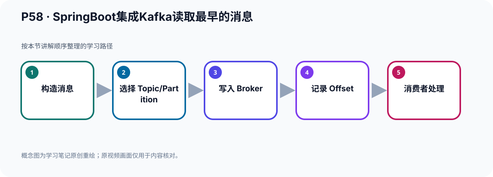
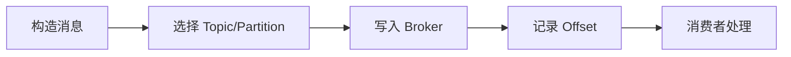

# P58：SpringBoot集成Kafka读取最早的消息

> 笔记编号 58/156 · 时长 04:16 · [打开原视频 P58](https://www.bilibili.com/video/BV14J4m187jz?p=58)

[← P57: Kafka的几个概念快速梳理](../05-spring-boot-basics/p057-Kafka的几个概念快速梳理.md) · [返回本章](./README.md) · [P59: SpringBoot集成Kafka读取最早的消息 →](../05-spring-boot-basics/p059-SpringBoot集成Kafka读取最早的消息.md)

## 先看结论

> 这节把“SpringBoot集成Kafka读取最早的消息”放回消息链路，沿 Producer、Broker、Partition、Offset 与 Consumer 追踪数据和元数据如何流动。它服务于本章目标：搭建 Spring Boot 工程，掌握 KafkaTemplate、消息发送、监听消费、偏移量和对象序列化。

## 老师怎么一步步讲

1. 第 1 步，围绕“SpringBoot集成Kafka读取最早的消息”完成构造消息。
2. 第 2 步，围绕“SpringBoot集成Kafka读取最早的消息”完成选择 Topic/Partition。
3. 第 3 步，围绕“SpringBoot集成Kafka读取最早的消息”完成写入 Broker。
4. 第 4 步，围绕“SpringBoot集成Kafka读取最早的消息”完成记录 Offset。
5. 第 5 步，围绕“SpringBoot集成Kafka读取最早的消息”完成消费者处理。

## 老师的补充说明

下面按原声顺序整理老师的完整讲解脉络。保留原因、案例、对比、操作过程、边界条件和口头提醒；删除重复语气词，并把长口语拆成适合阅读的短段落。

> 技术术语已经过统一校正；仍无法确认的人名或口头英文会保留原意，并通过右侧时间范围返回视频核对。

### 先明确：SpringBoot集成Kafka读取最早的消息要解决什么 · 00:00–01:08

那刚才我们了解了这五个概念。有了这个了解之后，接下来我们来实现一下，我们怎么把这个历史消息也给它读取出来。那么在末日情况下，当我们启动一个新的消费主食，就是我们消费的时候，它都需要有个消费组。因为你需要指一个消费组ID，如果你不指定的话，你的程序启动它会报错。也就是在我们的代码中，你消费，那你需要指一个ID，这个globalID，这个不指定的话，它程序报错。

当我们启动一个消费主的时候，那么它从每个分区的这个最新片一辆，最新片一辆就是最新的，也就是最后的那个位置，那个Offset，你看，在后面是新的，是吧？前面是老的，那就是最新的，就是从这个6下面的位置从7开始读，这个对它来说就从4开始读消息，那么上面这个东西就是从6开始读消息，因为这个是当前的这个消息的下一个位置，就是最新的。

### 跟着老师操作，并观察运行结果 · 01:08–02:30

最新片一辆就是该分区中最后一条消息的下一个位置，从这个位置开始消费，这是默认情况下，它从这里开始消费，那就是我们消费的启动之后，我们要消费消息，那么它默认对于这个Partition这个分区来说，它从6这个位置读消息，在从4，在从7开始读消息。那如果说你希望从雷从最早的这个位置开始读，你希望从最老的这个开始读，从第一条开始读，那你要把消费者，他的这个属性设置成Erlist，设置成这个属性。

那么接下来去设置一下，看看能不能读了消息，那此时我们就在这个地方打开配文件，那么这是消费者，他属于消费的配置，他不属于生生者，属于消费者，那把消费者这个打开，打开之后我们直接说了，这里面有几十个二十几个那个配置项，那么点一下一个Output，你把Output，Output什么呢？Output，Outside，Reset，就是把片一辆重置，重置片一辆，点一下。点一下，那么他这里面有四个曲子，对吧？

有四个曲子，那么最早的开始读的就是Erlist，这是最早的，自动的从这个最早的位置开始读，好，加这个属性。

### 最后验证结果，并收束本节结论 · 02:31–04:13

加这个属性之后，我们接下来我们启动一下我们的程序，看看他能不能把之前的消息读到，我们之前在我们这个Kafka，点这个插件看一下，这个HaloTombico里面，他其实目前我们刷新一下，他里面已经有两个消息了，这两个消息，对吧？

他这个片一辆，你该从里开始的，因为他有两个消息，现在他现在这个最后的这个片一辆已经是二了，有两个消息，好，这是我们这个，然后他这个PartyC，它是N，编号是N，相对于现在是PN，因为目前我们这个Tombico没有指定分区个数，所以他默认只有一个分区，所以就PartyCN只有一个分区，你可以指定，在创建Tombico的时候可以指定分区个数，目前没有指定，默认是一个分区，下面这个呢，这个也是一个分区，这个也是一个分区，默认都是一个分区，好，那我们这个里面有两个消息，他的这个Tombico一开始的，然后结束了这个片一定是二，现在我们已经启动程序了，那么他到这个间谍器，就是这个间谍器，他开了去消费，用这个消费总机消费，消费这个主题，好，那么我们又接下来用这个Mate方法，走一下，看看能不能把这个，之前用两条去赌到，

好，起完来吧，起完来，那么这个程序来得起完了吗，起完之后呢，然后好，我们这个是看一下，我们通过这个去搜索一下，我们有两个消息，那么他应该赌出两条数据，看有没有赌到，看见没有，找一下，找一下之后你发现他没赌到，对吧，没赌到，那这是什么原因呢，这是这个原因啊，我们看一下，。

## 放进整套课

本节属于 **Spring Boot 集成 Kafka**。这一章要解决的是：搭建 Spring Boot 工程，掌握 KafkaTemplate、消息发送、监听消费、偏移量和对象序列化。

这节位于消息链路上。要顺着“发送端—Broker—分区日志—消费端”看数据和元数据怎样流动。

### 记忆路线

```mermaid
flowchart LR
    N0["构造消息"]
    N1["选择 Topic/Partition"]
    N0 --> N1
    N2["写入 Broker"]
    N1 --> N2
    N3["记录 Offset"]
    N2 --> N3
    N4["消费者处理"]
    N3 --> N4
```

## 用在工作里

| 项目 | 内容 |
|---|---|
| 先回答 | 先明确消息从哪里产生、写入哪个 Topic、由谁消费。 |
| 立刻做 | 复现发送、Broker 写入和消费者处理的完整链路。 |
| 留下证据 | 记录 Partition、Offset、序列化结果和消费端输出。 |

## 关键术语

- **Kafka：** Apache 开源的分布式事件流平台，常用于高吞吐消息传递、数据管道和流处理。
- **Partition：** Topic 的物理分片，是 Kafka 并行度、顺序性和扩展能力的基本单位。
- **Offset：** 事件在 Partition 中的位置编号，也是消费者记录消费进度的依据。

## 最容易踩的坑

能发送成功不代表业务处理成功；序列化、分区、确认机制和消费进度需要分别观察。

## 自测

1. 不看笔记，用自己的话解释“SpringBoot集成Kafka读取最早的消息”解决了什么问题。
2. 按顺序复述：构造消息、选择 Topic/Partition、写入 Broker、记录 Offset、消费者处理。
3. 如果运行结果和老师不同，你会先检查哪三个输入或环境条件？

## 学完检查

- [ ] 我能不看视频复述本节完整思路
- [ ] 我能指出关键命令、配置、类或接口的作用
- [ ] 我能解释画面中的输入与输出为什么对应
- [ ] 我读完了老师的详细讲解正文，没有只看路线图和要点
- [ ] 我完成了本节自测或复现实验

## 需要核对原话时

[查看本节带时间戳的完整 ASR](./transcripts/p058-SpringBoot集成Kafka读取最早的消息-ASR.md)。主笔记负责理解与实践；ASR 页面负责逐句完整性复核。
