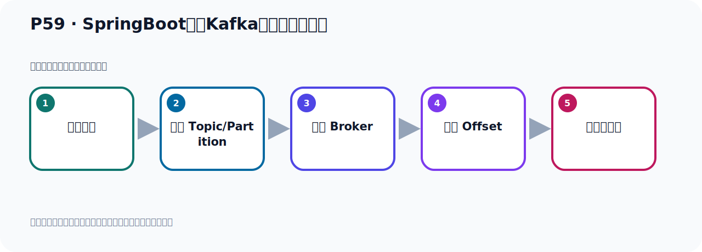
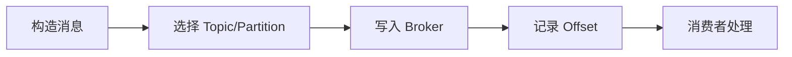

# P59：SpringBoot集成Kafka读取最早的消息

> 笔记编号 59/156 · 时长 06:00 · [打开原视频 P59](https://www.bilibili.com/video/BV14J4m187jz?p=59)

[← P58: SpringBoot集成Kafka读取最早的消息](../05-spring-boot-basics/p058-SpringBoot集成Kafka读取最早的消息.md) · [返回本章](./README.md) · [P60: 手动重置Kafka偏移量offset →](../05-spring-boot-basics/p060-手动重置Kafka偏移量offset.md)

## 这节到底讲什么

**核心主题：SpringBoot集成Kafka读取最早的消息。**

这节位于消息链路上。要顺着“发送端—Broker—分区日志—消费端”看数据和元数据怎样流动。
本节属于“Spring Boot 集成 Kafka”这一章；放在全章里看，它的作用是：搭建 Spring Boot 工程，掌握 KafkaTemplate、消息发送、监听消费、偏移量和对象序列化。

## 本节路线

## 老师的完整讲解顺序（ASR 辅助复核）

> 下面按时间顺序保留经过基础术语替换的 ASR，方便核对老师是否提到某个细节。
> 人名、命令、代码和英文参数仍可能识别错误；准确结论以本节白话说明、代码块和实操速查表为准。

### 1. 00:00–01:03

好，我们配了Ernest配置以后，我们发现我们第一条消息，之前的历史消息还是没读到，这些查的结果是没读到。没读到，那是什么原因呢？我们看一下。它启动的时候，它默认从第一条开始读，但是我们读了是没读到，那这个时候我们有一个注意事项，那我们下一个，看下一个PUT，一个注意。如果之前已经用相同的消费组ID消费过这个主题，那我们那个Hanotomy和那个主题，我们之前洗衣精消费过，对吧？我们之前是消费过的，就是这个主题。我们第二条消息，第二条消息我们之前是消费过的，你如果消费过，并且CMAK已经保存了这个消费组的偏意量，那你消费过之后来，那么CMAK它就会保存你这个消费组的偏意量，你这个消费组它的偏意量是多少，它CMAK就已经保存了。

### 2. 01:04–02:03

那么即使你设置了这个Odys，那么这个设置也是不生效的，你用这个消费组已经消费过了，那么CMAK它已经帮你记下了那个偏意量，那个偏意量它已经帮你记住了，对吧？因为你用这个消费组，就说你用同一个消费组ID，你消费过这个主题，我们用了哪个消费组呢？我们当时用的是这个HanotGlob这个消费组，我们已经消费过这个主题，叫HanotTopic已经消费过了，那么CMAK就记住了你这个消费组，你这个消费组的偏意量，你的这个消费组偏意量是多少，它已经记下了。那么此时，如果你设置这个Odys的话，它是没有用的，配置是不生效的。因为这个配置它只是说，当Kafka找不到偏意量的时候，才使用这个配置，你才生效。

### 3. 02:03–02:55

那么Kafka如果能够找到你上次记录了这个偏意量的话，那么你即便设置这个配置，它也是不生效的。只有当你Kafka没有记录过你这个消费组的偏意量的时候，它才有效。那现在你想读到历史消息怎么办？那么就是有两个办法，那么这种情况下你想读历史消息怎么办？你看，两个办法，第一种办法，手动重置偏意量。因为Kafka已经帮你记拿那个偏意量，你记住了，你这个消费组的偏意量，它已经帮你记下来的。好，那你把它重置一下，手动重置下偏意量，这是一个办法。好，另外一个办法，就是使用一个新的消费组ID，两个办法。好，那现在我现在用同一个消费组，我想去消费这个历史消息，那消费不了。

### 4. 02:55–03:44

所以就只能说你去重置一下偏意量才可以。那现在我这样，我先用这个方法，就是我先用一个新的消费组去消费，那么这样它就生效了。那又改个消费组的名字，那这个时候我们的消费组就改个名字，之前叫Hanou Group，那我这样叫Hanou Group02，对吧？我已经改了一个消费组名字，那么此时你这边是个Allist，那这个时候它就可以消费历史消息了。好，那这个时候我们再想这个秘方把命运行一下，好，右键运行它去监听，接受消息，走一下，看一下这个时候能不能把历史消息赌到。好，那么这个时候你看一下，它明显的把这个辽量去赌到了，你换一个新的消费组，那么就可以赌到这个历史消息，好，那么这个时候你这个配置才生效，才生效了，对吧？

### 5. 03:44–04:23

好，才生效啊，是这样的。好，那现在你看一下，我现在用这个消费组，用这个Hanou Group02，我已经消费过了，那么这个时候Kafka已经记住了你这个消费组它的偏颜是多少了，它已经消费到哪个位置了，它已经记住了。它已经记住了，所以你这个时候你看，你重新启动，你把它关闭，你看我们这个刚才多两次吧，我们查一下Count F，查一下，是两次啊，你看这地方，它两条处置吧，两条对吧，两条啊，没问题。好，那现在我们把它关闭啊，现在把它成型关掉，关掉了我现在这个消费组，我已经消费过一次了，是吧？从最早的消息开始消费，你消费过一次了。

### 6. 04:23–05:07

好，那么Kafka已经记住了你这个消费组，它的偏颜是多少，它已经记住了，记住了那么这个时候你再消费，那是消费不了了，你即便是从最早的开始消费，那也是不行的。啊，你这边配件是最早的开始消费，但是也是消费不了的，因为Kafka已经帮你记住了这个偏颜，你这个消费组的偏颜是多少，它已经记住了。好，这个时候你看，它结果你看，收一下，有没有这个关卡，收一下读取事件，读取事件，你要没收取这个读取事件的关卡，你看没有收到没有结果，没收到，没收到，那就是你再读是读不到的，读不到的。好，因为你的这个消费组，它已经帮你记下来的它的偏颜是多少，它已经消费到什么位置了，已经记下来的。

### 7. 05:07–05:56

比如说，你这个消费组，消费组要组立一个组，你这个消费组，比如说，你现在假设我们现在这里只有一个Partition，就一个分区，它已经消费到我这个位置了，对吧，已经帮你记下来的，消费到你的。好，那你第二次启动项目的时候，那么它只得从6开始消费，即便是你配了一个Orlist从第一条消费，那也是无效的，也是无效的。好，除非说，你要像从第一条消费，那你怎么办呢？你可以这样，你就是两个办法，一个就是手动重置添量，一个就是再使用一个新的消费组ID，换一个消费组ID，好，就可以从第一条开始读取。好，这就是我们读取最早那个消息，它的一个注意事项。

## 关键术语

- **Kafka：** Apache 开源的分布式事件流平台，常用于高吞吐消息传递、数据管道和流处理。
- **Topic：** 事件的逻辑分类。生产者向 Topic 写数据，消费者从 Topic 读取数据。
- **Partition：** Topic 的物理分片，是 Kafka 并行度、顺序性和扩展能力的基本单位。
- **CMAK：** Kafka Manager 的社区延续版本，用于集群管理；不同 Kafka 版本存在兼容边界。

## 完整原声逐段记录

[查看本节带时间戳的本地 ASR](./transcripts/p059-SpringBoot集成Kafka读取最早的消息-ASR.md)。主笔记负责可读性和术语校正；ASR 页面负责完整性复核。

## 读完记住

- 本节主题是 **SpringBoot集成Kafka读取最早的消息**，它服务于本章目标：搭建 Spring Boot 工程，掌握 KafkaTemplate、消息发送、监听消费、偏移量和对象序列化。
- 理解顺序是：构造消息 → 选择 Topic/Partition → 写入 Broker → 记录 Offset → 消费者处理。
- 学习时要同时核对老师的解释、画面中的配置/代码，以及最终运行结果。

## 最容易踩的坑

能发送成功不代表业务处理成功；序列化、分区、确认机制和消费进度需要分别观察。

## 自测

1. 不看笔记，用自己的话解释“SpringBoot集成Kafka读取最早的消息”解决了什么问题。
2. 按顺序复述：构造消息、选择 Topic/Partition、写入 Broker、记录 Offset、消费者处理。
3. 如果运行结果和老师不同，你会先检查哪三个输入或环境条件？

## 学完检查

- [ ] 我能不看视频复述本节完整思路
- [ ] 我能指出关键命令、配置、类或接口的作用
- [ ] 我能解释画面中的输入与输出为什么对应
- [ ] 我核对过完整 ASR，没有跳过老师的补充说明
- [ ] 我完成了本节自测或复现实验
