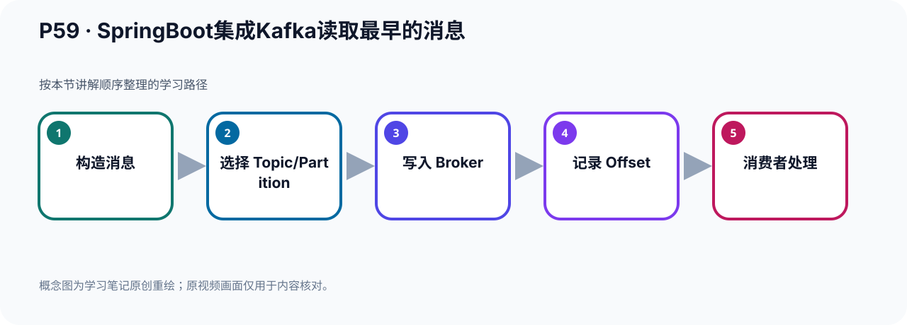
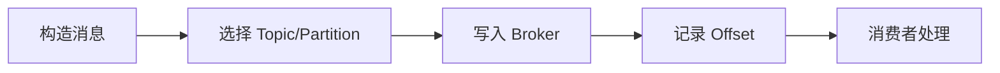

# P59：SpringBoot集成Kafka读取最早的消息

> 笔记编号 59/156 · 时长 06:00 · [打开原视频 P59](https://www.bilibili.com/video/BV14J4m187jz?p=59)

[← P58: SpringBoot集成Kafka读取最早的消息](../05-spring-boot-basics/p058-SpringBoot集成Kafka读取最早的消息.md) · [返回本章](./README.md) · [P60: 手动重置Kafka偏移量offset →](../05-spring-boot-basics/p060-手动重置Kafka偏移量offset.md)

## 先看结论

> 这节把“SpringBoot集成Kafka读取最早的消息”放回消息链路，沿 Producer、Broker、Partition、Offset 与 Consumer 追踪数据和元数据如何流动。它服务于本章目标：搭建 Spring Boot 工程，掌握 KafkaTemplate、消息发送、监听消费、偏移量和对象序列化。

## 老师怎么一步步讲

1. 第 1 步，围绕“SpringBoot集成Kafka读取最早的消息”完成构造消息。
2. 第 2 步，围绕“SpringBoot集成Kafka读取最早的消息”完成选择 Topic/Partition。
3. 第 3 步，围绕“SpringBoot集成Kafka读取最早的消息”完成写入 Broker。
4. 第 4 步，围绕“SpringBoot集成Kafka读取最早的消息”完成记录 Offset。
5. 第 5 步，围绕“SpringBoot集成Kafka读取最早的消息”完成消费者处理。

## 老师的补充说明

下面按原声顺序整理老师的完整讲解脉络。保留原因、案例、对比、操作过程、边界条件和口头提醒；删除重复语气词，并把长口语拆成适合阅读的短段落。

> 技术术语已经过统一校正；仍无法确认的人名或口头英文会保留原意，并通过右侧时间范围返回视频核对。

### 先明确：SpringBoot集成Kafka读取最早的消息要解决什么 · 00:00–01:49

我们配了Ernest配置以后，我们发现我们第一条消息，之前的历史消息还是没读到，这些查的结果是没读到。没读到，那是什么原因呢？我们看一下。它启动的时候，它默认从第一条开始读，但是我们读了是没读到，那这个时候我们有一个注意事项，那我们下一个，看下一个PUT，一个注意。如果之前已经用相同的消费组ID消费过这个主题，那我们那个Hanotomy和那个主题，我们之前洗衣精消费过，对吧？我们之前是消费过的，就是这个主题。

我们第二条消息，第二条消息我们之前是消费过的，你如果消费过，并且CMAK已经保存了这个消费组的偏意量，那你消费过之后来，那么CMAK它就会保存你这个消费组的偏意量，你这个消费组它的偏意量是多少，它CMAK就已经保存了。那么即使你设置了这个Odys，那么这个设置也是不生效的，你用这个消费组已经消费过了，那么CMAK它已经帮你记下了那个偏意量，那个偏意量它已经帮你记住了，对吧？因为你用这个消费组，就说你用同一个消费组ID，你消费过这个主题，我们用了哪个消费组呢？

我们当时用的是这个HanotGlob这个消费组，我们已经消费过这个主题，叫HanotTopic已经消费过了，那么CMAK就记住了你这个消费组，你这个消费组的偏意量，你的这个消费组偏意量是多少，它已经记下了。那么此时，如果你设置这个Odys的话，它是没有用的，配置是不生效的。

### 对比不同情况，明确条件和边界 · 01:52–02:39

因为这个配置它只是说，当Kafka找不到偏意量的时候，才使用这个配置，你才生效。那么Kafka如果能够找到你上次记录了这个偏意量的话，那么你即便设置这个配置，它也是不生效的。只有当你Kafka没有记录过你这个消费组的偏意量的时候，它才有效。那现在你想读到历史消息怎么办？那么就是有两个办法，那么这种情况下你想读历史消息怎么办？你看，两个办法，第一种办法，手动重置偏意量。因为Kafka已经帮你记拿那个偏意量，你记住了，你这个消费组的偏意量，它已经帮你记下来的。

### 继续追踪实现过程和关键调用 · 02:39–03:20

那你把它重置一下，手动重置下偏意量，这是一个办法。另外一个办法，就是使用一个新的消费组ID，两个办法。那现在我现在用同一个消费组，我想去消费这个历史消息，那消费不了。所以就只能说你去重置一下偏意量才可以。那现在我这样，我先用这个方法，就是我先用一个新的消费组去消费，那么这样它就生效了。那又改个消费组的名字，那这个时候我们的消费组就改个名字，之前叫Hanou Group，那我这样叫Hanou Group02，对吧？

我已经改了一个消费组名字，那么此时你这边是个Allist，那这个时候它就可以消费历史消息了。

### 跟着老师操作，并观察运行结果 · 03:21–04:34

那这个时候我们再想这个秘方把命运行一下，好，右键运行它去监听，接受消息，走一下，看一下这个时候能不能把历史消息赌到。那么这个时候你看一下，它明显的把这个辽量去赌到了，你换一个新的消费组，那么就可以赌到这个历史消息，好，那么这个时候你这个配置才生效，才生效了，对吧？才生效啊，是这样的。那现在你看一下，我现在用这个消费组，用这个Hanou Group02，我已经消费过了，那么这个时候Kafka已经记住了你这个消费组它的偏颜是多少了，它已经消费到哪个位置了，它已经记住了。

它已经记住了，所以你这个时候你看，你重新启动，你把它关闭，你看我们这个刚才多两次吧，我们查一下Count F，查一下，是两次啊，你看这地方，它两条处置吧，两条对吧，两条啊，没问题。那现在我们把它关闭啊，现在把它成型关掉，关掉了我现在这个消费组，我已经消费过一次了，是吧？从最早的消息开始消费，你消费过一次了。那么Kafka已经记住了你这个消费组，它的偏颜是多少，它已经记住了，记住了那么这个时候你再消费，那是消费不了了，你即便是从最早的开始消费，那也是不行的。

### 最后验证结果，并收束本节结论 · 04:34–05:56

你这边配件是最早的开始消费，但是也是消费不了的，因为Kafka已经帮你记住了这个偏颜，你这个消费组的偏颜是多少，它已经记住了。这个时候你看，它结果你看，收一下，有没有这个关卡，收一下读取事件，读取事件，你要没收取这个读取事件的关卡，你看没有收到没有结果，没收到，没收到，那就是你再读是读不到的，读不到的。因为你的这个消费组，它已经帮你记下来的它的偏颜是多少，它已经消费到什么位置了，已经记下来的。

比如说，你这个消费组，消费组要组立一个组，你这个消费组，比如说，你现在假设我们现在这里只有一个Partition，就一个分区，它已经消费到我这个位置了，对吧，已经帮你记下来的，消费到你的。那你第二次启动项目的时候，那么它只得从6开始消费，即便是你配了一个Orlist从第一条消费，那也是无效的，也是无效的。除非说，你要像从第一条消费，那你怎么办呢？你可以这样，你就是两个办法，一个就是手动重置添量，一个就是再使用一个新的消费组ID，换一个消费组ID，好，就可以从第一条开始读取。

这就是我们读取最早那个消息，它的一个注意事项。

## 放进整套课

本节属于 **Spring Boot 集成 Kafka**。这一章要解决的是：搭建 Spring Boot 工程，掌握 KafkaTemplate、消息发送、监听消费、偏移量和对象序列化。

这节位于消息链路上。要顺着“发送端—Broker—分区日志—消费端”看数据和元数据怎样流动。

### 记忆路线

```mermaid
flowchart LR
    N0["构造消息"]
    N1["选择 Topic/Partition"]
    N0 --> N1
    N2["写入 Broker"]
    N1 --> N2
    N3["记录 Offset"]
    N2 --> N3
    N4["消费者处理"]
    N3 --> N4
```

## 用在工作里

| 项目 | 内容 |
|---|---|
| 先回答 | 先明确消息从哪里产生、写入哪个 Topic、由谁消费。 |
| 立刻做 | 复现发送、Broker 写入和消费者处理的完整链路。 |
| 留下证据 | 记录 Partition、Offset、序列化结果和消费端输出。 |

## 关键术语

- **Kafka：** Apache 开源的分布式事件流平台，常用于高吞吐消息传递、数据管道和流处理。
- **Topic：** 事件的逻辑分类。生产者向 Topic 写数据，消费者从 Topic 读取数据。
- **Partition：** Topic 的物理分片，是 Kafka 并行度、顺序性和扩展能力的基本单位。
- **CMAK：** Kafka Manager 的社区延续版本，用于集群管理；不同 Kafka 版本存在兼容边界。

## 最容易踩的坑

能发送成功不代表业务处理成功；序列化、分区、确认机制和消费进度需要分别观察。

## 自测

1. 不看笔记，用自己的话解释“SpringBoot集成Kafka读取最早的消息”解决了什么问题。
2. 按顺序复述：构造消息、选择 Topic/Partition、写入 Broker、记录 Offset、消费者处理。
3. 如果运行结果和老师不同，你会先检查哪三个输入或环境条件？

## 学完检查

- [ ] 我能不看视频复述本节完整思路
- [ ] 我能指出关键命令、配置、类或接口的作用
- [ ] 我能解释画面中的输入与输出为什么对应
- [ ] 我读完了老师的详细讲解正文，没有只看路线图和要点
- [ ] 我完成了本节自测或复现实验

## 需要核对原话时

[查看本节带时间戳的完整 ASR](./transcripts/p059-SpringBoot集成Kafka读取最早的消息-ASR.md)。主笔记负责理解与实践；ASR 页面负责逐句完整性复核。
