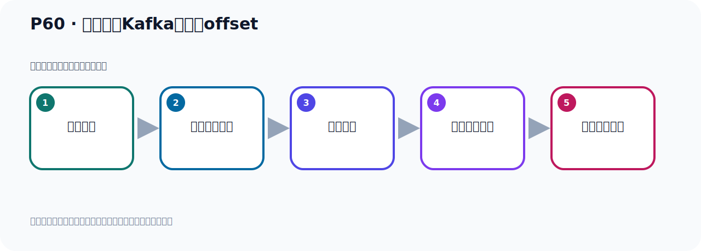

# P60：手动重置Kafka偏移量offset

> 笔记编号 60/156 · 时长 07:25 · [打开原视频 P60](https://www.bilibili.com/video/BV14J4m187jz?p=60)

[← P59: SpringBoot集成Kafka读取最早的消息](../05-spring-boot-basics/p059-SpringBoot集成Kafka读取最早的消息.md) · [返回本章](./README.md) · [P61: 消息消费时偏移量策略的配置 →](../05-spring-boot-basics/p061-消息消费时偏移量策略的配置.md)

## 这节到底讲什么

**核心主题：手动重置Kafka偏移量offset。**

这节围绕位置与进度展开。一定要区分日志中的位置、各副本的末端位置、可见水位和消费者提交进度。
本节属于“Spring Boot 集成 Kafka”这一章；放在全章里看，它的作用是：搭建 Spring Boot 工程，掌握 KafkaTemplate、消息发送、监听消费、偏移量和对象序列化。

## 本节路线

## 老师的完整讲解（按视频顺序校正）

> 下面保留老师的完整讲解顺序，并修正 Kafka、Java、ZooKeeper、
> Topic、Partition、Offset 等常见识别错误。它不是压缩摘要；原始 ASR 在后面单独保留。

### 1. 00:00–01:02

读取最早的消息，有两种方式。首先，使用新的消费组ID，另外一种方式，手动重置片影量。下面，我们看一下怎么手动重置片影量。使用新的ID，我们已经演示过了。我们在这里，把主ID修改一下。修改之后，就变成新的主ID。现在，我们看一下第二种方式，重置片影量。重置片影量，我们可以用这个脚本去操作。就是Kafka里面，它给我们提问这个脚本。它脚本就是用这个胳膊，翻主这个脚本。翻主这个脚本。后面，给你的服务器地址，Kafka的服务器地址。后面，指定这个主。就是你的主是哪个主。然后，后面，指定一个脱屁格，是哪个脱屁格。对吧，哪个脱屁格。

### 2. 01:02–01:56

好，这个Raysight，这个Obsite，然后就是把那个Obsite要重置，加上这个指内。后面，就是你要把它重置到从第一条消息开始读。那你就to list， to list。后面，加个指行就行了。好，然后下面这个呢，就是一样啊，只是说这地方不一样。你这次重置到第一条，那么这个是把它重置到最后一条，Natist，重置到最后一条消息的下一个位置。把它那个Obsite重置到这个位置，去执行。好，那下面我们就把这个人改一下，改成我们真实的，让我们去执行一下。好，这次再执行一下，那就是这方就是改成什么，我们这就是，我们在本地执行，到时候我们就写17就可以了，17.0.0.1，。

### 3. 01:56–02:43

那点点点1，嗯，点1，然后，9092，好，这是我们这个服务器啊，这个服务器这个。好，主的话，我们的主呢，就是这个名字，我们的主呢，叫Hullet-Torbig。我们Torbig啊，啊，这个主啊，主对，主的话就是这个0二啊，现在这个0二，是不是没有消费不讲消息的，我们试一下。现在消费不讲了，对吧，啊，因为之前你消费过了，你看，现在被毒到啊，我们可以用这个去搜索一下，看一下。堵不到了对吧，所以这个主，它已经消费过，所以它已经帮你进入了那个，呃，偏意调了，所以就没法再消费了。好，那我们把这个主名字，等一下这个主名啊，这主名，好，Torbig什么名字呢，Torbig就是这个名字，我们是这个Torbig。

### 4. 02:43–03:23

好，Torbig名字就是这个，是吧，在这个名字，好，从字到最早啊，最早，好，那整个名字就这一段，好，那我们就把这个段执行一下，那我们就切换了呢，我们到这个服务器上，让它打开一个新窗口，那我们到这个U的Nokka-Kavka这个并不录像啊，这里面是吧，执行一下，哪个脚本呢，是Kavka-Grupp这个脚本，Kavka-Grupp，哎，Grupp这个脚本在哪，Kavka-Grupp，分组是吧，哎，看这个脚本是叫Consumer-Grupp啊，Consumer-Grupp，在这个地方，就这个啊，这个脚本啊，很Grupp，。

### 5. 03:23–04:57

好，那么就执行这个脚本，好，执行完了，执行完了以后呢，呃，执行完，啊，执行完是报错了啊，看一下啊，有没有写错啊，呃，如果，但是这个当前的状态是稳定的，我们看一下啊，嗯，不然个错啊，我看看这个错什么意思啊，好，那么他爆了个错来就是，好，那么他这个错来就是这个分配，仅仅能什么重置，如果这个左是不合约的啊，如果这个左是不合约的，。

### 6. 04:58–05:46

未激活的，才可以分配，但是当前这个状态是稳定的，那考虑就是我这个程序开着的啊，那我这个程序开着这里的，我把这个程序停一下，啊，因为这个左现在处于运行中啊，把停掉了，停掉了对吧，好，现在停掉了啊，现在轻一下停掉了，停掉了，停掉之后我们重新再点分配一下，他说你要处于不活动状态才可以分配啊，好，那这个是我们再走一下，然后这个回车执行，好，那么这个时候就执行完了啊，执行完了对吧，好执行完了，你看他这个新的奥尔赛的就是人了啊，现在重置到人这个位置了，好，那就是我们这个左，然后这个Topic，是吧，Partition我们只有一个Partition，只有个屁人啊，这个Partition，好，重置完了，。

### 7. 05:46–06:35

重置完了之后我们这个时候呢，我们可以再执行的代码，之前执行是堵不到这个世界的，好，现在我们的执行，看他能不能堵到这个世界呢，来密封运行一下，能不能堵到数据，好，你看这个时候他可以堵到了啊，可以堵了两条，我们可以搜索一下，呃，这个搜索了两条呢，这个两条结果是吧，两结果啊，好，那我们再关一下，你看，如果你再堵啊，再右键，那再运行，堵都堵不到了，好，这个时候堵不堵不到了，因为他已经堵过了，对吧，已经进入了，进入了那个Offset了，好，那你如果想还要堵到，你重置一下，那要在这地方执行这个命令啊，好，执行，好，执行完了，又重置成这个人了啊，好，那现在你这个成语起头又可以堵了，。

### 8. 06:35–07:21

这个是吧，好，这个成语起头啊，你看右键这个起头，好，应该又可以堵了两条数据，我们搜一下，是吧，两条啊，再两条，好，这个时候我们这个啊，通过这种方式可以重置啊，重置它，好，这是重置到第一条啊，那么下面这个就说你应该图纳提式的，重置到最后，最新的那个消息这个位置，把他那个偏移，偏移量，偏移位置，重置到最新的位置，那就是你下次读消息，就从最新这个位置开始读消息，啊，就是用下面这个命令，下面这个命令，其他地方都一样，就是最终就改了这一个常数，其他常数都是一样的，好，那这就是我们的手动，重置偏移量啊，。

## 关键术语

- **Kafka：** Apache 开源的分布式事件流平台，常用于高吞吐消息传递、数据管道和流处理。
- **Topic：** 事件的逻辑分类。生产者向 Topic 写数据，消费者从 Topic 读取数据。
- **Partition：** Topic 的物理分片，是 Kafka 并行度、顺序性和扩展能力的基本单位。
- **Consumer：** 从 Kafka Topic 拉取并处理事件的客户端。
- **Offset：** 事件在 Partition 中的位置编号，也是消费者记录消费进度的依据。

## 完整原声逐段记录

[查看本节带时间戳的本地 ASR](./transcripts/p060-手动重置Kafka偏移量offset-ASR.md)。主笔记负责可读性和术语校正；ASR 页面负责完整性复核。

## 读完记住

- 本节主题是 **手动重置Kafka偏移量offset**，它服务于本章目标：搭建 Spring Boot 工程，掌握 KafkaTemplate、消息发送、监听消费、偏移量和对象序列化。
- 理解顺序是：消息写入 → 形成日志位置 → 副本同步 → 更新可见水位 → 记录消费进度。
- 学习时要同时核对老师的解释、画面中的配置/代码，以及最终运行结果。

## 最容易踩的坑

“Offset”不是一个全局数字；它必须放在具体 Topic、Partition、消费者组或副本语境中解释。

## 自测

1. 不看笔记，用自己的话解释“手动重置Kafka偏移量offset”解决了什么问题。
2. 按顺序复述：消息写入、形成日志位置、副本同步、更新可见水位、记录消费进度。
3. 如果运行结果和老师不同，你会先检查哪三个输入或环境条件？

## 学完检查

- [ ] 我能不看视频复述本节完整思路
- [ ] 我能指出关键命令、配置、类或接口的作用
- [ ] 我能解释画面中的输入与输出为什么对应
- [ ] 我核对过完整 ASR，没有跳过老师的补充说明
- [ ] 我完成了本节自测或复现实验
