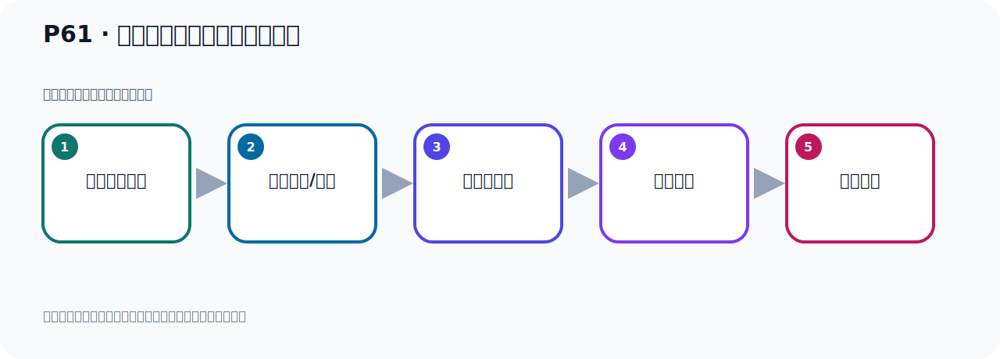

# P61：消息消费时偏移量策略的配置

> 笔记编号 61/156 · 时长 10:10 · [打开原视频 P61](https://www.bilibili.com/video/BV14J4m187jz?p=61)

[← P60: 手动重置Kafka偏移量offset](../05-spring-boot-basics/p060-手动重置Kafka偏移量offset.md) · [返回本章](./README.md) · [P62: Spring Boot集成Kafka发送Message对象消息 →](../05-spring-boot-basics/p062-Spring-Boot集成Kafka发送Message对象消息.md)

## 这节到底讲什么

**核心主题：消息消费时偏移量策略的配置。**

这是一节动手课。不要只记命令，要把前置条件、操作步骤、关键参数和成功信号连成一条验证链。
本节属于“Spring Boot 集成 Kafka”这一章；放在全章里看，它的作用是：搭建 Spring Boot 工程，掌握 KafkaTemplate、消息发送、监听消费、偏移量和对象序列化。



## 本节路线


## 先把三个策略分清

```yaml
spring:
  kafka:
    consumer:
      auto-offset-reset: earliest
```

- `earliest`：没有有效已提交 Offset 时，从最早仍保留的位置开始。
- `latest`：没有有效已提交 Offset 时，从日志末端开始，只接收后续新消息。
- `none`：没有有效已提交 Offset 时直接抛出异常。

最重要的前提是：它们只处理“没有有效 Offset”的情况。如果消费组已经提交过进度，重启后
仍从已提交位置继续，不会因为写了 `earliest` 就每次重放。

## 老师的完整讲解顺序（ASR 辅助复核）

> 下面按时间顺序保留经过基础术语替换的 ASR，方便核对老师是否提到某个细节。
> 人名、命令、代码和英文参数仍可能识别错误；准确结论以本节白话说明、代码块和实操速查表为准。

### 1. 00:00–01:09

好，那接下来我们继续看一下PPT。我们看一下这个消息消费时那个偏一调它的一个策略，策略的配置。偏一调策略的配置。它的配置就是我们在代码中，我们在Spring Boot中，我们是配这一段对吧。然后这个地方就是配偏一调的，好，把这个纸改一下。偏一调。那我们就是在我们代码中，我们看一下，就在这地方，配偏一调。是吧？在这地方。好，那么这个地方它配偏一调，它可以配这么四个纸，有这么四个纸，这四个。我们原来给大家配了一个是这个纸，那么这是读历史消息，从第一条消息开始读，这是这个配置。那我们分别看一下这四个配置。首先第一个配置就是我们这个Earlist，这个我们已经配置过了，它就是自动把这个偏移量从字为最早的那个偏移量，从零开始读，读我们的数据。

### 2. 01:09–02:00

好，这是最早的，这个我们前面已经用过了。好，那么Nartist的，这就是他自动把这个偏移量从字为最新偏移量，最新偏移量是什么偏移量呢？就是看这个图啊，就是最新偏移量就是这个位置。比如说你这个，假设你之前到这个5这里，那么最新的应该是6，最后那个，最后那个就是最新的偏移量。假设你之前已经把这个，读到了这个位置，是吧，你把这小已经消费过了，你消费过了，那么你这个，你这个组的这个消费者，他就记这个偏移量，那偏移量来，最新偏移量应该就到6，那么下次就读6这个位置，因为之前已经读到5这个位置了，那下一次读，就读6这个位置，6这个位置就是最新的这个偏移量，好，这是最新偏移量了。

### 3. 02:05–03:10

好，那么最新偏移量呢，我们用个代码，我们试一下，跑一下，这个之前没用过，我们用一下，这个Nartist的最新的啊，好，这个字，最新偏移量。那这个字的话，我们预期代码啊，现在呢，我们预期一下，好，那么这个预期他就消费，是吧。好，那现在我们就预期代码，那就是从这个，在我们消费者，是吧，在他消费组，啊，消费组去读取这个消息，那我们这个时候又先预期一下，好，预期看一下，他能不能消费到呢，现在，他从最新开始读，那应该是读不到的，啊，读不到的，因为之前我们这个组啊，他已经消费过这个消息，啊。那么他已经把偏移量，已经制到那个，呃，最新的位置了，那你从最新开始读，那就是把之前的，呃，消息是读不到的，啊，之前的消息读不到，你如果现在再发一个新消息，那我可以读到，比如说我现在发个新消息啊，那我在这个，这个地方发个新消息，那他可以读到，好，这我们发一个，发个新消息。

### 4. 03:10–04:09

他从最新位置开始读，好，那我这个新消息就发出去了，就发完了，你那这个字印完了，打勾了，对吧，字印完了，没有报错啊，好，那这个时候你看一下我们这个消费者这边，哎，你看这个读取事件，你收回一下，你看他找到一条消息了，就这个消息，他读到了，之前找不到，现在找到了，所以他从最新一个消息开始读，啊，最新一个消息开始读，好，这是我们这个配置，那然后呢，就是我们的，呃，呃，那是怎么意思呢，如果没有给这个消费组，找到以前的偏移量，折向消费者，抛出一层，就是你这个消费者组啊，你这个消费者组啊，有没有，在这个Kafka里面，有没有这个偏移量，就以前有没有纯偏移量，如果有偏移量，那有，那有正常的，啊，可以消费，你没有偏移量的话呢，他得抛一层，啊，你配置这个的话，就是你没有偏移量，他得抛一层，。

### 5. 04:10–05:00

那你有偏移量，你有偏移量是怎么办呢，你有偏移量，那么从这个偏移量的，呃，这个后面的位置开始堵，啊，后面的位置开始堵，那现在我们看一下啊，我们现在这个，呃，这个组，我看一下啊，我们现在这个组是吧，他有偏移量吗，他有啊，因为之前不是消费库吗，他肯定是有偏移量的，对吧，有偏移量的，你这个时候你配上他是不会报错的，不会报错，配他啊，好，配他之后我们这个时候，起头我们代码啊，这个密封的起头，好，把这个东西先关一下，好，密封起头，直接在你右键啊，运行一下，那这个时候他是不会报错的，但是他堵不到消息，因为他是从，他也像是从最新位置开始堵，他不会报错，你看，呃，你这个消息消费他没堵的东西，。

### 6. 05:00–06:02

是吧，从你的，呃，也就是他从你，你之前记录的这个偏移量的位置的下一个位置开始堵，如果说你这个消费组，原来连这个位置偏移量都没有，但他爆一层，啊，他爆一层，你如果有偏移量，那我这种策略就是从你这个偏移量的下一个位置开始堵，所以我现在配的是这个，呃，这个，对吧，但是如果说我现在这个发个消息，那么他可以堵到，我发消息了，我这个时候发一个消息，走一下，好，那我这个发完了，应该，都是正常的啊，走一看一下，都正常的，这不，这上面这个不是异层啊，这个是他那个配置，这我们前面给他看过，他这个配置，啊，这是一个，这是一个配置啊，这不是异层，不是异层，好，发完了之后你看这边堵到了没有，你看这个读取事件，这个，你看他堵了这个消息的，堵到了，对吧，。

### 7. 06:03–06:54

所以这个浪的话呢，他的意思就是说，呃，你当前这个消费组，也就是你这个消费组，如果他有偏移量，好，那我就从这个偏移量的下一个位置开始堵数据，是吧，如果说你这个消费组都没有偏移量，那我就包一层，他会包一层，啊，那你看我给你测试一下，如果说我这番这个消费组，比如说我加个，呃，00009，那现在这个消费组是一个全新的消费组，这个全新消费组，他在Kafka中肯定是没有偏移量的，因为他是这个全新的消费组，他没有偏移量，那此时你用这个浪，那他就报错，包一层，来我们测试一下，那你启动的时候呢，运行就包一层啊，那这个是没，呃，去消费一下，我们想到没方法去消费，呃，消费，那么他这个坚定，呃，这个地方坚定消费的时候呢，这个组是个全新的，。

### 8. 06:55–07:45

那你用浪这个策略，他报错了，你看，上面已经爆一层了，在一层了，错误是吧，呃，一个塞位型，啊，一个错误啊，是吧，没有定义这个offside，对吧，就是你这个消费组没有定义offside，没有定义offside的话，那你这个时候你是不能用这么浪这个策略的啊，是不能用浪这个策略的，好，那现在我对这个消费组，如果说对这个消费组是吧，我做一个什么，我给他设置一个，设置一个这个这个offside的偏移量，那我可以这个用这个方式重置一下吧，用这个方式重置一下，我只要把这个组重置一下啊，那这个组叫什么，零二，零二然后面加零零九零二零零九是吧，后面加个零零九，好，那我现在把这个消费组，我给他重置一下啊，重置一下，重置到他最早那个位置，那此时他是不是就有这个，。

### 9. 07:45–08:43

片一掉呢，他有了，他片一掉相距是零吗，把这个消费组重置一下，好，那我重置完了，重置完了以后，我们现在来，再去运行，运行的话那么他这个浪的话，从来也开始读啊，因为你之前把那个消费组，你这为零了啊，到从零这为止开始读，那就开始从零开始读嘛，我会读嘛，是吧，那你消息都可以读的，对吧，好那这次你看我们右下运行没有方法，他就可以读的啊，消息可以读的，你看我们之前所发的几个消息他都可以读的，我们之前有几个消息，我们可以看这个Kafka这里点一下，Kafka这个Topic，刷新一下啊，刷新，我们之前发了四条消息的啊，有四条消息对吧，有四条消息，所以他把这四条消息都帮我们读到了啊，读到了，所以你重置之后，你有片一掉呢，那么就从你这个片一掉，这个位置，开始读消息啊，开始读消息，。

### 10. 08:43–09:38

好，这就是我们这个策略，好那么最后个策略看一下，这个策略是什么策略呢，就是这个策略那就是一个筛不行这个策略，一个筛略他抛一层啊，那我们这样这个策略，这个策略啊他目前是不支持的，目前我们这个史律Kafka是不支持的，啊他这个这个是直接抛一层，但是目前是不支持的，你看一下，我们给这个策略之后啊，我们去运行一下代码啊，诱界呢，这个就运行一下，运行之后呢，他就直接抛一层的啊，抛一层这个提示的原因就是什么，他提示的是不合法的值的一个异常，我们这个配置，他说，他说你这个配置，什么reset，offside是吧，reset他说，这个史军必须是其中的一个，哪几个呢，只能是这三个里面的其中一个，。

### 11. 09:39–10:05

那tist，onist和na，一个sepulchre他是不支持的，他说你这个四五层的词啊，必须是，必须是三个，啊，这个三个里面的其中一个，啊你不利用一个sepulchre，所以一个sepulchre他直接抛一层，但是呢，他是目前这个史律Kafka是不支持的，啊，好，那么以上呢，就是我们这个，消息消费是那个偏意量，那个策略的一个配置，可以配置这么三个值，好，这三个值。

## 关键术语

- **Kafka：** Apache 开源的分布式事件流平台，常用于高吞吐消息传递、数据管道和流处理。
- **Topic：** 事件的逻辑分类。生产者向 Topic 写数据，消费者从 Topic 读取数据。

## 完整原声逐段记录

[查看本节带时间戳的本地 ASR](./transcripts/p061-消息消费时偏移量策略的配置-ASR.md)。主笔记负责可读性和术语校正；ASR 页面负责完整性复核。

## 读完记住

- 本节主题是 **消息消费时偏移量策略的配置**，它服务于本章目标：搭建 Spring Boot 工程，掌握 KafkaTemplate、消息发送、监听消费、偏移量和对象序列化。
- 理解顺序是：确认前置条件 → 执行安装/配置 → 启动或应用 → 观察输出 → 排查失败。
- 学习时要同时核对老师的解释、画面中的配置/代码，以及最终运行结果。

## 最容易踩的坑

只照抄命令而不核对当前目录、版本、端口和配置文件路径，最容易造成“命令没报错但服务不可用”。

## 自测

1. 不看笔记，用自己的话解释“消息消费时偏移量策略的配置”解决了什么问题。
2. 按顺序复述：确认前置条件、执行安装/配置、启动或应用、观察输出、排查失败。
3. 如果运行结果和老师不同，你会先检查哪三个输入或环境条件？

## 学完检查

- [ ] 我能不看视频复述本节完整思路
- [ ] 我能指出关键命令、配置、类或接口的作用
- [ ] 我能解释画面中的输入与输出为什么对应
- [ ] 我核对过完整 ASR，没有跳过老师的补充说明
- [ ] 我完成了本节自测或复现实验
