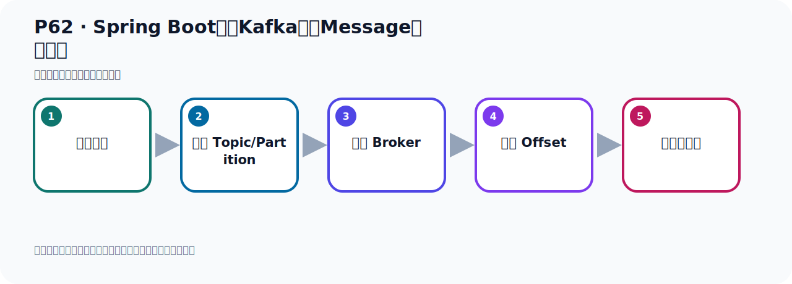
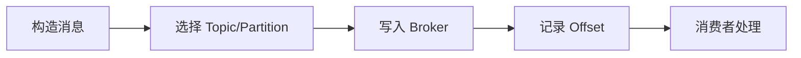

# P62：Spring Boot集成Kafka发送Message对象消息

> 笔记编号 62/156 · 时长 07:42 · [打开原视频 P62](https://www.bilibili.com/video/BV14J4m187jz?p=62)

[← P61: 消息消费时偏移量策略的配置](../05-spring-boot-basics/p061-消息消费时偏移量策略的配置.md) · [返回本章](./README.md) · [P63: Spring Boot集成Kafka发送ProducerRecord对象消息 →](../05-spring-boot-basics/p063-Spring-Boot集成Kafka发送ProducerRecord对象消息.md)

## 这节到底讲什么

**核心主题：Spring Boot集成Kafka发送Message对象消息。**

这节位于消息链路上。要顺着“发送端—Broker—分区日志—消费端”看数据和元数据怎样流动。
本节属于“Spring Boot 集成 Kafka”这一章；放在全章里看，它的作用是：搭建 Spring Boot 工程，掌握 KafkaTemplate、消息发送、监听消费、偏移量和对象序列化。

## 本节路线

## 老师的完整讲解（按视频顺序校正）

> 下面保留老师的完整讲解顺序，并修正 Kafka、Java、ZooKeeper、
> Topic、Partition、Offset 等常见识别错误。它不是压缩摘要；原始 ASR 在后面单独保留。

### 1. 00:00–00:51

好，那接下来我们继续往下看一下，好，我们看一下，接下来我们看一下这个Spring Boot集成Kafka开发了手这个生产者发送消息的一些方法。那么这个生产者发送消息我们有时候也叫做生产者构端向Kafka的主题Topic中写入世界，那么它是一个意思。那么我们生产者构端向Kafka发送消息的话，它主要是有这么十个方法，生的生的这十个方法。上面这生的这有六个，加上下面这个生的Default有四个，总共一起来是十个方法。好，那我们看一下这几个方法，主要是看一下它里面的参数，我们在开发的时候该怎么去传这样的参数。好，那我们打个代码，那这里我们有写代代码。

### 2. 00:52–01:50

首先我们是看生产者发消息，在生的者写个方法，那你把这个方法先考备一份。考备一份之后我们就要2，这个方法叫2。那它发消息的话也是用Temple Letter to 发，只不过里面参数不一样，之前我们用这个参数，好，先我们看一下它有什么方法来看一下。点生的，生的那么它有六个方法，好，这个方法我们用过了，还传一个数据，我们用过了。好，我们下面给大家看一下哪个方法来，我们给大家看一下这个方法，这个方法没用过的话里面传一个Message。好，那么看这个方法，那它里面需要一个Message。那么这个Message是一个对象，点一个这个对象，它需要传一个Message，我们点一个去看一下，是哪个方法呢？

### 3. 01:50–02:47

就是这个方法点一个，需要传这么个对象，这个Message，对吧？好，在Message那我们要传这么个对象，那就需要转了一个这个对象，那么这个对象怎么准备呢？这个对象我们导入一下，导这个类，那么这个Message是哪个Message呢？就是我们那个Spring Boot瑞里面的这个Message，就这个类，什么类Message，好，就它，好，那么这个Message我们怎么去创建这个Message呢？这个Message点一个去看一下，它是一个接口，这个接口，那么它有实现类，空脚H，它有实现类，是吧？它还有它是吧？好，那我们在创建这个对象的时候，并不是用它的实现类去创建，是用个什么？用个构建器模式，构建器模式就是有个MessageView的，MessageView的，这个View的，它点，那我们首先要给这个消息，这个是消息吗？

### 4. 02:47–03:17

那么消息里面放个数据，那么数据怎么办呢？数据就位置，Black Note，用这个方法，好，这就放个数据，放数据我们放个字幕转，比如说Hello，是吧？Kafka？好，这我们的数据，数据放了，然后呢，最终就bill一下，它这个构建器模式，这个构建器模式，好，这是，通过构建器，构建器这个模式，创建，创建我们这个，这个，。

### 5. 03:17–03:47

OurOurOur。

### 6. 03:47–04:42

下面就一个设置你看这些设置里面没有设置这个叫什么Topic这个方法你看比较叫set没掉set啊set的头set怎么掐了这些东西但是没有Topic那他怎么放呢set的hide这样就行了然后这个hide里面给放个头那么这个hide怎么放呢这个hide是这样的就是我们看这个方法里面点那个方法然后点上一次接口接口了他说这个message这个方法的接口啊这个message他说这个message你可以通过头里面给他放Topic就是个头了通过这个谈出那就是这个头了这个头的k也是他值什么呢值我们放个Topic那Topic我们叫测试的TopicTopic那么这个就是我们Topic的名字。

### 7. 04:42–05:32

通过头啊再起流头在这个头里面hide中这个放置了放置这个TopicTopic的名字就可以了好然后bue等一下bue等一下就是创建一下这个message对象好然后把message发出去就可以了好那么这个方法他是犯行的犯行的那么这个方法是犯行的就是说你这个消息里面放的是什么类型的消息我们是放的字物串所以写个字物串型的因为我们的消息是字物串所以这边犯行写个字物串就可以了好那接下来把这个message发出去那么发出去之后呢他就把这个消息发哪去了发到这个Topic下去了发这边去了好那我们这个发出消息就写好了这种没有这个方法传一个message对象。

### 8. 05:33–06:31

好那么这个方法竟然写好之后我们可以在这边测试一下那么把这个关掉咱们测在这个task的类测试一下好测试一下呢我们在这里就写个太大02测试一下太大02测一下我们掉下两个方法来掉下我们这个二那个方法掉下二那个方法好那这个是我们直接在运行下看看消息能不能发出去能不能发出去好了这个时候呢我们运行下右键然后运行好运行之后呢你看这个鸟是打打了一个沟那说明他消息就发出去了这边没有异常你看这整个对吧好发出去那么消息咋去了呢我们看这个我们这个这个地方点着好点三之后呢你看我们的刷新啊刷新看一下刷新刷新那我们这里一个探子脱米个太多那个好太多那个为什么这边有两个消息的。

### 9. 06:31–07:24

这是因为我之前啊在我讲课之前我当时跑了一遍这个代码我当时也发过发过一个消息方向消息所以他有两个或者说我们换个脱米个给他测试一下换个脱米个测试一下比如说我们这个脱米个呢太刹-02好吧刚零二好我们用这个零二的脱米个发一个消息你看一下那么他到时候就一个消息啊好这个是右键的发送一下好发送完了对吧没有异常没有异常我们看这个Kafka这里我们这里看一下还没出来我们刷新一下啊点刷新目前你看还没有这个零二我们点在这边点一下刷新好这个零二有了以后你看点击点击你看他现在是发了一个消息对吧发了一个消息啊这就是我们这个方法通过这个方法来发送消息啊。

### 10. 07:24–07:38

就是传一个message残属那残属可以这样的构建啊这是构建他的数据这是构建他的他这个脱米个名字啊那再是我们啊这个通过这种方式发什么消息。

## 关键术语

- **Kafka：** Apache 开源的分布式事件流平台，常用于高吞吐消息传递、数据管道和流处理。
- **Topic：** 事件的逻辑分类。生产者向 Topic 写数据，消费者从 Topic 读取数据。

## 完整原声逐段记录

[查看本节带时间戳的本地 ASR](./transcripts/p062-Spring-Boot集成Kafka发送Message对象消息-ASR.md)。主笔记负责可读性和术语校正；ASR 页面负责完整性复核。

## 读完记住

- 本节主题是 **Spring Boot集成Kafka发送Message对象消息**，它服务于本章目标：搭建 Spring Boot 工程，掌握 KafkaTemplate、消息发送、监听消费、偏移量和对象序列化。
- 理解顺序是：构造消息 → 选择 Topic/Partition → 写入 Broker → 记录 Offset → 消费者处理。
- 学习时要同时核对老师的解释、画面中的配置/代码，以及最终运行结果。

## 最容易踩的坑

能发送成功不代表业务处理成功；序列化、分区、确认机制和消费进度需要分别观察。

## 自测

1. 不看笔记，用自己的话解释“Spring Boot集成Kafka发送Message对象消息”解决了什么问题。
2. 按顺序复述：构造消息、选择 Topic/Partition、写入 Broker、记录 Offset、消费者处理。
3. 如果运行结果和老师不同，你会先检查哪三个输入或环境条件？

## 学完检查

- [ ] 我能不看视频复述本节完整思路
- [ ] 我能指出关键命令、配置、类或接口的作用
- [ ] 我能解释画面中的输入与输出为什么对应
- [ ] 我核对过完整 ASR，没有跳过老师的补充说明
- [ ] 我完成了本节自测或复现实验
