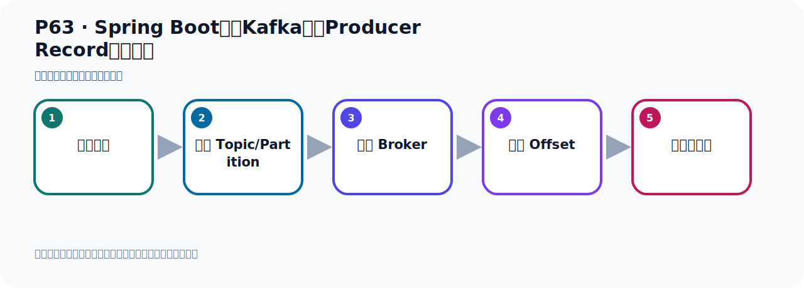
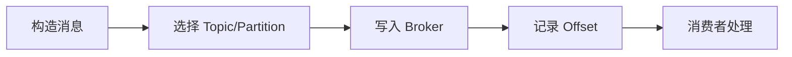

# P63：Spring Boot集成Kafka发送ProducerRecord对象消息

> 笔记编号 63/156 · 时长 12:00 · [打开原视频 P63](https://www.bilibili.com/video/BV14J4m187jz?p=63)

[← P62: Spring Boot集成Kafka发送Message对象消息](../05-spring-boot-basics/p062-Spring-Boot集成Kafka发送Message对象消息.md) · [返回本章](./README.md) · [P64: Spring Boot集成Kafka发送指定分区的消息 →](../05-spring-boot-basics/p064-Spring-Boot集成Kafka发送指定分区的消息.md)

## 这节到底讲什么

**核心主题：Spring Boot集成Kafka发送ProducerRecord对象消息。**

这节位于消息链路上。要顺着“发送端—Broker—分区日志—消费端”看数据和元数据怎样流动。
本节属于“Spring Boot 集成 Kafka”这一章；放在全章里看，它的作用是：搭建 Spring Boot 工程，掌握 KafkaTemplate、消息发送、监听消费、偏移量和对象序列化。

## 本节路线

## 老师的完整讲解顺序（ASR 辅助复核）

> 下面按时间顺序保留经过基础术语替换的 ASR，方便核对老师是否提到某个细节。
> 人名、命令、代码和英文参数仍可能识别错误；准确结论以本节白话说明、代码块和实操速查表为准。

### 1. 00:00–01:02

接下来我们继续来看一下Kafka发送消息的发送方法。刚才是用了Send的Message对象，接下来我们再来写一个方法，考背一端这个方法。这个方法我们继续叫Send，Send这个方法。那么也是用模板类去发送，点一下Send，Send它有六个方法，刚才这个方法用过了。接下来给它用过这个方法，看看这个方法该怎么使用。这个方法里面传一个参数叫ProducerRecord、生产者纪度，它是个犯行对象，Record。好，我们用这个方法看看该怎么使用。我们这个地方调查发送，点进来看写代码。在这个地方传一个ProducerRecord传个这个对象，它是个犯行的。

### 2. 01:02–01:53

我们在这里也要准备一个这个对象，好，那么这个对象我们就看一下准备一个Record的这个对象传进来。那么这个对象点进去看一下，它是一个类，它是类，就是一个生产者纪录类。那么它里面有这边一些字段，比如说主题，什么哪个主题发到哪个主题上，在两个分区，还有它它请那个头部信息，还有key和value，就是说我们这个Kafka的数据啊，你是可以给它设置一个key的，可以给它设一个key。也就是说你像Kafka发的那个消息，它是可以设一个key的，可以指定一个key，但是你也可以不指定key。好，这个value就是它那个消息的那个具体类种，比如说Hello，Kafka，那么这个字不串，就是消息类种。

### 3. 01:54–02:42

好，那么还有个就是时间戳，这个时间戳就是你生产者发这个消息的时候，这个时间，什么时间发这个消息，可以带一个时间，带一个消息的时间。那么到这个消息我们知道它是什么时候发的，好，那么这个对象它有这么一记参数，对吧。好，那么整个参数我们就需要什么呢，创建出这个对象，创建出这个对象。那这对象这里面有个范围形象，k和value，这个key和value其实就是什么，就是你这个key和这个value，就是你发生的这个消息是什么类型的。还有就是这个消息你想给它设个key，这个key是什么类型的。那这个key我们给它设一个使据类型，我们这个使据。好，这个发那个消息类种我们也是个字不串的，我们使用了字不串，也是使用了使据。

### 4. 02:43–03:37

好，那么这个对象怎么购建呢，我们之前购建这个消息对象我们用的是用build模式，用的是购建器模式。那这个对象它有没有购建器模式呢，build没有这个类，所以它的购建没法用购建器模式去购建，因为它这里面的字段并不多啊，它这个要购建的话它不是很多，所以它希望我们人工去指定一下，所以它没有给我们写购建器模式。而我们之前这边这个购建还是挺多的，你看它这个方法里面你点一下的时候，点一下，你看它可以购建很多东西啊，它里面好多方法嘛，都可以购建嘛，所以它字段比较多一点啊，它给我们提供了一个购建器模式。当然这个地方呢，它也可以给我们提供，只是它在马中没有提供，没有提供我们就没法去用购建器模式，那这个时候我们只能用一个对象啊，好了，用一个，用一个对象，是吧。

### 5. 03:37–04:05

用一个对象，那么你6的时候这个类，它购建器你看啊，购建器就是这些嘛，那么这些称数比较少，最长的购建器就是上面这个，它最多。那么它报告一个参数，两个，三个，四个，五个，六个，六个参数，那就是刚好使它这里面的，这个对象里面的它在一个，两个，三个，四个，五个，六个，刚好这六个字段嘛，是吧，六个参数那就是它的这个参数，是吧，六个。好，那我们分别传一下，六个参数，那我们传一下，放合传一下，点一来，六个参数那就是这个，好，第一个是Topic，那我们把这个先渴问一下这个，对吧，我们的参数是这些啊，参数是这些，好，那Topic这个好办啊，第一个参数Topic，Topic我们就写个呢，Topic我们就，因为我们之前这个Topic，就叫零二，好，这Topic，这个几个，这�。

### 6. 04:34–05:24

解决了，然后第二个就叫扒地形，分区，分区我们写个零吧，我们默认在零分区上，我们现在就一个分区，对吧，就零，然后时间戳，时间戳，就这个消息发出去之后，什么时候发的，时间戳，那么这个呢，我们可以写个当前时间的好秒数，它时间戳，它这个浪型啊，所以当前时间好秒数就可以了，好，这个key，给这个消息一个key啊，这个计调我们写一个，这个叫k1吧好吧再来个k啊好然后他直直就有什么消息啊直消息那么行Hello哎呀Kafka好这么消息对吧好最后一个一table一table然后里面是没有一个hide这个内心啊好那么这个产生怎么办呢这个产生说啊。

### 7. 05:24–06:10

其实就是他里面这个产生哪个呢就是他要装个hide是吧这个hide就是就是我们这东西啊他其实有一个这个内心你看这个hide点进去看一下你看他是不是记成一table里面是hide这个内本来就是这个内心就这个内心是吧他记成他的记成他啊记成这个内本来是我们接力开的啊这个接力开的可叠在的对吧接力开的好我们这个内记成他所以我们这个地方既然我们这个内是记成他的那我们这个地方是吧这个参数我们是不是可以可以直接用我们这个参数啊用这个内啊哎可以那么这个内我怎么办呢我怎么冲着这个内好那今天呢我需要准备一个这个内准备一个这个参数hide是。

### 8. 06:10–06:58

好准备一下至于它是多少我先不知道我先放这里好然后把它倒入一下倒入是吧倒入的话这个倒哪一个呢这十不论啊这个这个是注解这个肯定不是是什么上一不是这个是这个是这个是一个注解啊这个是个注解你看点进去看一下这注解肯定不行返回一下啊好那肯定就是上面这个呢就对上面这个啊就这个是吧这个接口Kafkahide啊这个这个内行啊这个内行然后倒进来之后我们这边传这个hide就可以了好那这个参数我们传闻了传闻了今天我们解决一下这个这个内他这个hide是什么创建对吧好点进去之后呢他这个接口接口看一下他接口那么他实现内呢就是这个required hide。

### 9. 06:58–08:07

hide是在他实现内好是Kafka里面提问了一个内好这个内那么他就相当于是要用这个内去创建了他就这个内他实现了好那像有六这个内吧六这个内好那也就是说我在这边啊是不是六一个这个内啊对吧六这个内那么六这个内的时候这个内各个系列是空的啊是空的那我们要给他这个六完之后他就在这个内容里面要放一些信息啊也在这个required hide他里面是放什么的就这里这个这个hide是他里面是放一些那里面呢是放一些这个一些这个信息到时候呢到时候到时候对吧消费者接收该消息后接收到该该这个消息后可以呢拿到这拿到这个hide里面放的信息可以拿到hide里面。

### 10. 08:07–09:04

放的信息是吧你可以到时候可以拿到那在这里面我们可以放一些信息比如放一个他里面掉方法啊就掉ad 方法也可以的放信息那么这个信息呢我们就用建制队的方式放放一些信息信息是个建制队信息是建制队是kvalue建制队是吧建制队好那我们放kvalue放比如说我举个例子我放一个用户的手机号这是建那么只好写个手机号好先识别写得很好但是他这个放进去之后这个方法他里面要要这个beta入住数组是吧需要beta入住那我们这边怎么办呢有getget一下get一下好那我们就拿一个get的beta数组这样就这几个方法都可以了这是指的一个编码那我们指的youtube不youtube8。

### 11. 09:04–10:01

用这个方法或者你不指的一编码用这个方法对吧这样再反过一个字节数组好点他好这样我们就是放了这个手机号放了这个这是建这是建后面这是直好这是你放了个这个头里面放这个信息到时候消费者接受到这个交易之后他可以从头里面可以拿出这个信息当你这个你不只放一个你可以放多个你可以再放比如说再放是吧放吗比如说假的你放个订单号all的id放订单号订单号比如说是比如说 od 什么假的叫 od 什么一个订单号要好这么订单号然后get一下这边放个订单号好那这样的话你就在这个头里面放了个信息到时候呢消费的接受消息之后可以从头里面拿到这个两个信息你可以把这个消息里面放一个特殊的。

### 12. 10:01–10:49

一些一些标记一些东西是吧到时候消费者可以拿到这些标记这些信息好完了之后那我们这个与扩的对象就固定好了固定好之后调这个方法剩下发送就可以了哎就可以了是吧好那么这方面有个警告我们可以这边可以加一个这个犯罪的一个标记就可以了好那么这就是我们呢通过这个方法发送发送一个Producersrecorder对象然后这里面有个headerheader就是这个他是放一些限制队的一些信息这个建议队你自己定义根据与业务需要你放一些特殊的一些标记放进去到时候消费者可以拿到这些标记对吧好那么放完之后呢我们下面就开始把这个方法运行一下啊把其他地方关一下。

### 13. 10:49–11:44

关一下我们测试一下这个方法这个方法叫3我们在这个地方测试一下测一下3这个方法看一下他能不能发出去那再放个3这是3这个方法好那么他发哪去了看一下他是发到这个02这个这个托比卡那目前我们看一下02托比卡里面几个消息啊再刷新一下目前只有一个啊只有一个现在我们去发一个那么待会就有两个了好那我们再去发一个另外这个方法用键的运行一下好运行一下好运行完了是吧都正常的没有抱错啊正常的好这时候呢我们这个时候看一下Kafka这边这边我们刷新一下之前是一个我们这个时候在点上面这个刷新刷新刷新之后我们这个时候你看消息有两条消息的他的这个这个outside一到二了。

### 14. 11:44–11:55

是吧再说我们的消息就发成功了好这是我们采用这种模式啊传一个这个Producer record这个对象然后发送消息。

## 关键术语

- **Kafka：** Apache 开源的分布式事件流平台，常用于高吞吐消息传递、数据管道和流处理。
- **Topic：** 事件的逻辑分类。生产者向 Topic 写数据，消费者从 Topic 读取数据。
- **Producer：** 向 Kafka Topic 发送事件的客户端。
- **ProducerRecord：** Kafka 原生生产者消息对象，可明确 Topic、Partition、key、value 和 headers。

## 完整原声逐段记录

[查看本节带时间戳的本地 ASR](./transcripts/p063-Spring-Boot集成Kafka发送ProducerRecord对象消息-ASR.md)。主笔记负责可读性和术语校正；ASR 页面负责完整性复核。

## 读完记住

- 本节主题是 **Spring Boot集成Kafka发送ProducerRecord对象消息**，它服务于本章目标：搭建 Spring Boot 工程，掌握 KafkaTemplate、消息发送、监听消费、偏移量和对象序列化。
- 理解顺序是：构造消息 → 选择 Topic/Partition → 写入 Broker → 记录 Offset → 消费者处理。
- 学习时要同时核对老师的解释、画面中的配置/代码，以及最终运行结果。

## 最容易踩的坑

能发送成功不代表业务处理成功；序列化、分区、确认机制和消费进度需要分别观察。

## 自测

1. 不看笔记，用自己的话解释“Spring Boot集成Kafka发送ProducerRecord对象消息”解决了什么问题。
2. 按顺序复述：构造消息、选择 Topic/Partition、写入 Broker、记录 Offset、消费者处理。
3. 如果运行结果和老师不同，你会先检查哪三个输入或环境条件？

## 学完检查

- [ ] 我能不看视频复述本节完整思路
- [ ] 我能指出关键命令、配置、类或接口的作用
- [ ] 我能解释画面中的输入与输出为什么对应
- [ ] 我核对过完整 ASR，没有跳过老师的补充说明
- [ ] 我完成了本节自测或复现实验
