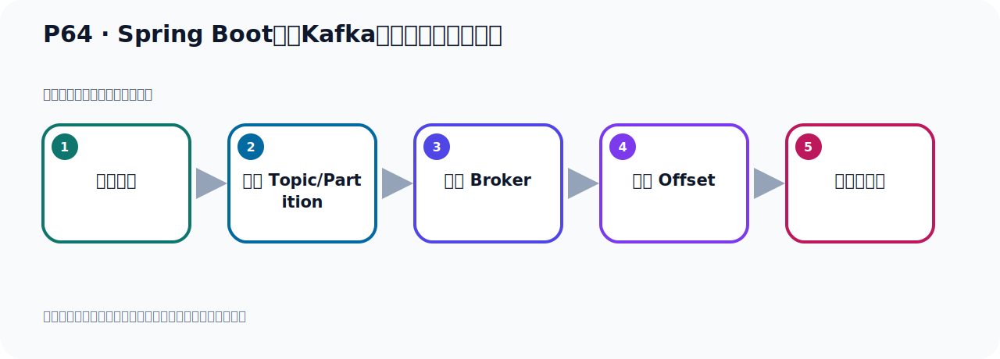
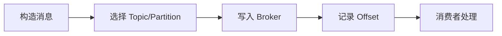

# P64：Spring Boot集成Kafka发送指定分区的消息

> 笔记编号 64/156 · 时长 04:14 · [打开原视频 P64](https://www.bilibili.com/video/BV14J4m187jz?p=64)

[← P63: Spring Boot集成Kafka发送ProducerRecord对象消息](../05-spring-boot-basics/p063-Spring-Boot集成Kafka发送ProducerRecord对象消息.md) · [返回本章](./README.md) · [P65: Spring Boot集成Kafka发送默认topic消息 →](../05-spring-boot-basics/p065-Spring-Boot集成Kafka发送默认topic消息.md)

## 这节到底讲什么

**核心主题：Spring Boot集成Kafka发送指定分区的消息。**

这节位于消息链路上。要顺着“发送端—Broker—分区日志—消费端”看数据和元数据怎样流动。
本节属于“Spring Boot 集成 Kafka”这一章；放在全章里看，它的作用是：搭建 Spring Boot 工程，掌握 KafkaTemplate、消息发送、监听消费、偏移量和对象序列化。

## 本节路线

## 老师的完整讲解（按视频顺序校正）

> 下面保留老师的完整讲解顺序，并修正 Kafka、Java、ZooKeeper、
> Topic、Partition、Offset 等常见识别错误。它不是压缩摘要；原始 ASR 在后面单独保留。

### 1. 00:00–01:15

接下来我们继续看一下生产者发动消息，再来一个方法试，方法试发生消息，也是用Template去发生消息，然后调渗渗渗方法。那么生产方法我们看一下，这些方法里面我们稍微看一眼。现在这个方法看过了，这个方法看过了，是吧？我们拿长点，这个能不能往左边再拉一下。好，那没有了啊。好，这里我看过，这里我看过。那么下面这几个方法，那有四个是吧？一个，两个，三个，四个。这个四个方法其实我们就找一个参数最多的就可以了。对吧？你比如说这个方法，它就一包衡了，你也不想要，你下面的所有参数，你看，Topic是一样的吧？这个Partition，你看，这个Partition包括了吧？你上面你看，这个方法，这个方法我已经用过了，这个方法我已经用过，给一个Topic，给一个数据，是吧？好，它包含了这个K，你看，它包含K吧？你再包含K，你再包含K。好，然后它包含一个数据，那你包含一个数据，那你这边一个包含一个数据。

### 2. 01:15–02:07

所以你只要把这个方法看一下就可以了。它参数最多，下面这个方法你知道它怎么用，那你下面这个方法参数还少一些，那就更知道它怎么用了，对吧？好，说明看一个参数一成的，好，你看这个呢，它这样，只有这么几个参数，那么这个参数最多，所以我们找这个参数，把它使用一下，好，点进来。然后那么参数最多了，就是哪一个呢？就是我们这个参数它最多，那么它里面要传上这样几个参数。好，让我消息，传这么几个参数，它是最多的。那你看，首先传个Topic，那Topic好办，我们传Topic，那名字我们就叫Topic的一二。好，好，那我们这个地方呢，就是Topic就是它，好，这个解决了。

### 3. 02:07–02:55

第二个Partition分区，那我们默认在雷分区，我们指定个分区，是吧？好，这个时间初也就是你发这个消息啊，给它一个时间，啊，这个消息带了一个时间，是什么时间发的这个消息？那我们这个时间写了sintem0.dn，当前好比好数就可以了。它是这个none类型，然后这个消息它有个j，有个j，是吧？好，j比如说我们写一个k2，好吧，好，j我们写一个handle。Kafka，好，这就是我们这个方法，这个方式写完了，是吧？好，那就可以发送了，我们这也是发送一下，那我们在这个tide里面发送一下，测试一下，在雷4啊，那就它附这一份，调一下到雷4方法。

### 4. 02:55–03:59

好，那我们直接发送了啊，我们看一下Kafka，目前这个0.2里面有几个消息，看一下，目前是两个，消息个数两个，那我们再发一个，看一下，它就三个了，点一下发送，右键发送。好，那么消息就发出去了，这个日志都正常了，好，发送去以后呢，我们就看一下Kafka，这里面有几个消息，那只是点这个位置刷新一下，刷新，这个时候有三个消息，好，那么消息就发出去了。好，那这样我们把这个圣诞方法就看完了，它里面的其他几个方法呢，因为参数比这个还少，那你知道这个怎么传参数，那另外几个方法也就知道它怎么传参数了。好，以上呢，就是我们圣诞方法，圣诞方法的话呢，就是一个是用这种方式传，考虑这个参数构建了，稍微麻烦一点，还有一个就是这个参数传，其他的这种，你这种普通的这种传方参数都比较简单啊，都比较简单。

### 5. 03:59–04:09

好，再就说我们这个方法里面的前面六个方法就看完了啊，看完了，接下来我们看一下后面的这个圣诞第四的方法。

## 关键术语

- **Kafka：** Apache 开源的分布式事件流平台，常用于高吞吐消息传递、数据管道和流处理。
- **Topic：** 事件的逻辑分类。生产者向 Topic 写数据，消费者从 Topic 读取数据。
- **Partition：** Topic 的物理分片，是 Kafka 并行度、顺序性和扩展能力的基本单位。

## 完整原声逐段记录

[查看本节带时间戳的本地 ASR](./transcripts/p064-Spring-Boot集成Kafka发送指定分区的消息-ASR.md)。主笔记负责可读性和术语校正；ASR 页面负责完整性复核。

## 读完记住

- 本节主题是 **Spring Boot集成Kafka发送指定分区的消息**，它服务于本章目标：搭建 Spring Boot 工程，掌握 KafkaTemplate、消息发送、监听消费、偏移量和对象序列化。
- 理解顺序是：构造消息 → 选择 Topic/Partition → 写入 Broker → 记录 Offset → 消费者处理。
- 学习时要同时核对老师的解释、画面中的配置/代码，以及最终运行结果。

## 最容易踩的坑

能发送成功不代表业务处理成功；序列化、分区、确认机制和消费进度需要分别观察。

## 自测

1. 不看笔记，用自己的话解释“Spring Boot集成Kafka发送指定分区的消息”解决了什么问题。
2. 按顺序复述：构造消息、选择 Topic/Partition、写入 Broker、记录 Offset、消费者处理。
3. 如果运行结果和老师不同，你会先检查哪三个输入或环境条件？

## 学完检查

- [ ] 我能不看视频复述本节完整思路
- [ ] 我能指出关键命令、配置、类或接口的作用
- [ ] 我能解释画面中的输入与输出为什么对应
- [ ] 我核对过完整 ASR，没有跳过老师的补充说明
- [ ] 我完成了本节自测或复现实验
