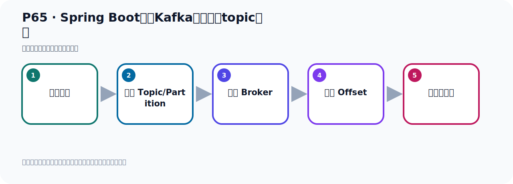
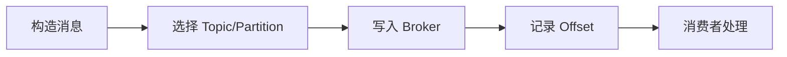

# P65：Spring Boot集成Kafka发送默认topic消息

> 笔记编号 65/156 · 时长 07:21 · [打开原视频 P65](https://www.bilibili.com/video/BV14J4m187jz?p=65)

[← P64: Spring Boot集成Kafka发送指定分区的消息](../05-spring-boot-basics/p064-Spring-Boot集成Kafka发送指定分区的消息.md) · [返回本章](./README.md) · [P66: kafkaTemplate.send()和kafkaTemplate.sendDefault()的比较 →](../05-spring-boot-basics/p066-kafkaTemplate.send-和kafkaTemplate.sendDefault-的比较.md)

## 这节到底讲什么

**核心主题：Spring Boot集成Kafka发送默认topic消息。**

这节位于消息链路上。要顺着“发送端—Broker—分区日志—消费端”看数据和元数据怎样流动。
本节属于“Spring Boot 集成 Kafka”这一章；放在全章里看，它的作用是：搭建 Spring Boot 工程，掌握 KafkaTemplate、消息发送、监听消费、偏移量和对象序列化。

## 本节路线

## 老师的完整讲解（按视频顺序校正）

> 下面保留老师的完整讲解顺序，并修正 Kafka、Java、ZooKeeper、
> Topic、Partition、Offset 等常见识别错误。它不是压缩摘要；原始 ASR 在后面单独保留。

### 1. 00:00–01:19

下面我们就看一下发送消息的发送方法。我们在这里打开这个生产车，写一个PublicSend5方法。那么发送的话，也是用Template去发送，它是SendDefault，有四个方法。我们看一下这个方法，这个就直接传一个数据。这个参数比较多，它传一个分区、消息的时间、消息的key、消息的据点内容。这个参数比较全，它有四个参数。这个就传一个消息key、消息数据，这个比较少，我们看参数比较多的方法。再看下面这个，最下面还有这个方法。那么这个方法，它只有三个参数，分区、key和数据。我们就看这个方法就够了，因为它的参数最多，它这些参数你都会了，其他参数也就知道了。

### 2. 01:19–02:17

所以看这个方法就够用了，就看它一个，它参数是最多的，它已经包含了其他方法的所有参数。那么defort，那就是这个方法。点进去看一下参数最多的，那就是这个方法，它最多点进来。那就是这个四个参数这个方法，那我们参数来就在四个。第一个你传一个potency，那我们分区呢？我们是能分区，第一个分区是能。然后就是，第二个就是时间，那么时间我们传一个当前时间好秒数。它是一个annown，就是一个数字。这时间，第三个key，那我们这个key的话我们就写个key3，key3吧。好，然后后面是数据，数据选个handle。好，handleKafka，那我们这个方法就写完了。

### 3. 02:17–03:09

掉这个defort的方法。好，那么掉defort的方法之后，那今天呢，我们把这个方法去运行一下，它能不能发出去呢？哎，我们这个方法在发消息的时候，它其实没有指定那个tobik。那你没有指定tobik按照我们这个发送的话，生产者发到这个服务器，发服务器的话，你手上第一步，你要指定个tobik。它是往tobik去发送，那现在我们这一方没有指定tobik，那它会发哪儿去呢？哎，它会发到哪里去，我们去跑一下啊。好，那这个时候我们调一下这个方法5，那我们在这个测试这里写个方法5，调一下它，测试5。好，那我就直接运行啊，那么这里运行一下，看看它能不能发出去，或者说它发到哪个tobik上去的。

### 4. 03:10–04:00

好，那么运行以后呢，那么就包错了，这是红色的。好，红色的包错了，你看它错误异常信息在哪里，在下面。好，这异常信息，它这个是这个参数的一个异常，不合法的一个参数异常，就是你这个tobik不离是空的。也就是我们调这个default这个方法，send的default的方法，我们没有在方法参数中没有指定tobik，那这个时候它就不知道你这个消息要发哪儿去。我们看一下之前我们给他画的图啊，你发送的时候你必须有tobik，看这张图，这张对吧，你伸展着你发消息一定要有一个tobik，他是把消息放在这个tobik里面去，tobik里面然后再是分区，分区里面放消息，消息还有这个，还有偏一调，是这么个情况。

### 5. 04:01–04:47

所以你没有tobik，所以他发的手要找不到tobik，那对于这种senddefault的方法，它的tobik怎么指定呢，因为这个方法里面它都没有tobik，它的四个方法里面都不需要传tobik，好，那么在十分不得集成以后开发的时候呢，我们需要在配置片中啊去指定一下tobik。那就在十分不得，然后Kafka，Kafka上面干嘛呢，它有个叫模板，叫timeplate，叫模板，这个模板。好，这个模板里面它有几个配置像，有这么几个配置像对吧，好，其中有一个配置像，就叫defaulttobik。就是默认的这个tobik，你去发送消息的时候的那个默认的default，啊，那个默认的这个tobik是什么，好，通过这个材质配置一下。

### 6. 04:47–05:55

比如说我们给它指定一个名字，叫defaulttobik，好，这个名字，好，那么这就是配置什么呢，这就是配置这个模板，配置那个，配置，模板这个默认的这个tobik，这个迷程，是吧，我们通过这个配置一下，它模拟到这个tobik的迷程，好，配完之后我们再来发，之前没发出去，它报错了，现在我们再来发一下，再发一下，点一下，运行。那么此时啊，它就可以发出去啊，就可以发出去了。好，那你可以看到呢，它这里没报错，是两个勾，打两个勾，说明这个测试是正常的，好，就是这里看都正常的。看一下，正常的，好，那消息发出去，发出去之后呢，我们这个tobik是叫defaulttobik，好，这个是我们在这个插件里面去观察一下，点开，点开之后我们这边就多一个defaulttobik，啊，现在还没看到，没看到我们需要这里点一下刷新啊，刷新一下，好，这个defaulttobik已经有了。

### 7. 05:56–06:43

那目前呢，比方呢，发了一个消息，发了一个消息，好，我们这个凹呼赛的，它现在已经从雷到一，雷到一了，因为有一条消息。这是我们用这个方法去发送消息的时候，那就需要呢，配置一下这个陌生的那个tobik，在配置边中，配置一下，这样它就把消息啊，发到我们这个tobik，在配置边中就指定好。那么这样的话呢，就表示啊，以后你发消息的时候，都是往这个tobik去发送。啊，因为你这个里面就配这一个tobik嘛。那以后所有的消息都是往这个tobik发送。那如果说我们用之前这个方法，像我们这种方法，我们可以自己手动在这个代码中指定tobik，在这里可以指定，所以你想写什么名字，就可以写什么名字。

### 8. 06:44–07:15

那么对于这种情况来说呢，它的tobik是固定的，就是配置边中所配这个名字，你不能改的，你没法搞两个tobik，你只能搞一个tobik。那我们上面这个方法呢，可以随便写自己的tobik，你可以写很多种tobik。好，那这样的话呢，我们就把这个send的default这个方法啊，就测试完了。好，那以上呢，就是我们的这个发生者发送消息的这个10个方法，我们给他做个介绍啊，怎么发消息，这10个方法。

## 关键术语

- **Kafka：** Apache 开源的分布式事件流平台，常用于高吞吐消息传递、数据管道和流处理。
- **Topic：** 事件的逻辑分类。生产者向 Topic 写数据，消费者从 Topic 读取数据。

## 完整原声逐段记录

[查看本节带时间戳的本地 ASR](./transcripts/p065-Spring-Boot集成Kafka发送默认topic消息-ASR.md)。主笔记负责可读性和术语校正；ASR 页面负责完整性复核。

## 读完记住

- 本节主题是 **Spring Boot集成Kafka发送默认topic消息**，它服务于本章目标：搭建 Spring Boot 工程，掌握 KafkaTemplate、消息发送、监听消费、偏移量和对象序列化。
- 理解顺序是：构造消息 → 选择 Topic/Partition → 写入 Broker → 记录 Offset → 消费者处理。
- 学习时要同时核对老师的解释、画面中的配置/代码，以及最终运行结果。

## 最容易踩的坑

能发送成功不代表业务处理成功；序列化、分区、确认机制和消费进度需要分别观察。

## 自测

1. 不看笔记，用自己的话解释“Spring Boot集成Kafka发送默认topic消息”解决了什么问题。
2. 按顺序复述：构造消息、选择 Topic/Partition、写入 Broker、记录 Offset、消费者处理。
3. 如果运行结果和老师不同，你会先检查哪三个输入或环境条件？

## 学完检查

- [ ] 我能不看视频复述本节完整思路
- [ ] 我能指出关键命令、配置、类或接口的作用
- [ ] 我能解释画面中的输入与输出为什么对应
- [ ] 我核对过完整 ASR，没有跳过老师的补充说明
- [ ] 我完成了本节自测或复现实验
