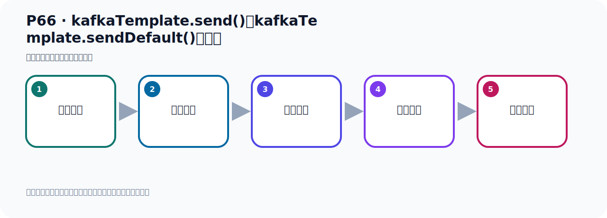
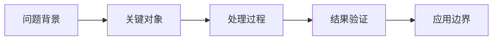

# P66：kafkaTemplate.send()和kafkaTemplate.sendDefault()的比较

> 笔记编号 66/156 · 时长 03:14 · [打开原视频 P66](https://www.bilibili.com/video/BV14J4m187jz?p=66)

[← P65: Spring Boot集成Kafka发送默认topic消息](../05-spring-boot-basics/p065-Spring-Boot集成Kafka发送默认topic消息.md) · [返回本章](./README.md) · [P67: 获取生产者消息发送结果 →](../05-spring-boot-basics/p067-获取生产者消息发送结果.md)

## 这节到底讲什么

**核心主题：kafkaTemplate.send()和kafkaTemplate.sendDefault()的比较。**

这节继续完善 Kafka 的完整知识链。请按老师的讲解顺序理解动机、做法和结果。
本节属于“Spring Boot 集成 Kafka”这一章；放在全章里看，它的作用是：搭建 Spring Boot 工程，掌握 KafkaTemplate、消息发送、监听消费、偏移量和对象序列化。

## 本节路线

## 老师的完整讲解顺序（ASR 辅助复核）

> 下面按时间顺序保留经过基础术语替换的 ASR，方便核对老师是否提到某个细节。
> 人名、命令、代码和英文参数仍可能识别错误；准确结论以本节白话说明、代码块和实操速查表为准。

### 1. 00:00–01:08

刚才我们把聖德方法和聖德底附的方法中了一个测试，下面我们看一下聖德方法和底附的方法有什么区别，一个是聖德方法，一个是聖德底附的方法，它的区别。好，这两个方法，它的最主要区别就是发送消息到Kafka时，是否每次都需要指定主题Topic，要不要指定Topic？我们从代码中可以看到，我们这种聖德方法每次都要指定Topic，我们这个聖德底附的不需要指定Topic，这个聖德方法，你看这里它也是指定Topic的，比如说这里它也是指定Topic的，每次指定Topic，这里它也是指定Topic的，所以它的区别最主要就在这里，就是要不要指定Topic。我们底附的Topic是在配置文件中配的，只需要指定一次，在配置文件中配置一下就可以了。

### 2. 01:09–02:09

好，在它主要区别，所以它区别就是，总结一下，聖德方法，那么这个方法它需要明确的指定，要发送我们消息的目标Topic。那我们聖德底附的方法，不需要指定发送我们消息的目标Topic，一个是需要明确的指定，另外一个是不需要指定的，它直接从配置文件中拿到那个Topic名字。我们聖德方法，它适用于需要根据业务逻辑，或者是外部输入动态确定消息目标Topic的场景，因为每次发送消息的时候，你都需要自己指定一个Topic，这是聖德方法。那么聖德底附的呢，它适用于总是需要将消息发到某个特定的，默认的Topic的场景，就是每次发消息都是发到同一个Topic。这个场景下呢，就可以用底附的这个方法。

### 3. 02:10–03:05

所以我们这个底附的方法是一个便捷方法，快捷便捷方法，它只要配置中指定的默认主题来发消息。如果你的应用，所有消息都发到同一个主题，那么你采用这个底附的方法非常方便，它可以减上代码的重复，满足我们特定的业务需求。那上面这个呢，它就更灵活，圣诞方法，因为你每次发送消息，你可以指定不同的这个Topic，不同的主题发到不同主题上。而我们下面这个就比较固定，每次都是往一个主题去发送。好，各有各的这个优缺点，所以根据实际情况，如果说我们项目中啊，都是要把消息发到同一个主题上，那就可以使用底附的。那你需要呢，灵活的去变化，考虑不同消息，要发到不同的这个Topic上，那你需要使用上面这个方法。

### 4. 03:06–03:09

好，那以上呢，就是我们对这两个方法做一个比较。

## 关键术语

- **Kafka：** Apache 开源的分布式事件流平台，常用于高吞吐消息传递、数据管道和流处理。
- **Topic：** 事件的逻辑分类。生产者向 Topic 写数据，消费者从 Topic 读取数据。
- **KafkaTemplate：** Spring for Apache Kafka 提供的高层发送 API。

## 完整原声逐段记录

[查看本节带时间戳的本地 ASR](./transcripts/p066-kafkaTemplate.send-和kafkaTemplate.sendDefault-的比较-ASR.md)。主笔记负责可读性和术语校正；ASR 页面负责完整性复核。

## 读完记住

- 本节主题是 **kafkaTemplate.send()和kafkaTemplate.sendDefault()的比较**，它服务于本章目标：搭建 Spring Boot 工程，掌握 KafkaTemplate、消息发送、监听消费、偏移量和对象序列化。
- 理解顺序是：问题背景 → 关键对象 → 处理过程 → 结果验证 → 应用边界。
- 学习时要同时核对老师的解释、画面中的配置/代码，以及最终运行结果。

## 最容易踩的坑

不要把孤立 API 或配置项当成完整能力；始终把它放回生产、存储、消费或集群链路中理解。

## 自测

1. 不看笔记，用自己的话解释“kafkaTemplate.send()和kafkaTemplate.sendDefault()的比较”解决了什么问题。
2. 按顺序复述：问题背景、关键对象、处理过程、结果验证、应用边界。
3. 如果运行结果和老师不同，你会先检查哪三个输入或环境条件？

## 学完检查

- [ ] 我能不看视频复述本节完整思路
- [ ] 我能指出关键命令、配置、类或接口的作用
- [ ] 我能解释画面中的输入与输出为什么对应
- [ ] 我核对过完整 ASR，没有跳过老师的补充说明
- [ ] 我完成了本节自测或复现实验
