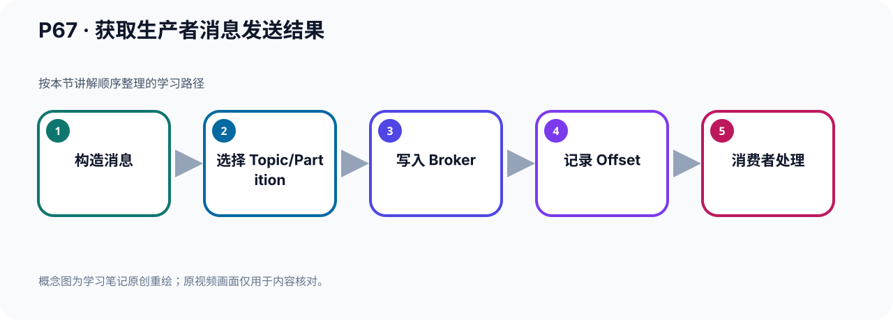
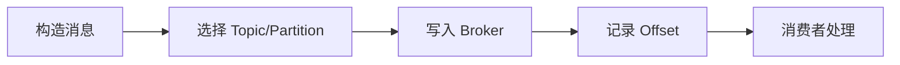

# P67：获取生产者消息发送结果

> 笔记编号 67/156 · 时长 04:42 · [打开原视频 P67](https://www.bilibili.com/video/BV14J4m187jz?p=67)

[← P66: kafkaTemplate.send()和kafkaTemplate.sendDefault()的比较](../05-spring-boot-basics/p066-kafkaTemplate.send-和kafkaTemplate.sendDefault-的比较.md) · [返回本章](./README.md) · [P68: 阻塞式获取生产者消息发送的结果 →](../05-spring-boot-basics/p068-阻塞式获取生产者消息发送的结果.md)

## 先看结论

> 这节把“获取生产者消息发送结果”放回消息链路，沿 Producer、Broker、Partition、Offset 与 Consumer 追踪数据和元数据如何流动。它服务于本章目标：搭建 Spring Boot 工程，掌握 KafkaTemplate、消息发送、监听消费、偏移量和对象序列化。

## 老师怎么一步步讲

1. 第 1 步，围绕“获取生产者消息发送结果”完成构造消息。
2. 第 2 步，围绕“获取生产者消息发送结果”完成选择 Topic/Partition。
3. 第 3 步，围绕“获取生产者消息发送结果”完成写入 Broker。
4. 第 4 步，围绕“获取生产者消息发送结果”完成记录 Offset。
5. 第 5 步，围绕“获取生产者消息发送结果”完成消费者处理。

## 老师的补充说明

下面按原声顺序整理老师的完整讲解脉络。保留原因、案例、对比、操作过程、边界条件和口头提醒；删除重复语气词，并把长口语拆成适合阅读的短段落。

> 技术术语已经过统一校正；仍无法确认的人名或口头英文会保留原意，并通过右侧时间范围返回视频核对。

### 先明确：获取生产者消息发送结果要解决什么 · 00:00–00:56

接下来我们继续往下看一下，我们获取生产者消息发送的结果。前面我们介绍两个方法，一个是Send的方法，一个是Send的Default的方法。这两个方法都可以把我们的数据发送到Kafka里面去。这两个方法都返回comparable future这个对象。它是一个的范形的，里面是一个发送结果对象，叫SendResult对象。我们可以看一下代码，这两个方法都是返回这个对象。

我们在这里打开我们这些代码，比如说我们这个Send的方法，点一下，那么它返回了comparable future这个对象，它是个范形对象。你看SendDefault的方法，点进去看一下，它也是返回一个comparable future这个对象，里面是一个SendResult结果对象。

### 跟着老师操作，并观察运行结果 · 00:56–01:54

那这个对象是个什么对象呢？就是说，这个comparable future对象，那么这对象我们点语看一下这个原代码，点语。点语之后你发现这个代码是从GTK 1.8开始，就有这个类了。那么它是哪个类呢？它是我们加碼多线程必发编程下的一个类，加碼UTO counter这个包，必发编程包的一个类。这是我们这个comparable future，然后呢，它的这个里面的这个叫什么，叫SendResult。那么这是个什么类呢？

这是一个棚类，它里面有两个字段，一个就是我们生产者那个记录对象，一个就是那个记录的这个元数据信息对象。这个类里面有这么两个成业变量，然后下面就是它的一个固责方法，然后get它这里面的成业变量，下面就是图示据方法，所以这个类很简单，。

### 跟着老师操作，并观察运行结果 · 01:54–03:00

这个类就是封装的发送后的那个结果，我这个消息发到Kafka之后，那么它应该给我有个结果，那么这个结果呢，通过这个类的封装。

那么这个结果用这个类的封装，这个类的这个结果信息呢，它又是放到我们这个comparable future里面的，通过它去拿你这个结果，那这个comparable future它是将要避发编程里每个类，这个类是从GTK8就1.8引入那个类，它由于异步编程，它表示的是一个异步计算的结果，comparable就表示什么意思啊，可以完成的，可完成的，对吧，future是未来的，未来完成的结果，它是一个异步啊，就是未来会完成的结果，所以现在没有结果，未来会完成的结果，将来的结果。

那因为有了这样一个对象啊，它就使得我们调用者不需要等待操作完成，。

### 最后验证结果，并收束本节结论 · 03:00–04:38

就能继续执行其他任务，从而提高业务程序的小异速度和吞吐量。什么意思啊，就是我去发消息，往这个Kafka去发消息，我这个代码在那里执行，执行我发送就可以了，我不用等待。相当于我这个主线程是吧，继续往那执行，我继续往那执行，在这个位置发消息的时候就相当于开启一个新线程，让这个新线程去发消息，那我这个主线程可以继续往下执行，不用等待，在这个位置不需要等待，不需要主设。

那这的话呢，我这个主线程继续往下执行，可以继续执行下面的应用代码，那那么这个发消息这里呢，它是等，它是等后续我们拿一个未来的结果，在此时刻我调这个方法去发的时候，我是不用等结果的，我不用等，我调完这个方法就直接可以继续往下执行，不用等待，不用主设。那这的话就让我们这个主线程，让我们这个调入线程可以直接往下执行，不用主设，不用等待，那么提高程序的响应速度和推动量。

这是我们使用complete future这个类，到时候呢，到时候它这个发发消息发Kafka，发完之后成功或者失败，到时候你可以通过这个complete future，可以拿到这个结果，它是成功还是失败，到时候用这个去拿，拿结果就可以了。它是这么一个情况，所以我们这个方法都是反为这个类，那下面呢，我们来去看一下这个类，怎么去拿结果。

## 放进整套课

本节属于 **Spring Boot 集成 Kafka**。这一章要解决的是：搭建 Spring Boot 工程，掌握 KafkaTemplate、消息发送、监听消费、偏移量和对象序列化。

这节位于消息链路上。要顺着“发送端—Broker—分区日志—消费端”看数据和元数据怎样流动。

### 记忆路线

```mermaid
flowchart LR
    N0["构造消息"]
    N1["选择 Topic/Partition"]
    N0 --> N1
    N2["写入 Broker"]
    N1 --> N2
    N3["记录 Offset"]
    N2 --> N3
    N4["消费者处理"]
    N3 --> N4
```

## 用在工作里

| 项目 | 内容 |
|---|---|
| 先回答 | 先明确消息从哪里产生、写入哪个 Topic、由谁消费。 |
| 立刻做 | 复现发送、Broker 写入和消费者处理的完整链路。 |
| 留下证据 | 记录 Partition、Offset、序列化结果和消费端输出。 |

## 关键术语

- **Kafka：** Apache 开源的分布式事件流平台，常用于高吞吐消息传递、数据管道和流处理。

## 最容易踩的坑

能发送成功不代表业务处理成功；序列化、分区、确认机制和消费进度需要分别观察。

## 自测

1. 不看笔记，用自己的话解释“获取生产者消息发送结果”解决了什么问题。
2. 按顺序复述：构造消息、选择 Topic/Partition、写入 Broker、记录 Offset、消费者处理。
3. 如果运行结果和老师不同，你会先检查哪三个输入或环境条件？

## 学完检查

- [ ] 我能不看视频复述本节完整思路
- [ ] 我能指出关键命令、配置、类或接口的作用
- [ ] 我能解释画面中的输入与输出为什么对应
- [ ] 我读完了老师的详细讲解正文，没有只看路线图和要点
- [ ] 我完成了本节自测或复现实验

## 需要核对原话时

[查看本节带时间戳的完整 ASR](./transcripts/p067-获取生产者消息发送结果-ASR.md)。主笔记负责理解与实践；ASR 页面负责逐句完整性复核。
