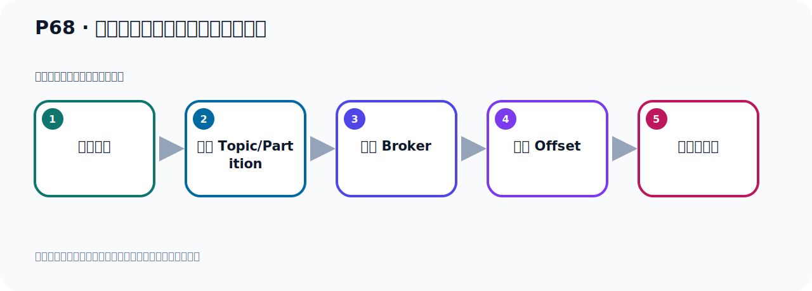
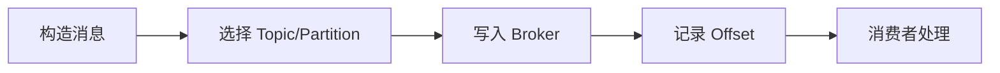

# P68：阻塞式获取生产者消息发送的结果

> 笔记编号 68/156 · 时长 11:18 · [打开原视频 P68](https://www.bilibili.com/video/BV14J4m187jz?p=68)

[← P67: 获取生产者消息发送结果](../05-spring-boot-basics/p067-获取生产者消息发送结果.md) · [返回本章](./README.md) · [P69: 非阻塞式获取生产者消息发送的结果 →](../05-spring-boot-basics/p069-非阻塞式获取生产者消息发送的结果.md)

## 这节到底讲什么

**核心主题：阻塞式获取生产者消息发送的结果。**

这节位于消息链路上。要顺着“发送端—Broker—分区日志—消费端”看数据和元数据怎样流动。
本节属于“Spring Boot 集成 Kafka”这一章；放在全章里看，它的作用是：搭建 Spring Boot 工程，掌握 KafkaTemplate、消息发送、监听消费、偏移量和对象序列化。

## 本节路线

## 老师的完整讲解（按视频顺序校正）

> 下面保留老师的完整讲解顺序，并修正 Kafka、Java、ZooKeeper、
> Topic、Partition、Offset 等常见识别错误。它不是压缩摘要；原始 ASR 在后面单独保留。

### 1. 00:00–01:04

Kafka发送消息，方法是返回combo.vf表示未能的结果，是一步计算结果。为什么他用一步计算结果，可以提高程序的小音速度和吞吐量？主要是因为你这个雕着不需要等待操作完成，就能继续执行其他任务。发送消息让他在新线中去执行，其他操作可以继续执行。好，我们具体看一下，主要是因为，我们调入Kafka发消息方法的时候，你发消息你调到方法去发，发的时候Kafka可能需要一些时间来处理这个消息。比如说网络原因，我需要连接网络或者网络有延迟，我这个消息要进行序列化器，进行转化，或者是我Kafka集群，他的一些负载等等一些情况。那么你这个消息不是说发了之后立刻就处理的。

### 2. 01:05–01:58

如果说你这个发消息是同步方法，那你这个发消息可能就要等个几十毫秒，几百毫秒。那么这个发消息就会造成主设，就会主设你这个调用线程。因为你发消息，你说等消息处理好，网络连接，消息序列化器，等它处理好以后，你才可以继续往下执行。那这样的话就会引起我们当前这个线程的主设，直到你这个消息发生成功，或者是发生错误，发生成功或者失败以后，我们才离这个方法才可以返回。因为你是同步方法，你才可以返回，只有等于有结果了才可以返回。那如果说你是用同步的方式，那这样的话就会导致我业用程序性能下降，尤其是在高并发展一下。每调一次发生的消息，那我都说等这个结果，每次发消息都等结果。

### 3. 01:58–02:48

那如果有大任的请求都要发消息，那你这个请求都会在这个发消息这个方法这里，主设等待。那么程序性能急剧下降，尤其是访问量比较大的时候，高并发场景。好，所以我们也使用这个complete filter，一步编程，发了之后就直接返回了，然后这个结果互续再去获取。未来再拿结果，不用主设。所以这个性能方法，它就掉完之后，就立即返回一个表示，这个一步操作结果的未来对象。你掉完这个方法之后，就不用主设，立刻给你反过一个对象，反过什么对象呢？可能不让你要future对象。反过这个对象，这个对象呢，可能马上没有结果，以后有结果，后续拿结果。

### 4. 02:49–03:48

它操作完之后，你就可以拿结果，它没有操作完，你就拿不到结果。它返回一个未来的对象，所以这个对象表示一个未来的对象，未来的结果对象。所以这的话，你就不用等待它操作完成，是吧？不用等待操作完成，不用主设。那么这样的话，我们调个现成就可以继续执行其他任务，而不必等待消息发生完成。当消息发生完成以后，无论是成功还是失败，那么completely future都会相应的更新其状态，并允许我们通过回调，主设等方式获取结果。就是它消息发完之后，你再通过这个未来对象，可以拿到结果，是吧？可以拿到结果。好，这就是我们调了一种方式，那接下来我们去写个代码来跑一下，那这个时候我们开始写个代码。

### 5. 03:48–04:32

那么这里写个方法六，我们发生一个消息。好，这个人不管你是default的方法，还是无论的方法都可以，因为它都是返回一个completely future。好，我们看一下点VNR。那你看一下，它都返回一个completely future。我把这个换合夹的太长了，换合，再两合就写。那么这个地方就是写个future算了，写短一点，太长了。好，那么这表示一个呢，就是未来的结果，这是未来的结果，写个completely future，这样吧，就是未来的结果。好，然后怎么办呢？然后它这个发完之后，这个方法就可以直接完了，直接完之后，这个结果在这里面。

### 6. 04:32–05:47

你马上去拿，可能没有。但是呢，它等这个消息发完之后，什么这个训练坏完了，消息这个Kafka都完成了以后，那么你可以通过这个对象给拿到结果。啊，给拿结果。那怎么拿结果呢？有好几个方式，怎么怎么拿结果，拿到结果。通过了这个内，completely future，这个内，这个内，拿结果。结果啊，该拿结果啊，这个内里面啊，这个内里面啊，有好多方法。有好多方法啊，很多方法。你看，那我先介绍一个方法啊，就是主色等待的方式拿结果。那结果，那就是我们用这个future，诶，不是，用这个变量，直接调一个get的方法。点get，get。好，这样拿结果，那么这个方法是主色的啊，主色的，而且它有一场把它check一下，check一下。

### 7. 05:47–06:51

好，这个check了，我们就直接写一个catch，把它一场写最上面这个负累，负累一场。好，这样就可以了，是吧。好，那么这就是主色等待的方式拿结果。它这个拿结果啊，就是说，如果这个Kafka消息还没有发完，没发完，那么这个方法会在这里主色，主色等待。等于它发完之后，有结果了，好，它就可以拿结果。那么它拿结果是什么呢？它拿结果就是我们那个shind，r，这个就是结果，shind，r对象，它就是结果。那么这个结果里面我们知道它有两个成业变量啊，这个结果里面有两个催变量。那就是这个结果你看，它两个催变量，一个就是你那个消息本身的那个对象，就生产者发的那个消息进入对象，包括那个什么，这个对象里面包含很多制断，Topic啊，帕地信啊，还头部的信息啊，还有剑啊，纸啊，还有这个时间啊，这些信息，你的消息的这些信息就可以通通到对象拿到。好，另外一个对象是什么呢？就是它的元数据，这个元数据，这个元数的影响。

### 8. 06:52–07:47

好，那么这个元数对象啊，如果它不是空，就说明啊，就说明这个消息发生出了，你看啊。它这里有个说明，你看，它说这个元数据对象就是hasb，就是ack，白服务器。就是我们，如果你这个服务器端，当然有ack，就是服务器端，它已经拿到这个消息了，有个确认，是吧，服务器端如果已经确认了，那我们这个对象是不会是空的了。如果服务器端没确认，那么这个对象是空的。是吧？所以这个元数据就是我们这个进入了一个发送有没有成功的一个对象，通过它来判断有没有发成功，那我们这里可以怎么判断呢？就是通过它拿到那个元数据对象，它点开了那个元数据，就这个对象。好，如果它不能空，不能空啊。

### 9. 07:48–08:54

因为对服务器，Kafka服务器，如果确定这个消息它接到了，接到了，那么这个对象就不会是空的了。不会是空的了，那说明服务器接到了。好，那么这个时候Kafka接到了这个消息。好，那么此时呢，Kafka，Kafka这个服务器接收到了，到了这个消息，是吧？确认，确认，已经接到消息了，它不得空啊，不得空。好，那么我们就是，那就是这种一个打印讯化啊，可以打印消息发生成功。因为它都有这个对象，那么消息确实发生成功了，发生成功，然后我们可以把这个对象呢，它的信息你可以再打印一下，就是这个对象啊。它点，拿到这个对象，然后看看它的一些信息，那你看一下啊。比如说它里面的一些字段啊，你看一下，那我们直接掉个突出性方法算了。

### 10. 08:55–09:35

啊，突出性方法，看那突出性方法呢，倒是把它的，它把Partition啊，然后加上offside，那你想拿其他字段，你看它有没有公开的方法，你可以拿下，你要想拿这个信息，它可以得到这个offside，时间还有这个这几个字段，还有Partition啊，这几个信息，可以拿这几个信息。好，这是，这是我们的这个成功，啊，发生成功了。好，这是主授的方式啊，去拿结果。好，那么这个，那么另外还有一个对象，我们来打一下，就这个对象里面，它还有个呢，这个消息百分之百的那个对象，我们来打一下，就这个对象，打一下。

### 11. 09:42–10:26

好，打一下，打一下。好，那我们这个，这个就写完了，然后我们就用掉这个方法去发消息，发消息之后，我们去通过这个主授的方式，去拿下结果。通过调查它的beta的方法，这个方法是主授的，拿到结果之后，才打印，没拿到结果，它会在这个方法一直等，一直卡，卡在这里一直等。那我们调一下这个零六这个方法，去发送一下，那在这里测试一下，那我们这里，附着一个灯啊，好，这也是零六，那我们调六这个方法，好，然后就直接在这里运行啊，好，右键运行一下，调六这个方法。六这个方法，它实际上是default，剩下default，那么它发到末日的那个分区，它是掉了这个剩下default啊。

### 12. 10:26–11:13

好，它发完了，你看，代码这个意思是没有问题啊，走完了，走完之后呢，我们看看它的这个，这个这个地方打印啊，这个信息要看一下，打印信息，那也在这了，发了消息，你看，它发了成功了，对吧，好，然后你这个消息对象呢，是这样的，你看，它是这个脱密个，分区上的，它是头部信息，目前这个头部信息我们是没有传，没有给来信息，所以是call的，好，这个case是k3。然后这个只是handle，handle，couple card，这是个时间戳，当前的好秒数，好，这就是我们拿结果，通过这个get来，来结果，这是主色式拿结果，好，下面我们看一下来，非主色式拿结果，看什么拿。

## 关键术语

- **Kafka：** Apache 开源的分布式事件流平台，常用于高吞吐消息传递、数据管道和流处理。
- **Topic：** 事件的逻辑分类。生产者向 Topic 写数据，消费者从 Topic 读取数据。
- **Partition：** Topic 的物理分片，是 Kafka 并行度、顺序性和扩展能力的基本单位。

## 完整原声逐段记录

[查看本节带时间戳的本地 ASR](./transcripts/p068-阻塞式获取生产者消息发送的结果-ASR.md)。主笔记负责可读性和术语校正；ASR 页面负责完整性复核。

## 读完记住

- 本节主题是 **阻塞式获取生产者消息发送的结果**，它服务于本章目标：搭建 Spring Boot 工程，掌握 KafkaTemplate、消息发送、监听消费、偏移量和对象序列化。
- 理解顺序是：构造消息 → 选择 Topic/Partition → 写入 Broker → 记录 Offset → 消费者处理。
- 学习时要同时核对老师的解释、画面中的配置/代码，以及最终运行结果。

## 最容易踩的坑

能发送成功不代表业务处理成功；序列化、分区、确认机制和消费进度需要分别观察。

## 自测

1. 不看笔记，用自己的话解释“阻塞式获取生产者消息发送的结果”解决了什么问题。
2. 按顺序复述：构造消息、选择 Topic/Partition、写入 Broker、记录 Offset、消费者处理。
3. 如果运行结果和老师不同，你会先检查哪三个输入或环境条件？

## 学完检查

- [ ] 我能不看视频复述本节完整思路
- [ ] 我能指出关键命令、配置、类或接口的作用
- [ ] 我能解释画面中的输入与输出为什么对应
- [ ] 我核对过完整 ASR，没有跳过老师的补充说明
- [ ] 我完成了本节自测或复现实验
