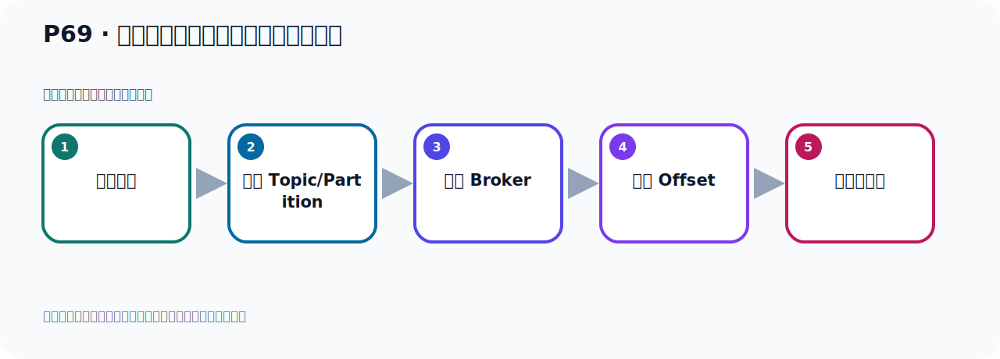
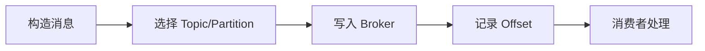

# P69：非阻塞式获取生产者消息发送的结果

> 笔记编号 69/156 · 时长 10:52 · [打开原视频 P69](https://www.bilibili.com/video/BV14J4m187jz?p=69)

[← P68: 阻塞式获取生产者消息发送的结果](../05-spring-boot-basics/p068-阻塞式获取生产者消息发送的结果.md) · [返回本章](./README.md) · [P70: SpringBoot集成Kafka开发发送对象消息 →](../05-spring-boot-basics/p070-SpringBoot集成Kafka开发发送对象消息.md)

## 这节到底讲什么

**核心主题：非阻塞式获取生产者消息发送的结果。**

这节位于消息链路上。要顺着“发送端—Broker—分区日志—消费端”看数据和元数据怎样流动。
本节属于“Spring Boot 集成 Kafka”这一章；放在全章里看，它的作用是：搭建 Spring Boot 工程，掌握 KafkaTemplate、消息发送、监听消费、偏移量和对象序列化。

## 本节路线

## 老师的完整讲解（按视频顺序校正）

> 下面保留老师的完整讲解顺序，并修正 Kafka、Java、ZooKeeper、
> Topic、Partition、Offset 等常见识别错误。它不是压缩摘要；原始 ASR 在后面单独保留。

### 1. 00:00–01:03

通过Gate方法，我们拿到消息发生后的结果，它是主色等待式的方式。这个方法它会主色等待。下面我们看下来，我们用非主色等待方式，怎么拿结果。我们看一下。刚才我们方式一是调到ComponentVoltaireFuture的Gate方法，它是一个同步主色等待的结果。这是第一种方式，那么这种方式它的效率比较差，因为它要主色等待。当我调Gate结果的时候，它就需要等待，代码就需要等待，在那里要等。我们有没有其他方式呢？我们可以使用方式二，方式二是一步的，它是使用Z什么什么方法，Z什么什么方法，来注册这个回调函数。当你结果拿到以后，它自动调我这个Range函数，回调函数它会再什么呢？

### 2. 01:03–01:48

在ComponentVoltaireFuture完成时被执行。我不需要再等的，不需要等。你调Gate的方法，你需要再等，卡在那里的。而我们这个是在来接收。你ComponentVoltaireFuture的结果，有结果了，你直接调我这个方法。有结果了，调我这个方法，有结果调我这个方法。你没结果，你不如调我，你有结果，你调我这个方法。我们用我们注册这个回调函数。这样的话，它有结果了，结果拿到了，就直接调我这个回调函数，调我这个函数去。好，那我们使用代码来开发一下。好，那这个是我们写一个07发送消息的。把其他地方稍微关一下。

### 3. 01:48–02:54

都关了，在这个地方。好，写个07，07的方法。好，ComponentVoltaireFuture，这个叫7这个方法。好，那现在我们把这些看一下，首先它这个是发送，发送之后拿那个为你的结果。为你的结果，我们采用方式2，第二种方式。第二种方式，非主色的这个方式，不需要主色的方式，不需要主色等待的方式去拿结果。好，那就是它怎么办呢？这一方就不是调整什么get的方式了。我们在这上面注册回调函数，比如说，a，x，xsept，对吧，xsept是什么呢？在这里，我们调用什么呢？调Z，Z函数，Z是什么呢？然后接收结果，a，xsept接收结果，是吧，然后接收结果，当你有结果了，你就回调5，。

### 4. 02:54–03:48

就回调5这个函数。那这个函数你怎么接收呢？点进来看一下，它这个函数里面需要传一个呢？Consumer？传一个消费者。啊，传个消费者的话呢，这个消费者你看一下，点进来。消费者，它是一个函数数接口，它里面只有一个抽属方法。好，那么这个抽属方法呢，我们可以用NM的表示去开发，去写着代码。那首先，第1个，就是你接收一个参数列表，那就参数列表就是它了，是吧，第1步打个箭头，打箭头，第3步写个大呼号，然后在里面去写代码就可以了。那么这个参数列表的参数内形由它自己推断，我们不用去指的内形，它自己去推断，所以这个T就去掉，好，然后这一加Dou号就行了，加它结束啊，来，加它结束。

### 5. 03:49–04:51

好，那就是它掉这个赞，掉这个赞，赞那么它返回了这个地方啊，就不需要就它去接受返回职了，它掉赞，好，这个直接这样结束，再结束。好，赞那么T是什么东西啊？T就是那个结果，你看这个数，你看这个数表你看点一下，T什么，T就是那个胜的贼的这个结果，T就是那贼的结果。所以我们就把下面这个代码给它再移到这里来就可以了，是吧，只不过我们这一方是T而已，T，这个下面是T，这是T。或者说你这样写，你把这地方这个名字干出来就写成这个结果，写它，是吧，好，这个就是结果，它如果拿到里面那个recorder，这个might net，这个元素局不得一空，那说明消息方成功了，然后这个消息的信息内容啊，其实通过get，Producer，recorder可以拿到，好，那这就是我们一步拿结果。

### 6. 04:52–06:03

而且它可以注册，连续注册多个回调，这是注册一个回调，是吧，注册这个回调之后，你看这个回调之后，它返回来其实又是一个什么con-bran-biel future，又是这个future，好，那你可以在这个位置，这位置后面可以再继续注册点，点什么呢，当它发生一场的手，我们可以指一个sepsiline，这个方法，当它发生一场的手，我们可以拿这个一场信息，那这个里面它传个什么呢，这里面它传一个方个形，里面传个方个形，那这个方个形你看一下呢，它是接收两个参数，然后返回一个结果，接收两个参数返回结果，不是接收两个参数啊，就是你给它传一个参数，然后给你返回结果，这个是你传一个参数，然后返回结果，好，那我们怎么去写呢，用论文表去写，那第一步是考备它这个参数列表，那在这地方考备它个列表，然后第一步加个箭头，第三步大过号，对吧，然后这个类型让它自行推断就可以了，好，那最近推断你看这个类型什么类型呢，就是sulub，就异层，。

### 7. 06:03–06:50

我们把这个異层打印一下，是吧，如果发生異层就会直移这个，好，再可以啊，然后呢，我们这个方法接下来怎么办呢，接下来就要锐锗一下锐锗一下锐锗一个空，是吧，因为这个它里面传个什么传个函数吗，它是锏锗锏锗锏锗锏锗锗锗锗锗�这个函数是要有反为值的也没有反为值的不行的要有反为值所以我们要在这里面你要Return一下一不Return的话你这个办法报错了报错了对吧报错了编译报错好要Return一下至于Return什么东西你自己来决定。

### 8. 06:50–07:40

好那上面我们这个地方为什么不需要Return因为它这里面是传一个什么传一个消费者这个消费者你看它这个反为值是是V的不需要反为值的所以这个时候它不需要上面这个不需要Return好那么就是这是非主流的方法拿结果你这个里面的结果有了好你掉我这个掉我这个我拿结果如果说你这个里面的结果是失败的它会掉如果有异常失败那么它会掉这里掉这里我们可以做这个失败处理这边是做失败处理失败的这个处理是吧你消息发失败了怎么怎么处理那么上面这个是消息发成功的一个处理这就是我们通过电动方式啊非主流的方式用任何什么什么函数去去去这个获取结果获取它未来的结果。

### 9. 07:40–08:42

好那么这个方法就写完了喜欢之后我们接下来可以在这里做一个测试好都没这里写个太史兰雷七这个方法那这里方就改了一个七就行的掉七这个方法那么直接把对码又借率行行运行下看它这个结果有没有拿到好执行完了执行完开实质啊开实质开实质的你看一下再把消息发出成功然后那个信息打开出来因为我们现在没有发生异常没有发生异常所以我们这个地方还没执行就是我们这个雷七的方法那么这个相遇不说执行因为你没有发生异常没有发异常那么这个代码就不会触发你发生异常了这个代码就会触发如果大家学过像这种前端开发不是我们学过像一个发生阿迦的请求你看用什么用阿迦请求。

### 10. 08:42–09:45

Ax是吧用这东西发生阿迦请求他是不是也是任何的数发生之后然后任拿结果是吧然后任拿结果然后还有什么开起异常是吧其实和那个类似和前端的这个类似如果你知道这个前端发阿迦请求那个写法那这个代码其实和他类似的这个Z拿结果嘛Z就拿结果他发送消息之后有结果了就会掉这个Z还出从Z还出就可以拿到这个结果拿结果好如果他发送抛错了有异常了那么他就会走这个还出然后在这个里面我们可以对异常进一处那再去所谓第二种方式用这种非主设式的方式或是结果当然我们刚刚用的是Zx其实也有Z不赖也可以用Z软也可以都是去运行的这几个方法来非常非常相似以后看它里面的这个参数。

### 11. 09:45–10:47

传个韩数还是什么消费的还是传个什么我们可以给这个方法稍微看一眼点点ZZ比如说这个O不赖ZIPP那这边是传一个韩数这边是传个韩数对吧然后Z那个ZRZR里面传个什么ZR里面是传一个ZR然后你相遇在里面再跑一个新一个现场在新现场中你做你的这个处理做你这个成功的一个处理再执行一个任务任务里面做一些工作好这是我们的这个这个可能本来没分析了它里面有很多方法很多方法那么关于这个内的更多的一个方法来需要去学习一下这个内这个内的方法很多有很多方法你看展开之后很多它也属于我们加发必发编程中的一个内一个内好那这种一步回掉后的结果我们就测试完了。

## 关键术语

- **Producer：** 向 Kafka Topic 发送事件的客户端。
- **Consumer：** 从 Kafka Topic 拉取并处理事件的客户端。

## 完整原声逐段记录

[查看本节带时间戳的本地 ASR](./transcripts/p069-非阻塞式获取生产者消息发送的结果-ASR.md)。主笔记负责可读性和术语校正；ASR 页面负责完整性复核。

## 读完记住

- 本节主题是 **非阻塞式获取生产者消息发送的结果**，它服务于本章目标：搭建 Spring Boot 工程，掌握 KafkaTemplate、消息发送、监听消费、偏移量和对象序列化。
- 理解顺序是：构造消息 → 选择 Topic/Partition → 写入 Broker → 记录 Offset → 消费者处理。
- 学习时要同时核对老师的解释、画面中的配置/代码，以及最终运行结果。

## 最容易踩的坑

能发送成功不代表业务处理成功；序列化、分区、确认机制和消费进度需要分别观察。

## 自测

1. 不看笔记，用自己的话解释“非阻塞式获取生产者消息发送的结果”解决了什么问题。
2. 按顺序复述：构造消息、选择 Topic/Partition、写入 Broker、记录 Offset、消费者处理。
3. 如果运行结果和老师不同，你会先检查哪三个输入或环境条件？

## 学完检查

- [ ] 我能不看视频复述本节完整思路
- [ ] 我能指出关键命令、配置、类或接口的作用
- [ ] 我能解释画面中的输入与输出为什么对应
- [ ] 我核对过完整 ASR，没有跳过老师的补充说明
- [ ] 我完成了本节自测或复现实验
