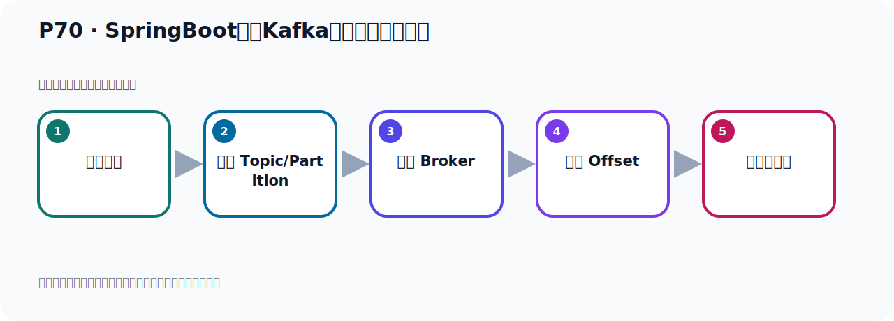
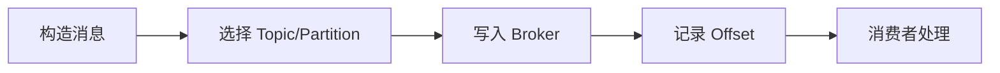

# P70：SpringBoot集成Kafka开发发送对象消息

> 笔记编号 70/156 · 时长 05:20 · [打开原视频 P70](https://www.bilibili.com/video/BV14J4m187jz?p=70)

[← P69: 非阻塞式获取生产者消息发送的结果](../05-spring-boot-basics/p069-非阻塞式获取生产者消息发送的结果.md) · [返回本章](./README.md) · [P71: SpringBoot集成Kafka自动装配的KafkaTemplate →](../05-spring-boot-basics/p071-SpringBoot集成Kafka自动装配的KafkaTemplate.md)

## 这节到底讲什么

**核心主题：SpringBoot集成Kafka开发发送对象消息。**

这节位于消息链路上。要顺着“发送端—Broker—分区日志—消费端”看数据和元数据怎样流动。
本节属于“Spring Boot 集成 Kafka”这一章；放在全章里看，它的作用是：搭建 Spring Boot 工程，掌握 KafkaTemplate、消息发送、监听消费、偏移量和对象序列化。

## 本节路线

## 老师的完整讲解顺序（ASR 辅助复核）

> 下面按时间顺序保留经过基础术语替换的 ASR，方便核对老师是否提到某个细节。
> 人名、命令、代码和英文参数仍可能识别错误；准确结论以本节白话说明、代码块和实操速查表为准。

### 1. 00:00–00:54

好，那接下来我们就继续看一下，我们这个生产者发送这个对象消息。好，我们看一下这个问题啊。我们在前面的这个代码测试中啊，我们这些发送消息，都是发了一个字幕串。Hull，Kafka，都是发的字幕串。这些都是发的一个字幕串，再发的一个字幕串，上面这些都是字幕串。所有的消息呢，都发了这个字幕串。那下面呢，我们看一下，我们来发一个对象，那我们写一个新方法，写个新方法，发对象，那就是写一个Public08这个方法，Send08这个方法。好，这个8。那发的时候，我又采用那个默认的发送啊，就发到默认那个Topic里面去。好，那么调这个方法。

### 2. 00:54–01:48

调整一下去发。好，这个反归结果，我们前面已经介绍过了，因为这个反归结果，我就不再去获取结果了。我直接去发一下，测试这个发送。那发送呢，我们这些方，这个分区，这个分区这里，我们给它一个空啊。这个给它空的话呢，那么就让Kafka自己去分区。分区给个空，分区是空。分区是空，是空。让Kafka，让Kafka自己，自己呢。去这个，去分区。他自己的决定，把这个消息发到哪个分区，他自己去决定啊，让自己去决定。去决定，把这个消息发到哪个分区，啊，那个分区。他自己去决定，我们这不设置，我们之前写了零，那么发到零这个分区，那写个空，他就发到他自己去决定。

### 3. 01:48–02:43

当然目前我们只有一个分区，那肯定也是往零这个分区去发送。好，这是消息这个时间。好，可以，然后这个是他的这个数据，好，数据这里来我们先要发个对象，比如说我们发个U的对象，啊，发个对象。好，那么U的对象目前没有，那我这里冲那个U的对象，啊，写一个U的对象，我们发个对象消息，好，那这个是U的。写个模型类，啊，模特包，让写个U的。好，那么这个类里面最好给它几个字段啊，啊，写个int，一个id，然后给它一个，呃，手机号。好，再比如说给它一个，嗯，给它一个生日啊，带一头，好，生日，Boss Day，Boss Day，好，Boss Day，好，那么就给三个字段，然后呢，我们用Lombok来给它试试点试点给它的方法，带个数据，然后给它搞一个构建器模式。

### 4. 02:44–03:27

没有参数的构建器，再加上所有参数的构建器，所有参数的构建器，再加一个bue的数据，搞一个构建器模式。那这样后呢，我们这个类就准备好了，啊，这个对象，啊，这个类准备好了，准备好了，之后呢，我们就发这个类啊，那我们这里呢，准备一个呢，来，这个对象。那就是U的点，试试点，对吧，试试点，然后首先试试它的那个id，好，id给它个字，id，然后给它一个手机号，好，给它个手机号。然后给它一个三字，是吧，bue的，啊，六一个，三字，代，三字，然后最终掉下bue的方法，这样我们就构建一个U的对象，好，这个时候把U的对象来发出去，那这个方来发U的对象，发出去，对吧。

### 5. 03:28–04:11

好，发现之后你看这方它，不错，啊，原因是什么呢？原因是我们这个default，啊，我们所使用这个temporate这个类，它的这个犯行里面啊，它这个犯行里面，它其实这个犯行里面写是使距使距，你看，在这里方呢。我们定的这个，它的这个q是使距，直是使距，啊，因为这个temporate里面，它这两个犯行啊，就是那个消息的q和消息的直，这个消息它可以指定q，也可以不指定q，啊，你可以给它指定一个q，但是直你肯定要指定个直，对吧，那就，那就说这个犯行里面指定的是我们这个消息的q是什么类型，我们这个消息的直是什么类型，好，它目前呢我们这边定的就是使距使距，。

### 6. 04:11–05:09

所以你现在要指，你要发个yout of对象，那么它转换就报错了，所以它没法，啊，这个类型不匹配，所以这方是报错，那么小怎么办呢？那我们定一个新的这个temporate，就是我们注入个新的了，这里，注入一个，注入一个啊，我们把这个叫二，然后把这个把这个指的感觉，我不接个它，这里可以了，对吧，我不接个它，哎，我这边之前有一个，把你去掉一下，去掉一下，之前有一个，好，那这样就可以了啊，或者说你这些是一个yout of也可以，当你写yout of的话，它不太通用，啊，以后我如果发一个定单对象，那些发不出去了，倒是转换类型会报错，所以这方也许个yout of它不太通用，说我们写个二不七个的代表通用啊，好，那我们重新注入一个这个temporate，那为什么我可以这样注入呢，上面这注入可以，那么这边注入也可以啊，哎，主要就是啊，我们这个Kafkatemporate是十分不得自动装配技能的，。

### 7. 05:09–05:14

我们看一下它是怎么自动装配的啊，好，那下面我们去看一下，。

## 关键术语

- **Kafka：** Apache 开源的分布式事件流平台，常用于高吞吐消息传递、数据管道和流处理。
- **Topic：** 事件的逻辑分类。生产者向 Topic 写数据，消费者从 Topic 读取数据。

## 完整原声逐段记录

[查看本节带时间戳的本地 ASR](./transcripts/p070-SpringBoot集成Kafka开发发送对象消息-ASR.md)。主笔记负责可读性和术语校正；ASR 页面负责完整性复核。

## 读完记住

- 本节主题是 **SpringBoot集成Kafka开发发送对象消息**，它服务于本章目标：搭建 Spring Boot 工程，掌握 KafkaTemplate、消息发送、监听消费、偏移量和对象序列化。
- 理解顺序是：构造消息 → 选择 Topic/Partition → 写入 Broker → 记录 Offset → 消费者处理。
- 学习时要同时核对老师的解释、画面中的配置/代码，以及最终运行结果。

## 最容易踩的坑

能发送成功不代表业务处理成功；序列化、分区、确认机制和消费进度需要分别观察。

## 自测

1. 不看笔记，用自己的话解释“SpringBoot集成Kafka开发发送对象消息”解决了什么问题。
2. 按顺序复述：构造消息、选择 Topic/Partition、写入 Broker、记录 Offset、消费者处理。
3. 如果运行结果和老师不同，你会先检查哪三个输入或环境条件？

## 学完检查

- [ ] 我能不看视频复述本节完整思路
- [ ] 我能指出关键命令、配置、类或接口的作用
- [ ] 我能解释画面中的输入与输出为什么对应
- [ ] 我核对过完整 ASR，没有跳过老师的补充说明
- [ ] 我完成了本节自测或复现实验
