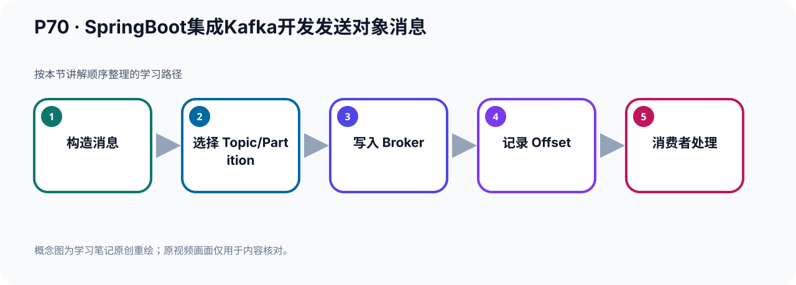
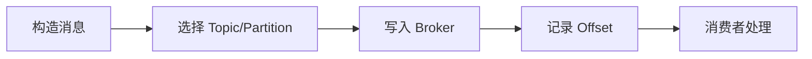

# P70：SpringBoot集成Kafka开发发送对象消息

> 笔记编号 70/156 · 时长 05:20 · [打开原视频 P70](https://www.bilibili.com/video/BV14J4m187jz?p=70)

[← P69: 非阻塞式获取生产者消息发送的结果](../05-spring-boot-basics/p069-非阻塞式获取生产者消息发送的结果.md) · [返回本章](./README.md) · [P71: SpringBoot集成Kafka自动装配的KafkaTemplate →](../05-spring-boot-basics/p071-SpringBoot集成Kafka自动装配的KafkaTemplate.md)

## 先看结论

> 这节把“SpringBoot集成Kafka开发发送对象消息”放回消息链路，沿 Producer、Broker、Partition、Offset 与 Consumer 追踪数据和元数据如何流动。它服务于本章目标：搭建 Spring Boot 工程，掌握 KafkaTemplate、消息发送、监听消费、偏移量和对象序列化。

## 老师怎么一步步讲

1. 第 1 步，围绕“SpringBoot集成Kafka开发发送对象消息”完成构造消息。
2. 第 2 步，围绕“SpringBoot集成Kafka开发发送对象消息”完成选择 Topic/Partition。
3. 第 3 步，围绕“SpringBoot集成Kafka开发发送对象消息”完成写入 Broker。
4. 第 4 步，围绕“SpringBoot集成Kafka开发发送对象消息”完成记录 Offset。
5. 第 5 步，围绕“SpringBoot集成Kafka开发发送对象消息”完成消费者处理。

## 老师的补充说明

下面按原声顺序整理老师的完整讲解脉络。保留原因、案例、对比、操作过程、边界条件和口头提醒；删除重复语气词，并把长口语拆成适合阅读的短段落。

> 技术术语已经过统一校正；仍无法确认的人名或口头英文会保留原意，并通过右侧时间范围返回视频核对。

### 先明确：SpringBoot集成Kafka开发发送对象消息要解决什么 · 00:00–00:54

那接下来我们就继续看一下，我们这个生产者发送这个对象消息。我们看一下这个问题啊。我们在前面的这个代码测试中啊，我们这些发送消息，都是发了一个字幕串。hello，Kafka，都是发的字幕串。这些都是发的一个字幕串，再发的一个字幕串，上面这些都是字幕串。所有的消息呢，都发了这个字幕串。那下面呢，我们看一下，我们来发一个对象，那我们写一个新方法，写个新方法，发对象，那就是写一个Public08这个方法，Send08这个方法。这个8。

那发的时候，我又采用那个默认的发送啊，就发到默认那个Topic里面去。那么调这个方法。

### 跟着老师操作，并观察运行结果 · 00:54–01:34

调整一下去发。这个反归结果，我们前面已经介绍过了，因为这个反归结果，我就不再去获取结果了。我直接去发一下，测试这个发送。那发送呢，我们这些方，这个分区，这个分区这里，我们给它一个空啊。这个给它空的话呢，那么就让Kafka自己去分区。分区给个空，分区是空。分区是空，是空。让Kafka，让Kafka自己，自己呢。去这个，去分区。他自己的决定，把这个消息发到哪个分区，他自己去决定啊，让自己去决定。

### 老师用例子进一步解释 · 01:35–02:52

去决定，把这个消息发到哪个分区，啊，那个分区。他自己去决定，我们这不设置，我们之前写了零，那么发到零这个分区，那写个空，他就发到他自己去决定。当然目前我们只有一个分区，那肯定也是往零这个分区去发送。这是消息这个时间。可以，然后这个是他的这个数据，好，数据这里来我们先要发个对象，比如说我们发个U的对象，啊，发个对象。那么U的对象目前没有，那我这里冲那个U的对象，啊，写一个U的对象，我们发个对象消息，好，那这个是U的。写个模型类，啊，模特包，让写个U的。

那么这个类里面最好给它几个字段啊，啊，写个int，一个id，然后给它一个，呃，手机号。再比如说给它一个，嗯，给它一个生日啊，带一头，好，生日，Boss Day，Boss Day，好，Boss Day，好，那么就给三个字段，然后呢，我们用Lombok来给它试试点试点给它的方法，带个数据，然后给它搞一个构建器模式。没有参数的构建器，再加上所有参数的构建器，所有参数的构建器，再加一个bue的数据，搞一个构建器模式。

### 最后验证结果，并收束本节结论 · 02:53–05:14

那这样后呢，我们这个类就准备好了，啊，这个对象，啊，这个类准备好了，准备好了，之后呢，我们就发这个类啊，那我们这里呢，准备一个呢，来，这个对象。那就是U的点，试试点，对吧，试试点，然后首先试试它的那个id，好，id给它个字，id，然后给它一个手机号，好，给它个手机号。然后给它一个三字，是吧，bue的，啊，六一个，三字，代，三字，然后最终掉下bue的方法，这样我们就构建一个U的对象，好，这个时候把U的对象来发出去，那这个方来发U的对象，发出去，对吧。

发现之后你看这方它，不错，啊，原因是什么呢？原因是我们这个default，啊，我们所使用这个temporate这个类，它的这个犯行里面啊，它这个犯行里面，它其实这个犯行里面写是使距使距，你看，在这里方呢。

我们定的这个，它的这个q是使距，直是使距，啊，因为这个temporate里面，它这两个犯行啊，就是那个消息的q和消息的直，这个消息它可以指定q，也可以不指定q，啊，你可以给它指定一个q，但是直你肯定要指定个直，对吧，那就，那就说这个犯行里面指定的是我们这个消息的q是什么类型，我们这个消息的直是什么类型，好，它目前呢我们这边定的就是使距使距，所以你现在要指，你要发个yout of对象，那么它转换就报错了，所以它没法，啊，这个类型不匹配，所以这方是报错，那么小怎么办呢？

那我们定一个新的这个temporate，就是我们注入个新的了，这里，注入一个，注入一个啊，我们把这个叫二，然后把这个把这个指的感觉，我不接个它，这里可以了，对吧，我不接个它，哎，我这边之前有一个，把你去掉一下，去掉一下，之前有一个，好，那这样就可以了啊，或者说你这些是一个yout of也可以，当你写yout of的话，它不太通用，啊，以后我如果发一个定单对象，那些发不出去了，倒是转换类型会报错，所以这方也许个yout of它不太通用，说我们写个二不七个的代表通用啊，好，那我们重新注入一个这个temporate，那为什么我可以这样注入呢，上面这注入可以，那么这边注入也可以啊，哎，主要就是啊，我们这个Kafkatemporate是十分不得自动装配技能的，我们看一下它是怎么自动装配的啊，好，那下面我们去看一下，。

## 放进整套课

本节属于 **Spring Boot 集成 Kafka**。这一章要解决的是：搭建 Spring Boot 工程，掌握 KafkaTemplate、消息发送、监听消费、偏移量和对象序列化。

这节位于消息链路上。要顺着“发送端—Broker—分区日志—消费端”看数据和元数据怎样流动。

### 记忆路线

```mermaid
flowchart LR
    N0["构造消息"]
    N1["选择 Topic/Partition"]
    N0 --> N1
    N2["写入 Broker"]
    N1 --> N2
    N3["记录 Offset"]
    N2 --> N3
    N4["消费者处理"]
    N3 --> N4
```

## 用在工作里

| 项目 | 内容 |
|---|---|
| 先回答 | 先明确消息从哪里产生、写入哪个 Topic、由谁消费。 |
| 立刻做 | 复现发送、Broker 写入和消费者处理的完整链路。 |
| 留下证据 | 记录 Partition、Offset、序列化结果和消费端输出。 |

## 关键术语

- **Kafka：** Apache 开源的分布式事件流平台，常用于高吞吐消息传递、数据管道和流处理。
- **Topic：** 事件的逻辑分类。生产者向 Topic 写数据，消费者从 Topic 读取数据。

## 最容易踩的坑

能发送成功不代表业务处理成功；序列化、分区、确认机制和消费进度需要分别观察。

## 自测

1. 不看笔记，用自己的话解释“SpringBoot集成Kafka开发发送对象消息”解决了什么问题。
2. 按顺序复述：构造消息、选择 Topic/Partition、写入 Broker、记录 Offset、消费者处理。
3. 如果运行结果和老师不同，你会先检查哪三个输入或环境条件？

## 学完检查

- [ ] 我能不看视频复述本节完整思路
- [ ] 我能指出关键命令、配置、类或接口的作用
- [ ] 我能解释画面中的输入与输出为什么对应
- [ ] 我读完了老师的详细讲解正文，没有只看路线图和要点
- [ ] 我完成了本节自测或复现实验

## 需要核对原话时

[查看本节带时间戳的完整 ASR](./transcripts/p070-SpringBoot集成Kafka开发发送对象消息-ASR.md)。主笔记负责理解与实践；ASR 页面负责逐句完整性复核。
