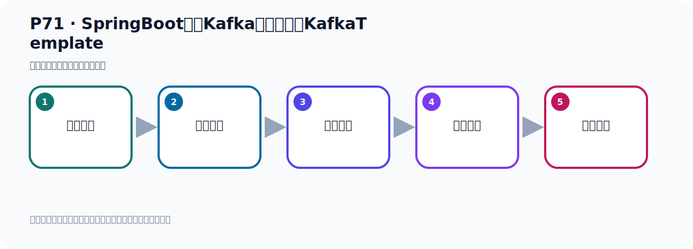

# P71：SpringBoot集成Kafka自动装配的KafkaTemplate

> 笔记编号 71/156 · 时长 04:06 · [打开原视频 P71](https://www.bilibili.com/video/BV14J4m187jz?p=71)

[← P70: SpringBoot集成Kafka开发发送对象消息](../05-spring-boot-basics/p070-SpringBoot集成Kafka开发发送对象消息.md) · [返回本章](./README.md) · [P72: SpringBoot集成Kafka开发发送对象消息序列化 →](../05-spring-boot-basics/p072-SpringBoot集成Kafka开发发送对象消息序列化.md)

## 这节到底讲什么

**核心主题：SpringBoot集成Kafka自动装配的KafkaTemplate。**

这节继续完善 Kafka 的完整知识链。请按老师的讲解顺序理解动机、做法和结果。
本节属于“Spring Boot 集成 Kafka”这一章；放在全章里看，它的作用是：搭建 Spring Boot 工程，掌握 KafkaTemplate、消息发送、监听消费、偏移量和对象序列化。

## 本节路线

## 老师的完整讲解顺序（ASR 辅助复核）

> 下面按时间顺序保留经过基础术语替换的 ASR，方便核对老师是否提到某个细节。
> 人名、命令、代码和英文参数仍可能识别错误；准确结论以本节白话说明、代码块和实操速查表为准。

### 1. 00:00–00:48

下面我们看一下，为什么我们可以注入这两个类型，也可以注入这个类型，它为什么可以用。这里我们就看一下，史文布桃里面的自动装配，它已经帮我们集成好了，在这个并。我们下面让下面别爆出，我们下面这一边改成2，我们下面再爆出这一方。我们这里就用Time Rate 2来发送，这样的话它就不如爆出了，它的值是而不尽的。这样我们到时就可以发送了，这个方法就写好了。写好了，然后我就看看我们为什么可以这样注入，这个时候我们把其他地方关掉。我们这个项目它是史文布的整合掉Kafka，那么在史文布桃里面，它有一个自动装配，我们知道史文布桃里面都有这种装配。

### 2. 00:48–01:37

那么它自动装配的时候，它是用了这个架包里面的，叫什么呢？史文布的实大桃叫Output Convict，这里面是自动装配。我们现在是用了史文布的3.2这个版本，那么在这个Metal E4这里面，然后在史文布里面，然后有个这样一个文件，Input是这个文件，我们打开这个文件，那么这里面的这些配置内都是史文布桃启动之后，它会读取这些配置内的，然后根据这个条件注解来进行筛选，符合条件的这个配置内就会被夹载，那么被夹载以后，那么它就会进行这个配置。那我们在这里收一下Kafka，是吧，Kafka。好，收下Kafka之后，我们就收到这里面的地方，就这一段配置内，也就是在史文布桃程序它启动的时候，它会夹载这个配置内，。

### 3. 01:37–02:24

这里面的所有配置内都会夹载，只不过来有一些配置内，由于它不满动条件，因为它还有条件重解，不满动条件，所以它就导致其他的内可能没有夹载，但是我们这个内会被夹载，这个配置内你看一下。好，应该它是有条件重解的，当你这个可能是胖下，如果你有这个内的话，那就是你如果已经加拿了这个Spring Boot桃的这个相关的这个整合Kafka的这个架包，那么它就有这个内，有这个内它就可以帮你自动发配置，这就是自动发配置，那么在自动发配置里面，它会帮我们创建这个Kafkatemplate，我们看一下在那里面，就在这一方创建一个B，创造B，那么这里面就创建一个Kafkatemplate，这就是我们Kafkatemplate，。

### 4. 02:24–03:23

好，那么创建之后，它这个里面的范形是问号问号，是不确定的，对吧，你看它这个B在最终返回了手呢，这个返回了手，返回这个template，它其实这个template在哪里呢，在这地方吗，它就能返回这个template，那么它溜了手，你看溜了手template是这样一个template，Kafkatemplate，那就是说它这个剑和直，是obj，obj，那你写个剑写个矢菌，只写个obj点也可以，那你剑写个obj的，只写个obj点也可以，所以我们注入呢，之前我们这两个都写了矢菌，因为矢菌也是obj的一个，继承obj，所以用矢菌矢菌你可以注入这个B可以的，因为在它的容器中已经配好了这个B，好，所以我们可以到时候可以注入这个B，这是容器中就配好了，它有这安排B注解，容器中有这个B，所以我们这边可以注入，你注入矢菌矢菌可以，注入这个矢菌obj点也可以，那你注入一个什么呢，注入个obj点，obj点也可以，。

### 5. 03:24–04:02

注入个这个矢菌是obj的，obj的，比如这个叫三，那么这样它也是可以的，obj，obj也可以，好，那么这个就是我们使为Boot，在何卡木卡那时候，它你自动帮你在容器中已经配好了这个B，所以我们可以直接使用，原因在这里，好，那么这就是我们这个使为Boot，自动装配，把我们配置好了这个B，那么这个矢菌里面你可以这样写，好，那我们这个关于注入的这个B就，这个我们分析完了，好，下面我们开始去发送有消息啊。

## 关键术语

- **Kafka：** Apache 开源的分布式事件流平台，常用于高吞吐消息传递、数据管道和流处理。
- **KafkaTemplate：** Spring for Apache Kafka 提供的高层发送 API。

## 完整原声逐段记录

[查看本节带时间戳的本地 ASR](./transcripts/p071-SpringBoot集成Kafka自动装配的KafkaTemplate-ASR.md)。主笔记负责可读性和术语校正；ASR 页面负责完整性复核。

## 读完记住

- 本节主题是 **SpringBoot集成Kafka自动装配的KafkaTemplate**，它服务于本章目标：搭建 Spring Boot 工程，掌握 KafkaTemplate、消息发送、监听消费、偏移量和对象序列化。
- 理解顺序是：问题背景 → 关键对象 → 处理过程 → 结果验证 → 应用边界。
- 学习时要同时核对老师的解释、画面中的配置/代码，以及最终运行结果。

## 最容易踩的坑

不要把孤立 API 或配置项当成完整能力；始终把它放回生产、存储、消费或集群链路中理解。

## 自测

1. 不看笔记，用自己的话解释“SpringBoot集成Kafka自动装配的KafkaTemplate”解决了什么问题。
2. 按顺序复述：问题背景、关键对象、处理过程、结果验证、应用边界。
3. 如果运行结果和老师不同，你会先检查哪三个输入或环境条件？

## 学完检查

- [ ] 我能不看视频复述本节完整思路
- [ ] 我能指出关键命令、配置、类或接口的作用
- [ ] 我能解释画面中的输入与输出为什么对应
- [ ] 我核对过完整 ASR，没有跳过老师的补充说明
- [ ] 我完成了本节自测或复现实验
