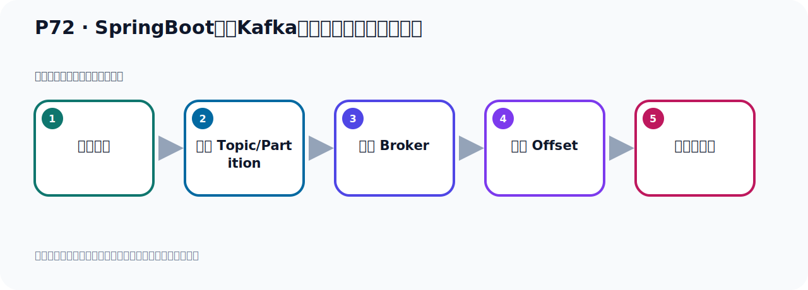
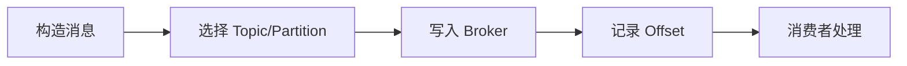

# P72：SpringBoot集成Kafka开发发送对象消息序列化

> 笔记编号 72/156 · 时长 09:39 · [打开原视频 P72](https://www.bilibili.com/video/BV14J4m187jz?p=72)

[← P71: SpringBoot集成Kafka自动装配的KafkaTemplate](../05-spring-boot-basics/p071-SpringBoot集成Kafka自动装配的KafkaTemplate.md) · [返回本章](./README.md) · [P73: SpringBoot集成Kafka开发发送消息的KafkaTemplate注入 →](../05-spring-boot-basics/p073-SpringBoot集成Kafka开发发送消息的KafkaTemplate注入.md)

## 这节到底讲什么

**核心主题：SpringBoot集成Kafka开发发送对象消息序列化。**

这节位于消息链路上。要顺着“发送端—Broker—分区日志—消费端”看数据和元数据怎样流动。
本节属于“Spring Boot 集成 Kafka”这一章；放在全章里看，它的作用是：搭建 Spring Boot 工程，掌握 KafkaTemplate、消息发送、监听消费、偏移量和对象序列化。

## 本节路线

## 老师的完整讲解（按视频顺序校正）

> 下面保留老师的完整讲解顺序，并修正 Kafka、Java、ZooKeeper、
> Topic、Partition、Offset 等常见识别错误。它不是压缩摘要；原始 ASR 在后面单独保留。

### 1. 00:00–00:58

接下来我们就开始发送这个消息。在这里发送消息的代码就写好了。写好之后我们就开始在这边发送一下。发送一下我们在这个测试内发一下。这里把下面折起来。测试内发一下我们在这里写一个08这个方法。测试08。08这个方法掉我们这个8这个方法。8这个方法就是我们发送对象。把这个钱关掉一下。对吧？发送对象掉这个，它是发送一个优势对象。它是发到末日的Topic里面去了。末日的Topic就是我们这个地方配的这个末日Topic。D4的Topic。目前我们在这边看一下，Kafka这个插件里面看一下。我们在这里点一下刷新。刷新之后我们现在这个D4的Topic。

### 2. 00:58–01:47

这里面目前有9个消息，有9个。我们刷新看一下。刷新刷新9个，那我们再发一个消息，那边就10个了。再发消息就10个，好，那这个是我们去发送。好，就到这里去发，对吧？点这个右键，运行一下。好，去发送一个对象消息，一个优势对象。好，那么此时，当我们去发送这个优势对象消息的时候，发现它已经爆出了，我先拖一下日志。再爆出了，在下面，好，爆出了。爆出了说，这个叫sorto laser行，是序列化器异程。序列化器异程，它说不能转换这个值。什么值呢？我们这个值是优的，就是你这个优的对象这个值是吧？这个转换这个value这个值啊。它说要转到哪去呢？

### 3. 01:47–02:37

它说去转换到这个，这个什么？sorto laser转成一个自捕串的序列化器对象。哎，那这个异程了，序列化器异程。啊，也就是这个值的序列化器发生异程了，就是我们发个对象来，默认就发不出绪。也就是我们的这个发送的消息啊，你存到Kafka的时候，它里面需要把你这个消息要做一个序列化器。那么它默认是用自捕串序列化器，它默认用的是自捕串序列化器。所以导致我们的消息呢，就发不出绪了。因为你现在发个对象，你之前我们这边发一个自捕串都没有问题。是吧？你现在发个对象，这个对象呢，转成一个自捕串的方式，它用自捕串去序列化器的时候就不行了。好，所以它就出那个转换这个异程，那这个都需要怎么办呢？

### 4. 02:37–03:23

这个时候我们需要在这个生产者这边，要配个东西，那就是我们这个生产者。这个生产者我们之前看过，它里面有几十个配置，是吧？二十几个，那你给点一下，你看，点一下生产者，是吧？里面里面有二十几个配置，当然这个画横线的这个是不能用的，这个红色的这个不能用的，好，上面这家具有二十几个，是吧？二十几个那，就是你要对它那个值呢，就这个成熟的，叫值的，so-layer，序列化器这个内，就是这个值用什么内，进行序列化器，是吧？我们要配这个成熟，那就是它点这个value，那就这个，它跑下面去了，我们把它切到上面去了，放这位置。好，这里，那么这个值的序列化器用什么内呢？

### 5. 03:23–04:14

我们看一下它木认是什么，看一下，点进来，点之后就是这个值的序列化器，点这里，它木认啊，它等于String，这个序列化器，木认是等于汤，是吧？木认是这个序列化器，所以它木认是这个序列化器，木认是这个序列化器，是吧？那么我们现在要干嘛呢？我们现在是一个对象，那里用String序列化器来就不行了，你看它这个序列化器内，点进来看一下，在序列化器内，它的合一方法，那就是这个，就是这个序列化器的方法，你看，它接收的是一个，这是你的Topic，是吧？这是你的这个数据，这个数据是个字物串的，这个字物串你看它直接get a bitus，然后这是个编码，是吧？编码格式，那就是直接调这个方法，去拿这个数据，。

### 6. 04:14–04:57

但是我们现在是个对象，那么它无法这么去操作，所以它出现一个这个异常，转换异常，序列化器异常，那我们要换一个实现啊，换一个实现内，那这个时候呢，我们看看，它木认是这个内形那么点到它的接口，它接口是这个solider这个接口，那么这个接口，你还是Kafka，啊，这个包里的题目的，那么看看这个接口，它有哪些实现，你看，我们使均一solider实现这个接口，那么这个接口，从那使均之外，还有没有其他实现，我们按一个contrl去可以看一下，你看，这是它的接口，那它下面有这么多实现，这应该有几十个，对吧？好，几十个，那你看看，你是对象的话，用哪一个比较合适呢？

### 7. 04:57–05:50

对象的话，对象的话呢，我们通常啊，会使用一个叫接声区的话，就是这个，它是比较适合的，用接声区的话，对吧？哎，点个接声solider，就是这个对象，用它序列化器，点一下啊，就这个叫接声solider，用它来序列化器，就是把你这个对象转成接声，然后呢，发动到Kafka，那你看，它这里面的这个方法，我们展的左边这个结果，它太长了，那么它在序列化器的时候，应该是solider，就这个方法，这个，对吧？solider，我们右边折下，那么你看它这个，你这个数据呢，是个犯行的，你可以是任何的对象，对吧？那你这个犯行的这个数据，这数据怎么转呢，你看，它是，它是这个，当然它转的时候，。

### 8. 05:50–06:30

在掉这里之后，掉这里啊，掉这个方法，好，我们点进来，掉这里，掉这里之后，你看，solider，这是你的这个数据对象，那么它转的时候，你看它，掉这个方法，转成一个接声，把你的数据转成接声，是吧？这么接声，那么它掉的是write value as values，变成一个字节数组，反回，变成一个字节数组的方式，写到Kafka，那么它这个write是什么，它这个write是一个什么，是一个openget的这个write，是这个类的点的，是这个openget的这个write，这个类的是我们接个谁，这个价包提供的，那个接个是这个价包，提供的，因为它这个write类，把你这个对象转这个字节数组，。

### 9. 06:30–07:19

然后写到Kafka，好，那我们可以用这个类的，来实现这个，这个转换，实现去的话，那么这样的话比较合适，好，那我们就把这个类的复正一下，右键然后呢，这个复制，复制它整个这个包加类名，好，那此时我们这个讯息的话就改成了，这个地方的空格一下，改成这个类就写成，对吧，因为之前的末日的史军说他异常，那我现在转他，转他之后，我们这个手再来发出消息，看看能不能发成功，好，那此时呢，我们再来去发一下，在这地方，好，这个手再去发送，右键能发送，好，那这个手你看，他就发成功了，这里面都是打勾的，打勾了就正常的，那你看是，我们这边看一下，没有异常发出去了，。

### 10. 07:19–08:30

之前我们看这边是9个是吧，9个消息我们再点开看一下，这边是，之前是9个，先刷新看一下，刷新，刷新一下，现在是10个了，10个消息，那说明消息就发出去了，所以当你发这种对象的消息，或者是其他那些消息，考虑你末日的那个史军的训练话，是会出现异常的，那这个时候呢，你需要指定一个合适的训练话器有这么多，这么多，对吧，用这个对象你可以用这个接着训练话器，当着他还有个训练话器，比如说这个对象你也可以用什么呢，偷史军训练话器，用这个也可以，偷史军嘛，转成正串，把对象直接调一下偷史军方法，那你看他的训练话，这个这个，偷史军这个训练话，是吧，他怎么做的呢，你看，这个就他吧，他然后调这个结构，调这个方法，这个方法就在这里是吧，好，那就是你这个对象这个数据，数据怎么办呢，这数据你看，直接把这个数据调偷史军方法，然后get a beta识，也变成一个字节数组，变成个字节数组写中这个Kafka，写出Kafka，好，所以这个手来就是把你对象直接偷史军也可以，那我们试一下，你用这个发送来也是可以的，用这个训练话也可以，我们复制一下，。

### 11. 08:31–09:30

复制，好，复制我们把小鱼把这个方改一下，训练话器改一下，好，感觉他之后了，我们这个时候再发送一下，在这边去发送，右键发送，我们之前是十条消息，我们先看一下他能不能发出去，好，你看这两个是勾打勾的，打勾的说明他正常那么一层这个日志没有一层是正常的，是正常的，那我们的消息就发出去了，看一下这个Kafka的数据啊，之前是十条，我们刷新一下，刷新，来，十一条了，好，这就是我们发送对象消息，木轮情况下，考虑他会有训练话异常，我们需要指定一个合适的训练话器，对这个值指定一个训练话器，这样你的消息才可以正直的发生出去，好，那么以上这个呢，就是我们发送对象消息，对象消息首先注入了这个模板内这个放行改一下，对吧，发送然后再发送一个对象，好，发对象你要指定一下那个训练话器，多个配置，直接训练话器，。

### 12. 09:31–09:34

好，这样你才可以发出一个对象这个消息。

## 关键术语

- **Kafka：** Apache 开源的分布式事件流平台，常用于高吞吐消息传递、数据管道和流处理。
- **Topic：** 事件的逻辑分类。生产者向 Topic 写数据，消费者从 Topic 读取数据。

## 完整原声逐段记录

[查看本节带时间戳的本地 ASR](./transcripts/p072-SpringBoot集成Kafka开发发送对象消息序列化-ASR.md)。主笔记负责可读性和术语校正；ASR 页面负责完整性复核。

## 读完记住

- 本节主题是 **SpringBoot集成Kafka开发发送对象消息序列化**，它服务于本章目标：搭建 Spring Boot 工程，掌握 KafkaTemplate、消息发送、监听消费、偏移量和对象序列化。
- 理解顺序是：构造消息 → 选择 Topic/Partition → 写入 Broker → 记录 Offset → 消费者处理。
- 学习时要同时核对老师的解释、画面中的配置/代码，以及最终运行结果。

## 最容易踩的坑

能发送成功不代表业务处理成功；序列化、分区、确认机制和消费进度需要分别观察。

## 自测

1. 不看笔记，用自己的话解释“SpringBoot集成Kafka开发发送对象消息序列化”解决了什么问题。
2. 按顺序复述：构造消息、选择 Topic/Partition、写入 Broker、记录 Offset、消费者处理。
3. 如果运行结果和老师不同，你会先检查哪三个输入或环境条件？

## 学完检查

- [ ] 我能不看视频复述本节完整思路
- [ ] 我能指出关键命令、配置、类或接口的作用
- [ ] 我能解释画面中的输入与输出为什么对应
- [ ] 我核对过完整 ASR，没有跳过老师的补充说明
- [ ] 我完成了本节自测或复现实验
