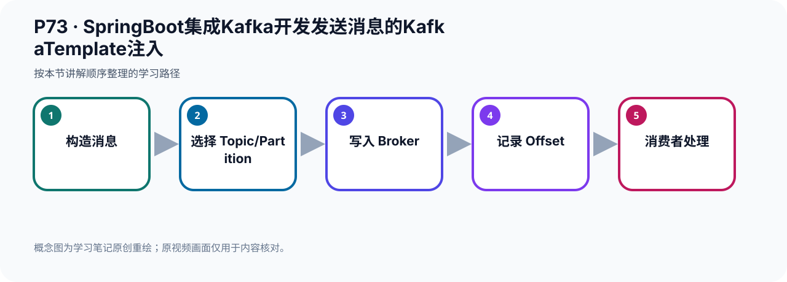
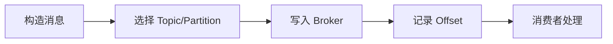

# P73：SpringBoot集成Kafka开发发送消息的KafkaTemplate注入

> 笔记编号 73/156 · 时长 02:39 · [打开原视频 P73](https://www.bilibili.com/video/BV14J4m187jz?p=73)

[← P72: SpringBoot集成Kafka开发发送对象消息序列化](../05-spring-boot-basics/p072-SpringBoot集成Kafka开发发送对象消息序列化.md) · [返回本章](./README.md) · [P74: Kafka的核心概念Replica副本 →](../06-producer-internals/p074-Kafka的核心概念Replica副本.md)

## 先看结论

> 这节把“SpringBoot集成Kafka开发发送消息的KafkaTemplate注入”放回消息链路，沿 Producer、Broker、Partition、Offset 与 Consumer 追踪数据和元数据如何流动。它服务于本章目标：搭建 Spring Boot 工程，掌握 KafkaTemplate、消息发送、监听消费、偏移量和对象序列化。

## 老师怎么一步步讲

1. 第 1 步，围绕“SpringBoot集成Kafka开发发送消息的KafkaTemplate注入”完成构造消息。
2. 第 2 步，围绕“SpringBoot集成Kafka开发发送消息的KafkaTemplate注入”完成选择 Topic/Partition。
3. 第 3 步，围绕“SpringBoot集成Kafka开发发送消息的KafkaTemplate注入”完成写入 Broker。
4. 第 4 步，围绕“SpringBoot集成Kafka开发发送消息的KafkaTemplate注入”完成记录 Offset。
5. 第 5 步，围绕“SpringBoot集成Kafka开发发送消息的KafkaTemplate注入”完成消费者处理。

## 老师的补充说明

下面按原声顺序整理老师的完整讲解脉络。保留原因、案例、对比、操作过程、边界条件和口头提醒；删除重复语气词，并把长口语拆成适合阅读的短段落。

> 技术术语已经过统一校正；仍无法确认的人名或口头英文会保留原意，并通过右侧时间范围返回视频核对。

### 先明确：SpringBoot集成Kafka开发发送消息的KafkaTemplate注入要解决什么 · 00:00–00:53

刚才发生了一个对象的消息，主要是配置一个训练花器。这个是关一下，打开一下我们的配置文件。当然，这里也可以配一个键的训练花，这是指的训练花。它里面还有一个叫Kid训练花，有个这个配置箱。Kid，Serializer，Serializer，就这个了。叫Kid训练花。Kid训练花末日也是字幕串，点击看一下。Kid训练花末日也是字幕串的。如果说你对这个Kid，你想指定训练花方式也是可以的。末日是它，末日是字幕串训练花。这个是值，值末日是训练花，是这个训练花。

那么Kid末日也是这个训练花，字幕串训练花。所以这个一般计问下来，我们Kid都是写个字幕串。

### 继续拆解选择 Topic/Partition · 00:53–01:40

所以这一块我们一般不用去调整，所以这个你可以不配。Kid也可以不配。这是Kid，末日也是用了字幕串训练花。这是这个。然后就是我们在发动消息的时候，在这里面。我们上面不是注入了三个吗？这里面是传使句一使句，这里面是传使句，我不记得。那么这里面是传ObG的，我们用它发消息能不能发出去？也是可以的。看一下，怎么感觉ObG3。ObG3，它这个G是ObG的，值也是ObG的。那我G是写个使句可不可以？可以，因为使句它也是计成ObG的。然后值是ObG的，是我们的U的。

### 最后验证结果，并收束本节结论 · 01:40–02:36

用这个3对象，用注入这个对象也是可以的。所以这个你表示了，我们注入了所这个犯行例子里面可以写这三种情况，都是可以的。都是可以的。那么再发一下。这里改成Tibetli3再发一下，在这个测试这里。然后这里右键发送，掉这个8方法，你看这个8方法就是我们刚刚Tibetli3去发送。那这里右键发送，我们看原来是多少个，原来是11个。就11个，11个我们这个是再发一个右键发送。那么发送没有问题，对吧，消息已经发出去了。发成困难，没有异常。

没有异常，然后看一下我们这个Kafka的数据，之前是11个，我们这次刷新一下，刷新，好，12条数据。那这就是我们的消息的发送，好，再次消息发送。

## 放进整套课

本节属于 **Spring Boot 集成 Kafka**。这一章要解决的是：搭建 Spring Boot 工程，掌握 KafkaTemplate、消息发送、监听消费、偏移量和对象序列化。

这节位于消息链路上。要顺着“发送端—Broker—分区日志—消费端”看数据和元数据怎样流动。

### 记忆路线

```mermaid
flowchart LR
    N0["构造消息"]
    N1["选择 Topic/Partition"]
    N0 --> N1
    N2["写入 Broker"]
    N1 --> N2
    N3["记录 Offset"]
    N2 --> N3
    N4["消费者处理"]
    N3 --> N4
```

## 用在工作里

| 项目 | 内容 |
|---|---|
| 先回答 | 先明确消息从哪里产生、写入哪个 Topic、由谁消费。 |
| 立刻做 | 复现发送、Broker 写入和消费者处理的完整链路。 |
| 留下证据 | 记录 Partition、Offset、序列化结果和消费端输出。 |

## 关键术语

- **Kafka：** Apache 开源的分布式事件流平台，常用于高吞吐消息传递、数据管道和流处理。
- **KafkaTemplate：** Spring for Apache Kafka 提供的高层发送 API。

## 最容易踩的坑

能发送成功不代表业务处理成功；序列化、分区、确认机制和消费进度需要分别观察。

## 自测

1. 不看笔记，用自己的话解释“SpringBoot集成Kafka开发发送消息的KafkaTemplate注入”解决了什么问题。
2. 按顺序复述：构造消息、选择 Topic/Partition、写入 Broker、记录 Offset、消费者处理。
3. 如果运行结果和老师不同，你会先检查哪三个输入或环境条件？

## 学完检查

- [ ] 我能不看视频复述本节完整思路
- [ ] 我能指出关键命令、配置、类或接口的作用
- [ ] 我能解释画面中的输入与输出为什么对应
- [ ] 我读完了老师的详细讲解正文，没有只看路线图和要点
- [ ] 我完成了本节自测或复现实验

## 需要核对原话时

[查看本节带时间戳的完整 ASR](./transcripts/p073-SpringBoot集成Kafka开发发送消息的KafkaTemplate注入-ASR.md)。主笔记负责理解与实践；ASR 页面负责逐句完整性复核。
