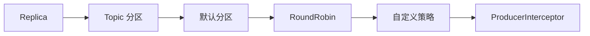

# 第 6 章：副本、分区策略与生产者链路

理解副本与分区，验证默认、轮询和自定义分区策略，并串起生产者发送流程与拦截器。

## 整章核心讲解

一个 Topic 可以有多个 Partition，每个 Partition 又可以有多个 Replica。分区提供并行度，副本提供容错；两者解决的是不同问题。

生产者先确定 Topic，再根据显式 Partition、key 哈希或无 key 策略选择分区，然后经过序列化、拦截器、批次累积和网络发送。分区策略会影响同 key 顺序、负载均衡和批处理效率。

## 先看懂整章数据流

## 本章逐节目录

1. [P74 Kafka的核心概念Replica副本](./p074-Kafka的核心概念Replica副本.md) · 05:25
2. [P75 Kafka命令行脚本创建topic并指定分区和副本](./p075-Kafka命令行脚本创建topic并指定分区和副本.md) · 09:22
3. [P76 SpringBoot集成Kafka创建topic并指定分区和副本](./p076-SpringBoot集成Kafka创建topic并指定分区和副本.md) · 08:29
4. [P77 SpringBoot集成Kafka创建topic并指定分区和副本](./p077-SpringBoot集成Kafka创建topic并指定分区和副本.md) · 07:44
5. [P78 生产者发送消息的分区策略测试](./p078-生产者发送消息的分区策略测试.md) · 04:09
6. [P79 生产者发送消息的分区策略源码分析](./p079-生产者发送消息的分区策略源码分析.md) · 09:33
7. [P80 生产者发送消息的分区策略源码分析](./p080-生产者发送消息的分区策略源码分析.md) · 10:59
8. [P81 生产者发送消息的分区策略源RoundRobinPartitioner](./p081-生产者发送消息的分区策略源RoundRobinPartitioner.md) · 04:30
9. [P82 生产者发送消息配置分区策略RoundRobinPartitioner](./p082-生产者发送消息配置分区策略RoundRobinPartitioner.md) · 08:32
10. [P83 生产者发送消息配置分区策略RoundRobinPartitioner测试](./p083-生产者发送消息配置分区策略RoundRobinPartitioner测试.md) · 07:50
11. [P84 生产者发送消息自定义分区策略](./p084-生产者发送消息自定义分区策略.md) · 06:52
12. [P85 生产者发送消息自定义分区策略](./p085-生产者发送消息自定义分区策略.md) · 04:57
13. [P86 Kafka生产者发送消息的流程](./p086-Kafka生产者发送消息的流程.md) · 05:44
14. [P87 Kafka自定义消息发送的拦截器](./p087-Kafka自定义消息发送的拦截器.md) · 07:00
15. [P88 Kafka自定义消息发送的拦截器测试](./p088-Kafka自定义消息发送的拦截器测试.md) · 05:21

## 本章学习方法

1. 先把上面的流程图画在纸上，明确每节位于哪一步。
2. 读逐节正文，再用 ASR 核查老师的补充、口头提醒和演示顺序。
3. 遇到命令或代码课，必须记录“输入—配置—输出—失败原因”。
4. 学完后从头解释整章，不以“视频播放完”作为完成标准。
