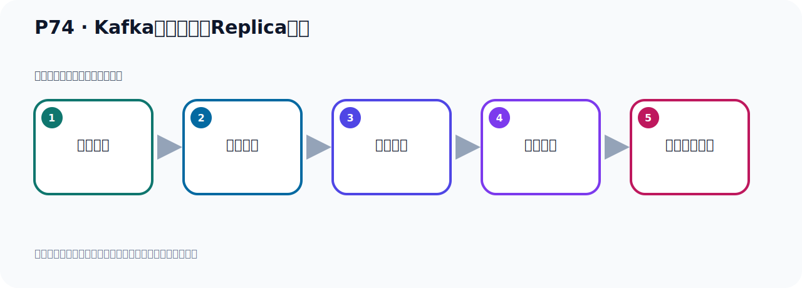

# P74：Kafka的核心概念Replica副本

> 笔记编号 74/156 · 时长 05:25 · [打开原视频 P74](https://www.bilibili.com/video/BV14J4m187jz?p=74)

[← P73: SpringBoot集成Kafka开发发送消息的KafkaTemplate注入](../05-spring-boot-basics/p073-SpringBoot集成Kafka开发发送消息的KafkaTemplate注入.md) · [返回本章](./README.md) · [P75: Kafka命令行脚本创建topic并指定分区和副本 →](../06-producer-internals/p075-Kafka命令行脚本创建topic并指定分区和副本.md)

## 这节到底讲什么

**核心主题：Kafka的核心概念Replica副本。**

这是一节概念课。老师先交代背景，再给出定义、组成和作用，最后把概念放回 Kafka 整体架构。
本节属于“副本、分区策略与生产者链路”这一章；放在全章里看，它的作用是：理解副本与分区，验证默认、轮询和自定义分区策略，并串起生产者发送流程与拦截器。

## 本节路线

## 老师的完整讲解顺序（ASR 辅助复核）

> 下面按时间顺序保留经过基础术语替换的 ASR，方便核对老师是否提到某个细节。
> 人名、命令、代码和英文参数仍可能识别错误；准确结论以本节白话说明、代码块和实操速查表为准。

### 1. 00:00–00:59

接下来我们接着看一下Kafka它里面的核心概念叫Replica副本。副本是什么意思呢？Replica副本是为了实现备份功能，数据的备份，保证我们Kafka集群中某个节点发生宕机时该节点上的Partition数据不丢失。我们的消息是发生到Topic里面的，Topic里面它又分成了多个Partition，一个或多个Partition。那我们的数据是在Partition里面，它为了保证Partition数据不丢失，让我们Kafka在发生宕机的时候可以继续工作。某个节点发生宕机可以继续工作，那么它又提供了一个副本机制，也就是把你的数据要备份一个。那么一个Topic的每个分区它都有一个或者多个副本。

### 2. 01:01–01:54

那我们看一下下面这个图，我们把它放大一点，看一下图。我们发消息是发给Topic，Topic里面可以有一个分区，也可以有多个分区。那就是你这个分区里面的这个数据，它都有备份，你这个分区，是吧，每个Partition的数据，它都有备份。那目前我们是单个节点，我们只部署一台机器，那就是它自己本身，它相当于没有另外的备份了，没有备份，就是它自己本身。那么它自己本身，我们把这个也可以说是一个副本，就是它自己本身，它也算一个，那就是一个副本。所以它每个这个分区，就是每个Partition，它有一个副本，或者是多个副本。多个副本的话，需要你去搭建一个集群，好，我们后面搭集群的时候，那我们就可以给它分配多个副本。

### 3. 01:55–02:51

目前它就一个副本，就它自己本身。那么这个Topic这个副本，它分为Lead副本和Fullover副本。Lead副本叫做主副本，Fullover副本叫从副本。Lead是能导者，Fullover是根据者，所谓Lead副本就是，每个分区，多个副本中的这个主副本，有一个主副本。那么这个主副本就是，你生产者发送的数据，以及消费者消费数据，都是从这个主副本去消费去发送。也就是，我们读写数据，都是读那个主副本，读写主副本。那么从副本来你是不会去读写的。那这个Fullover这个副本，就是分区中，这个多个副本中的那个从副本。从副本它是实时从主副本同步数据，它昨日起一个备份的作用，保证数据和主副本数据同步。

### 4. 02:52–03:43

当我们的主副本Lead副本发生固难的时候，那么某个从副本，它就会成为一个新的主副本。它就会把自己变成主副本，然后接收以外界的这个读写请求。所以我们这个Kamakar里面，有一个副本这个概念，副本就是对于分区的数据做个备份。当我们只有一个机器的时候，我们只部署一台机器，一个Kamakar服务器，那么它的副本相对就是一个来，这个一个就是它自己本身，也就是它这个主副本，它自己本身，它自己本身可以负责读和写，你可以往里面写消息，也可以从里面读消息。当你搭设机群之后，那我们可以有多个副本了，有主副本，然后有多个从副本。主副本负责读和写，从副本主要是负责从这个主副本同步数据。

### 5. 03:44–04:33

当主副本发生固难的时候，那么从副本它就变成主副本。这是我们Kamakar里面这个副本这个概念，副本这个概念。那么我们在设置这个副本个数的时候，布林设置成脸，副本个数布林设置为脸，就是你人工去指定副本的时候，这个副本是布林为脸的，一般至少是个1。而且你也不能大于这个节点个数，否则它不错。一个就是副本的个数布林是脸，因为你如果只有一个服务器，一个节点，那么它的副本个数相对是1，你这个1就是它自己本身，而且这个1它本身就是主副本，因为这个主副本相对负责读和写，它没有额位的备份，但是它自己也算一个副本，那么它就是主副本，算一个副本。

### 6. 04:34–05:22

所以你在设置副本个数的时候，布林写脸是不行的，至少是写个1吧，但是你也不能大于这些个数，比如说我们的服务器就一台，你如果把这个副本设为2，那是不行的，因为你的服务器只有一个服务器，你这个卡木杆你只部署一个节点，你这个时候如果你把副本设为2的话，它是不允许的，是没错的。如果说你有两台服务器，那你可以设个2，你只有一个服务器，那你只能设个1，这个副本个数只能设个1，布林设个2，因为布林大于今天个数，否则它没错。好，以上就是我们给大家解释一下这个副本的概念。下面我们看一下，我们通过代码，或者说通过什么方式，我们可以来指定它这个分区，指定它这个副本。好，那么看一下。

## 关键术语

- **Kafka：** Apache 开源的分布式事件流平台，常用于高吞吐消息传递、数据管道和流处理。
- **Topic：** 事件的逻辑分类。生产者向 Topic 写数据，消费者从 Topic 读取数据。
- **Partition：** Topic 的物理分片，是 Kafka 并行度、顺序性和扩展能力的基本单位。
- **Replica：** Partition 的副本。Leader 对外服务，Follower 负责同步并提供故障接管基础。

## 完整原声逐段记录

[查看本节带时间戳的本地 ASR](./transcripts/p074-Kafka的核心概念Replica副本-ASR.md)。主笔记负责可读性和术语校正；ASR 页面负责完整性复核。

## 读完记住

- 本节主题是 **Kafka的核心概念Replica副本**，它服务于本章目标：理解副本与分区，验证默认、轮询和自定义分区策略，并串起生产者发送流程与拦截器。
- 理解顺序是：提出背景 → 给出定义 → 拆解组成 → 解释作用 → 放回整体架构。
- 学习时要同时核对老师的解释、画面中的配置/代码，以及最终运行结果。

## 最容易踩的坑

不要只背术语定义；需要同时说清它解决什么问题、与哪些组件交互、失效时会出现什么现象。

## 自测

1. 不看笔记，用自己的话解释“Kafka的核心概念Replica副本”解决了什么问题。
2. 按顺序复述：提出背景、给出定义、拆解组成、解释作用、放回整体架构。
3. 如果运行结果和老师不同，你会先检查哪三个输入或环境条件？

## 学完检查

- [ ] 我能不看视频复述本节完整思路
- [ ] 我能指出关键命令、配置、类或接口的作用
- [ ] 我能解释画面中的输入与输出为什么对应
- [ ] 我核对过完整 ASR，没有跳过老师的补充说明
- [ ] 我完成了本节自测或复现实验
