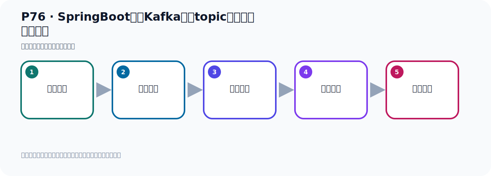

# P76：SpringBoot集成Kafka创建topic并指定分区和副本

> 笔记编号 76/156 · 时长 08:29 · [打开原视频 P76](https://www.bilibili.com/video/BV14J4m187jz?p=76)

[← P75: Kafka命令行脚本创建topic并指定分区和副本](../06-producer-internals/p075-Kafka命令行脚本创建topic并指定分区和副本.md) · [返回本章](./README.md) · [P77: SpringBoot集成Kafka创建topic并指定分区和副本 →](../06-producer-internals/p077-SpringBoot集成Kafka创建topic并指定分区和副本.md)

## 这节到底讲什么

**核心主题：SpringBoot集成Kafka创建topic并指定分区和副本。**

这节继续完善 Kafka 的完整知识链。请按老师的讲解顺序理解动机、做法和结果。
本节属于“副本、分区策略与生产者链路”这一章；放在全章里看，它的作用是：理解副本与分区，验证默认、轮询和自定义分区策略，并串起生产者发送流程与拦截器。

## 本节路线

## 老师的完整讲解（按视频顺序校正）

> 下面保留老师的完整讲解顺序，并修正 Kafka、Java、ZooKeeper、
> Topic、Partition、Offset 等常见识别错误。它不是压缩摘要；原始 ASR 在后面单独保留。

### 1. 00:00–01:01

方式2方式2就是在执行代码时，指定分区各属和副本各属，执行代码。原来在发送消息的时候，我们就是调到最后的代码，通过KafkaTemplate，调到send 方法，或者send 方法，去发消息。调到这个方法的时候，它底层其实已经自动帮我们完成了Topic创建了。你直接调这个方法就行了，它自动帮我们完成Topic创建。它这种创建，它创建Topic来默认只有一个分区，分区只有一个副本。这个副本就是它自己本身，没有额外的其他副本的，也就是它没有备份。它默认Topic只有一个分区，一个副本。这个副本其实也算不上副本，但是也可以叫做副本，因为这个副本就是它自己本身。

### 2. 01:01–01:48

就是它本身这个副本，也就是它这个主副本，它可以接受读和写数据，它没有额外的备份。这样的话，就是你不够安全，如果你这个节点宕机，你数据会丢失，因为你没有备份，数据没有备份，也是这样的。当然我们现在是单级点了，单级点，所以我们也没有副本的，只有一个节点。我后面搭集群之后，我们可以有多个副本。这是默认其妙的一个分区一个副本。我们可以在创建项目的时候，我们可以指定，创建项目的时候，我们可以配置一个内。在这个内里面，我们专门对Topic进行初识化，初识化的时候，我们可以指定它的分区个数和副本个数。下面我们看看该怎么做。它代码来就这样的。

### 3. 01:48–02:39

我们看下个PUT，它代码也很简单，就是这样写一个配置内就可以实现。下面我们去写这个内。在项目启动以后，我们就配一个给Topic配置一下它的分区和副本。我们先写一个Confegre配置内，然后就要Confegre。这个内它既然是配置内的话，我们就加一个Confegre一起注写。它是个配置内。这边怎么配呢？配一个B，AddB，配一个B注写，Public。Public是它用一个叫U-Pobic，用这个内U-Topic。配一个这个B，在10分钟之中配一个这个B，配这个B就可以了。这个B我们就Return一下，Return，那么这个对下怎么6呢？

### 4. 02:39–03:28

这个B是吧？它里面有一些成语的变量，我们看看有没有什么方法可以帮我们构造出来的，它有一些构造方法，它也构造方法，那么它有没有bill的模式我们看一下，有没有bill的类，构建器模式有没有？好像没有，没有关系模式，那我们只能6一个了。6一个，好，6个里面就带参数了，带参数啊，Return，6一个，6个在对下，好，带参数，参数的话那么它里面有3个参数啊，一个就是Int，Short，然后什么Alm，然后呢在下面就是什么，就是这个Map，三种方式里传参数都行，我们选什么呢？选了第一种方式，它其实都是传的差不多啊，差不多，我们点击看一下，在传一个名字，那么就托个名字，托个名字我们也写个名字啊，。

### 5. 03:28–04:18

然后这个名字叫它的托一个，托一个，托，托一个，好，这名字啊，然后呢，那么这个就是，你看Party是吗，就是分区个数，比如说我给它指定5个分区，在这个托一个下，分有5个分区，分区，然后后面这个就是什么啊，就是这个副本英词，几个副本，它这个Short，Short值啊，那我们就是，我们现在单节点你只能写1，你写按的报错，你写人也不行，所以我们是单个节点只能写1，而且它是Short，你需要转型一下，Short，对吧，Short转型一下，不然它报错了，你看它Short去掉之后你看它，它报错的啊，所以这里要把它强制转型一下，好，那么这一话我们就配置了一个什么，配置个托一个吧，那到时候那个项目，等一下，。

### 6. 04:19–05:01

我到时候项目启动之后啊，因为项目启动之后我们这个配置内会不会夹载，夹载之后它在重新出现这个B，创建这个B的时候它就会帮我们在这个Kafka中啊，就会创建一个这个Topic，名字叫黑Topic，5个分区一个副本，副本就是它自己本身，因为我们是单节点，好，那这个时候我们去创建一下，试一下看能不能创造出来，我们目前看一下Kafka这边，Kafka这边啊，我们再刷新一下，所以你想目前是没有这个黑Topic的啊，我们这有个黑Topic是吧，那我把删一下在之前的删掉，可能是我之前这个什么时候给创建的一个删掉，是吧，删掉了啊，现在没有这个黑Topic是吧，没有吧，。

### 7. 05:01–05:46

没有这个名字啊，没有这个名字，刷新，没有对吧，没有，好，那我们项目强制后到时候它会帮我们创建一个黑Topic，好，那这时候我们去运营代码，把这个先关闭，关闭，我们先看看去吧，它这边没有Topic，刷新一下还有没有，没有对吧，这个黑Topic这没有的啊，没有的，好，没有，我们现在去运营，没有方法，好，这个没有方法，又见，运营，运营之后，它就会加了这个B，加了这个B之后，它就会在Kafka中创建个Topic，好，它现在已经创建完了，我们看看有没有报错啊，只是指中往上拖一下，好，这是配置值，这个不是错啊，这个不是错，在网上，这也是配置值，这个不是错，好，没有错误对吧，没有错误，好，那现在我们去这个Kafka上看一下，。

### 8. 05:46–06:41

也没有创建啊，好，这点一下刷新，哎，这就是创建出来了，这个，对吧，你看我们是指定五个分区，那么它这个离外，有五个分区，对吧，五个分区啊，好，这样就创出来了，好，然后它的工具显示的时候，这个v的和这个这个副本，它是显示的一，但是从这边看的时候，它其实这里这个黑这个Topic，它其实显示的是，是一个，有一个副本，是吧，副本一至一，因为你这个集群中啊，它默认的副本一只是一，啊，默认是一，而且我们现在是单个几点嘛，单个几点它默认就是一啊，啊，你单个几点你没法配二，配三，配四，配五了，如果说你这个配二的话不行的，我们看，我们这边配个配个二，给你跑一遍，配个二啊，配个二，配个二，你运行一下，把之前这个删掉，你看，把这个之前这个黑Topic右键，然后这个三足，底下的三足，上周没有了对吧，我们这个是配个二，配个二那么运行它爆出啊，右键，运行一下，运行，。

### 9. 06:41–07:40

运行，好，运完了，然后看这次，我们走一下，这个不是一层，往上走，哎，上面有一层，失败了就穿了Topic，穿了不了对吧，然后它这个是不合法的，怎么有一个副本一，只了一个一层，副本一至二，它说大于可用的Broker树，你看，二，大于吗，大于可用的Broker树，Broker树只有一个，你写个二是不行的，啊，好，所以它没穿成功，在这个Kafka这边，刷新看一下，刷新，这个黑Topic没有，没成没成功，好，同步的，这方你写个雷也是不行的，写个雷，对吧，好，我们这次运行一下，看看，右键运行这个测试方法，走一下，写个雷也不行啊，不仅是雷，好，写完了，我们看一下这个日志，好，这这不是错，啊，这是配置信息，这不是走，那这有异常的，失败了创建，。

### 10. 07:41–08:24

创建长这提示这个这个不合法的这个副本音词的一个异常，他说这个必须是蛮大于雷的，啊，这个副本音词必须大于雷，比较大雷，好，那以上这个呢，就是我们，呃，去通过代码的方式去指定这个，呃，指定这个副本音词啊，对吧，副本音词，好，那现在异就正常了，我们关一下，关一下之后，好，再启动，启动，启动一下，好，创建，我们看一下，一边播异常，再说看一下，好，这正常的对吧，好，正常的，然后他这边的这个已经创出来的，看一下，刷新，这个黑Topic出来了，好，这个是我们通过代码的方式来，创建这个Topic，啊，创Topic，。

## 关键术语

- **Kafka：** Apache 开源的分布式事件流平台，常用于高吞吐消息传递、数据管道和流处理。
- **Topic：** 事件的逻辑分类。生产者向 Topic 写数据，消费者从 Topic 读取数据。
- **Broker：** 运行 Kafka 服务的节点；多个 Broker 组成 Kafka 集群。
- **KafkaTemplate：** Spring for Apache Kafka 提供的高层发送 API。

## 完整原声逐段记录

[查看本节带时间戳的本地 ASR](./transcripts/p076-SpringBoot集成Kafka创建topic并指定分区和副本-ASR.md)。主笔记负责可读性和术语校正；ASR 页面负责完整性复核。

## 读完记住

- 本节主题是 **SpringBoot集成Kafka创建topic并指定分区和副本**，它服务于本章目标：理解副本与分区，验证默认、轮询和自定义分区策略，并串起生产者发送流程与拦截器。
- 理解顺序是：问题背景 → 关键对象 → 处理过程 → 结果验证 → 应用边界。
- 学习时要同时核对老师的解释、画面中的配置/代码，以及最终运行结果。

## 最容易踩的坑

不要把孤立 API 或配置项当成完整能力；始终把它放回生产、存储、消费或集群链路中理解。

## 自测

1. 不看笔记，用自己的话解释“SpringBoot集成Kafka创建topic并指定分区和副本”解决了什么问题。
2. 按顺序复述：问题背景、关键对象、处理过程、结果验证、应用边界。
3. 如果运行结果和老师不同，你会先检查哪三个输入或环境条件？

## 学完检查

- [ ] 我能不看视频复述本节完整思路
- [ ] 我能指出关键命令、配置、类或接口的作用
- [ ] 我能解释画面中的输入与输出为什么对应
- [ ] 我核对过完整 ASR，没有跳过老师的补充说明
- [ ] 我完成了本节自测或复现实验
