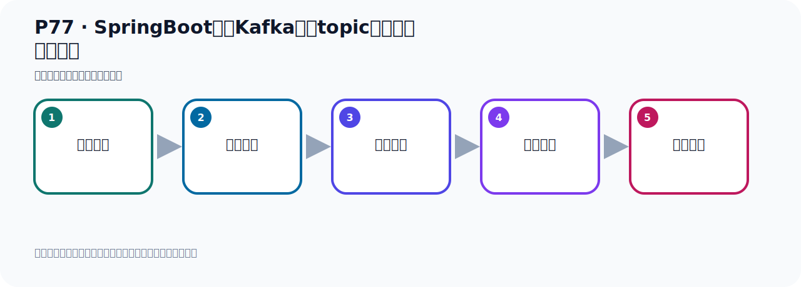

# P77：SpringBoot集成Kafka创建topic并指定分区和副本

> 笔记编号 77/156 · 时长 07:44 · [打开原视频 P77](https://www.bilibili.com/video/BV14J4m187jz?p=77)

[← P76: SpringBoot集成Kafka创建topic并指定分区和副本](../06-producer-internals/p076-SpringBoot集成Kafka创建topic并指定分区和副本.md) · [返回本章](./README.md) · [P78: 生产者发送消息的分区策略测试 →](../06-producer-internals/p078-生产者发送消息的分区策略测试.md)

## 这节到底讲什么

**核心主题：SpringBoot集成Kafka创建topic并指定分区和副本。**

这节继续完善 Kafka 的完整知识链。请按老师的讲解顺序理解动机、做法和结果。
本节属于“副本、分区策略与生产者链路”这一章；放在全章里看，它的作用是：理解副本与分区，验证默认、轮询和自定义分区策略，并串起生产者发送流程与拦截器。

## 本节路线

## 老师的完整讲解顺序（ASR 辅助复核）

> 下面按时间顺序保留经过基础术语替换的 ASR，方便核对老师是否提到某个细节。
> 人名、命令、代码和英文参数仍可能识别错误；准确结论以本节白话说明、代码块和实操速查表为准。

### 1. 00:00–00:43

刚才我们通过这个BING的方式，我们可以创建Topic，只能分析一口副本。这个代码我如果反复运行，它有没有问题的？因为这个BING不是在你第一次启动，它会创建，所以就创建。那我下次把项目光了，我再启动。按理说它是不是又要执行这个BING，又要创建。那第二次创建，会不会有问题的？好，那目前的话我们看一下，我们这边刷新，我们这个Topic、黑Topic已经创建好了。创建好之后，我们接下来把这个项目已经关了，我们再启动这个Mate方法。它会不会再创建，或者说有没有问题，有没有冲突？好，那么执行，你看代码呢，有没有报异常呢，看一下。

### 2. 00:43–01:40

没有异常是正常的，对吧？那就是你第二次启动也是可以的，你下的启动不影响，这代码不影响。或者说我现在往这里面发个消息，我再创建一下，它会不会把这个消息弄丢。那我们看一下，比如说目前这个Kafka中是没有消息的，你看这个黑Topic里面没有消息，对吧？没有消息，现在我在这边呢，我测试一下发个消息啊。那我找一个方法去发一个。那去发一个的话呢，我就在这个地方，我们就发一个对象消息，好，写个09这个方法。9对吧？好，那我发到这个消息，那它这个是不能通过它，我们诊一下分区，诊一下Topic，那我们找一个上面的方法去发一下，找一个那个默认的，我们找个指定分区的这种方式，指定Topic的方式，用这个发一下。

### 3. 01:41–02:48

好，这样啊，那我们这个Topic是叫黑Topic，往黑Topic发一个，发一个信息，黑Topic，好，然后这个分区我们不指定，让它自己去决定，然后这个k我们写个k9吧，然后这个数据，数据我们可以写个U字，把对象数据发过去，好，那既然是对象数据发过去，我这边用一个Kafka2，这个对象，Kafka，Time2去发送，好，这个是我们这个9的方法，我们在这边去发送9的方法，测试一下。那就是9，然后我们这边调用着9的方法，调9方法，那么它就往这个黑Topic发一个数据的，发个数据，对吧？发个数据，好，现在我们去调一下这个方法，右键，然后就直接左键，不用右键，点一下运行，好，那就运行完了，。

### 4. 02:48–03:40

语完了，成功了，也没有异常，那消息就发过去了，我们看一下这个数据，那我们这边刷新一下，好，刷新一下之后呢，那么这个数据就发到这个黑Topic里面去了，然后它发到哪个Partition呢，发到这个Partition的，这个分区，它有五个分区，那么发到最后这个分区的，放这里的，对吧？这有个消息，好，在这边的情况，那现在就是，我们往这个Topic中已经发了消息了，发消息之后，那现在我们如果说让项目重新启动，从一启动，那么项目它又会加到这个B，加到这个B，它会不会把我们的消息都丢了，也就是说它会不会把我们的Topic给覆盖掉，因为现在我们这个Kafka中已经帮你，已经有这Topic了，而且它里面已经有信息了，有数据了，那我在强项目的时候，它会不会把这个Topic给覆盖掉，。

### 5. 03:41–04:29

重新创新一个新的，它会不会创新新的，好，那这个我们看下来，那我们预议代码，预议代码，好，那这个时候我们就在这里，右键预讯这个测试方法，走一下，走一下，然后我们看看我们的Kafka的数据有没有被弄丢，被冲掉，好，轻松弯弯的我们看一下，试试没有异常，是吧，没有异常，好，没有异常，我们就看Kafka这个信息，好，这个时候先刷新一下，刷新一下之后，你发现它这种信息都是在的，这种数据都在，好，没有问题，所以就说它这个配置这个B，如果说你的这个B，这个Topic已经存在，它其实不会帮你创建，是吧，你不存在，它帮你创建，那所以这个数据没有丢，没有动作丢，。

### 6. 04:29–05:21

没有问题，你可以再反复一下，让你再起一下，是不影响的，所以你羡慕了，反复了重启啊，不会影响你之前创造的Topic，数据不会丢，是没有情况，没有情况，没有误错，没有说误错，我们看Kafka在里面的信息刷新，刷新之后，我们这个黑Topic还是在的，然后数据还是在的，数据还是在的，好，在这个情况，那有了时候我们希望它这个Topic我们更新一下，对吧，我希望这种我希望更新一下，比如说之前这个分区是15吧，那现在我想改成，比如说分区改成11，改大点，给改成9吧，改成9，好，那我们这一方叫，叫update，update，好，叫这个名字啊，这个B的名字不能重复，那就是相应我这方是对这个，对这个对Topic，。

### 7. 05:21–06:07

记这个更新啊，记起更新，是吧，记起更新啊，那现在上面也存在，下面也存在啊，那待会创新完之后是什么情况，而且我们上面这个Topic里面的信息会不会弄丢啊，它会不会弄丢，好，那这个是呢，我们就，想不想想，用一下嘛，右键呢，在启动之前我们看下之前的一个状态，之前它还是5个分区，那这个是我们启动这个，每一方法运行一下，那运行之后它其实会更新一下，帮你改成9个分区，看一下，没有报错，没有报错，然后我们这个就可以把它这个，把这个Kafka这个打开，打开之后之间是5个分区，我们刷新一下，你看变成9个分区了，而且你之前的消息也是不会弄丢的啊，这个消息没有弄丢，。

### 8. 06:08–07:12

所以你存在我就不会创建，然后你存在，但是发现里面的参数不一样，它就会用这个参数帮你更新一下，用这个参数给更新一下，还是这样的，对吧，好，现在我这个分区已经是9了，现在我如果想再改回来改成7，再更新7，就你缩小，把分区缩小，那么它有没有问题的，来走一下，改成7了，这就是9，就改成7，好，这是在运行这个运行方法，好，改9之后我们看看有没有报错，先看一下是字，我们走一下，好，这是字，好，这是这一块，目前没看得错，你看往哪走，往哪走，没错，没错，好，那我们看看我们这个里面，现在是什么样子呢，刷新一下，刷新，还是我们这个原来的9啊，还是原来的9，那还是9个嘛，你现在改成这个7个以后，它消息没有帮你说小，没有帮你说小，你之前是9个，。

### 9. 07:12–07:43

就是你可以放大，但你说小的时候没有帮你说，没有帮你说，不能帮你说小，指名放大不能说小，你已经变成9了，你现在变成7，改不了，改不了，好，那以上这个就是我们关于我们手动自己去代码中创建Topic，并且指定它的分区个数，副本个数，就是以上的代码，好，这就是我们自己写代码去创建这个Topic，指名分区和副本，好，那我们就开始刷新，我们。

## 关键术语

- **Kafka：** Apache 开源的分布式事件流平台，常用于高吞吐消息传递、数据管道和流处理。
- **Topic：** 事件的逻辑分类。生产者向 Topic 写数据，消费者从 Topic 读取数据。
- **Partition：** Topic 的物理分片，是 Kafka 并行度、顺序性和扩展能力的基本单位。

## 完整原声逐段记录

[查看本节带时间戳的本地 ASR](./transcripts/p077-SpringBoot集成Kafka创建topic并指定分区和副本-ASR.md)。主笔记负责可读性和术语校正；ASR 页面负责完整性复核。

## 读完记住

- 本节主题是 **SpringBoot集成Kafka创建topic并指定分区和副本**，它服务于本章目标：理解副本与分区，验证默认、轮询和自定义分区策略，并串起生产者发送流程与拦截器。
- 理解顺序是：问题背景 → 关键对象 → 处理过程 → 结果验证 → 应用边界。
- 学习时要同时核对老师的解释、画面中的配置/代码，以及最终运行结果。

## 最容易踩的坑

不要把孤立 API 或配置项当成完整能力；始终把它放回生产、存储、消费或集群链路中理解。

## 自测

1. 不看笔记，用自己的话解释“SpringBoot集成Kafka创建topic并指定分区和副本”解决了什么问题。
2. 按顺序复述：问题背景、关键对象、处理过程、结果验证、应用边界。
3. 如果运行结果和老师不同，你会先检查哪三个输入或环境条件？

## 学完检查

- [ ] 我能不看视频复述本节完整思路
- [ ] 我能指出关键命令、配置、类或接口的作用
- [ ] 我能解释画面中的输入与输出为什么对应
- [ ] 我核对过完整 ASR，没有跳过老师的补充说明
- [ ] 我完成了本节自测或复现实验
