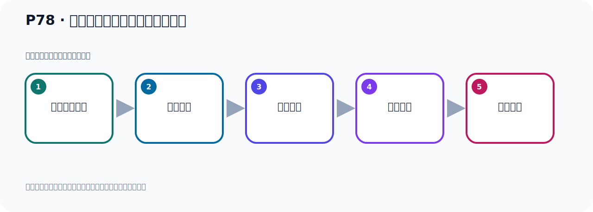

# P78：生产者发送消息的分区策略测试

> 笔记编号 78/156 · 时长 04:09 · [打开原视频 P78](https://www.bilibili.com/video/BV14J4m187jz?p=78)

[← P77: SpringBoot集成Kafka创建topic并指定分区和副本](../06-producer-internals/p077-SpringBoot集成Kafka创建topic并指定分区和副本.md) · [返回本章](./README.md) · [P79: 生产者发送消息的分区策略源码分析 →](../06-producer-internals/p079-生产者发送消息的分区策略源码分析.md)

## 这节到底讲什么

**核心主题：生产者发送消息的分区策略测试。**

这节用实验验证前面的配置或机制。重点是记录输入、预期、实际输出，以及两者不一致时如何定位。
本节属于“副本、分区策略与生产者链路”这一章；放在全章里看，它的作用是：理解副本与分区，验证默认、轮询和自定义分区策略，并串起生产者发送流程与拦截器。

## 本节路线

## 老师的完整讲解顺序（ASR 辅助复核）

> 下面按时间顺序保留经过基础术语替换的 ASR，方便核对老师是否提到某个细节。
> 人名、命令、代码和英文参数仍可能识别错误；准确结论以本节白话说明、代码块和实操速查表为准。

### 1. 00:00–01:00

好，那接下来我们继续往下看一下。我们生产者发送消息的这个分区策略。发送消息的一个分区策略。什么意思呢？就是我这个消息要发到哪个分区。就是消息发到哪个分区。消息发到哪个分区中，哪个分区中，是吧？有什么策略？是什么策略？就是发上策略。你看我们也假设我现在这个Tobik叫Mightobik。它里面有三个分区，P0、P1、P2，三个分区。那我这个生产者去发个消息的时候，那么这个消息是放到P0分区，还是P1分区，还是P2分区。它采用什么策略？去发送。那这地方相遇一个什么？类似于附载均衡一样。我要把消息往哪个分区去发送。好，那么它里面有一套策略，有的策略。

### 2. 01:01–01:54

那首先我们通过代码调试看一下，首先我们看一下目前我们卡木卡，这里刷新。卡木卡我们的这个黑Tobik，它里面现在是有九个分区，从0到8是九个分区。好，目前我这里面都没有数据的，里面的Message全部是零，刷新之后都是零。那我们就去发消息看一下它发哪去的，对吧？好，那么再我们再关一下，打开我们这个生产者这里。好，我们用这个九这个方法，往这个黑Tobik来发消息，那么这个分区我们没有指定，没有指定，那就需要它选一种策略去发送。如果说我指定了，那就发到我指定了分区，我没有指定，那肯定就是需要一种策略，往哪个分区去发送，它有个策略。对吧？好，现在我们去把这个九方法去调一下，那在这个测试内这边调一下。

### 3. 01:55–03:00

调出来，那我就这地方，九方法对吧？好，那我们直接运行一下，运行跑一遍，看一下这个消息它发哪去的。好，它发完了，发完之后我们这个日之来的阵场没有异常，好，看这个Kafka，我们这个是刷新一下，刷新一下。好，刷新一下之后我们发现它这个消息是发到雷五，五号分区的，分区是五的那个分区发生你的，对吧？在这边有一条数据，那比如说我现在再换一个方法，换一个方式，把这个分区我指向，比如说我指到二，我人工指定的，我人工指定的二，那就是这个消息就发到二分区，是吧？好，那么这个是我们发一下，这边去发右键，然后发送。掉09方法，它现在是指到二，那么它就发到二那个分区了。好，发完了，发完之后我们看Kafka，Kafka，这个二，我们刷新一下看一下，刷新，来，二这个分区你看它有一条消息。

### 4. 03:01–04:06

所以一种方式就是你手动指定，另外一种方式如果你不指定的话，那么就会呢，Kafka，它就会帮你呢，使用一种策略给你发送。好，那下面我们去研究一下，它是什么策略啊，那这边我就不指定，我不指定，对吧？我不指定，我再发一下，看它发哪儿去的，好，这是再发一下，右键，再发送。之前是二，这边有一条数据，五这边有一条数据，既然我又发一条，看看执行完了没有，在这，好，它已经执行完了，执行完了之后，那我们再看这个图，好，这个是在刷新一下，刷新，它把消息又发到五这个分区的，对吧？发到五分区的。所以它里面有一套策略，我们下面去跟踪一下这个策略是什么策略啊，那我们可以这样，在这里订个段点，发送消息这里订个段点，我们去跟踪一下原代码，看它怎么选择这个分区的，这个分区没有指定，它怎么选分区，好，那此时呢，我们这里第八个运行一下，第八个运行，然后调试一下代码跟踪一下原代码。

## 关键术语

- **Kafka：** Apache 开源的分布式事件流平台，常用于高吞吐消息传递、数据管道和流处理。

## 完整原声逐段记录

[查看本节带时间戳的本地 ASR](./transcripts/p078-生产者发送消息的分区策略测试-ASR.md)。主笔记负责可读性和术语校正；ASR 页面负责完整性复核。

## 读完记住

- 本节主题是 **生产者发送消息的分区策略测试**，它服务于本章目标：理解副本与分区，验证默认、轮询和自定义分区策略，并串起生产者发送流程与拦截器。
- 理解顺序是：准备测试条件 → 执行操作 → 读取结果 → 对照预期 → 形成结论。
- 学习时要同时核对老师的解释、画面中的配置/代码，以及最终运行结果。

## 最容易踩的坑

测试前残留的 Topic、Offset、缓存或旧进程会污染结果；每次实验都要先确认初始状态。

## 自测

1. 不看笔记，用自己的话解释“生产者发送消息的分区策略测试”解决了什么问题。
2. 按顺序复述：准备测试条件、执行操作、读取结果、对照预期、形成结论。
3. 如果运行结果和老师不同，你会先检查哪三个输入或环境条件？

## 学完检查

- [ ] 我能不看视频复述本节完整思路
- [ ] 我能指出关键命令、配置、类或接口的作用
- [ ] 我能解释画面中的输入与输出为什么对应
- [ ] 我核对过完整 ASR，没有跳过老师的补充说明
- [ ] 我完成了本节自测或复现实验
