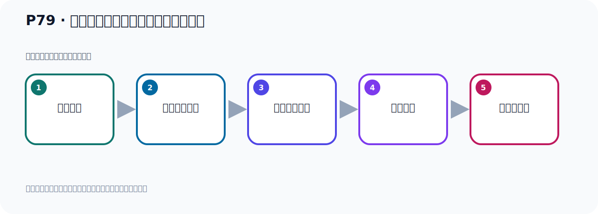

# P79：生产者发送消息的分区策略源码分析

> 笔记编号 79/156 · 时长 09:33 · [打开原视频 P79](https://www.bilibili.com/video/BV14J4m187jz?p=79)

[← P78: 生产者发送消息的分区策略测试](../06-producer-internals/p078-生产者发送消息的分区策略测试.md) · [返回本章](./README.md) · [P80: 生产者发送消息的分区策略源码分析 →](../06-producer-internals/p080-生产者发送消息的分区策略源码分析.md)

## 这节到底讲什么

**核心主题：生产者发送消息的分区策略源码分析。**

这节从源码解释表面行为。阅读时先记住调用入口，再追踪条件分支、默认实现和最终选择结果。
本节属于“副本、分区策略与生产者链路”这一章；放在全章里看，它的作用是：理解副本与分区，验证默认、轮询和自定义分区策略，并串起生产者发送流程与拦截器。

## 本节路线

## 老师的完整讲解（按视频顺序校正）

> 下面保留老师的完整讲解顺序，并修正 Kafka、Java、ZooKeeper、
> Topic、Partition、Offset 等常见识别错误。它不是压缩摘要；原始 ASR 在后面单独保留。

### 1. 00:00–00:57

D8 运行，调识带码，跟踪下原带码。好，进入以后，调这个方法进入这个方法，点这个圣诞发进来。进入之后，应该在这里发送，上面是固定对象，我们就看核心的，非核心带码，我们不去跟踪，那我想走到这一行，我们看看对象，什么情况，看一下，目前的PartyC是空的，这个消息信息对象是空的，PartyC是空的，没有指定，调这个方法进来，好，我们看核心地方，那我们要走，到这，那么这个信息对象看一下，展开，展开一下，这个看不到，看不到，我们可以先补看它，那我们要走，好，调这个方法，发送，那发送的时候，这是我们对象，对象里面，这个PartyC是空的，没有指定，。

### 2. 00:57–01:52

那我们进入这个方法，进来，好，进去之后，我们往下走，往下走，非核心的，我们补看，让它走，它这里应该不是发送，这是构建那个生产者，一些信息对象，然后我们看，找到发送的地方，这都不是，这个是加一个人接器，那目前，我们看看它这个，我们要走一下，这人接器是多少，这个没有，这个信息是空的，就没东西，还是我们远的对象，然后往下走，到这，好，那么这就是发送的，对吧，发送，好，这核心的发送是核心的，我们进来，到这个发送里面，点一下，好，点一下之后，我们看看这个Record，这个Record还是我们之前的对象，PartyC是空的，后面是个Coreback，是个回调函数，。

### 3. 01:52–02:46

这是Coreback回调函数，好，好，那接下来我们就往下走，到这，那么这一行就是发送的，对吧，这一行就发送，好，那么进入个方法，进来，到这方法，好，点一下这个send 方法，好，到这来了，到这来之后，它这一个拦截器，目前里面是空的，拦个，好，往下走，到这里，这个话呢，就是真正的发送了，上面是拦截器，然后这里是发送，好，发送那么，进这个方法，进来，好，到这里啊，然后往下走，看哪里是发送，找发送啊，不是发送的地方，我们不看，往下走，这个地方，这个应该不是发送了，再往下走，到这，这也不是，到这，这是一些变静的数据啊，好，这个是虚拟化，对吧，。

### 4. 02:46–03:30

比如说你要对象数据，你要用这个结成虚拟化，这是虚拟化的，好，再往下走，这也是虚拟化啊，再往下走，刚才虚拟化应该是k呢，这个k虚拟化，然后这是指的虚拟化，好，那再往下，到这，好，这有一个叫Partition，是吧，这个Partition这个方法，那就是给这个，现在要计算你一个Partition嘛，计算是吧，调整方法，好，那这块应该是重要的，很重要的，它不是要计算那个Partition吗，好，那我们看它怎么计算的，我们进入Partition方法，好，进来，好，到这，到这的话呢，首先我们这个required里面，我们这个原来这个required它里面的Partition是k，它原来是k，是吧，好，如果你不等于k，。

### 5. 03:30–04:13

它是直接拿你自己本身那个Partition，比如说你这个Partition，你原来自己是2，好，那么它自己拿你自己本身这个Partition，你这不等于k，是吧，不等于k，就用你指定的那个Partition，好，那如果等于k，那么我就掉下面的人，到这里的人，对吧，到这里的人，好，那么这是个什么对象呢，这个是k的，如果它不等于k，好，它会做这个代码，那现在我没什么，我没现在这个是k的，是k的，那么这个代码应该不走，走，到下面的人，这个代码不走，是吧，这个代码其实是自定义的那个Partition，就是你如果自己定义了一个呢，这个分区的那个分区策略，那么它就使用你所定义的那个分区策略，。

### 6. 04:13–05:02

你来叫customerPartition，自定义的分区策略，对吧，我们现在没有自定义，所以它就不执行这个代码，好，到这里来，到这里来之后，你看，它怎么计算Partition啊，往下走，其实就是通过这一行代码计算Partition，那我们找到的核心代码就是这样的，就是你这个，就是当你的序列化器k，不等于空，然后这个等于forced的时候，那么这个forced的话，它上面默认就是forced，是吧，默认是forced，好，那么这个时候用这个Partition，就用它计算Partition，那我们进入一个方法，进来，好，就这个方法，进来，好，进来那么它是调这样一个方法，拿到这个硬特值，我要把消息发到哪个Partition，。

### 7. 05:02–05:50

那它就是这个硬特值，那么它的核心计算逻辑就是这一种代码，这一种代码就是它默认情况下采用这种代码，好，所以它默认情况下其实就这个代码，就这一端，代码就这一端，也就是它调了这么一个类，这个类里面有一号有一个这个代码，这个代码就计算那个分区策略，分布一下策略，好，这个代码你看一下，首先是把你这个key，就是你存问那个key，就是我们发消息的时候，我们不是当时有个key吗？我们叫key9，这个key，好，哪里的key以后呢，然后用这个方法进行计算，这个方法计算是计算什么呢？就生成一个32位的这个哈希值，把你这个key，就key9那个数据，。

### 8. 05:50–06:48

生成一个30位的哈希值，调这个方法，那么这个方法里面，它里面代码比较长，但是计算它哈希值的这个方法，包括一些一位的操作，好，这个是计算哈希值，哈希值拿到之后，然后干嘛呢，然后把他这个地方应该是，应该是给他取一个，取一个正数吧，是吧，转成一个正数，有可能它里面是复数，我们运行一下，看一下，这个我们可以把他运行一下，这个值这个复的对吧，复的，然后再通过前面这个是不是变成正数了，走一下，然后把它执行一下，执行，它就变成正数了，然后呢，就把它和我们的这个帕丁型个数，我们是9个吧，帕丁型是9个了，是9个，然后取余数，你看，它的算法就取余数，取模取余数，看看你这个应该分配哪个分区，我们总共有9个分区，。

### 9. 06:48–07:44

那么取余数的话，那个余数它的范围一定是0，0到8之间，范围一定是0到8之间，如果它余数是9，那么可以除禁，可以除禁的话，它的余数是0，所以它的余数肯定是0到8之间，就通过这个策略，也就是它的合计策略就是把你的那个k，k生成32位的这个哈希值，然后与你的帕丁型个数取余数，然后去分配，那也就是说我们这个k9，它取余数之后，它是等于5，等于5，所以它数据都放在这里的，那就是接下来我只要是k是9的话，那么你反复发数据发消息，都是发到这个5这个分区的，我们可以测试，可以看，那这次我们把这个代码走完，这个代码再，好，再走完，下面就不过看了，这个分区策略已经找到了，好，那接下来你反复了去发消息，它都是发到5这个分区的，。

### 10. 07:44–08:47

因为你的k没有变，那么它肯定是往5里面发，好，我们走一遍，对吧，好，走一遍你看一下，我们之前这边是两个数据，我们再刷新，这边我发了几条数据了，这四条，那我们再发一条，之前应该是三条，再发一条应该是五条，好，然后我们再看一下这个5号，这个5条，是吧，PartyC5这个地方是5条，那你再发一条就6条，所以它都发到这个5这个分区的，好，我再分区的，好，那这次你刷新看一下，刷新，好，都发在5这个分区的，对吧，那你换个k，比如说你这边这个k给换一个，不是k9，不是k9，我假设为这个k10了，k99，好吧，k99，那么它这个含义值可能有变化，有变化的话，那么它可能在另一个分区的，好，那这次我们再去跑一下，那它可能技术的结果就不是5，。

### 11. 08:48–09:29

余数可能不是5了，好，整完之后我们看一下卡卡这边，刷新，刷新之后，那么这次它就余数就是8了，是8的话，它就放在8这个分区的，好，那么以上呢，我们通过跟踪它的原代码，我们找到了它的默认情况下，它就是使用了PartyC这个Building，就内置的PartyC，然后它里面这个方法，去取得这个分区的，去取余数的方式来进行这个分区策略，进行这个消息分区策略，好，这是我们这个通过原代码跟踪以后，得到这边一个结论。

## 关键术语

- **Partition：** Topic 的物理分片，是 Kafka 并行度、顺序性和扩展能力的基本单位。

## 完整原声逐段记录

[查看本节带时间戳的本地 ASR](./transcripts/p079-生产者发送消息的分区策略源码分析-ASR.md)。主笔记负责可读性和术语校正；ASR 页面负责完整性复核。

## 读完记住

- 本节主题是 **生产者发送消息的分区策略源码分析**，它服务于本章目标：理解副本与分区，验证默认、轮询和自定义分区策略，并串起生产者发送流程与拦截器。
- 理解顺序是：找到入口 → 读取关键参数 → 进入条件分支 → 选择实现 → 用测试验证。
- 学习时要同时核对老师的解释、画面中的配置/代码，以及最终运行结果。

## 最容易踩的坑

源码结论必须与当前 Kafka/Spring Kafka 版本对应；不要把旧版本实现当成永远不变的规则。

## 自测

1. 不看笔记，用自己的话解释“生产者发送消息的分区策略源码分析”解决了什么问题。
2. 按顺序复述：找到入口、读取关键参数、进入条件分支、选择实现、用测试验证。
3. 如果运行结果和老师不同，你会先检查哪三个输入或环境条件？

## 学完检查

- [ ] 我能不看视频复述本节完整思路
- [ ] 我能指出关键命令、配置、类或接口的作用
- [ ] 我能解释画面中的输入与输出为什么对应
- [ ] 我核对过完整 ASR，没有跳过老师的补充说明
- [ ] 我完成了本节自测或复现实验
