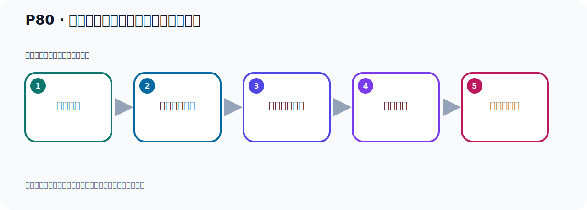

# P80：生产者发送消息的分区策略源码分析

> 笔记编号 80/156 · 时长 10:59 · [打开原视频 P80](https://www.bilibili.com/video/BV14J4m187jz?p=80)

[← P79: 生产者发送消息的分区策略源码分析](../06-producer-internals/p079-生产者发送消息的分区策略源码分析.md) · [返回本章](./README.md) · [P81: 生产者发送消息的分区策略源RoundRobinPartitioner →](../06-producer-internals/p081-生产者发送消息的分区策略源RoundRobinPartitioner.md)

## 这节到底讲什么

**核心主题：生产者发送消息的分区策略源码分析。**

这节从源码解释表面行为。阅读时先记住调用入口，再追踪条件分支、默认实现和最终选择结果。
本节属于“副本、分区策略与生产者链路”这一章；放在全章里看，它的作用是：理解副本与分区，验证默认、轮询和自定义分区策略，并串起生产者发送流程与拦截器。

## 本节路线

## 老师的完整讲解顺序（ASR 辅助复核）

> 下面按时间顺序保留经过基础术语替换的 ASR，方便核对老师是否提到某个细节。
> 人名、命令、代码和英文参数仍可能识别错误；准确结论以本节白话说明、代码块和实操速查表为准。

### 1. 00:00–00:56

下面我们来看一下，我们发动消息的时候，如果说我在这里不给它指定Key，它之前是指定Key，那么有Key的话，它把Key取一个Hashiz，然后用它分区个数取余数，然后决定你这个消息发到哪个分区。现在我没有这个Key，那我们在这里写一个方法一时，一时的话我没有这个Key，那就是把Key去掉，那这个时间这个也去掉，这个也不要了，那这个地方也去掉。好，那我们就这样，就发一个托匹格，然后发一个对象，发个消息，没有指定Key，那么它会怎么发送呢？我们看一下它的一个策略，它会发到哪个分区上。那此时我们在这个测试内去掉一下这个方法，那就掉一下一时这个方法。

### 2. 00:57–01:54

那么这些方法就是一时，掉一下我们一时这个方法，掉一时这个方法，一时这个方法没有Key的。好，那我们去，首先我们去跑一下看一下，我们把一时这个跑一遍，先看一下我们目前这个数据情况，关心关心这个样子。目前这个样子，我们现在这个R，R6，R6这些都有数据了，我们待会看看它发哪去的，这个111261111，那我们这些发送一下，发送。1121211121啊待会记下数据好发文了发文了我们算一下我们是1121211121哎他其实发到我们这个哎这个排列器雷这里的发这里的增加一条数据吗是吧之前是什么是雷啊现在增加一条数据那我们再发一遍啊再发一遍啊再发一遍。

### 3. 01:55–02:44

掉一十这个方法没有指定T看他发哪个分区的好那此我们再打开这个Kafka这边刷新一下算一下是我们之前是这个11126那么他发了五五这个分区的在这里面增加一条对吧好那你再发一条再发一条那你发现了他其实没有什么规律他这个随机的那就是他随机的你没有指定可以说随机的那这个时候我们再看一下Kafka这边啊之前这次期我们再看一下啊刷新好，那这个时候是把这个第四个加列有出去之前是二嘛，这变成三了嘛这边加列出去，那就是第一次发这里的第二次发的这个五这个分区的第三次发的是四的分区的那它没有规律，是随机的没有指定K，那么是随机的那我们看一下它怎么做的呢。

### 4. 02:44–03:30

我们可以跟踪它的代码，点进去跟踪一下这是一个多点，然后我们去跟踪代码看一下它怎么做的好，这里底边一个运行一下运行之后呢，我们主要是看那个核心代码非核心的不看好，这是我们进到这个方法里面去进去进去之后看一下核心的，不核心的我们不看好，再往下走，好，再发送，我们进来好，到这，然后到这，好，再发送，进来到这，我们看它计算那个分区了，在哪里计算分区好，这里，这是计算分区，对不对好，计算分区，那么它这个方法我们可以进去看一下这个计算分区就这个方法进来计算分区，首先，get a Partition，我们没有指定分区，那么这是空。

### 5. 03:30–04:17

所以这一行的码不执行我们没有指定分区，是吧，我们这边这个代码你看这个一十的码，掉一十的码，它没有指定是哪个分区没有指定，没有指定哪个分区好，然后你这里有没有制定的这个，这个分区对象我们没有制定，所以这个是空，它也不会进来我们下去，好，到这来的到这来以后，我们看一下，我们这个key，对，我们的key是空的那么它也不会走这个代码因为我们没有给这个消息指定key，它也不会走这个代码那么到这里，好，那么它反而会什么呢反过-1，这个只是个-1呢，定义好了这个-1也就是它反为-1的话，它其实是个随机策略那这个-1的话，它怎么做的呢，它怎么转化。

### 6. 04:17–05:02

好，那么这是我们下，走下，因为-1我们这边是没有-1这样一个一个partisan的，没有-1的，我们是0到-8那你-1的话，放到哪个地方，是吧所以它应该把-1转化一下，因为-1是没有这个分区的它肯定要转成0到-8，好，那么我们这个时候呢往下走下，好，这个就返回了是吧，好，这个分区就返回了是-1它只是-1看一下，-1好，那么它接下来，交开至于处理是吧处理的话，我们看它在那里处理，它其实在下面一点，我想走我想走，这个还不是，再往下走，再往下走到这，然后到这，来，到这个地方这个地方它会进一个处理，进一个处理，怎么处理的呢。

### 7. 05:02–05:44

你看啊，它会调这个open的这个方法，然后里面存了一大堆参数然后会把你的partisan，你的-1传进来，把partisan传进来传进来之后，我们看一下，进去这个方法，进来这个方法就这个open的方法，进来进来之后你看这个open的方法，它里面存了这么多参数，对吧这么多参数，其中你的这个partisan是-1的，是-1好，成功之后它进于计算，计算的话呢，那你怎么计算呢计算就是调这个方法进计算了，计算得到一个Topic音货对象Topic音货对象，看一下那这个地方我们看啊，它计算之后我们看啊先把这张走完，走完之后，看这个计算盟之后的Topic音货对象有什么信息呢。

### 8. 05:44–06:31

这里面是没有什么信息的啊它这个时候其实还没有计算那个partisan，没有计算，那么往下走啊往下走，再往下走，往下走好，这有个我要循环，我要循环里面呢首先你看，你这个partisan，你如果等于-1是吧这个只是-1吗，你之前的partisan是-1是吧如果你等于-1的话，接下来它需要重新计算partisan那么计算partisan是怎么计算的呢调这个内置的bude-in-partisan的调这个对象内置的这个对象，还是我们这个bude-in-partisan的对象和我们之前那个对象是一样，是这个对象吗之前我们是通过调查里面这一行代码实现，是吧。

### 9. 06:31–07:20

现在呢，它还是这个对象，调查里面这个方法这个集群，那目前我们就一个节点这个集群节点，就是我们这个AP，你来这个AP看一下是吧，好，那么它传进了，然后它计算出partisan的信息把partisan，应该放了个分区，它做个计算好，那么这个时候来进入这个方法，进入这个方法好，进入这个方法，这个方法，然后它进入partisan，那么看怎么计算呢往下走一下，首先是调get的方法好，它等于空，好，到这里到这里之后，你看它其实是调这个next-partisan的方法是吧，next-partisan方法好，那么这个进来，进来里面，进到这个next-partisan这里。

### 10. 07:20–08:05

这里的话呢，它首先是创建一个随机的R，Random，是个随机数嘛是吧，这个Random，这个Random，给一个Random如果Random等于空，那么通过这个类，如果不等于空的话，get的否则就是通过它，你看，这是不是产的一个随机数吗，next-partisan那这个代码，它就产的一个随机数那你可以把这个，比如说，这个运行，运行一下，运行那么它得了这么一个随机数，那你再运行，你看这个值不变了你再运行，这个值你还是变的吧，再运行，它是变的吧所以它是得了一个随机数吧，好，随机数我把它转化一下，这个方法转化一下转化之后得了一个随机数，Random，这个Random之后。

### 11. 08:05–08:58

下面要去计算它那个分区的，应该放了个分区好，看一下核应代码，对吧然后分区在你计算，那你在里，往它走，到这那就是你这个Random处以取予数可用的这个Party大角，我们是9个Party形，是吧9个Party形，Party形是9个，好，你看它也是用它取予数，只不过它在这个随机数之前我们这个Q，你传Q的话，就把你T，计算哈希，然后用这个Party形取予数你现在没有给我传Q，我就给你设一个随机数然后用你的Party形个数取予数，就计算成你的Party形这就是我们原代码的实现，好，那么之前把它的Party形记得出来了对吧，L10就不用看了，好，你看最终反变Party形，那是6。

### 12. 08:58–10:02

是6的话，那么这个数据就放到6这个分区下，那目前我们看一下6的分区下刷新看一下，刷新，6的分区下，现在只有一条消息那我现在把这个代码走完，6的里面就多一条消息，变成2了好，我们把代码走完，可以看一下，走完，走完之后，我们再看Kafka，这个6的分区，我们刷新一下刷新，你看6分区就多一条消息了，所以它就放了6这个分区下去了好，那以上的就是我们当我们没有指定这个Q的时候，它是怎么实现的就是这样实现的，好，那我们总结一下就是，你有Q就这样做啊有这个Q，是这样的，没有Q呢，怎么办，没有Q它是用随机数啊没有Q，是使用这个随机数，随机数，又和这个什么，和这个分区个数，和这个Party形个数。

### 13. 10:02–10:52

然后再举它取余数，是这样的和它取余数，是这样的这样子测语啊，把这个用不用，给它弄小一点好，弄小一点好，这就是我们的这个，这个这个这个这个策略啊在它默认的一种策略，你有Q，通过它，你这个Q取哈希，然后用这个Party形取余数你没有Q的话，用随机数，然后用这个Party形个数取余数好，这样的，来决定，我要把这个消息发送到哪个分区。

## 关键术语

- **Kafka：** Apache 开源的分布式事件流平台，常用于高吞吐消息传递、数据管道和流处理。
- **Topic：** 事件的逻辑分类。生产者向 Topic 写数据，消费者从 Topic 读取数据。
- **Partition：** Topic 的物理分片，是 Kafka 并行度、顺序性和扩展能力的基本单位。

## 完整原声逐段记录

[查看本节带时间戳的本地 ASR](./transcripts/p080-生产者发送消息的分区策略源码分析-ASR.md)。主笔记负责可读性和术语校正；ASR 页面负责完整性复核。

## 读完记住

- 本节主题是 **生产者发送消息的分区策略源码分析**，它服务于本章目标：理解副本与分区，验证默认、轮询和自定义分区策略，并串起生产者发送流程与拦截器。
- 理解顺序是：找到入口 → 读取关键参数 → 进入条件分支 → 选择实现 → 用测试验证。
- 学习时要同时核对老师的解释、画面中的配置/代码，以及最终运行结果。

## 最容易踩的坑

源码结论必须与当前 Kafka/Spring Kafka 版本对应；不要把旧版本实现当成永远不变的规则。

## 自测

1. 不看笔记，用自己的话解释“生产者发送消息的分区策略源码分析”解决了什么问题。
2. 按顺序复述：找到入口、读取关键参数、进入条件分支、选择实现、用测试验证。
3. 如果运行结果和老师不同，你会先检查哪三个输入或环境条件？

## 学完检查

- [ ] 我能不看视频复述本节完整思路
- [ ] 我能指出关键命令、配置、类或接口的作用
- [ ] 我能解释画面中的输入与输出为什么对应
- [ ] 我核对过完整 ASR，没有跳过老师的补充说明
- [ ] 我完成了本节自测或复现实验
