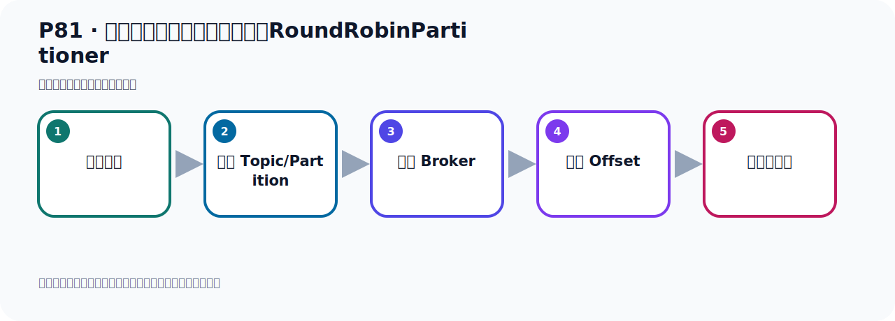

# P81：生产者发送消息的分区策略源RoundRobinPartitioner

> 笔记编号 81/156 · 时长 04:30 · [打开原视频 P81](https://www.bilibili.com/video/BV14J4m187jz?p=81)

[← P80: 生产者发送消息的分区策略源码分析](../06-producer-internals/p080-生产者发送消息的分区策略源码分析.md) · [返回本章](./README.md) · [P82: 生产者发送消息配置分区策略RoundRobinPartitioner →](../06-producer-internals/p082-生产者发送消息配置分区策略RoundRobinPartitioner.md)

## 这节到底讲什么

**核心主题：生产者发送消息的分区策略源RoundRobinPartitioner。**

这节位于消息链路上。要顺着“发送端—Broker—分区日志—消费端”看数据和元数据怎样流动。
本节属于“副本、分区策略与生产者链路”这一章；放在全章里看，它的作用是：理解副本与分区，验证默认、轮询和自定义分区策略，并串起生产者发送流程与拦截器。

## 本节路线

## 老师的完整讲解顺序（ASR 辅助复核）

> 下面按时间顺序保留经过基础术语替换的 ASR，方便核对老师是否提到某个细节。
> 人名、命令、代码和英文参数仍可能识别错误；准确结论以本节白话说明、代码块和实操速查表为准。

### 1. 00:00–00:55

好，那刚才我们是使用了它默认的内部、默认内置的分区策略，发消息的时候发到它的某个分区下，它是默认策略。有K是这样的筹读，没K是这样的筹读。那接下来我们看一下，我们自己配置一个其他的分配策略。那怎么配置呢？首先我们要看一下它里面有个接口，叫Partition的接口。好，那我们打开代码，打开代码我们去看看这个接口，那就是这个接口，Partition的这个接口，打开。好，这是这个接口，这个接口你看是Kafka提供那个接口，这个接口就是分区接口，Partition的就是分区接口。那么这个接口我们Ctrl H看一下它的实现，Ctrl H之后看它的实现，是这些实现。

### 2. 00:56–01:56

好，这是它的实现，那这个实现你看它在这个测试类里面，这个我一般不用看，它这个在测试类里面，在这个Task的类里面，这个你可以排除掉不用管它。然后这个也是在测试类中，你看，也在一个Task的类里面，你看这个Task的类，所以这个也不用管它，不用管它。好，让它打开，这是一个分区策略，那么这个分区策略之前的版本是可以用的，现在它已经不推荐使用了，这个一标有一个这个重点，就是过时的，通过这个重点标记我们这个类是过时的，所以这个不推荐使用，所以我们就不去借到它了。我们之前的老老版本这个策略是可以用的，当时是没有标记过时的，好，这是一支策略，那么这个策略看下来它也是标记成过时的，所以这个我们也不看了，原来这个老版本，之前的版本它是可以用的，可以用的。

### 3. 01:56–02:50

好，那就是一个这个东西，打开。好，那么这个策略看下来它是没有标记过时，它这个类上没有那个重点，所以这个策略是可以使用的，那么这个RenderRuby，那么它是个什么，是个轮巡策略，轮巡，比如说你这有八个这个分区，那我一个一个来，先访问它，第一次发到这里，第二次发这里，第三次发这，第四次发这，然后一个一个轮流去发，把每个里面发一个这个消息，每个分区里面发个消息，这就是轮巡，那么它发送消息比较均匀，往每个分区发一个消息，轮流的，每个人一个每个人一个。好，这个就发了第一个之后，然后接下来再发我们再往这里发，是吧，再往然后第二个发，然后第三个发，然后第四个发这样，轮流啊轮流这样去发，好，这是轮巡策略。

### 4. 02:50–03:38

那下面这个呢，这个也是测试的，测试了一下的，所以这个也不用管它，好，那我们现在这里面能够使用的就只剩一个了，其他几个过时的不推荐使用，那么只有个轮巡策略可以使用，那么它的分区策略就在这里面，它代码是这里实现，在它代码实现有这个，那就是轮流，每个人来发文一下，每个人来发文一下，它内部呢，会从你这个Kafka这个节点中，看你有几个节点，是吧，然后看看你这个Topic里面有几个分区，然后呢，把那个分区拿到之后，然后每个呢，一个一个轮流去发消息，好，这是它的策略，那下面我们看一下这个策略，我们该怎么去使用它呢，怎么去使用，。

### 5. 03:38–04:27

就说我现在不想用它默认策略，它默认策略，就是这种策略，对吧，我们不想用它，我想改成这种轮流，轮巡分配的策略，用这个策略，要使用这个策略，那首先我们看看它能不能帮我们配，对吧，能不能配的，那就这边去配，那我们属于生产者，那你看看它有没有这个配置呢，趴，趴D型，Pi，你看，趴D型你是找不到类似这种，这种配置的，所以我们在配置节目中呢，这东西无法实现了，没法在配置文件中去配这个策略，好，那今天我们看一下呢，怎么办呢，我们要用代码去实现，用代码来去配置这个策略，好，那我们看看代码怎么实现，。

## 关键术语

- **Kafka：** Apache 开源的分布式事件流平台，常用于高吞吐消息传递、数据管道和流处理。
- **Topic：** 事件的逻辑分类。生产者向 Topic 写数据，消费者从 Topic 读取数据。
- **Partition：** Topic 的物理分片，是 Kafka 并行度、顺序性和扩展能力的基本单位。

## 完整原声逐段记录

[查看本节带时间戳的本地 ASR](./transcripts/p081-生产者发送消息的分区策略源RoundRobinPartitioner-ASR.md)。主笔记负责可读性和术语校正；ASR 页面负责完整性复核。

## 读完记住

- 本节主题是 **生产者发送消息的分区策略源RoundRobinPartitioner**，它服务于本章目标：理解副本与分区，验证默认、轮询和自定义分区策略，并串起生产者发送流程与拦截器。
- 理解顺序是：构造消息 → 选择 Topic/Partition → 写入 Broker → 记录 Offset → 消费者处理。
- 学习时要同时核对老师的解释、画面中的配置/代码，以及最终运行结果。

## 最容易踩的坑

能发送成功不代表业务处理成功；序列化、分区、确认机制和消费进度需要分别观察。

## 自测

1. 不看笔记，用自己的话解释“生产者发送消息的分区策略源RoundRobinPartitioner”解决了什么问题。
2. 按顺序复述：构造消息、选择 Topic/Partition、写入 Broker、记录 Offset、消费者处理。
3. 如果运行结果和老师不同，你会先检查哪三个输入或环境条件？

## 学完检查

- [ ] 我能不看视频复述本节完整思路
- [ ] 我能指出关键命令、配置、类或接口的作用
- [ ] 我能解释画面中的输入与输出为什么对应
- [ ] 我核对过完整 ASR，没有跳过老师的补充说明
- [ ] 我完成了本节自测或复现实验
