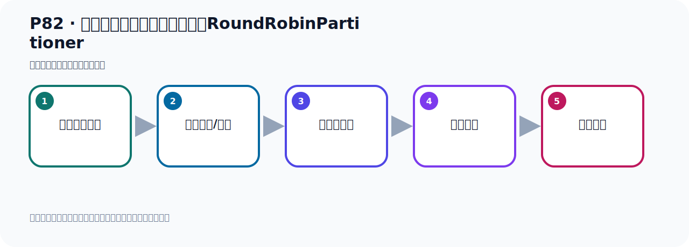

# P82：生产者发送消息配置分区策略RoundRobinPartitioner

> 笔记编号 82/156 · 时长 08:32 · [打开原视频 P82](https://www.bilibili.com/video/BV14J4m187jz?p=82)

[← P81: 生产者发送消息的分区策略源RoundRobinPartitioner](../06-producer-internals/p081-生产者发送消息的分区策略源RoundRobinPartitioner.md) · [返回本章](./README.md) · [P83: 生产者发送消息配置分区策略RoundRobinPartitioner测试 →](../06-producer-internals/p083-生产者发送消息配置分区策略RoundRobinPartitioner测试.md)

## 这节到底讲什么

**核心主题：生产者发送消息配置分区策略RoundRobinPartitioner。**

这是一节动手课。不要只记命令，要把前置条件、操作步骤、关键参数和成功信号连成一条验证链。
本节属于“副本、分区策略与生产者链路”这一章；放在全章里看，它的作用是：理解副本与分区，验证默认、轮询和自定义分区策略，并串起生产者发送流程与拦截器。

## 本节路线

## 老师的完整讲解顺序（ASR 辅助复核）

> 下面按时间顺序保留经过基础术语替换的 ASR，方便核对老师是否提到某个细节。
> 人名、命令、代码和英文参数仍可能识别错误；准确结论以本节白话说明、代码块和实操速查表为准。

### 1. 00:00–01:00

好，那下面我们就通过代码去实现一下使用轮寻的分区策略。那现在代码怎么办呢？首先，我们在这个地方，比如说我这里发消息，这个发消息的时候又是TimeBlete。那么TimeBlete，他自己本身能不能设置分区策略呢？我们点下来的方法。他的方法里面呢，有没有一个设置分区策略的方法？找一遍，目前发现好像没有。这里面没有看到他有这种分区策略的这种方式啊。那我们去看一下，比如说拿到他的这个生产等工厂，然后看看有没有添加分区策略的，比如说帕迪行，没有这个帕迪行的策略是吧？没有，或者说这个内里面本身也没有帕迪行，这个帕迪一副，这个是不是你指定策略，不是，是吧？

### 2. 01:00–01:59

好，那他里面还有什么方法没有呢？看一下，目前没有找到，你可以看一下。目前没有看到这样合适的方法，这都不是，刚才这个工厂我们试了一下，不行，是吧？拿不到。好，那么这些一看，肯定不是。这些看一下，这是set，set，没有帕迪行啊，没有帕迪行。好，那就是我们通过这种方式呢，没法去实现帕迪行设置，你看set帕迪行有吗？这是拦截器，这是leasing的，然后什么什么。好，所以没有啊，你通过这个template没法设置，啊，设置不了，好，那我们要想设置他的这个分区策略，那怎么办呢？那我们需要写一个配置类，在这里面去实现，因为他那个template里面没法去做这个工作，好，这边去实现，。

### 3. 01:59–02:51

这边实现怎么实现呢？他需要这样做啊，那我这点提前呢，把带码准备了一下，就首先你要配一个什么，你要配一个生产的工厂，要配个生产工厂，这带码我先拿过来一下，然后就放在这个位置，好，这是我配置一个生产的工厂，生产的工厂，那么这工厂呢，我们就用一个default Kafka生产的工厂，用一个默认的，默认的，好，这个叫生产的工厂，那么这个里面他也是放上那个数据的键，数据的纸，那这个纸呢，这一块为了给你通用，我把这里写overgig，这样我们给你通用一些，是吧，好，你再创建这个生产的工厂的时候呢，他这里面要指定，一系列的属性信息，通过你的这些属性信息，去创建这个工厂，。

### 4. 02:51–03:38

生产的工厂，那么这些属性信息呢，我就通过一个方法，给他生成好，生产者相关的配置信息，那我在这里写上这个方法，你看一下，我在这呢，是调这个方法，调这个方法，对吧，调这个方法，好，那我就，这个方法里面是一个map，然后呢，这个map大小，这个6也无所谓，不用指的6，就直接默认吧，好，然后里面放的属性，第一个属性就是他那个服务器地址，这是他什么服务器地址，不得是jab这个serv，就是他的服务器地址，你看他这个纸是多少，你看这个纸，点进去看一下纸，这个纸就是这个纸嘛，是吧，我用了他，我用他代码里面那个长量，去定义，如果你直接写这个字幕删，有时候容易写错，。

### 5. 03:38–04:29

所以我没写这个长量，再不更好一点，好，那么他具体值多少，他的具体值，他的这个服务器地址的值，那你需要读取我们这个配置名件里面这个纸，要读这个纸，把读进来，是吧，读这个是读进来，好，那么要读进来的话，怎么读呢，那我就在这个，好，把多余的先关掉一下，不想太多了，那我在配置这里，我要读的话，好，我这样去读，我通过这个，AddValue注解来读一下，他配置的值，那我在这个位置，那我先放上去这个位置吧，对吧，我们把我们这个创建这个托笔隔，这个放到下面去的，放下面，放到下面啊，你看我通过AddValue注解，把导入一下，在使不认的，在使不认的这个注解Value注解，读取一下我们使不认Kafka，。

### 6. 04:29–05:17

读取一下我们这个地址，就读取一下我们的使不认Kafka，然后不能使不认Kafka，然后不能使不认Kafka地址，好，这样读进来的，那除了的，我们这个生产者，我们还有一个值的训论方式，那么把它也读进来，是吧，那这个呢是在哪里呢，我们生产者有一个值的训论方式，那目前的话呢，我们就生产者只有这一个配置，再加上这个伏辑地址，那只有这两个属性，如果说你还有其他属性，你还需要再读一下，那目前我们只有这两个属性，所以把这两个属性读一下，读一下之后，那么分别放进来，这个是伏辑地址，那么这是值的训论方式，值的训论方式呢，我们应该有哪个类的，值的训论方式，我们找一下Value，应该是它点这个Value吧，就是SR，看出来你们有SR，。

### 7. 05:18–06:09

诶，那我们点一下，找到它的值的训论方式，我们看是哪个变形而成量，值的训论方式，看一下，那就是对SR Laser Class Conflict这东西，那就是它呢，值的训论方式嘛，就是这个成量，这个成量，好，那我这边方应该是这个成量，这是值的训论方式，你看，它里面是这个信息，对吧，好，那我们接下来，值的训论方式，那么值的训论方式，那就是我们读的这个数据，放在这里，放在这位置，好，那么配好了，这个配好了，配好了之后，那我这个下面这个工厂，生成的工厂配好了，生成的工厂配好了之后，接下来配个什么呢，接下来就配一个，诶，配一个这个Kafka，Time-Late，好，那就是在这里方，配个Kafka，。

### 8. 06:10–06:55

好，就是我们这个Kafka，好，当然我们这个Time-Late由于上面是OBG的，我们这两方也是OBG的，因为它里面这个键和值，这个键我们是这五段，值的我们是OBG的，我们指定是OBG的，上面也是OBG的嘛，所以指定它是OBG的，那这两方也是OBG的，对吧，好，然后这里面是把我们这个生成的工厂给它拿过来，好，拿过来之后，我们就配了一个全新的Time-Late，这是一个新的Time-Late，好，那到时候我们发消息的时候就用这个Time-Late去发消息，其实和我们之前那个配置文件是一样的，因为我们把配置文件的那些信息都读过来了，对吧，配置文件信息连接地址也读过来了，然后你的这个生成的配置也读过来了，。

### 9. 06:56–07:53

都读过来了，那其实就一样的，对吧，就是一样的，好，那么它读过来以后，那么看一下，这个太多了，先关一下，关一下，所以打开，好，那么这样的话我就有一个新的这个Kafka这个Time-Late，然后用这个去发消息，发消息的时候，我们在这边去指定一个什么，给它指定一个属性里面，指定一个分区策略，那就是我们通过这个配置，指定一个叫趴点，应该叫Partition吧，来，Partitionclass，就这个，指定个值呢，这里叫Partition分区的这个类，用哪个类去做分区，好，用哪个类做分区呢，那我们用这个轮曲策略，轮曲这些类叫什么名字，我们搜一下，Partition它的实现，。

### 10. 07:54–08:26

实现，就轮轮轮的揉B，那就这个类，我们复制一下这个类，复制，好，复制以后啊，那这边就写上这个类，点class，这样就可以了，对吧，那现在我们就使用这个方式做这个，做这个分区策略，那我们在这个分区策略这个方法里面打个盗点，我们待会预刑，看看它会不会进入代码，如果它进了呢，那说明我们这个配置就生效的，啊，我们通过这个方式呢，就指定了我们的分区策略，。

## 关键术语

- **Kafka：** Apache 开源的分布式事件流平台，常用于高吞吐消息传递、数据管道和流处理。
- **Partition：** Topic 的物理分片，是 Kafka 并行度、顺序性和扩展能力的基本单位。

## 完整原声逐段记录

[查看本节带时间戳的本地 ASR](./transcripts/p082-生产者发送消息配置分区策略RoundRobinPartitioner-ASR.md)。主笔记负责可读性和术语校正；ASR 页面负责完整性复核。

## 读完记住

- 本节主题是 **生产者发送消息配置分区策略RoundRobinPartitioner**，它服务于本章目标：理解副本与分区，验证默认、轮询和自定义分区策略，并串起生产者发送流程与拦截器。
- 理解顺序是：确认前置条件 → 执行安装/配置 → 启动或应用 → 观察输出 → 排查失败。
- 学习时要同时核对老师的解释、画面中的配置/代码，以及最终运行结果。

## 最容易踩的坑

只照抄命令而不核对当前目录、版本、端口和配置文件路径，最容易造成“命令没报错但服务不可用”。

## 自测

1. 不看笔记，用自己的话解释“生产者发送消息配置分区策略RoundRobinPartitioner”解决了什么问题。
2. 按顺序复述：确认前置条件、执行安装/配置、启动或应用、观察输出、排查失败。
3. 如果运行结果和老师不同，你会先检查哪三个输入或环境条件？

## 学完检查

- [ ] 我能不看视频复述本节完整思路
- [ ] 我能指出关键命令、配置、类或接口的作用
- [ ] 我能解释画面中的输入与输出为什么对应
- [ ] 我核对过完整 ASR，没有跳过老师的补充说明
- [ ] 我完成了本节自测或复现实验
