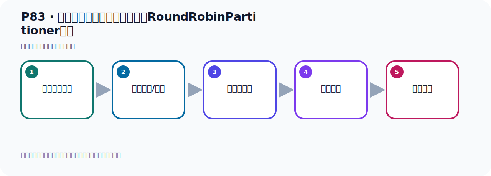

# P83：生产者发送消息配置分区策略RoundRobinPartitioner测试

> 笔记编号 83/156 · 时长 07:50 · [打开原视频 P83](https://www.bilibili.com/video/BV14J4m187jz?p=83)

[← P82: 生产者发送消息配置分区策略RoundRobinPartitioner](../06-producer-internals/p082-生产者发送消息配置分区策略RoundRobinPartitioner.md) · [返回本章](./README.md) · [P84: 生产者发送消息自定义分区策略 →](../06-producer-internals/p084-生产者发送消息自定义分区策略.md)

## 这节到底讲什么

**核心主题：生产者发送消息配置分区策略RoundRobinPartitioner测试。**

这是一节动手课。不要只记命令，要把前置条件、操作步骤、关键参数和成功信号连成一条验证链。
本节属于“副本、分区策略与生产者链路”这一章；放在全章里看，它的作用是：理解副本与分区，验证默认、轮询和自定义分区策略，并串起生产者发送流程与拦截器。

## 本节路线

## 老师的完整讲解（按视频顺序校正）

> 下面保留老师的完整讲解顺序，并修正 Kafka、Java、ZooKeeper、
> Topic、Partition、Offset 等常见识别错误。它不是压缩摘要；原始 ASR 在后面单独保留。

### 1. 00:00–00:57

好，那现在我们去发送我们的消息。去发送我们的消息。我们这里配我们的KafkaTemplate的这个并以后，它就会覆盖掉框架里面的那个并。把框架那个并就会覆盖掉。就会覆盖掉。好，那我们现在就开始去发消息。在我们这里面去发，是吧？调整去发。看看会不会走我们轮巡的策略。那此时在这里，底包运行，我们有断点，看会不会进入我们的断点。好，首先才报了一个错。那我把错误先解决一下。这错误怎么错误呢？这个总键要求这个类型。没有找到，我看一下。这个没找到。好，那我们看一下我们这个并。我们这个并里面是传到的史俊、Ebogigat。我们这个并是史俊、Ebogigat是这样的。

### 2. 00:58–01:46

那我们，那我看看，那我把我们之前这边注入了这个改一下。我们这里注了三个，可能它找不着。那我们干脆把这个东西都改成Ebogigat。可能这样就好了。他这里面喜欢史俊，他找不着这个并。找不到这个并。好，我们都是，我们因为我们这个并啊，都是史俊、Ebogigat。那我这样呢，给他这个改一下。改一下之后呢，我们之前再走一下。好，这个时候再，底包运行讲，看看有没有问题。来，我们这里有个错误，把错继一下。那么这个地方是，Recorded，啊，那你这地方是史俊，是史俊。好，那这样改可能有点多，那我干脆这个返回一下啊，这个还是史俊，那我在我配置这个并的时候，。

### 3. 01:46–02:43

把这地方干脆搞个问号算了。问号就是不确定的，是吧，里面这个不用指定的。好，然后这地方也干脆搞个问号。指，是不搞问号，啊，不指定，指的内形，不指的内形。好，再跑一下，看看他会不会出现这个内形的不一致的问题。那此时再打在这里，然后底包运行。好，运行之后，我们看一下，首先呢，他抱了一个错，我们把这个错呢，再解决一下啊，走下来，好，干什么错？呃，不合法的直，那这个不是我们那个内形问题的，是不合法的直啊，这个是空，这个k的讯定化，他说这个k的讯定化，不仅是空，是这个问题，他必须不是空的，那就是你给这个k也要设这个讯定化，是这个原因啊。

### 4. 02:43–03:32

好，那这个好办，他给k讯定讯定化，那就是我们在配置内边再加一个东西就行了。好，那我们在这个配置内中，然后我们要加一个呢，直的讯定化，啊，k的讯定化，就这个。那他这边应该是叫k，k意外，啊，k的一个讯定化配置，好，那么k的讯定化配置多少呢，那我们干脆在，在我们的配置问题中，给他指定一下，然后读进来，这地方。好，指定一下k的讯定方式，那就是这个，指定一下。k，我们有制服串，啊，有制服串，好，到时去让他读一下这个直就可以了，读这个直，好，那在上面这个地方呢，我们再读一下这个直，k的讯定化再读一下，好，放在这上面这位置，那么他读的时候，那么这地方就是k的讯定化，。

### 5. 03:34–04:25

好，那么读的时候读了哪个呢，这个读叫k的讯定化，好，读这个，啊，k的讯定化，读这个，是吧，好，读完之后，那么到时候这个地方就是我们的k的讯定化，这里，好，这个有了之后，我们再来跑一下，发生小消息，在里面，在里面，右键，然后呢，底八个御形，看一下他会不会进入我们那个轮巡的那个分区策略里面去，好，那么此时，他进入这个代码，这个代码是我们之前的，啊，我们把它断了去掉，然后进入下个断点，这是我们之前那个断点，好，下个断点，走，好，走了之后你发现没有，他就进入到了我们的，这个轮巡的这个，Partition这个方位去了，然后才要轮巡策略进行这个分区，对不对，去找到我要发到哪去，好，。

### 6. 04:25–05:12

这就轮巡策略，记得了，好，那这就，这完，啊，可以了，好，那在以上呢，就是我们这个修改他的这个分区策略，指定我们自己的，诶，指定一个其他的策略，不使用它默认的方式，你自己指定一个这个分区策略，用轮巡的分区策略，那他每次呢，就是，呃，去发送，啊，轮牛去发送，我们现在测试这个现象啊，那现在我把这个断点就直接去掉了，我们已经确定了他会找这个方法，对吧，我们就在这里，呃，断点就去掉，这里，好，没有断点了，可以了，然后我们就多发几个，看下他一个效果啊，呃，那我们干脆这样吧，我们把这个Kafka，我们干脆把这个，踏到脱米个干脆给它删掉，啊，。

### 7. 05:12–06:03

我们先速度一点清掉，我们发几个试一下，干什么效果，清掉了，啊，这个它都删掉了，我们重新发，重新发，那我们在这个测试那里面，这里面，好，我们这些发个呢，呃，霍循环比如说发发五次吧，霍循环发五次，然后呢，看着他是不是轮巡的啊，啊，发五次，那这个是我们右键呢，呃，运行一下，直接运行就可以了，运行之后啊，他会帮我们创建那个脱米个啊，好，五次发完了，发完之后看Kafka这边，这个信息，先刷新一下，叫黑脱米个，那你看一下，他的数据呢，是不是轮巡的呢，呃，一，然后二，然后三，然后五，然后七，哎，他这个不是标准的一个轮巡啊，你看，他这个效果啊，。

### 8. 06:03–06:57

哎，不是标准轮巡，也就是他的那个代码的计算，其实是有点小问题的，啊，不是说从零到，零到八，一次是标准的这样去轮巡的，他就是他这个代码的计算，可能是不是那么准确的，你看他用这个值，然后再用你可用的分余数，再取余数呢，是吧，他这个也是取余数，啊，取余数，然后什么，他Partition，或者是什么，也是取余数呢，啊，也是取余数，所以他这个，他虽然说这个方法名叫轮巡啊，但实际上他这个轮巡并不是标准的一个轮巡，我们测的效果，他并不是一个标准轮巡，好，这是关于的，哎，这个轮巡的这个策略啊，轮巡策略，具体代码是他这样实现的，好，那以上呢，我们就给他介绍了，哎，他里面这个轮巡策略，啊，怎么实现，。

### 9. 06:57–07:43

他在开发的时候，我们应该如何使用，啊，主要就是他怎么配置，哎，我们需要写一个配置类，才可以让他生效，因为在这边是配不了的，啊，这个配置文件中，他没有这个配置项，所以我们需要写一个配置类，啊，配置类中呢，在配置类中，对他做一个配置，就是我们自己的这个配置类，啊，配置下他这些手心，然后创建一个这个，生成的工厂，最终我们要覆盖一下，使被布特帮为创建这个B，覆盖一下，覆盖一下的时候，好，那么这个是我们用是自己的这个，啊，谈不立的，那么这个谈不立的里边，他已经指定了这个呢，分区的策略，啊，用是这个类，实现了这个分区策略，好，那么关于这一块的测试，我们就测试完了，。

## 关键术语

- **Kafka：** Apache 开源的分布式事件流平台，常用于高吞吐消息传递、数据管道和流处理。
- **Partition：** Topic 的物理分片，是 Kafka 并行度、顺序性和扩展能力的基本单位。
- **KafkaTemplate：** Spring for Apache Kafka 提供的高层发送 API。

## 完整原声逐段记录

[查看本节带时间戳的本地 ASR](./transcripts/p083-生产者发送消息配置分区策略RoundRobinPartitioner测试-ASR.md)。主笔记负责可读性和术语校正；ASR 页面负责完整性复核。

## 读完记住

- 本节主题是 **生产者发送消息配置分区策略RoundRobinPartitioner测试**，它服务于本章目标：理解副本与分区，验证默认、轮询和自定义分区策略，并串起生产者发送流程与拦截器。
- 理解顺序是：确认前置条件 → 执行安装/配置 → 启动或应用 → 观察输出 → 排查失败。
- 学习时要同时核对老师的解释、画面中的配置/代码，以及最终运行结果。

## 最容易踩的坑

只照抄命令而不核对当前目录、版本、端口和配置文件路径，最容易造成“命令没报错但服务不可用”。

## 自测

1. 不看笔记，用自己的话解释“生产者发送消息配置分区策略RoundRobinPartitioner测试”解决了什么问题。
2. 按顺序复述：确认前置条件、执行安装/配置、启动或应用、观察输出、排查失败。
3. 如果运行结果和老师不同，你会先检查哪三个输入或环境条件？

## 学完检查

- [ ] 我能不看视频复述本节完整思路
- [ ] 我能指出关键命令、配置、类或接口的作用
- [ ] 我能解释画面中的输入与输出为什么对应
- [ ] 我核对过完整 ASR，没有跳过老师的补充说明
- [ ] 我完成了本节自测或复现实验
